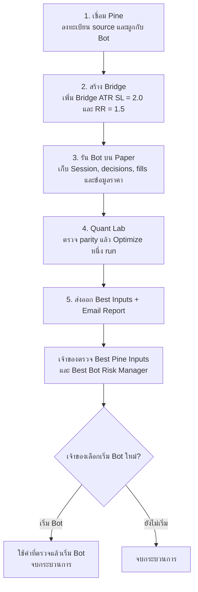

# Robot trade — Project Context

## Purpose
 
Initial QL-1 through QL-4 deployment (2026-09-23, release `39590f7`): Quant Lab research workspace ran as an offline service using a dedicated Python environment. The authenticated Node.js proxy `/api/quant/*` and 4-tab studio UI (Backtest, Optimizer, Risk Preview; Pine Export unreleased) were deployed alongside Trading Control Panel v2. That release's recorded validation was Node 111/111, Quant 71/71, and `PAPER_ONLY`. The 2026-09-24 observed release and current limitations are recorded under Production below. Live trading remains strictly locked.

Robot trade is a personal, multi-user TradingView webhook receiver and Spot-trading control plane. It is deployed on a VPS and currently runs in **Paper-only** mode: no real broker orders can be submitted by this release.

## Production

- Public URL: https://www.robottrade.io
- Release observed on 2026-09-24: `ff5a9d1`, with all four user services active; subsequently confirmed by Codex through SSH. Public health returned v2.2.0/PAPER_ONLY and the observed queue changed from 1 to 0. After the initial authentication failure, an authorized read-only database transaction directly verified schema 14 and outbox SENT 2,946, FAILED 1,151, DISABLED 513. These counts are a snapshot. Earlier journal checks found 1,865 failure log occurrences including 1,864 SMTP 550 rejections, not distinct emails; SMTP remediation remains open. Previous verified release: `39590f7` on 2026-09-23. SSH read access does not certify deploy readiness.
- Verified backups: Rehearsal and pre-live deployment backups were verified and archive-tested in protected storage.
- User services: astra-trade-phase2.service (API), astra-trade-worker.service (Paper execution and mail), robot-postgres.service (database), and astra-trade-quant.service (Quant bridge). All four are enabled; user lingering is enabled.
- Application: immutable release directories with an atomic `current` symlink; current release target is `ff5a9d1` (observed 2026-09-24).
- Shared state and runtime environment are kept in protected directories; configuration contents are not stored in this document.
- Database: PostgreSQL 16, database robot_trade; schema 14 directly verified on 2026-09-24 using a read-only transaction followed by rollback. PostgreSQL accepts local socket connections only; it has no TCP listener.
- Reverse proxy: Nginx with HTTPS, forwarding to the API over loopback.
- Retired runtime: astra-trade.service is disabled and inactive. The legacy SQLite store is retained as pre-cutover history, not the active database. Never restart the SQLite writer without an explicit recovery/reconciliation plan.
- Latest read-only acceptance check on 2026-09-23: all four services active, HTTPS health v2.2.0/PAPER_ONLY with queue 0, quant bridge health OFFLINE_RESEARCH_ONLY, tests 71/71 quant, 111/111 node.

Do not store passwords, webhook URLs, API keys, tokens, or private key material in this file.

## Historical deployments (SQLite; not current runtime)

- Bot-profile release verified after immutable symlink deployment: service active, health OK (PAPER_ONLY), schema v8, SQLite integrity OK, bot assets served, and unauthenticated bot API denied.
- Pre-migration final backup was retained in protected storage. Migration was rehearsed against a backup before production activation.
- Phase 0 deployed on 2026-09-17 using an immutable release and symlink swap. Production schema v9, integrity/foreign keys OK, 58 Paper fills matched 58 cash journal entries, and public assets/authentication boundary checks passed.
- Phase 0 final backup was retained in protected storage. Rehearsal preserved all IDs/secrets and row counts; no negative reconstructed cash, unresolved Paper orders, or FIFO analytics errors were found.
- UI hardening release 3feeb07 was deployed immutably on 2026-09-17 after 74/74 VPS tests. A matching backup was retained in protected storage. Production remained schema v9/PAPER_ONLY; 59 Paper fills matched 59 cash journal entries and authentication checks passed.

## Architecture

Current phase status (2026-09-26): **APP-3A Bridge engineering accepted in staging; QL-2A fixed-profile baseline accepted; next is QL-3A**. Exact Spot v4 compile/capture evidence, 24 PostgreSQL checks, 22 focused Node checks and a hosted controlled Paper BUY/targeted EXIT against real collector bars are recorded in [the acceptance record](docs/APP_3A_ACCEPTANCE_2026-09-26.md). Readiness/activation were exercised only on a separate test Bot/database, then stopped and cleaned up. The original SPT deployment remains DRAFT/capture-only, production is unchanged and SPT runtime Quant remains UNSUPPORTED. SMTP remediation and unknown provider accounting remain separate follow-ups.

QL-2A update (2026-09-26): **engineering baseline accepted for the reviewed fixed SPT Spot v4 profile**. The dedicated state trace compiled, its 58 source inputs plus two Bridge fields match the snapshot, and original notifications are off. Restored checkpoint replay agrees across 4,179 measured bars (47 BUY, 65 EXIT), with zero state/flag changes; all 5,185 closed OHLCV bars agree with independent Spot data. Python and production Node calculations agree on 92 serial decisions including caps, costs and final cash. All 130 recorded native observations match later history with zero changes, exceeding the minimum 100. QL-3A may start with research bounds/validation and the Bridge ATR/RR pair; no dynamic source slots are certified. Runtime Quant remains UNSUPPORTED pending later capability integration. See [QL-2A implementation](docs/QL_2A_IMPLEMENTATION.md).

Forward plan: [docs/ROADMAP.md](docs/ROADMAP.md) governs Pine → Bot → Quant → Owner; older phases remain in its archive. The workflow registers an indicator, creates its Bridge, runs Paper, performs one Quant optimization run, delivers validated Best Inputs/Email Report, then ends with owner review and an optional new Bot start. One Pine searches up to 8 user-selected numeric source inputs plus independent Bridge ATR/RR; multiple Pine scripts search only the shared pair. APP-3A fixes webhook/receiver identity and minimal isolation before QL-2A. QL-4B prepares candidate files/report; QL-4C validates before one-Pine owner delivery/apply and SMTP-gated email enqueue. Multi-Pine owner use waits for APP-3B. See [docs/PINE_EXPORT.md](docs/PINE_EXPORT.md). Live trading and production writes are not enabled by this plan.

1. **Signal layer**: TradingView indicator sends a Universal Webhook payload with trade_id, broker, symbol, event, sizing data, SL/TP, timestamp, volatility and news fields.
2. **Bot core**: The Node.js PostgreSQL API validates signals, authenticates each bot's webhook secret and durably queues accepted signals. A separate worker applies execution-time risk controls and commits the Paper fill, position, cash journal, audit and notification outbox atomically. **PostgreSQL schema 14 (supporting per-entry allocations and bot lifecycle state)** and decimal.js preserve monetary precision.
3. **Execution adapters**: Binance Global, Binance TH, InnovestX, MT5, Settrade and a future HTTP adapter use a common registry. Live execution is locked.

### Pine → Bot → Quant → Owner Workflow (5 ขั้นตอนหลัก)

กระบวนการนี้มี 5 ขั้นตอนหลัก โดย Quant Lab ทำ optimization หนึ่ง run แล้วส่งผลให้เจ้าของตรวจ ไม่มีการวนกลับมา Optimize ซ้ำใน workflow นี้:

- **Step 1 (เชื่อม Pine)**: รับเฉพาะ Pine v5/v6 Indicator ที่มี source ให้ตรวจสอบ ลงทะเบียน source/version/inputs และผูกกับ Bot; Strategy ให้ผู้ใช้แปลงภายนอกก่อนส่งเข้า โดยระบบปฏิเสธก่อนเรียก AI
- **Step 2 (สร้าง Bridge)**: Chatbot ใช้ AI API พร้อม Template/คู่มือให้ AI โดยตรง ไม่เชื่อม MCP เข้า Backend; ช่องตัวเลขสูงสุด 10 ช่อง = Bridge ATR for SL 2.0 และ RR 1.5 จำนวน 2 ช่องบังคับ + Dropdown ให้ผู้ใช้แมป numeric source inputs ได้ 0–8 ช่อง พร้อม Pine และคู่มือตั้ง Webhook ดูขอบเขตและเกณฑ์ parity เชิงตัวเลขใน [Bridge Adapter](docs/PINE_BRIDGE_ADAPTER_API.md)
- **Step 3 (รัน Bot บน Paper)**: ส่งสัญญาณผ่าน Universal Risk Engine และบันทึก Session, decisions, fills และข้อมูลที่จำเป็นสำหรับ Quant Lab
- **Step 4 (Quant Lab Optimize หนึ่ง run)**: ผ่านเกณฑ์ parity เชิงตัวเลขบน snapshot ที่กำหนดก่อน; Pine เดียว optimize เฉพาะตัวเลขที่ผู้ใช้เลือกไม่เกิน 8 ตัวและ Bridge ATR/RR โดยตรึงค่าอื่นทั้งหมด ส่วนหลาย Pine ตรึง source inputs แล้ว optimize เฉพาะ Bridge ATR/RR คู่ร่วม กติกานี้ใช้แทนการ optimize ทุก source parameter เดิม
- **Step 5 (ส่งออกและให้เจ้าของตรวจ)**: ส่ง Best Inputs (`inputs.json`, Pine Script, Setup Guide) และ Email Report ที่มี `bot_id`, `pine_import_id`, `export_id`, UTC timestamp และ Metrics สำคัญ เจ้าของตรวจ Best Pine Inputs และค่าที่เข้า Bot Risk Manager แล้วเลือกได้ว่าจะนำค่าไปใช้และเริ่ม Bot ใหม่หรือจบโดยไม่เริ่ม

เมื่อเจ้าของเริ่ม Bot ใหม่ กระบวนการนี้จบลง การทำงานรอบใหม่นับเป็นการเริ่ม workflow ใหม่; ไม่มีการส่งผลรอบหลังกลับไป Optimize ซ้ำโดยอัตโนมัติ

Bridge และ Quant มีสถานะรับรองแยกกัน: ส่งร่างได้ก่อนเก็บ parity จำนวนมาก และคง MTF/pivot ต้นฉบับไว้ได้หากแมป/ต่อท้ายได้ถูกต้อง ก่อนรัน Paper ในขอบเขตทดลองต้องผ่าน Bridge-stage checks; evaluator/sample/repaint gates ใช้กับ Quant งาน AI ต้องมีคิวถาวร, idempotency, timeout/retry และ token/cost budget ตาม [Bridge Adapter](docs/PINE_BRIDGE_ADAPTER_API.md) ส่วน SL/TP ใช้ `bridge-exit-v1`: ระดับจาก entry-bar close/ATR(14), ตรวจตั้งแต่แท่งถัดไป, SL ก่อน TP ก่อน native และ Paper/Quant ใช้โมเดล fill ที่บันทึกเวอร์ชันเดียวกัน ข้อกำหนดใหม่นี้ยังไม่ใช่ความสามารถที่ deploy แล้ว

## Product rules

Planned multi-indicator architecture: [docs/UNIVERSAL_RISK_MANAGER.md](docs/UNIVERSAL_RISK_MANAGER.md). Current Paper positions aggregate by bot/account/mode/symbol; they are not independently owned by indicator. Before enabling shared-symbol indicator deployments, add explicit group/lot exit ownership, reservations and versioned decisions. Quant optimization remains input-only and must preserve original indicator logic. This is a design finding, not a deployed capability.

- Spot only; Spot SELL orders must be reduce_only.
- Paper-only is enforced in configuration and server code.
- Binance Global normalizes crypto USD aliases to USDT before risk and position checks: BTCUSD, BTC/USD and BINANCE:BTCUSD become BTCUSDT.
- This is a symbol alias, not a currency conversion. Binance Global equity is USDT. Thai account policies remain THB.
- Duplicate trade_id values are rejected per user.
- Repeated BUY entries for the same symbol are allowed by default. Each entry requires a unique trade_id, is checked independently, and contributes to trade, notional, equity, balance and pending-order limits. Spot holdings remain aggregated per broker account and symbol, so scale-in does not consume another unique-symbol position slot.
- Stale signals are rejected according to the user profile.
- Existing rejected signals are historical records and are never resent automatically.

## Default / owner risk settings

- Max risk per trade: 100%
- Max order notional: 10,000 USDT
- Max daily notional: 100,000 USDT
- Percent Equity sizing is capped automatically at the lowest safe value among risk-derived size, available book equity, journaled cash minus reservations, max order notional and remaining daily notional budget.
- Explicit quantity and fixed-notional requests are still rejected if they exceed risk/equity constraints.
- Every numeric Risk Manager limit has an editable Default and Max Value. Default supplies the calculator's suggested setting; Max Value is the enforced ceiling.
- Each broker has configured Total Equity and Balance funding. Changes append capital deltas without resetting PnL. Current Paper cash and book equity are displayed separately and drive execution risk checks; book equity is not mark-to-market.
- The Risk Manager includes a real-time, non-executing preview that uses the same server-side risk engine as webhook orders. It shows risk amount, quantity, notional, available balance, open/remaining position slots and how many positions of the previewed size fit. A preview is point-in-time guidance; another concurrent signal can still consume capacity before execution.

### Planned Risk Manager / Quant Lab alignment

The next product scope is documented in [docs/RISK_MANAGER_NEXT.md](docs/RISK_MANAGER_NEXT.md). It preserves the current Bot-owned execution policy and Paper-only worker authority while making three distinctions explicit: policy limits versus calculator defaults, configured funding versus cash/reservations/book equity, and unique-symbol capacity versus independent entry allocations.

Current implementation note: Browser Risk Preview accepts a temporary policy object and supports a BUY Percent-Equity estimate. It is not yet a server-resolved immutable Bot policy snapshot, it does not cover targeted reduce-only exits or all sizing modes, and editing Preview fields currently contributes to the page dirty state. Quant optimization runs are Bot-scoped for ownership/history, but must not be represented as consuming the Bot's saved/locked risk snapshot until server-side resolution and provenance storage are delivered.

Planned policy changes are not deployed capabilities: a per-Bot operational entry-pause control, policy version/hash, allocation-count capacity, preview parity coverage, and stale-validation handling for policy/capital/source changes.

Other safeguards include max trades per day, maximum daily loss, maximum open positions, an optional repeated-symbol entry block, loss-streak pause, volatility and news blocks, allowed-symbols list, side mode, kill switch and reduce-only enforcement.

## UI

- Product name: **Robot trade**
- English is the default UI language; users can switch to Thai.
- A successful save shows Saved / บันทึกแล้ว.
- Recent Signals display their received timestamp.
- Trade Log shows an EN/TH explanation and original reason for REJECTED rows. A user or administrator can append a reviewed note to rejected rows.
- The UI is tested to avoid horizontal page overflow at normal desktop and mobile viewports.

## Webhook security

- Webhook secrets are hash-verified on receipt.
- Current webhook URLs are encrypted with AES-256-GCM, bound to the owning user and available only through that authenticated user's session.
- Legacy hash-only webhook URLs are recovered on the next successful webhook request, or when their owner supplies the existing URL for verification. They are not rotated automatically.
- Webhook URLs, passwords and broker credentials are secret data. Never log or commit them.

## Operations

- Latest local R-0 verification: npm test 111/111 and Quant offline pytest 71/71. These results apply to the local checkout, not the running release. Run npm run test:postgres only against an isolated test database; the recorded PostgreSQL integration result is 15/15, not a fresh production test.
- Production entry points: src/postgres/server.js (npm run start:postgres) and src/postgres/worker-main.js (npm run worker:postgres). npm start still selects the legacy SQLite runtime and must not be used to start production.
- Back up PostgreSQL using scripts/backup-postgres.mjs with the protected DATABASE_URL and compatible pg_dump. Use scripts/rotate-postgres-key.mjs and scripts/reset-postgres-password.mjs for their respective PostgreSQL maintenance tasks; follow docs/PHASE2.md. scripts/backup.mjs is for historical SQLite snapshots/import only.
- Deploy each release as a new immutable directory, switch the current symlink only after tests pass, then restart the PostgreSQL API and worker user services. Do not activate the retired SQLite service.
- Historical Phase 2 notes record schema 11 at PostgreSQL cutover. Repository schema 14 adds `ledger_position_allocations` (R-1) and `bot_sessions` / `bot_session_archive` (APP-3). The initial direct `robot_app` attempt failed authentication; a later authorized read-only transaction directly verified production schema 14 on 2026-09-24. API startup checks schema; migrations run offline with the schema-owner role, not robot_app.
- All database changes require a verified backup and integrity checks. After new PostgreSQL writes, restoring the old SQLite runtime loses those writes unless the delta is reconciled; there is no automatic reverse migration.
- Acceptance work still open: scheduled off-host backups with failure alerts and a full system restore drill. Hosted CI, fresh production Login/MFA and authenticated Overview/session restoration were verified as recorded below. The owner deferred off-host backup setup until after the final project because no destination is available; no backup timer was installed. Provider-managed backups were not verified. Isolated database restore tests do not establish full-system disaster recovery.

## Bot profiles

- Each main account owns up to five bot profiles: the existing main ID in slot 1 and four child IDs in slots 2–5.
- Child rows in `users` have `parent_user_id`, `bot_slot_index` and `label`. Existing `user_id` foreign keys and composite primary keys identify the canonical bot ID; no historical order ownership is rewritten.
- Bot profiles have independent risk profiles, configured Paper equity/balance, positions, fills, daily limits, loss streaks, credentials, analytics fees and encrypted webhook secrets. Newly created bots start with zero configured funds.
- Only main accounts can log in. Sessions and licenses belong to the main account. Suspension of the main account blocks all child webhooks and queued execution. Email notifications go to the owner.
- `/api/bots` lists or creates profiles; `PATCH /api/bots/:id` renames a profile. Scoped routes use `bot_id`. `bot_id=all` is a read-only overview/trade-log scope within the authenticated owner's five profiles.
- These are independent application Paper profiles, not exchange subaccounts. The global administrator kill switch still pauses entries across all bots.

## Analytics behavior

- Paper fills are matched into closed positions with round-trip FIFO per user, broker and symbol.
- Summary metrics include win/loss, win rate, net profit, profit factor, drawdown, expectancy, realized average win/loss ratio, streaks, average holding time and fee impact.
- Users can add a custom fee in basis points per broker. It changes analytics only; it does not mutate historical fills.
- Analytics APIs and UI support daily, weekly, monthly, annual and custom UTC date ranges, plus asset filters.
- Currency is selected by broker and never combined: Binance Global is USDT; Binance TH, InnovestX and Settrade are THB.
- Normal users can read only their own analytics. Administrators may select a user explicitly.

## Phase 0 (deployed)

- Risk now uses Paper cash and cost-based book equity from journaled fills. Realized losses reduce buying power; realized gains increase it. Pending reservations are deducted once.
- Equity/Balance inputs represent cumulative funding. Changing them appends a funding delta and never resets PnL; unchanged saves are idempotent. The UI separately shows current ledger cash and book equity.
- Migration reconstructs Paper cash from the current configured baseline and existing fills. Legacy funding dates are unknown; historical percentages are suppressed instead of fabricated. Negative reconstructed balances require operator review, not an automatic credit.
- Restart revalidates unfilled Paper jobs, preserves/cancels partially filled remainders, and quarantines inconsistent ledgers. LIVE/LEGACY orders are not replayed.
- Analytics counts completed flat-to-flat cycles. Period PnL and realized drawdown include partial exits; unrealized price changes are excluded. Historical funding records replace today's editable capital as the percentage basis.
- See docs/PHASE0.md and scripts/rehearse-phase0.mjs. Production migration rehearsal and backend smoke checks passed. Rendered browser QA was completed at 1440×900 desktop and 390×844 mobile; login, password entry, EN/TH, mobile navigation and public recovery guidance were verified without sending production signals.

## Phase 1 (deployed)

- Phase 1 delivered security: MFA, sessions, password recovery, RBAC and secret rotation. PostgreSQL and the separate worker were subsequently delivered in Phase 2.
- Schema 10 adds TOTP/recovery-code state, short-lived login/reset challenges, encrypted recovery mail and persistent attempt limits. It revokes legacy sessions while preserving existing trading/ownership data and secrets.
- Browser login now uses HttpOnly same-site cookies, exact Origin checks and CSRF headers. ADMIN/SUPPORT require MFA for privileged controls; sensitive operations require recent identity confirmation. Password, MFA, status and role changes revoke authentication state.
- UI includes MFA enrollment/login/recovery codes, identity confirmation and SMTP-backed password recovery with EN/TH labels. USER/SUPPORT/ADMIN have explicit grants; cross-owner bot access remains denied.
- Versioned tenant-bound encryption supports offline key rotation with a verified backup and transaction rollback. `scripts/rehearse-phase1.mjs` checks schema-9 migration on a copy without modifying the source.
- Deployment requires `PUBLIC_ORIGIN=https://www.robottrade.io`, the unchanged existing master key, administrator enrollment and backup/rehearsal. See docs/PHASE1.md for activation and rollback steps.
- Before deployment, the owner manually started an isolated local QA server after the execution policy refused agent startup. The policy was not weakened. Phase 1 rendered Chrome QA covered Desktop 1440×900 and Mobile 390×844, EN/TH, MFA recovery-code login, session reload and mobile navigation. A mobile Bot toolbar wrapping issue was fixed. Screenshots are outside the repository; physical devices and Safari were not tested.
- Local validation on 2026-09-18: 88/88 tests passed (74 existing plus 14 Phase 1/API/DOM tests), 47 JavaScript modules passed syntax checks, and `git diff --check` passed. Automated tests are separate from the rendered-browser and production checks recorded here.
- SMTP follow-up on 2026-09-18 (Asia/Bangkok): Gmail accepted one plain-text test message sent from the VPS using the existing EmailNotifier and protected environment configuration. The owner confirmed inbox receipt. A missing closing angle bracket in SMTP_FROM was corrected after a restricted-permission configuration backup. No production password reset or trade was triggered, and the service was not restarted. Recovery-token handling is covered by isolated automated tests, not a completed production password reset. The earlier absence of SMTP configuration is resolved.
- Deployment completed on 2026-09-18 (Asia/Bangkok): immutable release b441476, schema 10, 88/88 VPS tests and syntax checks passed. Two verified-copy rehearsals passed before migration; all 18 pre-existing non-session tables were unchanged, including 513 signals, 151 fills/cash-journal entries and three webhook secrets. The 21 old sessions were intentionally revoked. PUBLIC_ORIGIN now matches https://www.robottrade.io; master key and webhook URLs were not rotated.
- Final Phase 1 database backup and matching protected environment backup were retained in restricted storage. Health, integrity/FKs, public assets, authentication/Origin boundaries and mobile recovery UI passed after activation. The service remained Paper-only. See docs/PHASE1.md for the deployment record and rollback restrictions.
- Read-only acceptance review on 2026-09-18 confirmed release b441476, schema 10, integrity OK, no foreign-key errors, an active service, an empty queue and no service errors in the preceding 30 minutes. Administrator MFA was enrolled for 1/1 accounts and an unexpired MFA-verified session existed. No completed production password recovery was recorded. Owner confirmation of recovery-code safekeeping and a full isolated system-restore drill remain pending. Phase 2 development may start in isolation; this is not approval for Live trading or commercial launch.

## Phase 2 (deployed)

- Separate async PostgreSQL runtime under src/postgres; schema 11 uses NUMERIC(38,18) and decimal.js. Production now runs the PostgreSQL API and worker; SQLite is retained read-only for the migration retention window.
- API and worker run independently; owner/bot locks and SKIP LOCKED support concurrent workers. A Paper fill, cash journal, positions, audit and outbox commit atomically. Mail uses leases with at-least-once delivery.
- Monetary API values are strings, including UI funding/notional edits and preview prices. USDT/THB and per-bot ownership remain isolated. No Live execution is enabled.
- Offline import backs up schema 10, verifies copied rows, preserves IDs/ciphertexts, revokes transient authentication and quarantines interrupted orders. Legacy REAL precision requires an explicit rounding opt-in. Imported FIFO-only dust adjustments are disclosed and never change cash or fill records.
- Added native PostgreSQL backup/key rotation, maintenance locks, offline schema initialization, runtime-role grant template, private Compose example and PostgreSQL CI job. See docs/PHASE2.md for immutable cutover and rollback restrictions.
- Validation on 2026-09-18: 89/89 legacy/UI tests on Windows; 15/15 real PostgreSQL 16.15 integration tests on isolated VPS, including four OS workers, SIGKILL, migration rollback, full dump/restore hashes and key-rotation rollback. Production-copy rehearsal preserved 525 signals, 151 fills/cash entries and three users/bots; four secrets decrypt and 67 closed cycles calculate. No negative cash in that snapshot.
- Chrome QA used isolated fixtures through a private SSH tunnel: Desktop 1440x900 and Mobile 390x844, login/reload, Risk preview/save, Analytics, EN/TH, navigation and no horizontal overflow. No production test trades were sent. Docker/Compose runtime startup and sustained load/failover acceptance remain pending; hosted CI including the container build passed as recorded below.
- Deployment completed on 2026-09-18 (Asia/Bangkok) as immutable release 0321ae6. Final offline import preserved 3 users, 534 signals and 151 fills, reported zero interrupted orders and zero negative-cash accounts, and revoked zero active sessions. Verified backups: `pre-phase2-0321ae6-20260917T201156Z.db` and `post-phase2-0321ae6-20260917T201156Z.dump` (SHA-256 `2b7257670234cabe39df69ecbd1712d55779d3b2ffa46360cd804bf4724d9c32`). PostgreSQL 16 listens only on a protected Unix socket; API/worker use a restricted runtime role. PostgreSQL, API and worker passed supervised restart, local/domain health returned v2.2.0 PAPER_ONLY with an empty queue, and recent journals contained no fatal/error entries. The old SQLite service is disabled. Rollback to SQLite is no longer safe after any new PostgreSQL write without delta reconciliation.

## Phase 2 acceptance follow-up (2026-09-18, Asia/Bangkok)

- GitHub Actions Safety checks #24 succeeded for commit 639fe809ee01c233a9e8d2f0646281c9fb1eaabb: Linux and Windows test jobs, PostgreSQL integration, and container build. Verified directly in the authenticated GitHub UI: https://github.com/sanchatmd-dev/trading-bot/actions/runs/35269699025. Connector calls returned empty run/status lists and were not reliable evidence of absent CI. Four non-failing annotations concern the Node 20 runtime used by actions/checkout@v4 and actions/setup-node@v4; action-version maintenance remains separate work.
- A fresh production pg_dump used an exported repeatable-read snapshot and was restored into a uniquely named temporary database. Row counts and SHA-256 row fingerprints matched for all 27 public tables, including 539 signals, 151 fills and 151 cash-journal rows. Schema 11 verified and all four encrypted webhook/MFA records decrypted using the existing protected keyring. No source application rows were changed and no API, execution or email worker ran against the restored copy. The temporary database was dropped after verification.
- Restore-tested archive (155863 bytes; SHA-256 f92337afdc8f1b9f2a07b6b085d05a8dfec21d475421922d132f83b25d90ccaf) has a protected verification report. This was a same-host database restore test, not off-host or full-system disaster recovery.
- Production Chrome displayed authenticated Analytics and Overview. A newly opened tab restored the existing session and displayed v2.2/PostgreSQL/Paper with recent signals. The owner subsequently completed a fresh login. Database inspection verified a new, unexpired session created at 2026-09-18 03:35:08.838 Asia/Bangkok with mfa_verified=1; Chrome showed the authenticated Overview and health remained v2.2.0/PAPER_ONLY with queue 0. The agent did not collect credentials, generate an OTP, reset MFA or submit a trade.
- Owner explicitly deferred automatic off-host backups until after the final project. Resume destination selection, encrypted transfer, scheduling, failure alerts and off-host restore verification then; do not count this deferred work as completed.

## Known rejection causes and handling

- **Order exceeds available configured Spot equity**: automatic Percent Equity sizing now caps the order. Explicit oversized quantity remains rejected.
- **Order exceeds available configured Spot balance**: increase the configured Balance only when cash is actually available, or reduce the order. Percent Equity sizing caps automatically.
- **No Spot position available to sell**: the prior entry did not fill or no Paper position exists; exit orders are not converted into entries.
- **Symbol is not allowed**: add the symbol in Risk Manager only when intentionally approved.
- **Risk percent exceeds policy**: lower risk_value or explicitly review the configured ceiling.

## Repository

- Remote: https://github.com/sanchatmd-dev/trading-bot.git
- Main branch: main

## Phase R-1 & Schema 12 Delivery (2026-09-21)

- **Phase R-1 (Reconciliation & Scale-in Target Exit)**: Delivered in commit `b2cb863`. Added per-entry allocation tracking via table `ledger_position_allocations` to resolve single-position exit conflicts when scaling into positions. Independent allocation units allow targeted Take Profit/Stop Loss per order lot without prematurely closing concurrent allocations. Test suite verified via `test/scale-in.test.js`.
- **Schema 12 Recovery & PostgreSQL Baseline Fixes**:
  - Restored missing baseline tables, triggers, and indices in `src/postgres/schema.sql` (including `worker_heartbeats`, `notification_outbox`, `security_mail`, and Paper-trading journal structures) previously truncated during migration updates.
  - Upgraded baseline version to Schema 12 cleanly.
  - Updated `scripts/rotate-postgres-key.mjs` to validate and support Schema 12.
  - Resolved advisory lock / background worker hang issues in `test/postgres/phase2.test.mjs`.
- **CI / Automated Test Verification**:
  - GitHub Actions runs across Ubuntu, Windows, Docker container build, and real PostgreSQL integration (`npm run test:postgres`) all passed with zero errors.
- **Quant Lab (QL-1 to QL-4) Delivery & Audit Hardening (2026-09-22)**:
  - **QL-1 to QL-3**: Scaffolding, read-only data contracts, FIFO/risk parity evaluators, deterministic market data, discrete-event backtester, walk-forward validation, and constrained optimizer.
  - **QL-4**: Reconciled offline HTML tear sheet reports with SVG equity/drawdown curves, Pine Script v6 export engine for `alert_calls` and `order_fills`, input preset diff engine, and webhook strategy metadata pass-through.
  - **Audit Hardening & P1 Blocker Fixes**: Addressed all 12 findings (F01–F12) from `HANDOFF_AUDIT_QL1_QL4_826daf2.md` and all 4 P1 blockers from `HANDOFF_QL_FIXES_REVIEW.md`:
    1. *P1#1 (Export Hardcoding)*: Injected actual frozen `RiskProfile` (with hash digest verification), `broker`, `symbol`, and `timeframe` into Pine Script and JSON bundles.
    2. *P1#2 (Capital Separation)*: Separated `balance` from `initial_capital` in `BacktestConfig`, initializing cash strictly from `balance`.
    3. *P1#3 (Quote-Sized Caps Precedence)*: Re-architected `risk_evaluator.py` sizing order to execute quote/equity sizing before applying target allocation remaining bounds.
    4. *P1#4 (Targeted Order Fills in Pine)*: Rewrote Pine order-fill generation using `var string currentEntryId = ""` tracking and targeted `strategy.close(currentEntryId)` exits.
    5. *Regression Suite*: Replaced single-failure probe script with comprehensive positive regression suite `quant_lab/tests/test_audit_regressions.py` (7 tests).
    6. *Direct Node Parity*: Implemented `test_node_direct_parity.py` which dynamically spawns `src/postgres/risk.js` via Node, confirming byte-for-byte exact equality between Python and Node evaluations under production configurations.
- **APP-3 Delivery (2026-09-22) — Bot Lifecycle & Session Management (Schema 14)**:
  - **Schema 14**: Added `bot_sessions` table (strict state machine per bot: `SETUP`, `RUNNING`, `PAUSED`, `STOPPED`) and `bot_session_archive` table (immutable session history for Quant Lab ingestion).
  - **State Machine & Policy Freezing**: Transitioning from `SETUP` to `RUNNING` freezes the risk policy (`locked_policy`) and snapshots capital baseline (`initial_capital`). While `RUNNING` or `PAUSED`, `PUT /api/risk` returns `409 Conflict`.
  - **Execution Worker Enforcement**: `STOPPED` state immediately rejects all signals. `PAUSED` state halts new entries while allowing reduce-only exits (`side === 'SELL' && signal.reduceOnly`). When `RUNNING`, the worker executes against `locked_policy`.
  - **API Surface**: Added endpoints `GET /api/bot/session`, `POST /api/bot/session/run`, `POST /api/bot/session/pause`, `POST /api/bot/session/stop`, `POST /api/bot/session/reset`, `GET /api/bot/session/archive`, and enriched `GET /api/me` with `botSession`.
  - **Verification**: 12 integration tests in `test/postgres/lifecycle.test.mjs` passed on isolated real PostgreSQL. Hosted CI workflows (`Safety checks` including postgres, test ubuntu/windows, container, and `quant-lab`) all green.
- **Interactive Dashboard Charting (2026-09-22)**:
  - Integrated TradingView `lightweight-charts` (v4+) CDN into frontend Analytics panel without bundler overhead.
  - Dynamically switches symbols and fetches real-time 1h OHLCV directly from broker public endpoints (Binance) to minimize VPS bandwidth.
  - Dual custom EMAs (independently configurable periods) and custom ATR multiplier bands computed client-side in real-time.
  - Plots active bot positions with Entry, Stop Loss, and Take Profit horizontal price lines directly on the candlestick canvas using `/api/positions`.
- **APP-4 Delivery (2026-09-22) — Customer Lifecycle & Quotas**:
  - Centralized quota definition (`src/postgres/quotas.js`) with 4 distinct tiers:
    - **FREE**: 1 Bot, 30 days analytics history
    - **PERSONAL**: 3 Bots, 90 days analytics history
    - **PRO**: 10 Bots, 180 days analytics history
    - **ENTERPRISE**: 50 Bots, Unlimited analytics history
  - Server-side enforcement in `src/postgres/server.js`: `POST /api/bots` rejects creation with 403 when exceeding `maxBots`; `GET /api/analytics/*` restricts queries exceeding `historyDays`.
  - Account API (`/api/me`, `/api/auth/session`) returns active `plan` and `quota`.
  - Dynamic frontend rendering in `public/bots.js`: dynamically renders up to `maxBots` slots, automatically applying `.enterprise-grid` responsive layout for large bot counts. Date picker in `public/analytics.js` dynamically enforces minimum allowable history date.
- **Paper Forward Acceptance Passed (2026-09-22)**:
  - Executed automated acceptance suite `scripts/test-paper-acceptance.mjs` against live production `https://www.robottrade.io` (Release `c2921f3`, Schema 14).
  - All 7 verification criteria passed:
    1. *BUY P1*: HTTP 202 Accepted, Paper fill committed.
    2. *Repeated BUY P2 (Scale-in)*: HTTP 202 Accepted, concurrent allocation P2 opened alongside P1.
    3. *Duplicate Webhook*: HTTP 409 Rejected (`Duplicate trade_id`).
    4. *Stale Webhook*: HTTP 400 Rejected (`Signal is stale`).
    5. *Targeted TP1*: HTTP 202 Accepted, closed target allocation P1 independently while preserving P2.
    6. *Targeted TP2*: HTTP 202 Accepted, closed target allocation P2, bringing net holdings to flat.
    7. *Reduce-Only SL*: HTTP 202 queued, worker safely verified and rejected excess exit without opening opposite short.
  - Production queue drained immediately to 0; `/healthz` verified `{"ok":true,"version":"2.2.0","mode":"PAPER_ONLY","queued":0}`.
- **Current Milestone**: **Risk Manager / Quant Lab alignment, SMTP Notification Diagnosis and PostgreSQL Password Rotation** — Schema 14, R-1 Targeted Exits, APP-3 Lifecycle, and APP-4 Quotas are fully deployed and verified live in production Paper forward mode. Next implementation work is the documented Bot policy snapshot, preview parity and operational pause scope; follow-up operations are SMTP diagnosis and scheduled PostgreSQL password rotation.
