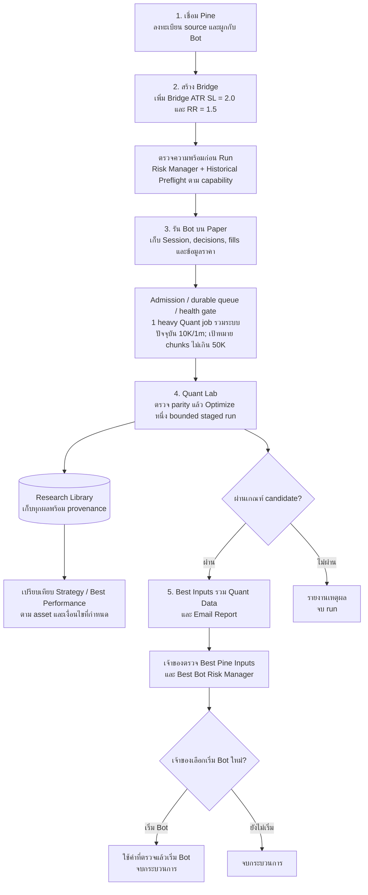

# Robot trade — Project Context

Historical handoff, 2026-10-03 (superseded by the current checkpoint below): checkpoint 22:25 Bangkok (15:25 UTC): read the [Codex to Claude handoff](docs/CODEX_TO_CLAUDE_HANDOFF_2026-10-03.md), beginning with its private-handoff instructions. All jobs launched by the outgoing root are closed. The local watcher passed independent checks, but its wait timed out without a child; the read-only command stopped before SSH and produced no fresh facts. Runtime is not freshly verified. The last full database observation is 14:19 UTC; later UI shows nine signals without proving a same-entry EXIT. Create Bot and Quant History remain local and undeployed. The incoming root must reverify Git, usage, ownership and authorized runtime before dispatch. Earlier dated entries below retain their historical scope.

Current checkpoint, 2026-10-04 about 21:27 UTC: Step 2 (ten-input round trip) progress, local only; Step 2 is not accepted. The criterion in the staging prototype plan matrix: the user selects 8 eligible source inputs plus the Bridge ATR multiplier and RR, and all ten round-trip through the UI, generated Pine and stored snapshot without silent truncation, each with a real supported effect and a declared optimizer domain. Earlier evidence was eleven artifact comparisons confirming the ten values; round trip and effects were open. Commit `40253be` (CI 9/9) adds test/step2-ten-input-roundtrip.test.js on the tracked SPT proxy source (a different, public Pine file, not the owner-private supported bytes): two different 8-subsets of the CATALOG plus ATR 60 and RR 1.5 survive validateSelection, assemble and JSON readback (10 bindings, slots 1..10 unique, domains and effective values unchanged, original bytes unchanged); the ATR and RR literals parsed back out of the generated Pine equal the selection, also for fractional 62.5 and 1.75; lockInputs accepts both subsets; a ninth slot (INVALID_SLOT_COUNT), a duplicate slot (DUPLICATE_BINDING) and an eligible non-CATALOG input (UNSUPPORTED_CUSTOM_BINDING) are rejected. quant_lab/tests/test_catalog_parity.py pins the Node research CATALOG (names, bounds, int flags) and the supported source hash to the Python custom evaluator. An independent tester killed 16 of 17 mutants; the survivor led to the added duplicate-slot case. Commit `56bbedc` (quant CI green on Windows and Ubuntu; Node jobs skipped because no Node file changed) adds quant_lab/tests/test_custom_effects.py, 103 tests: on deterministic synthetic data, moving any one of the ten CATALOG inputs, the Bridge ATR multiplier or RR changes the custom evaluator signals or the Paper decisions, at domain ends, on an interior pair where both runs fire, and for the five per-side gates on BUY-only and EXIT-only fixtures. An Opus review and recheck killed 28 of 28 mutants (16 whole-dimension, 12 side-only). Scope is model reachability only; it makes no real BTCUSDT 1m effect, TradingView parity or profitability claim. Findings for the owner: confirmLookback (slot 10 in owner lock 9db0f772) changes signals only on gap bars and gave identical vectors in the earlier TradingView axis parity, so the literal "real supported effect" criterion is not met for slot 10 on real data; slAtrBuffer and minRiskATR act only through their difference (one effective dimension); setupExpiry has a weak, fixture-sensitive effect; the emaSlow CATALOG minimum 1 is unreachable because fast must be below slow. Slot-10 options, an owner decision with no change made: replace confirmLookback with minRiskATR or slAtrBuffer under a new lock plus a TradingView axis parity, or record a documented exception. S2 is closed: commit `277b07b` (CI 9/9, including the PostgreSQL job) proves that the UI sends all eight slots with ATR and RR in one generate request and that the stored deployment snapshot keeps the eight bindings, their domains and values, and the bridge values. Still open for Step 2: selection coherence between deployment and research lock (S4, root design), the slot-10 decision (S6, owner) and the RR and multiplier empirical effect on collected data (S7). S5 closed on 2026-10-05 about 03:35 to 03:50 UTC (read-only, through the authenticated API): the QL-P2 bot has one deployment, b45d9f9d (READY), on the supported SPT source (hash prefix 0be2c64c); the Pine Bridge overview reports 20 eligible and reviewed numeric inputs and 8 selected slots read from the stored snapshot; the generate job that created it lists 10 bindings (slot 1 ATR multiplier, slot 2 RR, slots 3 to 10 emaFast, emaSlow, atrLen, stFactor, zoneAtrMult, setupExpiry, cooldown, confirmLookback) whose input ids, bounds and baselines equal the owner input lock 9db0f772 ([evidence](docs/evidence/QL_3A_APPROVED_INPUT_LOCK_2026-09-27.json)) exactly; 50 inputs stay fixed and the original source bytes are unchanged. Step 2 remains not accepted (S4, S6 and S7 open; the slot-10 decision is the owner's). No lock, optimizer, Pine, Risk Manager or deployment change was made.

Current checkpoint, 2026-10-05 about 02:06 Bangkok (19:06 UTC on 2026-10-04): chart v3 indicators release `2919f9b` is live on staging with the API running on it (API only); hosted CI passed all nine checks on `2919f9b` after a test-only line-ending fix to `0f110ff`. The Overview chart now has toggleable EMA 50 and 200, an ATR stop line (a visual guide only, not a bot stop-loss), and RSI and MACD panes, with settings saved per viewer; indicators never reach a bot, the Risk Manager, Preflight or any order. An independent audit accepted the release tool (ACCEPT_NARROW, 164 controls, 0 failures), and ACTIVATE_PASS at 18:55:29 UTC restarted only the API (conservative downtime about 2.1 seconds), followed by POSTCHECK_PASS at 18:56 and at 19:06 UTC (634 seconds after activation). Activity counts rose naturally to 65, 65, 65, 5 and 5 before the restart; the old QL-3A allocation of 0.01181 BTC stays OPEN. With the owner signed in, the defaults, toggles, bounded settings and Reset worked on BTCUSDT 1d; the 1h chart uses labelled Binance public REST data because stored coverage is shorter than the larger warm-up window. Phone layout and the Thai view were checked locally on 2026-10-04 (not a staging phone test); the TradingView 1m value comparison matched on 2026-10-05 and the daily one was not run. The authenticated Create Bot journey and the MD-1 gate remain open. See the [chart v3 release checkpoint](docs/STAGING_P2_CHECKPOINT_2026-10-03.md#chart-v3-indicators-release-2919f9b-upload-extraction-and-activation) and its [evidence](docs/evidence/P2_CHART_INDICATORS_RELEASE_2919F9B_2026-10-04.json).

Current checkpoint, 2026-10-04 23:05 Bangkok (16:05 UTC): chart v2 release `f22f3d0` is live on staging with the API running on it (API only); hosted CI passed all nine checks on `f22f3d0`, including the PostgreSQL job. The Overview chart now takes any allow-listed Binance Spot symbol and 14 intervals from 1m to 1w (default 1d), serves stored BTCUSDT bars when they are fresh and complete and otherwise a keyless server-side proxy (on by default under the authorization of the owner; `MARKET_PUBLIC_PROXY=0` disables it; no API key, no trading path), and draws per-lot entry, stop-loss and take-profit lines labelled with the bot name. The release adapter took three iterations: independent audits rejected versions 1 and 2 (version 2 on one high finding) and accepted version 3 as ACCEPT_NARROW (110 controls, 0 failures). Each live step used one pre-armed operations session, a root read-only refresh approval, root review and a separate phase approval. PRECHECK_PASS at about 15:38:40 UTC found only natural activity growth, from 39 events, pending and signals, 2 entries and 2 allocations to 60, 60, 60, 4 and 4, with the old OPEN allocation of 0.01181 BTC preserved. After INCOMING_PASS and one scp of three files (about 16 seconds, no retry), EXTRACT_PASS placed 784 files, and ACTIVATE_PASS at 15:41:21.9 UTC restarted only the API onto `f22f3d0` with conservative downtime of 2.898 seconds; trading, research, database and protected services stayed unchanged. The immediate check (about 15:41:47 UTC) and the delayed check (15:51:41 UTC; refresh created about 616 seconds after activation) returned POSTCHECK_PASS with activity unchanged at 60, 60, 60, 4 and 4. No retry, recover step or rollback was needed, all approvals are closed, and the rollback target would be `02af486` only. With the owner signed in, the served `interactive-chart.js` and `market-chart.css` are byte-identical to Git `f22f3d0` and load no unpkg script; the staging API reached Binance public REST (1,331 symbols), and the All Bots scope drew take-profit, entry (LONG 0.01181) and stop-loss lines labelled QL-3A for the old OPEN allocation. Verified at about 16:05 UTC, read-only through the authenticated API: the natural same-entry EXIT for the 0.01179 BTC allocation of the QL-P2 bot is proved. Paper BUY signal 66 was FILLED for 0.01179 BTC at 84,697.31 (2026-10-03 12:02 UTC), and EXIT signal 85, a reduce-only SELL from the Pine Bridge EXIT event with reason NATIVE and the same entry reference, was FILLED for the full 0.01179 BTC at 84,776.51 (quote 999.515 USDT, 2026-10-03 19:45 UTC); the bot now has no open position or lot. The gross result is about +0.93 USDT and the estimated net after the 10 bps per side Paper fee model is about -1.06 USDT (an estimate, because the analytics API is unavailable while managed Quant execution is enabled). Still open: the old QL-3A alert stays stopped until the old 0.01181 BTC OPEN allocation resolves, the authenticated Create Bot journey is unchecked, and webhook delivery during the roughly 2.9-second restart window was not separately verified. PF-2 stays off, the D6, R7, B3, W7 and MD-1 gates are unchanged and capacity is not approved. This entry supersedes the statements below that the market-data chart is not live and that the EXIT is unproved. See the [chart v2 release checkpoint](docs/STAGING_P2_CHECKPOINT_2026-10-03.md#chart-v2-release-f22f3d0-upload-extraction-and-activation) and [evidence](docs/evidence/P2_CHART_RELEASE_F22F3D0_2026-10-04.json).

Current checkpoint, 2026-10-04 16:20 Bangkok (09:20 UTC): Quant History release `02af486` is live on staging with the API running on it (API only). Root prepared one local adapter over the frozen UI release tool; author controls passed 38 with 0 failures, and an independent three-lens audit passed 81 with 0 failures (109 mutants: 105 killed, 4 equivalent) with verdict ACCEPT_NARROW. Each live step used one pre-armed operations session, a root read-only refresh approval, root review and a separate phase approval. The precheck at about 09:02:50 UTC (PRECHECK_PASS) found only natural activity growth, from 15 events, pending and signals, one entry and one allocation to 39, 39, 39, 2 and 2, with the old OPEN allocation of 0.01181 BTC preserved. After INCOMING_PASS and one scp of three files (about 16 seconds, no retry), EXTRACT_PASS placed 768 files, and ACTIVATE_PASS at 09:06:25 UTC restarted only the API onto `02af486` with conservative downtime of 2.841 seconds; trading, research, database and protected services stayed unchanged. The immediate check (about 09:07 UTC) and the delayed check (09:17:09 UTC, 641 seconds after activation) returned POSTCHECK_PASS with activity unchanged at 39, 39, 39, 2 and 2. A first delayed-check job timed out at 09:16:18 UTC before any approval or host contact because its refresh window closed 8 seconds before the ten-minute floor; this timing slip had no effect and a fresh job passed. Through local forwarding without authentication, the served `quant-lab.js` (31,738 bytes) is byte-identical to Git `02af486`, but the served page still loads the old chart script, so the new market-data chart (local commit `e44dfba` with test fix `5516a7f`, pushed with all nine CI checks passing on `5516a7f`, not deployed) is not live. All approvals are closed; no retry or rollback was needed, and the rollback target would be `256251b` only. Owner decision: real Binance Global data may be used only for OHLCV charts and Preflight, through keyless public endpoints, with no trading, Paper only and Live locked. Still open: the authenticated History view (the owner must sign in), the natural same-entry EXIT for the new 0.01179 BTC OPEN allocation, and the old QL-3A alert, which stays stopped until the old 0.01181 BTC OPEN allocation resolves. Webhook delivery during the roughly 2.8-second restart window was not separately verified. PF-2 stays off and capacity is not approved. See the [Quant History release checkpoint](docs/STAGING_P2_CHECKPOINT_2026-10-03.md#quant-history-release-02af486-upload-extraction-and-activation) and [evidence](docs/evidence/P2_HISTORY_RELEASE_02AF486_2026-10-04.json).

Current checkpoint, 2026-10-04 02:07 Bangkok (19:07 UTC): Create Bot UI release `256251b` is live on staging with the API running on it. Earlier in the segment, a read-only observation at 17:04 UTC matched all 23 stable fields (only natural activity grew) and one exact permission approval changed the UI release parent directory from `0775` to `0755`. Root then prepared two local adapters over the frozen release tool (publication; activation, checks and rollback), each with author controls and an independent ACCEPT_NARROW. At about 18:13 UTC publication returned PUBLISH_PREPARED_PASS (767 files by an atomic no-replace rename, no service change). At 18:56:31 UTC activation returned ACTIVATE_PASS: an API-only restart with conservative downtime of about 2.5 seconds, while trading, research, database and protected services stayed unchanged. The immediate check (about 18:57 UTC) and the delayed check (about 19:07 UTC, about 629 seconds after activation) both returned POSTCHECK_PASS with no activity change; activity was 15 events, pending and signals, one entry and one allocation. Through the existing local forwarding, the served `bots.js` and `index.html` are byte-identical to Git release `256251b`. All approvals are closed; no retry or rollback was needed. Still open: the authenticated Create Bot browser journey (the owner must sign in); Quant History `02af486`, which was not in `256251b` and went live as a separate release (see the newer checkpoint above); the natural same-entry EXIT for the new 0.01179 BTC OPEN allocation; and the old QL-3A alert, which stays stopped until the old 0.01181 BTC OPEN allocation resolves. Webhook delivery during the roughly 2.5-second restart window was not separately verified. See the [UI release checkpoint](docs/STAGING_P2_CHECKPOINT_2026-10-03.md#ui-release-256251b-publication-and-activation) and [evidence](docs/evidence/P2_UI_RELEASE_256251B_2026-10-03.json).

Current checkpoint, 2026-10-03 20:56 Bangkok (13:56 UTC): one read-only collection reports eight events and signals, one entry and one allocation. Root comparison confirms unchanged service identities, configuration, cache, research evidence, READY membership, policy, run and funding against the earlier full observation. Four activity-table hashes changed. These are current facts, not a deployment or capacity approval, and do not close the natural same-entry EXIT gate. The next bounded local change lets the parent permission tool consume the actual facts envelope without relabeling it or weakening its guards. No permission or service changed. See [current runtime facts](docs/evidence/P2_CURRENT_RUNTIME_FACTS_2026-10-03.json).

Current checkpoint, 2026-10-03 20:22 Bangkok (13:22 UTC): a bounded read-only ledger observation confirms natural BUY 66 filled `0.01179 BTC` and remains mapped to one OPEN allocation. Rejected TP EXIT 69 uses a different entry hash, absent from the six persisted BUY/EXIT events' BUY references. Its origin and the cash cause of later BUY rejections remain unproved. The old OPEN allocation is preserved and Paper health is normal. Current-import binding passed, but whole snapshot membership, capacity and release baseline remain unapproved. The next local packet prepares read-only current facts without zeroing activity; natural same-entry EXIT and deployment gates stay open. See [natural BUY evidence](docs/evidence/P2_NATURAL_PAPER_BUY_2026-10-03.json).

Current checkpoint, 2026-10-03 20:00 Bangkok (13:00 UTC): the new bot's staging UI reports six received signals, one filled Paper BUY at 12:02 UTC and five rejections, including `BELOW_QUANTITY_STEP` and `TARGET_NOT_OPEN`. The visible fill references deployment `b45d9f9d`; ledger correlation and a same-entry targeted EXIT remain unverified. The read-only runtime check stopped at `NATURAL_ACTIVITY_REQUIRES_REBASELINE` at 12:56 UTC and produced no accepted current state or capacity certificate. UI deployment remains on hold. The parent permission correction passed seventeen independent local controls but has not run on the host. No permissions, service or Risk Manager settings changed in this checkpoint. See [P2 checkpoint](docs/STAGING_P2_CHECKPOINT_2026-10-03.md).

Current checkpoint, 2026-10-03 18:48 Bangkok (11:48 UTC): the owner corrected the webhook and created the new alert. Computer Use verified `QL-P2 SPT ATR60 PAPER staging 1m b45d9f9d` Active on BTCUSDT 1m, with the old ATR60 alert still stopped. This verifies alert setup, not webhook delivery or a natural Paper BUY/targeted EXIT. A local Quant History correction supports both stored configuration shapes, uses inert text rendering and passed seven independent controls; it is not deployed and is absent from the immutable Create Bot package. The adapter passed twenty-five independent mock controls; actual Linux inventory and resource enforcement remain unproved. Parent-facts corrections and the mock supervisor await independent review. See [P2 checkpoint](docs/STAGING_P2_CHECKPOINT_2026-10-03.md).

Current checkpoint, 2026-10-03 18:12 Bangkok (11:12 UTC): the newly reviewed publication tool passed fourteen independent local controls. The 10:59 UTC read-only check preserved READY/evidence, protected processes and all nine research digests. Publication stopped at `RENAME_PARENT`; scoped reconciliation at 11:05 UTC found the existing parent mode is `0775`, while the tool assumed `0755`. The partial remains and the target and override are absent; Paper API and process identities are healthy and unchanged. A bounded group/ACL facts packet precedes any exact-parent correction; no permission change, retry or activation is authorized by this failed receipt. Create Bot remains undeployed. The Linux reader passed independent mock controls and a separate exact-integer correction, but adapter, supervision and actual Linux inventory remain unproved. Owner webhook correction and the natural Paper pair remain pending. See [P2 checkpoint](docs/STAGING_P2_CHECKPOINT_2026-10-03.md).

Current checkpoint, 2026-10-03 17:25 Bangkok (10:25 UTC): reviewed readbacks and the old-release precheck passed, followed by a successful transfer of the three UI package files. Extraction stopped during the bounded `quant_jobs` digest. The 10:22 UTC read-only reconciliation confirmed healthy Paper API, unchanged service identities, exact uploaded payload hashes and a retained partial directory; the target release and new API override are absent. It does not certify the full partial tree or current SQL invariants. A local Debugger packet prepares a narrowly bounded digest budget and an explicitly authorized partial-verification/publish phase. Create Bot is not deployed. The worker inventory validator passed its corrected local audit; the Linux reader remains local preparation without host authority. Owner webhook correction and the natural Paper pair remain pending. See [P2 checkpoint](docs/STAGING_P2_CHECKPOINT_2026-10-03.md).

Current checkpoint, 2026-10-03 16:30 Bangkok (09:30 UTC): worker-validator corrections passed independent local checks; this grants no Linux import, cache or host authority. The UI operator's local findings passed review, but two separately authorized read-only attempts stopped before complete live acceptance. The relative API entrypoint mismatch is corrected; the second error's cause remains unknown. No service or database state changed in either attempt. A local Debugger packet precedes a new readback; Create Bot remains undeployed and current health/capacity is unproved by those attempts. See [P2 checkpoint](docs/STAGING_P2_CHECKPOINT_2026-10-03.md).

Current checkpoint, 2026-10-03 15:40 Bangkok (08:40 UTC): Create Bot `256251b` is pushed with both CI workflows passing. Its package passed independent static checks; the API-only operator still needs reviewed local corrections before deployment. The 08:31 UTC read-only staging check passed with preserved runtime and READY state, idle research and zero new-bot activity. No capacity or native closure certification follows from that receipt. Local worker-validator corrections run separately. Owner webhook correction and the natural Paper pair remain pending. See [P2 checkpoint](docs/STAGING_P2_CHECKPOINT_2026-10-03.md).

Current update, 2026-10-03 14:43 Bangkok (07:43 UTC): the visible Create Bot control is prepared locally with authenticated quota checks, duplicate submission protection and explicit errors. Eight focused tests and twelve independent cases passed; desktop and mobile layout checks passed. It is not deployed. Worker alignment tooling remains a local preparation and audit task; no new research job, admission change or host action occurred. The READY deployment and owner webhook correction gate remain as recorded below. See [P2 checkpoint](docs/STAGING_P2_CHECKPOINT_2026-10-03.md).

Current update, 2026-10-03 14:16 Bangkok (07:16 UTC): normal UI activation made the new deployment b45d9f9d READY. A read-only check at 07:10:54 UTC confirms the current READY binding, exact snapshot, one immutable evidence row and recorded 58-input review hash. Runtime health and protected services passed; admission and PF-2 remain closed. The unsent TradingView alert has a nested internal URL; owner correction is pending. New events, signals and allocations remain zero; the old OPEN allocation is unchanged. Partial desktop/mobile Risk and Research Library checks passed, including disabled historical capability, locked proposal save and withheld metrics across incompatible contexts. This does not accept the full journey or natural pair. See [P2 checkpoint](docs/STAGING_P2_CHECKPOINT_2026-10-03.md).

Current update, 2026-10-03 13:47 Bangkok (06:47 UTC): staging API/trading run f2bd332; immediate and delayed release checks passed. The normal application created the third SPT Paper bot and generated deployment b45d9f9d. Its separate TradingView script compiled, and all 58 source inputs plus both Bridge inputs were saved and reopened for review. Independent artifact/input and evidence reviews passed. One immutable readiness record was inserted at 06:44 UTC through the unchanged maintenance-gated operator script. All three lock-holding services restarted and immediate postchecks passed; the conservative API downtime bound is 3.792 seconds. The deployment remains DRAFT. Activation, the owner-entered webhook, the new alert and a natural BUY/targeted EXIT remain pending. Generic 74/74 fixtures are not exact SPT/model parity evidence. Research admission remains closed, and the old OPEN allocation and stopped alert are preserved. See [P2 checkpoint](docs/STAGING_P2_CHECKPOINT_2026-10-03.md).

Handoff update, 2026-10-03 04:15 UTC: at the owner's request Claude handed the project to Codex ([handoff](docs/CLAUDE_TO_CODEX_HANDOFF_2026-10-03.md)). The 24-hour Window-2 database check passed. Three more verified-unused items (408.7 MB) moved to the holding folder, with nothing deleted. Step 4 is blocked: the READY SPT Paper bot still holds an OPEN long from 2026-09-27 that only an EXIT for that exact entry can close. The owner must choose a manual close action or a new SPT Paper bot before its TradingView alert restarts. The two code commits from 2026-10-02 remain undeployed.

Owner-request update, 2026-10-02 20:55 UTC: two commits are pushed and passed CI 9/9, but are not deployed. `34e8652` adds an optional per-plan AI quota and replaces the AI dollar estimate with neutral quota wording. It also redesigns the news block: a hidden per-bot switch that is on for new profiles; BUY is rejected only while a supplied news window is active; EXIT is never blocked; missing news data no longer rejects. A disabled-by-default feed port is included. `f21deff` adds an Activate-for-Paper control with a read-only deployment list and removes the USD figure from the journey page. The staging release needs a revised switch tool because the Python risk evaluator changed. About 1 GB of verified-unused leftovers moved to a labelled holding folder, with nothing deleted. A newly generated Bridge still needs recorded execution evidence before activation.

Step 5 run update, 2026-10-02 17:46 UTC: the declared bounded optimizer run completed on staging with `NO_VALID_CANDIDATE` after 21 evaluations in about 3.4 minutes. No candidate passed train/validation, so the holdout stayed unopened and nothing is recommended or applied. This was the owner-approved single repeat of the same declared request. The first submission at 15:23 UTC failed with `QUANT_IO_GATE_FAILED`: each research child compiled its Python imports under a 50% CPU quota and missed the 3-second readiness deadline. The research worker now uses a read-only bytecode cache, which brings import time to about 1 second; activation and the delayed check passed. API admission is closed again and cleanup was proven. Releases are unchanged: API/trading `c3fa9e5`, research worker `3309d07`.

Worker update, 2026-10-02 13:45 UTC: the staging research worker now selects the verified isolated Python wrapper. Its release remains `3309d07`; the API and trading worker remain `c3fa9e5`. Immediate and delayed checks passed, including unchanged other processes, effective environment, prepared files, I/O limits, closed admission and idle research state. The delayed check finished at 13:44:56 UTC with the same worker process, one startup and no recorded errors since activation. No optimizer job was submitted. Next is API admission open/close preparation and an authenticated submission route. The owner's current continuation reserve is 4% remaining.

Python preparation update, 2026-10-02 12:02 UTC: the isolated staging copy passed recovery verification, including 668 module origins, 100 native mappings, unchanged source/target inventories and no new bytecode. Final health passed at 12:01 UTC. The research worker has not selected this interpreter and admission remains closed. Next is a separately reviewed worker configuration change, then admission and one bounded run. See the [Step 5 checkpoint](docs/STAGING_STEP5_CHECKPOINT_2026-10-02.md) and [Codex to Claude handoff](docs/CODEX_TO_CLAUDE_HANDOFF_2026-10-02.md).

Continuation update, 2026-10-02 10:25 UTC: the research-job UI is deployed on staging release `c3fa9e5` for the API and trading worker. CI, immediate deployment checks and the ten-minute check passed, including served assets, Paper health, authentication guards and read-only database checks. The research worker remains on `3309d07`; admission is closed and no new optimizer job has been submitted. The declared 6,600-bar dataset and ten-dimension lock passed earlier read-only checks. Next are isolated Python preparation and one bounded optimizer run after admission gates pass. See the [Step 5 checkpoint](docs/STAGING_STEP5_CHECKPOINT_2026-10-02.md).

The owner now prioritizes a visible staging prototype, followed by the complete
six-step Bridge/Preflight/Paper/Quant/Library workflow. The
[P0/P1 plan](docs/STAGING_PROTOTYPE_PLAN_2026-10-01.md) distinguishes an early
preview from functional acceptance; the [Claude handoff](docs/CODEX_TO_CLAUDE_PROTOTYPE_HANDOFF_2026-10-01.md)
preserves runtime gates and ownership. The plan itself retains Spot/Paper-only and
10K/1m limits.

Handoff update, 2026-10-02 08:30 UTC: at the owner's request Claude stopped all work at a checkpoint and handed off to Codex; no code change is pending. Staging runs `f36181c` (API and trading) and `3309d07` (research worker, admission closed). See the [Claude to Codex handoff](docs/CLAUDE_TO_CODEX_HANDOFF_2026-10-02.md).

Staging release update, 2026-10-02 07:34 UTC: the staging API and trading worker run release `f36181c`, adding the read-only Research Library (Step 6) on the Quant page with provenance, read-time integrity checks and a context-matched comparison; no run can be labelled qualified yet. The research worker stays on `3309d07`; the database and production are unchanged.

Staging release update, 2026-10-02 05:02 UTC: the staging API and trading worker run release `b2f0bae`, adding the PF-4 Risk proposals panel (read-only preview, confirmed save) on the Risk manager page. The research worker stays on `3309d07`; the database, market stream, fallback timer and production are unchanged.

B2 update, 2026-10-02 03:47 UTC: Window 2 is complete. The staging database runs in FOUNDATION mode with bootstrap grants v4, and the research worker runs release `3309d07` in foundation idle mode with admission closed. Staging Analytics and legacy backtest/optimize answer 409 as accepted. PF-4 Risk proposals are committed in `68a6268` but not deployed.

B2 update, 2026-10-01 23:04 UTC: the staging PostgreSQL cluster now runs from a
persistent directory under its own enabled service. The database was down about
9 seconds and the API at most 3 minutes 29 seconds; identity and row counts
matched. After a reboot the database starts automatically, while the five
staging writers still need a manual start.

Staging release update, 2026-10-01 22:35 UTC: the staging API and trading worker
run release `3309d07`, adding the PF-3 readiness panel on the Risk manager page
and the guided Bridge wizard. The database, research worker, market stream,
fallback timer and production are unchanged.

P1 update, 2026-10-01 19:50 UTC: Step 1 has real-provider evidence (one visible
analysis failure and a successful retry, then two complete Bridge drafts, about
USD 0.03 in total); the TradingView compile is pending with the owner. PF-3
readiness reporting is committed and locally accepted (`0aabe14`, CI 9/9) but not
deployed; it ships with the guided Bridge wizard in one staging release. PF-3
shows that the default Risk policy rejects every Bridge BUY while news blocking
is on, because Bridge alerts carry no news flag. For B2, the staging database was
backed up and restored in isolation (49 of 49 tables matching), and the tools that
move it out of the temporary directory were rehearsed on a separate unit and port.
An independent audit is running; the live move, announced to the owner first, is
planned before 2026-10-10.

P0 update, 2026-10-01 16:16 UTC: the staging API and staging trading worker now
run release `533755b`, which adds a Prototype journey page and read-only,
owner-scoped research-history and Bridge-overview endpoints. The research worker,
market stream, fallback collector timer, database and production are unchanged;
research admission stays closed and foundation stays off. The fallback timer is
now a confirmed fifth staging database writer, and legacy synthetic Quant Lab
routes on staging call the production Quant bridge on loopback. The staging web
interface remains reachable only through an SSH tunnel. See the
[P0 preview record](docs/STAGING_PREVIEW_P0_2026-10-01.md).

Later read-only recovery discovery found an additional five-minute fallback
timer referencing the market collector. Its service was inactive when sampled;
the host source bytes and effective database target remain unverified. The four
published fallback definitions therefore do not yet cover the complete offline
quiescence plan. PostgreSQL runs in a transient session scope with a temporary
data-directory location. The observed read-only admin session reported `fsync`,
`synchronous_commit` and `full_page_writes` on, and the PostgreSQL 16.15 tools
are available. These facts do not prove every runtime session's settings,
automatic server recovery or successful backup/restore. No database lifecycle
change was made. See the [remaining recovery gates](docs/PF2_W7_PREREQUISITE_CHECKPOINT_2026-10-01.md#b2-recovery-and-activation-discovery).

Root accepted the dormant W7 release on staging at 13:58 UTC on 2026-10-01.
Exclusive upload and exact-environment read-only preflight passed, followed by
a native timeout fixture with no remaining child, grandchild, group member or
zombie. One extraction/import run verified 714 files, 71 directories and all
17 package versions on Linux Node 24.21.0. Four entrypoints passed both CJS and
ESM import checks. The existing services still use their original releases;
their identities, B1 controls and research fingerprint were unchanged in the
pre/post observations. No migration, dataset creation or foundation startup
occurred. Next: remaining activation/database recovery facts and exact policy
bindings before an independently reviewed offline packet. See the
[Linux acceptance record](docs/PF2_W7_PREREQUISITE_CHECKPOINT_2026-10-01.md#b2-dormant-release-linux-acceptance).

At 13:31 UTC on 2026-10-01, the isolated release extraction package is prepared
and independently reviewed locally. Its 714-file archive contract passed 18
parser tests and seven control tests. The controller's explicit user-session
environment correction passed static review. Read-only host observations at
12:44–12:48 UTC retained the six process identities, B1 controls and empty queue,
and verified the proposed storage device ancestry. These observations are dated,
not continuous health guarantees. No release upload or extraction has occurred.
The next action prepares exclusive upload, a bounded native timeout proof and
exact-environment read-only preflight before a separate extraction decision.
See the [release preparation record](docs/PF2_W7_PREREQUISITE_CHECKPOINT_2026-10-01.md#b2-release-preparation-and-host-observations).

The pinned W7 dependency bundle passed local acceptance at 12:36 UTC on
2026-10-01: 17 production packages, selected application import closure,
independent source/parser checks, CJS/ESM probes and an independent 182-file
archive check. It remains separate from the source export and all existing
runtime dependencies. Linux extraction/import proof and final release/storage
bindings are still required before the B2 offline packet. See the
[dependency record](docs/PF2_W7_PREREQUISITE_CHECKPOINT_2026-10-01.md#b2-local-dependency-bundle).

Latest staging recovery checkpoint, 2026-10-01: four complete fallback service
definitions are published, while the original transient definitions remain
loaded. One manager reload changed dependency-list display order; root accepted
the outcome through independent read-only reconciliation and 21 focused tests,
preserving the original exit-2 runner evidence. B1 controls and observed process
identities remain unchanged. This is not stop/start recovery proof, foundation
startup or W7 acceptance. The next bounded work prepares isolated dependencies
and release/policy bindings; all four staging writers must be accounted for in
the later offline packet. See the [record](docs/PF2_W7_PREREQUISITE_CHECKPOINT_2026-10-01.md#b2-r-recovery-publication-and-read-only-reconciliation).

## Document role

This file and [README.md](README.md) are the primary project explanations.
README covers the product and getting started; Context covers architecture,
boundaries and operational facts. [docs/ROADMAP.md](docs/ROADMAP.md) is the
single planning/progress/change-log index. Topic specifications and evidence
support that roadmap. Dated production observations below are not live status.

[Time Management](docs/TIME_MANAGEMENT.md) is the primary execution-time
document: effort budgets, overlapping machine/data waits, collection ETA and
remaining-work records. It follows Roadmap dependencies and acceptance gates.
Update both at each scope/status checkpoint; review README and Context in the
same change set, updating them when their product/architecture summaries change.
Historical backfill, live evidence and actual Paper ledger coverage remain
distinct. A finite engineering estimate does not guarantee a qualified strategy
or a collection deadline while a persistent Risk Manager guard blocks entries.

## Project execution team

Local PF-2 engineering now has a development-only immutable plan contract,
using current 10K/V1 limits. A development-only Python stateful replay core (S1,
V1 only, not full Risk Manager parity) now exists locally, but there is no runtime
historical replay or admission yet; cost-inclusive V2 parity remains required. A development-only trusted resolver (S3, `5006feb`) and Node replay driver with a result envelope (S4, `9a340af`) are pushed and not wired to any runtime ([S3 record](docs/PF2_S3_RESOLVER_CHECKPOINT_2026-09-30.md), [S4 record](docs/PF2_S4_REPLAY_DRIVER_CHECKPOINT_2026-09-30.md)). A pure plan builder and envelope validator (R1, `516b624`), the preflight schema and migration hook (R2, `07728ad`), the preflight service, holdout boundary registry, trusted-source adapters and scheduler authorize callback (R3, `25f2ff0`) and the `pf2_replay` protocol mode with supervised runner glue (R4, `872a36a`) follow; all are library code with no route, worker or process wiring. R3b (`ad93d7e`) implements the two owner-approved holdout rules (an owner-wide legacy-holdout conflict check and refusal of a boundary later than the current minute). Wiring slice W3 is next; R6 (routes) follows W3 because the API needs the capacity-policy loader, R5 follows W3, and PF-2 staging (R7) waits for trusted PROFILE v2 enrollment and an owner-authorized operations packet. This work runs alongside
QD-1/QS-1 runtime and I/O acceptance. See the
[PF-2 checkpoint](docs/PF_2_CONTRACT_CHECKPOINT_2026-09-29.md).

The 2026-09-29 local checkpoint adds a durable PostgreSQL I/O ledger adapter and
an isolated Python cost-v2 order finalizer. A subsequent
[runtime checkpoint](docs/QD_QS_RUNTIME_CANCEL_CHECKPOINT_2026-09-29.md) connects
the scheduler and ledger to a fixed diagnostic launcher with durable start
intent and cancellation guards. Its staging evidence covers held bootstrap only.
One isolated staging cancellation passed with `STOP_PROVEN`, conservative
unknown-final allowance charging, no result/checkpoint and confirmed cleanup.
The original services and prior evidence were unchanged on delayed readback.
A subsequent [local initial-binding checkpoint](docs/QD_QS_INITIAL_IO_BINDING_CHECKPOINT_2026-09-29.md)
adds trusted sampling and persisted ACTIVE accounting before payload release.
It verifies unit/process/cgroup/device identity, preserves bootstrap counters
and stops on uncertainty. Local PostgreSQL passed 14 checks; launcher helpers
and existing I/O controls passed 11. Independent source review found no blocker
for this single-child scope. The subsequent [Linux binding checkpoint](docs/QD_QS_LINUX_BINDING_CHECKPOINT_2026-09-29.md)
proves one diagnostic child with real kernel counters (read 0, write 4,096 bytes),
persisted ACTIVE before release and a receipt from the child after it consumed
the payload. Trusted cancellation and scratch cleanup passed; final accounting
remains conservative unknown-final charging, not measured settlement.
The internal [PROFILE runtime](docs/QD_QS_PROFILE_BINDING_CHECKPOINT_2026-09-29.md)
now has a fixed Node child, provisional result protocol and scoped independent
source review. One Linux staging case passed with 600 raw bars and 100 derived
bars, committed ACTIVE before release, real write counters and trusted stop.
The result remains provisional with null SQL result and unknown-final charging.
A later local slice adds frozen terminal readback so a measured final counter can
settle the ledger when every gate passes; otherwise the unknown-final charge
remains. One supervised Linux case then ran that stop path on the real PROFILE
child; the first frozen read failed the writeback gate, so the unknown-final
charge was kept and measured settlement on Linux is not yet proven. A local
follow-up (FTR-1b, `54a9fde`) adds an opt-in writeback drain, off by default and
untested on Linux; see the [writeback drain record](docs/QD_QS_FTR1B_WRITEBACK_DRAIN_2026-09-29.md). Offline recovery now
handles a parent crash mid-terminal instead of wedging the queue (`e8e1920`; [record](docs/QD_QS_B1_RECOVERY_PF2_R1_CHECKPOINT_2026-09-30.md)). The owner-approved
FTR-1c commit barrier and drain plan are done locally (`f5616f2`) and the research
enqueue route now checks queue limits and bar coverage before loading bars
(`ff1805d`), containment only ([record](docs/QS_FTR1C_C_HEAVY_PATH_S1S2_CHECKPOINT_2026-09-30.md)). The Linux
barrier proof FTR-1c-INT passed as one owner-run PASS-MEASURED case on the FTR-1c-C
code, the first Linux PROFILE case with measured settlement; FTR-1c-D hardening
(`30620ec`), wiring step W1 (`dedf834`), RC-1 (`f00053b`) and PF-2 R2 (`07728ad`)
are local, owner decisions OD-1 to OD-5 are approved and nothing is deployed
([record](docs/QS_FTR1C_INT_LINUX_PROOF_2026-09-30.md)). Wiring step W2
(`a8dcf6e`) binds the PROFILE V2 launcher and runtime to the policy terminal block;
no product code constructs them until W3, so product wiring W3 to W7 is not done.
The heavy-path S3a prepare-under-lease design is complete and its four owner
decisions are approved; S3b-1 (`7a488d4`) adds the pure V2 research contract
module, not wired; the heavy-path gate stays open until S3c and staging evidence.
The owner ran the audited apply step for the aged readiness pair once on
2026-09-30 and it passed, so the storage retention gate is closed for that pair;
supervisor crash recovery and full QD-1/QS-1 acceptance are not proven by it. See the
[FTR-1 and PF-2 S1 checkpoint](docs/QD_QS_FTR1_PF2_S1_CHECKPOINT_2026-09-29.md)
and the [Linux integration record](docs/QD_QS_FTR1_LINUX_INTEGRATION_2026-09-29.md).
Worker/public V2 admission and complete cumulative I/O enforcement remain open. Finalizer checks do
not establish full risk, position or historical replay parity. See the
[combined checkpoint](docs/QD_QS_DURABLE_IO_PF2_CHECKPOINT_2026-09-29.md).

[AGENTS.md](AGENTS.md) and [Agent Team](docs/AGENT_TEAM.md) define one root
commander with bounded specialist workers. Requested root default is Astra High;
role profiles explicitly select Astra Medium or GPT-6.1 Sol: High for debugger
and operations, Medium for coder/tester/routine worker, and Low for documentation
and release clerk. The default child model is gpt-6.1-sol at Medium effort.
At most three children run concurrently in this session, with no child delegation.
Since 2026-10-03 a Claude root follows the AGENTS.md ultracode rules instead: up to six concurrent workflow agents, at most three writers, one writer per file, and supplemental Fable 5.1 review roles.
Usage checks are account-wide observations, not guaranteed per-agent reservations.
Project configuration does not prove the model of an already active task changed.
Local development and authorized supervised VPS jobs retain the existing production,
capability and research gates. Agent concurrency is separate from the planned single
heavy Quant execution ceiling. No permanent agent daemon is installed by this setup.

All roles use the project Caveman skill for conversation and agent-authored
compact summaries/handoffs. The owner extends concise style to internal memory
files; AGENTS.md requires complete resume facts and preserved uncertainty/gates.
Product documentation remains normal prose. Runtime automatic compaction is not
changed; token savings and memory quality have not been benchmarked.

## Purpose

Latest continuation, 2026-10-01: the owner accepts staging downtime and the
mode/database/privilege/admission effects and authorizes Codex to continue with
checkpoint commits/pushes. B1 is accepted on staging after its single supervised
run and read-only reconciliation at 11:08 UTC: API research admission is off;
the legacy research worker is active and idle with physical read/write limits
of 512 KiB/s. Both controlled units use Restart=no; foundation, V2, enrollment
and preflight remain disabled. Production and the trading worker preserve
their recorded identities. This is not a stop-proven or foundation checkpoint.
Transient service definitions can disappear after a deliberate stop, so B2
must first establish reviewed recovery/replacement definitions and inventory
staging database consumers and maintenance locks. Read-only mapping identified
four staging writers, including a market-stream service without the maintenance
lock; all four must be quiescent for migration. A private grant v3 passed
independent review and 10 real-schema tests after v2 failed new-marker protection.
It has not been applied to staging. Foundation tables/data and
the remaining resource policies are still prerequisites. The W7 release is
prepared locally but has not been deployed; see the [current checkpoint](docs/PF2_W7_PREREQUISITE_CHECKPOINT_2026-10-01.md).

The [2026-10-01 PF-2 continuation](docs/PF2_ENROLLMENT_LOCAL_CHECKPOINT_2026-10-01.md)
implements effective owner-wide holdout admission, worker/API wiring and measured
PROFILE V2 enrollment with an immutable receipt. A local 10,000-bar test now runs
BACKFILL, PROFILE enrollment and PF-2 replay through the product workers to the
final envelope. Source evidence, OS telemetry and Python enrollment are synthetic
test dependencies; this does not establish native Linux or private-source parity.
PF-2 remains disabled on staging until the owner-run
[Linux/staging packet](docs/PF2_STAGING_ACCEPTANCE_PACKET_2026-10-01.md) passes.
The 2026-10-01 Claude root wave then repaired the CI failures of that checkpoint
(`258e865`) and the E2 measured settlement race (`3742961`). A second wave
(`5b1641f` to `28d6f7e`) added the remaining proof tests, the E2 follow-up
(enrollment veto when a settled I/O operation carries a stop reason, terminal
runtime charged in the unknown-final fallback, unsafe clock totals) and the
owner-only W7 diagnostic PROFILE enqueue helper; CI passes 9/9 at `28d6f7e`, the
planned W7 release commit. The W7 owner packet is ready after independent audits;
it waits for the owner's answers and the owner-run W7 cases, and no deploy,
migration or VPS action has occurred. The D6 prepare+BEGIN p99 measurement on
Linux blocks the durable enrollment proof (Roadmap R7) and staging activation,
not the W7 diagnostic, because only jobs marked
`completion_mode: 'pf2-enrollment-v1'` run the enrollment prepare and BEGIN.
HEAD later adds fail-closed defaults (`89d8e8c`) and the optional E2 accounting
follow-ups for a later release; W7 stays on `28d6f7e`. The Claude root stopped on
2026-10-01 and prepared a handoff to Codex.
 
Initial QL-1 through QL-4 deployment (2026-09-23, release `39590f7`): Quant Lab research workspace ran as an offline service using a dedicated Python environment. The authenticated Node.js proxy `/api/quant/*` and 4-tab studio UI (Backtest, Optimizer, Risk Preview; Pine Export unreleased) were deployed alongside Trading Control Panel v2. That release's recorded validation was Node 111/111, Quant 71/71, and `PAPER_ONLY`. The 2026-09-24 observed release and current limitations are recorded under Production below. Live trading remains strictly locked.

Robot trade is a personal, multi-user TradingView webhook receiver and Spot-trading control plane. It is deployed on a VPS and currently runs in **Paper-only** mode: no real broker orders can be submitted by this release.

## Production

- Public URL: https://www.robottrade.io
- Release observed on 2026-09-24: `ff5a9d1`, with all four user services active; subsequently confirmed by Codex through SSH. Public health returned v2.2.0/PAPER_ONLY and the observed queue changed from 1 to 0. After the initial authentication failure, an authorized read-only database transaction directly verified schema 14 and outbox SENT 2,946, FAILED 1,151, DISABLED 513. These counts are a snapshot. Earlier journal checks found 1,865 failure log occurrences including 1,864 SMTP 550 rejections, not distinct emails; SMTP remediation remains open. Previous verified release: `39590f7` on 2026-09-23. SSH read access does not certify deploy readiness.
- Verified backups: Rehearsal and pre-live deployment backups were verified and archive-tested in protected storage.
- User services: astra-trade-phase2.service (API), astra-trade-worker.service (Paper execution and mail), robot-postgres.service (database), and astra-trade-quant.service (Quant bridge). All four are enabled; user lingering is enabled.
- Application: immutable release directories with an atomic `current` symlink; current release target is `ff5a9d1` (observed 2026-09-24).
- Shared state and runtime environment are kept in protected directories; configuration contents are not stored in this document.
- Database: PostgreSQL 16, database robot_trade; schema 14 directly verified on 2026-09-24 using a read-only transaction followed by rollback. PostgreSQL accepts local socket connections only; it has no TCP listener.
- Reverse proxy: Nginx with HTTPS, forwarding to the API over loopback.
- Retired runtime: astra-trade.service is disabled and inactive. The legacy SQLite store is retained as pre-cutover history, not the active database. Never restart the SQLite writer without an explicit recovery/reconciliation plan.
- Latest read-only acceptance check on 2026-09-23: all four services active, HTTPS health v2.2.0/PAPER_ONLY with queue 0, quant bridge health OFFLINE_RESEARCH_ONLY, tests 71/71 quant, 111/111 node.

Do not store passwords, webhook URLs, API keys, tokens, or private key material in this file.

## Historical deployments (SQLite; not current runtime)

- Bot-profile release verified after immutable symlink deployment: service active, health OK (PAPER_ONLY), schema v8, SQLite integrity OK, bot assets served, and unauthenticated bot API denied.
- Pre-migration final backup was retained in protected storage. Migration was rehearsed against a backup before production activation.
- Phase 0 deployed on 2026-09-17 using an immutable release and symlink swap. Production schema v9, integrity/foreign keys OK, 58 Paper fills matched 58 cash journal entries, and public assets/authentication boundary checks passed.
- Phase 0 final backup was retained in protected storage. Rehearsal preserved all IDs/secrets and row counts; no negative reconstructed cash, unresolved Paper orders, or FIFO analytics errors were found.
- UI hardening release 3feeb07 was deployed immutably on 2026-09-17 after 74/74 VPS tests. A matching backup was retained in protected storage. Production remained schema v9/PAPER_ONLY; 59 Paper fills matched 59 cash journal entries and authentication checks passed.

## Architecture

The [worker-managed lifecycle baseline](docs/QD_QS_LIFECYCLE_STAGING_2026-09-28.md)
now passes the isolated database/scheduler/main/evaluator path under strict I/O
controls. One candidate completed to index 3,876 with verified checkpoint integrity,
the expected `NO_VALID_CANDIDATE`, no holdout evaluation and a released slot.
Automatic completion and physical cleanup passed with original services healthy.
This directly seeded engineering fixture does not certify HTTP enqueue, the
remaining stop/recovery cases or expanded capacity. Bots remain stopped.
The initial active-cancel attempt failed automatic cleanup with `STOP_UNCONFIRMED`.
A later isolated rerun passed after the private harness verified already-removed
transient units instead of rejecting their stop exit code 5 without readback.
Physical stop took 1.474 seconds, with slot retention, unchanged delayed output
and automatic confirmed cleanup. The original failed evidence is retained;
remaining fault cases are still open and production runtime was unchanged.
Two evaluator-timeout setup attempts failed before injection and remain recorded.
A later after-readiness attempt confirmed SIGSTOP, `EVALUATION_TIMED_OUT`, physical
stop, released slot and automatic cleanup, with unchanged deadline and pre-signal
checkpoint/result. This scoped pass does not prove interruption during payload
computation or scheduler deadline expiry. Pressure and recovery gates remain open.
The next local audit found that aged readiness reservations could be removed while
their regular pending files remained. A typed-reservation correction passed source
audit and 18/18 focused local checks, preserving the 24-hour retention and offline
ownership guards. Staging acceptance and deployment remain pending. The pressure
harness initially failed at proxy startup. Diagnostic probes and an actual-proxy
smoke subsequently passed at sixteen tasks. A separately named rerun reached the
worker but its first evaluator failed with `QUANT_IO_GATE_FAILED` at cursor zero,
before fault injection. Cleanup and delayed health checks passed; the inner I/O
assertion remains unlogged. Pressure acceptance is still pending. Main/evaluator
limits, the frozen release and original services remain unchanged.
Local supervisor/I/O diagnostics now retain bounded, sanitized failure metadata
without raw process output or environment values. Combined local checks pass
24/24 at that checkpoint; public failure codes and controls are preserved. An
isolated direct-evaluator Linux diagnostic subsequently passed the actual gate
and 1,000 bars in 2.526 seconds with confirmed cleanup. The original actual-main
failure was not reproduced. The [current closure wave](docs/QD_QS_CLOSURE_PROGRESS_2026-09-29.md)
adds local opt-in temporal health recovery, bounded V2 ATR artifacts, managed-mode
denial of legacy calculations/full-history analytics and an optional local capacity V2 policy.
Combined checks passed 105 with one Windows symlink-privilege skip; PostgreSQL has
25 passes and one separate Python parity skip. The V2 conversion pipeline and
optional scheduler policy pass local integration; public/worker enrollment stays
unavailable. Actual-main diagnostics reached checkpoint 3,000, then failed on a
missing I/O limits file. The subsequent [terminal handshake fixture](docs/QD_QS_TERMINAL_HANDSHAKE_2026-09-29.md)
passed on the actual isolated worker to cursor 3,876, with cleanup and unchanged
original services. This is a narrow engineering pass, not broader fault/capacity
acceptance or proof of the earlier failure's cause.
Bounded health probes stop waiting
and prevent overlapping replacement probes, but cannot certify external DB termination.
The [phase checklist](docs/QD_QS_PHASE_CLOSURE.md) retains enrollment, expanded
execution, cumulative I/O and genuine retention/crash gates. Production remains
unchanged. Capacity-contract V2 is distinct from execution-model V2 parity.

The [actual-worker follow-up](docs/QD_QS_RUNTIME_IO_COMPLETION_2026-09-28.md)
diagnosed missing startup byte counters and added bounded telemetry preparation.
Missing counters remain unknown. Main/evaluator prepare telemetry with a
reserved 4 KiB write in their own cgroups, verify device/limits and require real
byte counters before work. Late readbacks and cleanup failures reject admission.
Focused local I/O checks passed 8/8. Bounded staging verified actual main startup
and a sequential 1,000-row evaluator through the production supervisor, including
strict readback and Python checkpoint hashes. Exclusive run claims, reserved
cleanup time and automatic publication produced timely `DRIVER_DONE` with healthy
baseline/impact samples. This does not certify a new main-managed research job,
sustained load or larger capacity; earlier helper failures remain recorded.

The local [resource/profile integration](docs/QD_QS_RESOURCE_PROFILE_CHECKPOINT_2026-09-28.md)
adds opt-in cgroup I/O readback and a shared calibration deadline. The host's
user-service hierarchy now supports I/O after administrator-run delegation and
one owner-approved manager re-execution. A bounded active scratch unit verified
its exact limits and demonstrated approximately 0.5 MiB/second direct reads/writes.
An idle slice lacking I/O is not a failure by itself: systemd enables requested
controllers on demand. Actual main/evaluator readback passed the bounded follow-up.
The owner has intentionally stopped all Bots until a future deployment; system
service health must not be interpreted as permission to resume Bot trading.
Scheduled PROFILE jobs bind raw provenance to a server-owned deployment snapshot,
seed causal ATR14 with 500 bars and map open timestamps to closed timestamps.
Conversion uses the shared scheduler and publishes immutable dataset/sidecar
references. Results explicitly retain `evaluator_admission=false`; capability
and parity remain separate gates. Local lifecycle, actual application HTTP,
revocation during conversion and desktop/mobile Data checks passed. Physical
PROFILE recovery results now match in isolated staging. Its monitor completion
gate failed on a late done marker, so the full supervised run is not accepted.
There is no production deployment or increase beyond the existing 10K/1m admission.

An owner-authorized [staging follow-up](docs/QD_QS_PROFILE_STAGING_IO_2026-09-28.md)
used an isolated immutable release for the physical recovery drill. Host
I/O delegation uses a reviewed runtime drop-in with PID continuity and scoped
rollback; ancestor readback and scratch kernel throttling passed. Delegation is
runtime-only; reboot persistence remains open. Main startup and evaluator
enforcement passed the later bounded follow-up. The subsequent lifecycle baseline
adds worker-managed research; fault coverage and capacity acceptance remain open.

Owner-confirmed primary data collection and research market: **BINANCE:BTCUSDT
Spot 1m**. Existing evidence remains bound to its source/settings and execution
scope; this confirmation does not expand evaluator or timeframe support.

Current integration status (2026-09-27): APP-3A engineering accepted in staging;
QL-2A accepted for its fixed SPT profile. Custom evaluator baseline and sixteen
axis settings subsequently matched TradingView, and its scoped 100-observation
repaint check passed. The Custom sample contains no positive EXIT observation.
These results do not certify arbitrary Pine or every mixed parameter setting.
See [current status and evidence](docs/ROADMAP.md#current-status--2026-09-29).

QL-3A durable research completed 100 candidates on 10,000 verified Spot bars.
Every candidate had zero validation closed trades. The result remains
`NO_VALID_CANDIDATE`, with holdout unopened. The separate Spot EXIT v1 draft
improved historical loss but still stopped after three losing position episodes;
it is not activated or TradingView-certified. Last pushed checkpoint is
`a4e524f`; this is not a production deployment. SMTP remediation remains open.

The approved next product addition is readiness before Run Bot: static Risk
Manager consistency checks, Historical Preflight, data-readiness reporting and
explainable setting proposals. The [PF-1 through PF-4 plan](docs/ROADMAP.md#approved-extension--readiness-before-run-bot)
is not yet a shipped customer feature. Existing engines and scoped evidence are
building blocks. Engineering correctness and eligible trading recommendations
have separate acceptance decisions.

Implementation update (2026-09-28): [PF-1C](docs/PF_1C_CHECKPOINT_2026-09-28.md)
completes the scoped Paper engineering checks for authenticated risk readiness.
Saved and explicitly hypothetical draft modes are separate; draft responses also
include actual saved-policy guards/hash. Bridge resolves trusted deployment,
verified bar, policy and allocation data on the server. Complete public Binance
filters use independently timed 60-second snapshots and sourced reference prices.
The new `paper-close-cost-v2` finalizer is shared with the worker, includes
conditional stop costs and pending fees, and rechecks/stores venue evidence.
V1 deployments and price-distance R accounting remain unchanged. The UI displays
costs, venue diagnostics and draft provenance; preview never saves policy, starts
a Bot or creates an order. Auth/rate-limit bookkeeping can still write.

PF-1C passed 319 local automated checks, 30 repeated checks in isolated VPS
staging, real Chrome verification and a bounded metadata producer run exceeding
two TTLs. Test databases were removed and local PostgreSQL stopped. No deployed
release or existing Bot was switched. Active V2 rollout still requires reviewed
evidence and a metadata producer plan; public Paper filters are not Live venue
approval. Quant rejects V2 until historical evaluator parity exists. PF-1A
`9c5f8f3` is the preceding checkpoint. PF-1B/PF-1C and the Caveman policy were
committed and pushed as `cf8913d` on the working branch. Deployment remains a
separate action. The subsequent QD-1/QS-1 foundation and worker integration are
included in the current Git checkpoint; production rollout remains separate.

Historical Preflight fetches matching Spot OHLCV from the exchange and evaluates
a supported source locally, or replays a validated TradingView signal CSV for
one fixed input snapshot. CSV does not enable source-input optimization. Without
an evaluator or validated signal history, only static checks are available.
TradingView MCP is not required; source/parity validation remains necessary.
Actual historical webhook/fill records and simulated replay results remain
separate evidence types.

The owner workflow registers an indicator, creates a Bridge, checks readiness
before Paper, runs one bounded Quant optimization and delivers only validated
Best Inputs/Email Report for owner review and optional new Bot start. Negative
results end with a reason report. There is no automatic research loop. One Pine
searches up to eight selected numeric source inputs plus Bridge ATR/RR; multiple
Pine scripts keep their source inputs fixed and search only the shared pair.

### Planned research archive and reporting architecture

[Roadmap](docs/ROADMAP.md#approved-extension--quant-research-library-and-best-performance)
owns the approved QD-1 / QR-1 through QR-4 extension and target diagrams.
[The specification](docs/QUANT_RESEARCH_LIBRARY.md) defines immutable research
records, Quant Data bundles and comparison rules. These are planned features;
current durable jobs/offline reports are reusable components.

Store every terminal run with source/inputs/policy/capital/data/engine provenance,
including unsuccessful results. Best Inputs gains a Quant Data folder; Email
Report remains the second delivery. Actual Paper Portfolio Performance uses the
ledger and a planned funding-aware mark-to-market reporting layer. Strategy
Comparison uses compatible simulations and independent evaluation evidence.
Neither may mix synthetic fills into actual portfolio history or double-count
shared capital. Reporting market valuation does not silently change worker
book-equity risk calculations.

Planned capacity is 50K total bars for Preflight and <=50K processing chunks;
research budgets depend on timeframe/stage and include warm-up. BTCUSDT Spot 1m
uses 100K–250K search, 500K shortlist validation and 750K–1M final validation;
30m through 1D use 50K per supported timeframe. Current runtime remains at 10K
and its narrow profile. Research period choices add 2Y/3Y/All Available, bounded
by exact calendar/data/capability/resource admission; actual Bot All Registered
and ledger retention remain separate. Preserve independent holdout boundaries.

Local foundation update (2026-09-28): [QD-1/QS-1](docs/QD_QS_FOUNDATION_CHECKPOINT_2026-09-28.md)
adds a shared immutable raw Spot dataset store and an optional PostgreSQL queue.
Contracts reference datasets by ID/hash; the new scheduler uses a single fenced
slot, persistent owner fairness and bounded checkpoints. Expired executors keep
the slot until a trusted supervisor confirms they stopped. These modules are
extended by the opt-in [research worker adapter](docs/QD_QS_WORKER_CHECKPOINT_2026-09-28.md).
The adapter retains existing research routes and result semantics while storing
raw data and frozen ATR14 separately, serializing complete SPT/Paper/metric state,
and supervising each Python chunk through a Linux systemd service. Health checks
cover the local Paper API, DB, trading queue, memory, disk and load; missing health
blocks compute. Offline mode switching prevents mixed legacy/foundation research
workers. A cold worker crash retains STOPPING until verified offline recovery;
an offline recovery command and storage/range safeguards are now implemented in
the [recovery/staging work](docs/QD_QS_RECOVERY_STAGING_2026-09-28.md). A pinned
maintenance session, reviewed worker/release identity and physical stop proof
are required before recovery. Disk/temp reservations and database-bound retention
protect referenced artifacts; raw paged ingestion does not establish the ATR14
execution profile. The isolated main worker passed a physical SIGKILL/recovery
drill: its checkpoint and original deadline survived, the old token was fenced,
and the resumed result exactly matched the uninterrupted baseline with one
charged evaluation. Short production API/DB impact probes passed after client
warm-up; this is not sustained-load calibration or automatic crash recovery.
No production
rollout or expanded capacity is implied; the existing 10K/1m and V1 gates remain.

The [Data capability and ingestion work](docs/QD_QS_INGESTION_CALIBRATION_2026-09-28.md)
adds an authenticated raw-history UI/API and a range-bound BACKFILL variant to
the same foundation worker. Exact UTC ranges include additional warm-up and reject
above 10K without truncation. Published pages become durable checkpoints; final
raw output remains separate from ATR14/profile acceptance and natural Paper trade
coverage. Local HTTP/browser and PostgreSQL recovery checks passed. An isolated
managed worker also fetched 2,100 actual Spot bars through the authenticated API
and shared scheduler, with no ATR sidecar or research enrollment. Bounded
calibration passed the observed 300-second window with 173.210 seconds of nonidle
evaluator intervals. Thirty-two mechanical replays completed; a watchdog stopped
the final replay after the monitor ended. All new services stopped and all eight
existing services remained healthy. I/O counters were unavailable. Expanded
capacity and absolute I/O budgets remain open; this is not production acceptance.

The owner-provided initial envelope remains 2 vCPU / 8 GB / 100 GB NVMe, 8 TB
bandwidth and one snapshot, without a current upgrade requirement. Planned QS-1
enforces one global heavy Quant executor, durable fair scheduling, fenced leases,
production-health gates and measured resource isolation. Bot quotas do not grant
compute concurrency. Quant yields to Trading/Web/PostgreSQL. QD-1 datasets and
checkpoints must preserve state across <=50K chunks; smaller chunks bound pause
latency. No resource settings were applied by this plan. See [capacity contracts](docs/QUANT_CAPACITY_AND_INFRASTRUCTURE.md)
and [infrastructure review stages](docs/ROADMAP.md#quant-resource-protection-and-infrastructure-scaling).
Portable job/dataset/result identities allow future separate Quant compute;
PostgreSQL remains authoritative for owner/policy/trading/job identity. Off-host
backup and full restore acceptance remain required for paid Paper readiness.

Owner-requested replay, fixed-input new-period backtest and new optimization
create new run IDs linked to their parent; comparisons reference all participant
versions. Prior results stay immutable. An exposed holdout cannot become fresh
independent evidence for later tuning. No automatic research or deployment loop
is enabled. MCP is not required for these exchange-data/evaluator paths.

1. **Signal layer**: TradingView indicator sends a Universal Webhook payload with trade_id, broker, symbol, event, sizing data, SL/TP, timestamp, volatility and news fields.
2. **Bot core**: The Node.js PostgreSQL API validates signals, authenticates each bot's webhook secret and durably queues accepted signals. A separate worker applies execution-time risk controls and commits the Paper fill, position, cash journal, audit and notification outbox atomically. **PostgreSQL schema 14 (supporting per-entry allocations and bot lifecycle state)** and decimal.js preserve monetary precision.
3. **Execution adapters**: Binance Global, Binance TH, InnovestX, MT5, Settrade and a future HTTP adapter use a common registry. Live execution is locked.

### Pine → Bot → Quant → Owner Workflow (5 ขั้นตอนหลัก)

กระบวนการนี้มี 5 ขั้นตอนหลัก โดย Quant Lab ทำ optimization หนึ่ง run แล้วส่งผลให้เจ้าของตรวจ ไม่มีการวนกลับมา Optimize ซ้ำใน workflow นี้:

```mermaid
flowchart TD
    S1["1. เชื่อม Pine<br/>ลงทะเบียน source และผูกกับ Bot"] --> S2["2. สร้าง Bridge<br/>เพิ่ม Bridge ATR SL = 2.0 และ RR = 1.5"]
    S2 --> P["ตรวจความพร้อมก่อน Run<br/>Risk Manager + Historical Preflight ตาม capability"]
    P --> S3["3. รัน Bot บน Paper<br/>เก็บ Session, decisions, fills และข้อมูลราคา"]
    S3 --> QA["Admission / durable queue / health gate<br/>1 heavy Quant job รวมระบบ<br/>ปัจจุบัน 10K/1m; เป้าหมาย chunks ไม่เกิน 50K"]
    QA --> S4["4. Quant Lab<br/>ตรวจ parity แล้ว Optimize หนึ่ง bounded staged run"]
    S4 --> LIB[("Research Library<br/>เก็บทุกผลพร้อม provenance")]
    LIB --> CMP["เปรียบเทียบ Strategy / Best Performance<br/>ตาม asset และเงื่อนไขที่กำหนด"]
    S4 --> G{"ผ่านเกณฑ์ candidate?"}
    G -->|ผ่าน| S5["5. Best Inputs รวม Quant Data<br/>และ Email Report"]
    G -->|ไม่ผ่าน| N["รายงานเหตุผล<br/>จบ run"]
    S5 --> S6["เจ้าของตรวจ Best Pine Inputs<br/>และ Best Bot Risk Manager"]
    S6 --> S7{"เจ้าของเลือกเริ่ม Bot ใหม่?"}
    S7 -->|เริ่ม Bot| S8["ใช้ค่าที่ตรวจแล้วเริ่ม Bot<br/>จบกระบวนการ"]
    S7 -->|ยังไม่เริ่ม| S9["จบกระบวนการ"]
```

- **Step 1 (เชื่อม Pine)**: รับเฉพาะ Pine v5/v6 Indicator ที่มี source ให้ตรวจสอบ ลงทะเบียน source/version/inputs และผูกกับ Bot; Strategy ให้ผู้ใช้แปลงภายนอกก่อนส่งเข้า โดยระบบปฏิเสธก่อนเรียก AI
- **Step 2 (สร้าง Bridge)**: Chatbot ใช้ AI API พร้อม Template/คู่มือให้ AI โดยตรง ไม่เชื่อม MCP เข้า Backend; ช่องตัวเลขสูงสุด 10 ช่อง = Bridge ATR for SL 2.0 และ RR 1.5 จำนวน 2 ช่องบังคับ + Dropdown ให้ผู้ใช้แมป numeric source inputs ได้ 0–8 ช่อง พร้อม Pine และคู่มือตั้ง Webhook ดูขอบเขตและเกณฑ์ parity เชิงตัวเลขใน [Bridge Adapter](docs/PINE_BRIDGE_ADAPTER_API.md)
- **Step 3 (รัน Bot บน Paper)**: ตามแผนเพิ่มการตรวจ Risk Manager และ Historical Preflight ก่อน Run ตาม capability ที่รองรับ จากนั้นส่งสัญญาณผ่าน Universal Risk Engine และบันทึก Session, decisions, fills และข้อมูลที่จำเป็นสำหรับ Quant Lab
- **Step 4 (Quant Lab Optimize หนึ่ง run)**: ผ่านเกณฑ์ parity เชิงตัวเลขบน snapshot ที่กำหนดก่อน; Pine เดียว optimize เฉพาะตัวเลขที่ผู้ใช้เลือกไม่เกิน 8 ตัวและ Bridge ATR/RR โดยตรึงค่าอื่นทั้งหมด ส่วนหลาย Pine ตรึง source inputs แล้ว optimize เฉพาะ Bridge ATR/RR คู่ร่วม กติกานี้ใช้แทนการ optimize ทุก source parameter เดิม
- **Step 5 (ส่งออกและให้เจ้าของตรวจ)**: ส่ง Best Inputs (`inputs.json`, Pine Script, Setup Guide) และ Email Report ที่มี `bot_id`, `pine_import_id`, `export_id`, UTC timestamp และ Metrics สำคัญ เจ้าของตรวจ Best Pine Inputs และค่าที่เข้า Bot Risk Manager แล้วเลือกได้ว่าจะนำค่าไปใช้และเริ่ม Bot ใหม่หรือจบโดยไม่เริ่ม

เมื่อเจ้าของเริ่ม Bot ใหม่ กระบวนการนี้จบลง การทำงานรอบใหม่นับเป็นการเริ่ม workflow ใหม่; ไม่มีการส่งผลรอบหลังกลับไป Optimize ซ้ำโดยอัตโนมัติ

Bridge และ Quant มีสถานะรับรองแยกกัน: ส่งร่างได้ก่อนเก็บ parity จำนวนมาก และคง MTF/pivot ต้นฉบับไว้ได้หากแมป/ต่อท้ายได้ถูกต้อง ก่อนรัน Paper ในขอบเขตทดลองต้องผ่าน Bridge-stage checks; evaluator/sample/repaint gates ใช้กับ Quant งาน AI ต้องมีคิวถาวร, idempotency, timeout/retry และ token/cost budget ตาม [Bridge Adapter](docs/PINE_BRIDGE_ADAPTER_API.md) ส่วน SL/TP ใช้ `bridge-exit-v1`: ระดับจาก entry-bar close/ATR(14), ตรวจตั้งแต่แท่งถัดไป, SL ก่อน TP ก่อน native และ Paper/Quant ใช้โมเดล fill ที่บันทึกเวอร์ชันเดียวกัน ข้อกำหนดใหม่นี้ยังไม่ใช่ความสามารถที่ deploy แล้ว

## Product rules

Planned multi-indicator architecture: [docs/UNIVERSAL_RISK_MANAGER.md](docs/UNIVERSAL_RISK_MANAGER.md). Current Paper positions aggregate by bot/account/mode/symbol; they are not independently owned by indicator. Before enabling shared-symbol indicator deployments, add explicit group/lot exit ownership, reservations and versioned decisions. Quant optimization remains input-only and must preserve original indicator logic. This is a design finding, not a deployed capability.

- Spot only; Spot SELL orders must be reduce_only.
- Paper-only is enforced in configuration and server code.
- Binance Global normalizes crypto USD aliases to USDT before risk and position checks: BTCUSD, BTC/USD and BINANCE:BTCUSD become BTCUSDT.
- This is a symbol alias, not a currency conversion. Binance Global equity is USDT. Thai account policies remain THB.
- Duplicate trade_id values are rejected per user.
- Repeated BUY entries for the same symbol are allowed by default. Each entry requires a unique trade_id, is checked independently, and contributes to trade, notional, equity, balance and pending-order limits. Spot holdings remain aggregated per broker account and symbol, so scale-in does not consume another unique-symbol position slot.
- Stale signals are rejected according to the user profile.
- Existing rejected signals are historical records and are never resent automatically.

## Default / owner risk settings

- Max risk per trade: 100%
- Max order notional: 10,000 USDT
- Max daily notional: 100,000 USDT
- Percent Equity sizing is capped automatically at the lowest safe value among risk-derived size, available book equity, journaled cash minus reservations, max order notional and remaining daily notional budget.
- Explicit quantity and fixed-notional requests are still rejected if they exceed risk/equity constraints.
- Every numeric Risk Manager limit has an editable Default and Max Value. Default supplies the calculator's suggested setting; Max Value is the enforced ceiling.
- Each broker has configured Total Equity and Balance funding. Changes append capital deltas without resetting PnL. Current Paper cash and book equity are displayed separately and drive execution risk checks; book equity is not mark-to-market.
- The Risk Manager includes a real-time, non-executing preview that uses the same server-side risk engine as webhook orders. It shows risk amount, quantity, notional, available balance, open/remaining position slots and how many positions of the previewed size fit. A preview is point-in-time guidance; another concurrent signal can still consume capacity before execution.

### Planned Risk Manager / Quant Lab alignment

The canonical implementation order and numerical readiness targets are in
[Roadmap](docs/ROADMAP.md#approved-extension--readiness-before-run-bot).
[RISK_MANAGER_NEXT](docs/RISK_MANAGER_NEXT.md) specifies the UI/policy contract.
Preflight and automatic calculation assistance are planned. They preserve
owner risk limits, show source/data capability, and do not promise zero rejects
or a valid candidate. Native signals, intents, allocations and flat-to-flat
position episodes must be reported separately.

The next product scope is documented in [docs/RISK_MANAGER_NEXT.md](docs/RISK_MANAGER_NEXT.md). It preserves the current Bot-owned execution policy and Paper-only worker authority while making three distinctions explicit: policy limits versus calculator defaults, configured funding versus cash/reservations/book equity, and unique-symbol capacity versus independent entry allocations.

Scope note for the existing general UI (distinct from the later source-bound staging research job): Browser Risk Preview accepts a temporary policy object and supports a BUY Percent-Equity estimate. It is not yet a server-resolved immutable Bot policy snapshot, it does not cover targeted reduce-only exits or all sizing modes, and editing Preview fields currently contributes to the page dirty state. Quant optimization runs are Bot-scoped for ownership/history, but must not be represented as consuming the Bot's saved/locked risk snapshot until server-side resolution and provenance storage are delivered.

Planned policy changes are not deployed capabilities: a per-Bot operational entry-pause control, policy version/hash, allocation-count capacity, preview parity coverage, and stale-validation handling for policy/capital/source changes.

Other safeguards include max trades per day, maximum daily loss, maximum open positions, an optional repeated-symbol entry block, loss-streak pause, volatility and news blocks, allowed-symbols list, side mode, kill switch and reduce-only enforcement.

## UI

- Product name: **Robot trade**
- English is the default UI language; users can switch to Thai.
- A successful save shows Saved / บันทึกแล้ว.
- Recent Signals display their received timestamp.
- Trade Log shows an EN/TH explanation and original reason for REJECTED rows. A user or administrator can append a reviewed note to rejected rows.
- The UI is tested to avoid horizontal page overflow at normal desktop and mobile viewports.

## Webhook security

- Webhook secrets are hash-verified on receipt.
- Current webhook URLs are encrypted with AES-256-GCM, bound to the owning user and available only through that authenticated user's session.
- Legacy hash-only webhook URLs are recovered on the next successful webhook request, or when their owner supplies the existing URL for verification. They are not rotated automatically.
- Webhook URLs, passwords and broker credentials are secret data. Never log or commit them.

## Operations

- Latest local R-0 verification: npm test 111/111 and Quant offline pytest 71/71. These results apply to the local checkout, not the running release. Run npm run test:postgres only against an isolated test database; the recorded PostgreSQL integration result is 15/15, not a fresh production test.
- Production entry points: src/postgres/server.js (npm run start:postgres) and src/postgres/worker-main.js (npm run worker:postgres). npm start still selects the legacy SQLite runtime and must not be used to start production.
- Back up PostgreSQL using scripts/backup-postgres.mjs with the protected DATABASE_URL and compatible pg_dump. Use scripts/rotate-postgres-key.mjs and scripts/reset-postgres-password.mjs for their respective PostgreSQL maintenance tasks; follow docs/PHASE2.md. scripts/backup.mjs is for historical SQLite snapshots/import only.
- Deploy each release as a new immutable directory, switch the current symlink only after tests pass, then restart the PostgreSQL API and worker user services. Do not activate the retired SQLite service.
- Historical Phase 2 notes record schema 11 at PostgreSQL cutover. Repository schema 14 adds `ledger_position_allocations` (R-1) and `bot_sessions` / `bot_session_archive` (APP-3). The initial direct `robot_app` attempt failed authentication; a later authorized read-only transaction directly verified production schema 14 on 2026-09-24. API startup checks schema; migrations run offline with the schema-owner role, not robot_app.
- All database changes require a verified backup and integrity checks. After new PostgreSQL writes, restoring the old SQLite runtime loses those writes unless the delta is reconciled; there is no automatic reverse migration.
- Acceptance work still open: scheduled off-host backups with failure alerts and a full system restore drill. Hosted CI, fresh production Login/MFA and authenticated Overview/session restoration were verified as recorded below. The owner deferred off-host backup setup until after the final project because no destination is available; no backup timer was installed. Provider-managed backups were not verified. Isolated database restore tests do not establish full-system disaster recovery.

## Bot profiles

- Each main account owns up to five bot profiles: the existing main ID in slot 1 and four child IDs in slots 2–5.
- Child rows in `users` have `parent_user_id`, `bot_slot_index` and `label`. Existing `user_id` foreign keys and composite primary keys identify the canonical bot ID; no historical order ownership is rewritten.
- Bot profiles have independent risk profiles, configured Paper equity/balance, positions, fills, daily limits, loss streaks, credentials, analytics fees and encrypted webhook secrets. Newly created bots start with zero configured funds.
- Only main accounts can log in. Sessions and licenses belong to the main account. Suspension of the main account blocks all child webhooks and queued execution. Email notifications go to the owner.
- `/api/bots` lists or creates profiles; `PATCH /api/bots/:id` renames a profile. Scoped routes use `bot_id`. `bot_id=all` is a read-only overview/trade-log scope within the authenticated owner's five profiles.
- These are independent application Paper profiles, not exchange subaccounts. The global administrator kill switch still pauses entries across all bots.

## Analytics behavior

- Paper fills are matched into closed positions with round-trip FIFO per user, broker and symbol.
- Summary metrics include win/loss, win rate, net profit, profit factor, drawdown, expectancy, realized average win/loss ratio, streaks, average holding time and fee impact.
- Users can add a custom fee in basis points per broker. It changes analytics only; it does not mutate historical fills.
- Analytics APIs and UI support daily, weekly, monthly, annual and custom UTC date ranges, plus asset filters.
- Currency is selected by broker and never combined: Binance Global is USDT; Binance TH, InnovestX and Settrade are THB.
- Normal users can read only their own analytics. Administrators may select a user explicitly.

## Phase 0 (deployed)

- Risk now uses Paper cash and cost-based book equity from journaled fills. Realized losses reduce buying power; realized gains increase it. Pending reservations are deducted once.
- Equity/Balance inputs represent cumulative funding. Changing them appends a funding delta and never resets PnL; unchanged saves are idempotent. The UI separately shows current ledger cash and book equity.
- Migration reconstructs Paper cash from the current configured baseline and existing fills. Legacy funding dates are unknown; historical percentages are suppressed instead of fabricated. Negative reconstructed balances require operator review, not an automatic credit.
- Restart revalidates unfilled Paper jobs, preserves/cancels partially filled remainders, and quarantines inconsistent ledgers. LIVE/LEGACY orders are not replayed.
- Analytics counts completed flat-to-flat cycles. Period PnL and realized drawdown include partial exits; unrealized price changes are excluded. Historical funding records replace today's editable capital as the percentage basis.
- See docs/PHASE0.md and scripts/rehearse-phase0.mjs. Production migration rehearsal and backend smoke checks passed. Rendered browser QA was completed at 1440×900 desktop and 390×844 mobile; login, password entry, EN/TH, mobile navigation and public recovery guidance were verified without sending production signals.

## Phase 1 (deployed)

- Phase 1 delivered security: MFA, sessions, password recovery, RBAC and secret rotation. PostgreSQL and the separate worker were subsequently delivered in Phase 2.
- Schema 10 adds TOTP/recovery-code state, short-lived login/reset challenges, encrypted recovery mail and persistent attempt limits. It revokes legacy sessions while preserving existing trading/ownership data and secrets.
- Browser login now uses HttpOnly same-site cookies, exact Origin checks and CSRF headers. ADMIN/SUPPORT require MFA for privileged controls; sensitive operations require recent identity confirmation. Password, MFA, status and role changes revoke authentication state.
- UI includes MFA enrollment/login/recovery codes, identity confirmation and SMTP-backed password recovery with EN/TH labels. USER/SUPPORT/ADMIN have explicit grants; cross-owner bot access remains denied.
- Versioned tenant-bound encryption supports offline key rotation with a verified backup and transaction rollback. `scripts/rehearse-phase1.mjs` checks schema-9 migration on a copy without modifying the source.
- Deployment requires `PUBLIC_ORIGIN=https://www.robottrade.io`, the unchanged existing master key, administrator enrollment and backup/rehearsal. See docs/PHASE1.md for activation and rollback steps.
- Before deployment, the owner manually started an isolated local QA server after the execution policy refused agent startup. The policy was not weakened. Phase 1 rendered Chrome QA covered Desktop 1440×900 and Mobile 390×844, EN/TH, MFA recovery-code login, session reload and mobile navigation. A mobile Bot toolbar wrapping issue was fixed. Screenshots are outside the repository; physical devices and Safari were not tested.
- Local validation on 2026-09-18: 88/88 tests passed (74 existing plus 14 Phase 1/API/DOM tests), 47 JavaScript modules passed syntax checks, and `git diff --check` passed. Automated tests are separate from the rendered-browser and production checks recorded here.
- SMTP follow-up on 2026-09-18 (Asia/Bangkok): Gmail accepted one plain-text test message sent from the VPS using the existing EmailNotifier and protected environment configuration. The owner confirmed inbox receipt. A missing closing angle bracket in SMTP_FROM was corrected after a restricted-permission configuration backup. No production password reset or trade was triggered, and the service was not restarted. Recovery-token handling is covered by isolated automated tests, not a completed production password reset. The earlier absence of SMTP configuration is resolved.
- Deployment completed on 2026-09-18 (Asia/Bangkok): immutable release b441476, schema 10, 88/88 VPS tests and syntax checks passed. Two verified-copy rehearsals passed before migration; all 18 pre-existing non-session tables were unchanged, including 513 signals, 151 fills/cash-journal entries and three webhook secrets. The 21 old sessions were intentionally revoked. PUBLIC_ORIGIN now matches https://www.robottrade.io; master key and webhook URLs were not rotated.
- Final Phase 1 database backup and matching protected environment backup were retained in restricted storage. Health, integrity/FKs, public assets, authentication/Origin boundaries and mobile recovery UI passed after activation. The service remained Paper-only. See docs/PHASE1.md for the deployment record and rollback restrictions.
- Read-only acceptance review on 2026-09-18 confirmed release b441476, schema 10, integrity OK, no foreign-key errors, an active service, an empty queue and no service errors in the preceding 30 minutes. Administrator MFA was enrolled for 1/1 accounts and an unexpired MFA-verified session existed. No completed production password recovery was recorded. Owner confirmation of recovery-code safekeeping and a full isolated system-restore drill remain pending. Phase 2 development may start in isolation; this is not approval for Live trading or commercial launch.

## Phase 2 (deployed)

- Separate async PostgreSQL runtime under src/postgres; schema 11 uses NUMERIC(38,18) and decimal.js. Production now runs the PostgreSQL API and worker; SQLite is retained read-only for the migration retention window.
- API and worker run independently; owner/bot locks and SKIP LOCKED support concurrent workers. A Paper fill, cash journal, positions, audit and outbox commit atomically. Mail uses leases with at-least-once delivery.
- Monetary API values are strings, including UI funding/notional edits and preview prices. USDT/THB and per-bot ownership remain isolated. No Live execution is enabled.
- Offline import backs up schema 10, verifies copied rows, preserves IDs/ciphertexts, revokes transient authentication and quarantines interrupted orders. Legacy REAL precision requires an explicit rounding opt-in. Imported FIFO-only dust adjustments are disclosed and never change cash or fill records.
- Added native PostgreSQL backup/key rotation, maintenance locks, offline schema initialization, runtime-role grant template, private Compose example and PostgreSQL CI job. See docs/PHASE2.md for immutable cutover and rollback restrictions.
- Validation on 2026-09-18: 89/89 legacy/UI tests on Windows; 15/15 real PostgreSQL 16.15 integration tests on isolated VPS, including four OS workers, SIGKILL, migration rollback, full dump/restore hashes and key-rotation rollback. Production-copy rehearsal preserved 525 signals, 151 fills/cash entries and three users/bots; four secrets decrypt and 67 closed cycles calculate. No negative cash in that snapshot.
- Chrome QA used isolated fixtures through a private SSH tunnel: Desktop 1440x900 and Mobile 390x844, login/reload, Risk preview/save, Analytics, EN/TH, navigation and no horizontal overflow. No production test trades were sent. Docker/Compose runtime startup and sustained load/failover acceptance remain pending; hosted CI including the container build passed as recorded below.
- Deployment completed on 2026-09-18 (Asia/Bangkok) as immutable release 0321ae6. Final offline import preserved 3 users, 534 signals and 151 fills, reported zero interrupted orders and zero negative-cash accounts, and revoked zero active sessions. Verified backups: `pre-phase2-0321ae6-20260917T201156Z.db` and `post-phase2-0321ae6-20260917T201156Z.dump` (SHA-256 `2b7257670234cabe39df69ecbd1712d55779d3b2ffa46360cd804bf4724d9c32`). PostgreSQL 16 listens only on a protected Unix socket; API/worker use a restricted runtime role. PostgreSQL, API and worker passed supervised restart, local/domain health returned v2.2.0 PAPER_ONLY with an empty queue, and recent journals contained no fatal/error entries. The old SQLite service is disabled. Rollback to SQLite is no longer safe after any new PostgreSQL write without delta reconciliation.

## Phase 2 acceptance follow-up (2026-09-18, Asia/Bangkok)

- GitHub Actions Safety checks #24 succeeded for commit 639fe809ee01c233a9e8d2f0646281c9fb1eaabb: Linux and Windows test jobs, PostgreSQL integration, and container build. Verified directly in the authenticated GitHub UI: https://github.com/sanchatmd-dev/trading-bot/actions/runs/35269699025. Connector calls returned empty run/status lists and were not reliable evidence of absent CI. Four non-failing annotations concern the Node 20 runtime used by actions/checkout@v4 and actions/setup-node@v4; action-version maintenance remains separate work.
- A fresh production pg_dump used an exported repeatable-read snapshot and was restored into a uniquely named temporary database. Row counts and SHA-256 row fingerprints matched for all 27 public tables, including 539 signals, 151 fills and 151 cash-journal rows. Schema 11 verified and all four encrypted webhook/MFA records decrypted using the existing protected keyring. No source application rows were changed and no API, execution or email worker ran against the restored copy. The temporary database was dropped after verification.
- Restore-tested archive (155863 bytes; SHA-256 f92337afdc8f1b9f2a07b6b085d05a8dfec21d475421922d132f83b25d90ccaf) has a protected verification report. This was a same-host database restore test, not off-host or full-system disaster recovery.
- Production Chrome displayed authenticated Analytics and Overview. A newly opened tab restored the existing session and displayed v2.2/PostgreSQL/Paper with recent signals. The owner subsequently completed a fresh login. Database inspection verified a new, unexpired session created at 2026-09-18 03:35:08.838 Asia/Bangkok with mfa_verified=1; Chrome showed the authenticated Overview and health remained v2.2.0/PAPER_ONLY with queue 0. The agent did not collect credentials, generate an OTP, reset MFA or submit a trade.
- Owner explicitly deferred automatic off-host backups until after the final project. Resume destination selection, encrypted transfer, scheduling, failure alerts and off-host restore verification then; do not count this deferred work as completed.

## Known rejection causes and handling

- **Order exceeds available configured Spot equity**: automatic Percent Equity sizing now caps the order. Explicit oversized quantity remains rejected.
- **Order exceeds available configured Spot balance**: increase the configured Balance only when cash is actually available, or reduce the order. Percent Equity sizing caps automatically.
- **No Spot position available to sell**: the prior entry did not fill or no Paper position exists; exit orders are not converted into entries.
- **Symbol is not allowed**: add the symbol in Risk Manager only when intentionally approved.
- **Risk percent exceeds policy**: lower risk_value or explicitly review the configured ceiling.

## Repository

- Remote: https://github.com/sanchatmd-dev/trading-bot.git
- Main branch: main

## Phase R-1 & Schema 12 Delivery (2026-09-21)

- **Phase R-1 (Reconciliation & Scale-in Target Exit)**: Delivered in commit `b2cb863`. Added per-entry allocation tracking via table `ledger_position_allocations` to resolve single-position exit conflicts when scaling into positions. Independent allocation units allow targeted Take Profit/Stop Loss per order lot without prematurely closing concurrent allocations. Test suite verified via `test/scale-in.test.js`.
- **Schema 12 Recovery & PostgreSQL Baseline Fixes**:
  - Restored missing baseline tables, triggers, and indices in `src/postgres/schema.sql` (including `worker_heartbeats`, `notification_outbox`, `security_mail`, and Paper-trading journal structures) previously truncated during migration updates.
  - Upgraded baseline version to Schema 12 cleanly.
  - Updated `scripts/rotate-postgres-key.mjs` to validate and support Schema 12.
  - Resolved advisory lock / background worker hang issues in `test/postgres/phase2.test.mjs`.
- **CI / Automated Test Verification**:
  - GitHub Actions runs across Ubuntu, Windows, Docker container build, and real PostgreSQL integration (`npm run test:postgres`) all passed with zero errors.
- **Quant Lab (QL-1 to QL-4) Delivery & Audit Hardening (2026-09-22)**:
  - **QL-1 to QL-3**: Scaffolding, read-only data contracts, FIFO/risk parity evaluators, deterministic market data, discrete-event backtester, walk-forward validation, and constrained optimizer.
  - **QL-4**: Reconciled offline HTML tear sheet reports with SVG equity/drawdown curves, Pine Script v6 export engine for `alert_calls` and `order_fills`, input preset diff engine, and webhook strategy metadata pass-through.
  - **Audit Hardening & P1 Blocker Fixes**: Addressed all 12 findings (F01–F12) from `HANDOFF_AUDIT_QL1_QL4_826daf2.md` and all 4 P1 blockers from `HANDOFF_QL_FIXES_REVIEW.md`:
    1. *P1#1 (Export Hardcoding)*: Injected actual frozen `RiskProfile` (with hash digest verification), `broker`, `symbol`, and `timeframe` into Pine Script and JSON bundles.
    2. *P1#2 (Capital Separation)*: Separated `balance` from `initial_capital` in `BacktestConfig`, initializing cash strictly from `balance`.
    3. *P1#3 (Quote-Sized Caps Precedence)*: Re-architected `risk_evaluator.py` sizing order to execute quote/equity sizing before applying target allocation remaining bounds.
    4. *P1#4 (Targeted Order Fills in Pine)*: Rewrote Pine order-fill generation using `var string currentEntryId = ""` tracking and targeted `strategy.close(currentEntryId)` exits.
    5. *Regression Suite*: Replaced single-failure probe script with comprehensive positive regression suite `quant_lab/tests/test_audit_regressions.py` (7 tests).
    6. *Direct Node Parity*: Implemented `test_node_direct_parity.py` which dynamically spawns `src/postgres/risk.js` via Node, confirming byte-for-byte exact equality between Python and Node evaluations under production configurations.
- **APP-3 Delivery (2026-09-22) — Bot Lifecycle & Session Management (Schema 14)**:
  - **Schema 14**: Added `bot_sessions` table (strict state machine per bot: `SETUP`, `RUNNING`, `PAUSED`, `STOPPED`) and `bot_session_archive` table (immutable session history for Quant Lab ingestion).
  - **State Machine & Policy Freezing**: Transitioning from `SETUP` to `RUNNING` freezes the risk policy (`locked_policy`) and snapshots capital baseline (`initial_capital`). While `RUNNING` or `PAUSED`, `PUT /api/risk` returns `409 Conflict`.
  - **Execution Worker Enforcement**: `STOPPED` state immediately rejects all signals. `PAUSED` state halts new entries while allowing reduce-only exits (`side === 'SELL' && signal.reduceOnly`). When `RUNNING`, the worker executes against `locked_policy`.
  - **API Surface**: Added endpoints `GET /api/bot/session`, `POST /api/bot/session/run`, `POST /api/bot/session/pause`, `POST /api/bot/session/stop`, `POST /api/bot/session/reset`, `GET /api/bot/session/archive`, and enriched `GET /api/me` with `botSession`.
  - **Verification**: 12 integration tests in `test/postgres/lifecycle.test.mjs` passed on isolated real PostgreSQL. Hosted CI workflows (`Safety checks` including postgres, test ubuntu/windows, container, and `quant-lab`) all green.
- **Interactive Dashboard Charting (2026-09-22)**:
  - Integrated TradingView `lightweight-charts` (v4+) CDN into frontend Analytics panel without bundler overhead.
  - Dynamically switches symbols and fetches real-time 1h OHLCV directly from broker public endpoints (Binance) to minimize VPS bandwidth.
  - Dual custom EMAs (independently configurable periods) and custom ATR multiplier bands computed client-side in real-time.
  - Plots active bot positions with Entry, Stop Loss, and Take Profit horizontal price lines directly on the candlestick canvas using `/api/positions`.
- **APP-4 Delivery (2026-09-22) — Customer Lifecycle & Quotas**:
  - Centralized quota definition (`src/postgres/quotas.js`) with 4 distinct tiers:
    - **FREE**: 1 Bot, 30 days analytics history
    - **PERSONAL**: 3 Bots, 90 days analytics history
    - **PRO**: 10 Bots, 180 days analytics history
    - **ENTERPRISE**: 50 Bots, Unlimited analytics history
  - Server-side enforcement in `src/postgres/server.js`: `POST /api/bots` rejects creation with 403 when exceeding `maxBots`; `GET /api/analytics/*` restricts queries exceeding `historyDays`.
  - Account API (`/api/me`, `/api/auth/session`) returns active `plan` and `quota`.
  - Dynamic frontend rendering in `public/bots.js`: dynamically renders up to `maxBots` slots, automatically applying `.enterprise-grid` responsive layout for large bot counts. Date picker in `public/analytics.js` dynamically enforces minimum allowable history date.
- **Paper Forward Acceptance Passed (2026-09-22)**:
  - Executed automated acceptance suite `scripts/test-paper-acceptance.mjs` against live production `https://www.robottrade.io` (Release `c2921f3`, Schema 14).
  - All 7 verification criteria passed:
    1. *BUY P1*: HTTP 202 Accepted, Paper fill committed.
    2. *Repeated BUY P2 (Scale-in)*: HTTP 202 Accepted, concurrent allocation P2 opened alongside P1.
    3. *Duplicate Webhook*: HTTP 409 Rejected (`Duplicate trade_id`).
    4. *Stale Webhook*: HTTP 400 Rejected (`Signal is stale`).
    5. *Targeted TP1*: HTTP 202 Accepted, closed target allocation P1 independently while preserving P2.
    6. *Targeted TP2*: HTTP 202 Accepted, closed target allocation P2, bringing net holdings to flat.
    7. *Reduce-Only SL*: HTTP 202 queued, worker safely verified and rejected excess exit without opening opposite short.
  - Production queue drained immediately to 0; `/healthz` verified `{"ok":true,"version":"2.2.0","mode":"PAPER_ONLY","queued":0}`.
- **Historical milestone at the 2026-09-22 release (current work is in Roadmap)**: **Risk Manager / Quant Lab alignment, SMTP Notification Diagnosis and PostgreSQL Password Rotation** — Schema 14, R-1 Targeted Exits, APP-3 Lifecycle, and APP-4 Quotas are fully deployed and verified live in production Paper forward mode. Next implementation work is the documented Bot policy snapshot, preview parity and operational pause scope; follow-up operations are SMTP diagnosis and scheduled PostgreSQL password rotation.

PF-2 local update (2026-10-01): W3 runtime passes 43/43, W5 authority passes
4/4 and the complete Node suite passed 728 with three skips at that checkpoint.
Later on 2026-10-01 the Claude root repaired the CI failures of the `f52d4be` WIP
checkpoint (`258e865`) and the E2 measured settlement race (`3742961`). The
latest full local regression, at `7b8a08d`, reports Node 780 pass, 0 fail and 3
skipped of 783 tests and PostgreSQL 448 pass, 0 fail and 2 skipped of 450 tests;
the second wave (`5b1641f` to `28d6f7e`) passes CI 9/9 at `28d6f7e`.
Native Linux proof, the D6 prepare+BEGIN p99 measurement, durable PROFILE V2
enrollment on Linux and staging activation remain separate gates; PF-2 API is
still off.
