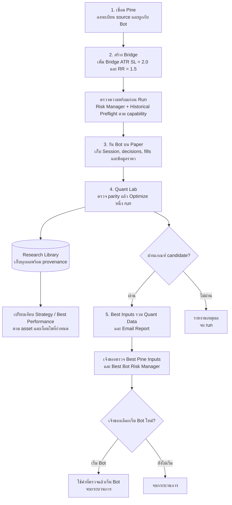

# Robot trade VPS 2.2.0 — PostgreSQL Paper staging

ระบบรับสัญญาณ TradingView สำหรับ Bot แบบ Spot Paper พร้อมบัญชีผู้ใช้, License, Risk Manager, Trade log และ Quant Lab สำหรับวิจัยย้อนหลัง โดย Worker เป็นผู้ตัดสินคำสั่งและบันทึกบัญชีเงินสด Paper ของระบบ

## เอกสารหลักและสถานะโครงการ

อัปเดต W7 วันที่ 2026-10-01: เจ้าของอนุมัติ downtime และผลกระทบของ staging พร้อมให้ Codex เดินงานและ commit/push ตาม checkpoint แล้ว การตรวจแบบอ่านอย่างเดียวพบว่าเครื่องยังขาด FOUNDATION/BACKFILL, resource policies และ physical I/O limits รวมทั้งต้องตรวจ rollback แยกแต่ละ service จึงต้องผ่าน prerequisite bootstrap ก่อน W7 ดู [checkpoint ล่าสุด](docs/PF2_W7_PREREQUISITE_CHECKPOINT_2026-10-01.md) ยังไม่มีการเปลี่ยน staging จากการตรวจรอบนี้

ตลาดหลักที่เจ้าของยืนยันสำหรับเก็บข้อมูลและวิจัยคือ **BINANCE:BTCUSDT Spot 1m** ใช้ตลาดเดิมต่อ ตามขอบเขต source/settings ที่ตรวจแล้ว

- **README นี้:** ภาพรวมโครงการ วิธีเริ่มใช้งานและขอบเขตผลิตภัณฑ์
- **[Context.md](Context.md):** สถาปัตยกรรม กติกาและบริบทการดำเนินงาน
- **[Roadmap](docs/ROADMAP.md):** ศูนย์รวมแผน ลำดับงาน สถานะล่าสุด เงื่อนไขเดินต่อและประวัติการเปลี่ยนแปลง
- **[Time Management](docs/TIME_MANAGEMENT.md):** งบชั่วโมง งานที่ทำระหว่างรอข้อมูลได้ Collection ETA และบันทึกเวลาคงเหลือ โดยใช้ลำดับและ gates จาก Roadmap

ทุก checkpoint ที่เปลี่ยนแผนหรือสถานะ ให้อัปเดต Roadmap และ Time Management พร้อมกัน และทบทวน README/Context ให้ตรงกับขอบเขตล่าสุด งบ Paper ที่ปรับตามงาน capacity/scheduler รวมเผื่ออยู่ที่ 410–720 ชั่วโมงก่อนหักเวลารอที่ซ้อนกันได้ ไม่ใช่กำหนดเวลารับประกัน Best Inputs ดูสมมติฐานและวิธีติดตามใน Time Management

สถานะ ณ 2026-09-27: APP-3A ผ่าน engineering acceptance ใน staging และ QL-2A ผ่าน baseline ตาม profile ที่ตรวจแล้ว SPT Custom ผ่าน axis parity และ scoped repaint งานวิจัย 100 candidates เสร็จแล้วแต่คืน `NO_VALID_CANDIDATE` เพราะ validation ไม่มี closed trades ส่วน Spot EXIT v1 เป็น draft ที่ยังไม่ผ่าน development preflight Checkpoint ที่ push ณ วันนั้นคือ `a4e524f`; สถานะและ checkpoint ล่าสุดดู [Roadmap](docs/ROADMAP.md#current-status--2026-09-29) การ push ไม่ใช่การ deploy production

แผน **ตรวจ Risk Manager ก่อน Run Bot** ทำถึง [PF-1C engineering checkpoint](docs/PF_1C_CHECKPOINT_2026-09-28.md): venue filters, shared cost model V2, pending fees และ UI Saved/Draft/Bridge ผ่าน 319 checks ในเครื่อง, 30 checks ซ้ำบน staging แยก, browser จริง และ metadata refresh ต่อเนื่องเกิน 120 วินาทีแล้ว ยังไม่เปลี่ยน release/Bot เดิม รุ่น V1 คงเดิม; V2 Quant ต้องผ่าน evaluator parity ก่อนใช้งาน ผล preview ไม่ใช่คำอนุมัติ Run Bot ดู [Roadmap](docs/ROADMAP.md#approved-extension--readiness-before-run-bot)

PF-2 ณ 2026-10-01 เชื่อม API, worker และ PROFILE enrollment พร้อม receipt แล้ว การทดสอบ local 10,000 แท่งผ่านตั้งแต่ BACKFILL จนได้ผล PF-2 โดยใช้ source/OS จำลองและ Python shim สำหรับ source ทดสอบ ยังไม่เปิดบน staging; รอ Linux acceptance ตาม [checkpoint](docs/PF2_ENROLLMENT_LOCAL_CHECKPOINT_2026-10-01.md) และ [ขั้นตอน staging](docs/PF2_STAGING_ACCEPTANCE_PACKET_2026-10-01.md) ขอบเขตยังเป็น Spot/Paper 1m รวม warm-up ไม่ใช่ 50,000 แท่ง รอบ Claude root ในวันเดียวกันแก้ CI ของ WIP checkpoint `f52d4be` (`258e865`) และ E2 measured settlement race (`3742961`) แล้วรอบที่สอง (`5b1641f`, `06a0f0f`, `4eb041a`, `e6f0dff`, `2b7915f`, `28d6f7e`) เพิ่ม proof tests ที่ขาด, E2 follow-up (veto enrollment เมื่อ settled I/O operation มี stop reason, คิด terminal runtime ใน unknown-final fallback, unsafe clock totals) และ W7 diagnostic PROFILE enqueue helper สำหรับเจ้าของ; full Node local ล่าสุด 783 tests ผ่าน 780 ล้ม 0 ข้าม 3 ที่ `7b8a08d` และ CI ผ่าน 9/9 ที่ `28d6f7e` ซึ่งเป็น W7 release commit ตามแผน ชุดขั้นตอน W7 สำหรับเจ้าของพร้อมแล้วหลังผ่านการตรวจ รอคำตอบของเจ้าของและการรัน W7 โดยเจ้าของ ยังไม่มี deploy, migration หรือ VPS action การวัด D6 p99 บน Linux ยัง block durable enrollment proof (Roadmap R7) และ staging activation แต่ไม่ block W7 diagnostic ต่อมาบน HEAD เพิ่ม fail-closed defaults (`89d8e8c`) และ E2 optional accounting follow-ups สำหรับ release ถัดไป ส่วน W7 ยังใช้ release `28d6f7e`; Claude root หยุดและเตรียม handoff ส่งต่อ Codex เมื่อ 2026-10-01

Historical Preflight ใช้ราคา Spot จาก exchange API และ evaluator ที่ผ่านการตรวจ หรือ CSV สัญญาณจาก TradingView ที่ผูกกับ source/input snapshot จึงไม่ต้องต่อ TradingView MCP การรองรับ CSV ใช้จำลอง Risk Manager ของสัญญาณชุดเดิม; ไม่ได้ทำให้เปลี่ยน source inputs หรือรองรับ Pine ทุกตัวได้

PF-2 และ QD/QS มี [local checkpoint วันที่ 2026-09-29](docs/QD_QS_DURABLE_IO_PF2_CHECKPOINT_2026-09-29.md): PostgreSQL I/O ledger ผ่าน 10 checks รวม settlement และการเปลี่ยน lease โดยรักษายอดสะสม ส่วน Python cost-v2 order finalizer ผ่าน 12 checks และเทียบ Node 17 กรณี ผู้ตรวจอิสระไม่พบ blocker ในขอบเขตนี้

[Runtime checkpoint](docs/QD_QS_RUNTIME_CANCEL_CHECKPOINT_2026-09-29.md) เชื่อม scheduler/ledger กับ launch intent และการ cancel ของ child ทดสอบที่ยังรอ payload แล้ว ผ่าน PostgreSQL 4 checks, ตรวจ source อิสระ และหนึ่งกรณี staging ที่จบ `CANCELLED`/`STOP_PROVEN` พร้อมคืน slot หลังหยุด process ตรวจซ้ำแล้วบริการและหลักฐานเดิมไม่เปลี่ยน ขั้นส่ง payload ยังปฏิเสธจนกว่าจะผูก I/O counters เริ่มต้นที่เชื่อถือได้ จึงยังไม่ใช่การเชื่อม PROFILE/evaluator ครบ ต้องตรวจ runtime accounting และ stateful replay ต่อก่อนเปิด Historical V2 replay หรือ capacity เพิ่ม

ลำดับผู้ใช้: เชื่อม Indicator → สร้าง Bridge → ตรวจความพร้อมก่อน Run และรัน Paper → Quant Optimize หนึ่ง run → ส่งผลที่ผ่านเกณฑ์ให้เจ้าของตรวจ → เจ้าของเลือกเริ่ม Bot ใหม่หรือจบ หากไม่พบ candidate ให้รายงานเหตุผลและจบ run โดยไม่ส่ง Best Inputs หรือวน Optimize อัตโนมัติ

[Initial I/O binding ในเครื่อง](docs/QD_QS_INITIAL_IO_BINDING_CHECKPOINT_2026-09-29.md) เพิ่มขั้นอ่าน counters และตรวจตัวตน unit/process/cgroup/device ก่อนบันทึก `ACTIVE` แล้วจึงปล่อย payload ผ่าน PostgreSQL 14 checks และ launcher/I/O controls 11 checks พร้อมตรวจ source อิสระ ขอบเขตนี้จำกัด diagnostic child หนึ่งตัวต่อ job [หลักฐาน Linux ล่าสุด](docs/QD_QS_LINUX_BINDING_CHECKPOINT_2026-09-29.md) ผ่าน binding/release ด้วย counters จริง read 0/write 4,096 bytes พร้อม marker รับ payload และ cleanup แล้ว [PROFILE runtime ภายใน](docs/QD_QS_PROFILE_BINDING_CHECKPOINT_2026-09-29.md) ผ่าน local checks/ตรวจ source อิสระ และ staging Linux หนึ่งกรณีแล้ว: 600 แท่งได้ผล 100 แท่งหลัง warm-up มี binding ก่อน release และหยุด child ครบ ผลยังเป็น provisional; counters หลังหยุดของกรณีนั้นยังไม่ผ่าน measured settlement ต่อมา [FTR-1c-INT](docs/QS_FTR1C_INT_LINUX_PROOF_2026-09-30.md) ผ่าน measured settlement บน Linux หนึ่งกรณี (PASS-MEASURED บนโค้ด FTR-1c-C) แต่ยังไม่ต่อเข้า product wiring (W2 ผ่านในเครื่องแล้ว แต่ยังไม่มี product code เรียกใช้จนกว่า W3; W3–W7 ยังไม่ทำ) และยังไม่ deploy

รายละเอียด phase และ test counts ด้านล่างเป็นประวัติของแต่ละ release ไม่ใช่สถานะ feature ปัจจุบันทั้งหมด ให้ใช้ Roadmap เป็นหลักในการเลือกงานถัดไป

## ทีม Agent สำหรับเดินโครงการ

อัปเดตงาน PF-2 วันที่ 2026-09-30: [holdout และ W3 local checkpoint](docs/PF2_W3_LOCAL_CHECKPOINT_2026-09-30.md)
เพิ่มขอบเขต holdout ร่วมที่เข้มที่สุดของเจ้าของเดียวกัน ผ่าน service tests 47/47
ส่วน W3 มีโค้ดเชื่อมในเครื่องแล้ว แต่ยังไม่ผ่าน acceptance ครบ และยังไม่ได้เปิด API บน staging
ต้องทำ durable trusted PROFILE V2 enrollment เพิ่มก่อน R7; ผล provisional ที่จบ CANCELLED ใช้แทนไม่ได้

ใช้หัวหน้าเดียวตาม [AGENTS.md](AGENTS.md) และ [คู่มือทีม](docs/AGENT_TEAM.md): Astra High คุม workflow/timeline/usage; Astra Medium audit งานยาก; บทบาท Codex ที่เหลือใช้ `gpt-6.1-sol` ทั้งหมด โดย Debugger/Operations ใช้ High, Coder/Tester/Routine worker ใช้ Medium และ Documentation/Release clerk ใช้ Low เริ่มด้วย routine worker หนึ่งคนสำหรับงานเล็กที่เข้าเกณฑ์ ไม่เปิด swarm เป็นค่าเริ่มต้น และทำงานพร้อมกันไม่เกิน 3 subagents โดยไม่ให้เขียนไฟล์เดียวกันพร้อมกัน งาน routine worker ที่เปลี่ยนพฤติกรรมต้องมี coder/tester/debugger ตรวจอิสระก่อน root รับงาน ถ้าหัวหน้ารันบน Claude ให้ใช้ model/effort ตามคอลัมน์ Claude ใน AGENTS.md (Opus 5.5 และ Sonnet 5.5) เจ้าของถอดบทบาท Fable 5.1 ทั้ง 3 ออกจากทีมแล้วเมื่อ 2026-10-01 และไม่ใช้ Fable จนกว่าเจ้าของจะสั่งใหม่

ตั้ง project defaults และ role profiles ใน `.codex/` แล้ว การเลือก model ของ task ที่เปิดอยู่ยังต้องตรวจจาก app ไม่ถือว่าไฟล์ config เปลี่ยน model ระหว่าง turn อัตโนมัติ ตรวจ quota ก่อนส่งงานและแต่ละ checkpoint พร้อม reserve 15 percentage points ตาม AGENTS.md; ไม่รับประกัน quota เมื่อหน้าต่างบางส่วนไม่มีข้อมูล ใช้ local สำหรับพัฒนาและ VPS เฉพาะงานที่ผ่าน scope/health/capability gates

ทุก role รวมหัวหน้าและ routine worker ใช้ Caveman สำหรับบทสนทนา, task packets, compact และ handoff ที่ agent เขียนเอง รวมถึงไฟล์ memory ภายใน ตาม [กติกากลาง](AGENTS.md#communication-compact-summaries-and-handoffs) ส่งเฉพาะไฟล์/สัญญา/หลักฐานที่จำเป็น ย่อข้อความซ้ำแต่คงข้อจำกัด หลักฐานและงานถัดไป เอกสารผลิตภัณฑ์ใช้ภาษาปกติ ยังไม่ได้วัดผลประหยัด token หรือ throughput จากการเปลี่ยน model

## แผน Quant Research Library และ Best Performance

ผล [worker-managed lifecycle staging](docs/QD_QS_LIFECYCLE_STAGING_2026-09-28.md) ผ่าน baseline ที่เชื่อมฐานข้อมูล, scheduler, main worker และ evaluator จริงภายใต้ I/O controls แล้ว ใช้ข้อมูลเดิมและหนึ่ง candidate ได้ `NO_VALID_CANDIDATE` ตาม fixture ตรวจ checkpoint ผ่าน คืน slot และหยุด process ครบ บริการเดิมปกติ ยังต้องตรวจ stop/recovery ที่เหลือก่อนปิด QD-1/QS-1; คงเพดาน 10K/1m และ Bot ทั้งหมดหยุดอยู่

รอบ active cancel ใหม่ผ่านใน staging แล้ว: หยุด process ภายใน 1.474 วินาที รักษา slot จนหยุด ไม่มี checkpoint/result เขียนเพิ่ม และ automatic cleanup ยืนยันสำเร็จ แก้เฉพาะ helper ที่เคยปฏิเสธ transient unit ซึ่งถูกลบไปแล้ว รอบเดิมที่แจ้ง `STOP_UNCONFIRMED` ยังคงเป็นหลักฐานล้มเหลว; scheduler deadline, pressure, crash/recovery และ readiness crash cleanup ภายใต้ controls ใหม่ยังต้องตรวจต่อ

รอบ evaluator timeout หลัง readiness ผ่านแล้ว: ยืนยัน SIGSTOP ของ child, ได้ `EVALUATION_TIMED_OUT`, คืน slot และ cleanup สำเร็จ โดย deadline และ checkpoint ไม่เปลี่ยน สองรอบเตรียมทดสอบที่ล้มเหลวยังคงเก็บไว้; scheduler deadline, pressure และ crash/recovery ยังต้องตรวจต่อ

แก้ปัญหาไฟล์ readiness ค้างหลัง crash ในเครื่องแล้ว โดยคง retention 24 ชั่วโมง ผ่าน source audit และการตรวจเฉพาะส่วน 18/18 ยังต้องตรวจ staging ก่อนรับรอง runtime ส่วน proxy ทดสอบผ่าน startup ที่ `TasksMax=16` แล้ว แต่ pressure run ใหม่พบ `QUANT_IO_GATE_FAILED` ใน evaluator ที่ cursor 0 ก่อนฉีด fault จึงยังไม่ผ่าน pressure acceptance งานทดสอบหยุดครบ บริการเดิมปกติ ต้องหาสาเหตุ I/O gate ก่อนรันใหม่

ชุด diagnostic แยกบน Linux staging ผ่าน 1,000 แท่งใน 2.526 วินาที ส่วน actual-main รอบต่อมาถึง checkpoint 3,000 แล้วล้มเพราะอ่านไฟล์ I/O ไม่พบ และ cleanup ครบ การแก้ terminal handshake ผ่าน [actual-worker fixture ใน staging](docs/QD_QS_TERMINAL_HANDSHAKE_2026-09-29.md) ถึง 3,876 แท่งและ cleanup ครบแล้ว แต่ยังไม่ผ่าน pressure acceptance ในเครื่องเพิ่ม health recovery แบบ opt-in, PROFILE streaming และ contract V2 ที่ใช้ scheduler policy แบบระบุชัดแล้ว รวมทั้งปฏิเสธ legacy calculation และรายงานประวัติทั้งหมดที่ข้าม scheduler เมื่อเปิด managed mode ชุดตรวจรวมผ่าน 105 กรณี ข้าม symlink บน Windows 1 กรณี; PostgreSQL ผ่าน 25 กรณี ข้าม Python parity 1 กรณี ยังไม่เปิด V2 enrollment, capacity เพิ่ม หรือ deploy production ดู [งานปิด QD-1/QS-1](docs/QD_QS_PHASE_CLOSURE.md) และ [หลักฐานล่าสุด](docs/QD_QS_CLOSURE_PROGRESS_2026-09-29.md)

เพิ่มขั้นเตรียม telemetry สำหรับ main/evaluator แล้ว: ใช้ไฟล์ชั่วคราว 4 KiB ผ่าน storage budget ตรวจ device/limits และรอ counters จริงก่อนรับงาน พร้อมปฏิเสธผลที่มาหลัง deadline ชุดทดสอบ I/O ล่าสุดผ่าน 8/8 และผ่าน staging ตามขอบเขตใน [บันทึกการตรวจ](docs/QD_QS_RUNTIME_IO_COMPLETION_2026-09-28.md)

ผล [ตรวจ worker จริงและแก้ completion](docs/QD_QS_RUNTIME_IO_COMPLETION_2026-09-28.md): main startup และ evaluator 1,000 แท่งผ่าน supervisor จริงแบบเรียงลำดับ ผ่าน I/O readback และตรวจ hash แล้ว Driver ส่ง completion อัตโนมัติหลัง cleanup ใน 35.250 วินาที; monitor รับผลทัน deadline และ health ผ่านครบ บริการเดิมทั้ง 8 ตัวคง PID เดิม หยุด unit ทดสอบและถอน override แล้ว ขอบเขตนี้ยังไม่ใช่การตรวจ research job ใหม่ที่ main จัดการผ่านฐานข้อมูล หรือการเพิ่ม capacity

ผล [physical PROFILE recovery และ I/O เดิม](docs/QD_QS_PROFILE_STAGING_IO_2026-09-28.md): recovery ได้ผลตรง baseline และ deadline เดิมคงอยู่ แต่ monitor รอบนั้นไม่ผ่านเพราะ done marker ช้า 11 วินาที หลักฐานเดิมยังคงสถานะล้มเหลว; รอบใหม่ด้านบนผ่าน completion แล้ว ยังต้องทบทวน acceptance ที่เหลือก่อนปิด QD-1/QS-1 และ Bot ทั้งหมดคงหยุดจนกว่าจะ deploy ใหม่

งาน local ล่าสุดเพิ่ม [resource controls และ data/profile contracts](docs/QD_QS_RESOURCE_PROFILE_CHECKPOINT_2026-09-28.md): ตรวจ I/O limits ของ worker, ใช้ deadline ร่วมในการวัดโหลด และเพิ่มช่วงเวลา UTC กับงาน PROFILE ผ่าน scheduler เดียวกัน PROFILE แปลงข้อมูลเปิดแท่งเป็นเวลาปิดแท่งพร้อม ATR14 แต่ยังไม่อนุญาต evaluator โดยอัตโนมัติ Local lifecycle, HTTP, การถอนสิทธิ์ระหว่าง conversion และ browser desktop/mobile ผ่านแล้ว; ผลทดสอบ staging ล่าสุดและ gates ที่เหลืออยู่ในบันทึกด้านบน ยังคงเพดาน 10K/1m และไม่มี production deployment

Git checkpoint ก่อนงาน recovery/storage คือ `2f6b1be` ซึ่งรวม QD/QS foundation และ worker integration บน branch `codex/app3a-market-wait-checkpoint` การ deploy เป็นขั้นตอนแยก

ต่อยอด [QD-1/QS-1 foundation](docs/QD_QS_FOUNDATION_CHECKPOINT_2026-09-28.md) ด้วย [research worker integration](docs/QD_QS_WORKER_CHECKPOINT_2026-09-28.md): worker แบบ opt-in อ่าน dataset ผ่าน reference, เก็บ SPT/Paper state ข้าม chunk และใช้ scheduler slot เดียว มี supervisor จำกัด process บน Linux และ health admission ที่ปฏิเสธเมื่อข้อมูลสุขภาพไม่ครบ การเปิดใช้ต้อง migration แบบ offline และตรวจ staging/headroom; capacity ยังเป็น 10K/1m และ V1 เดิม กรณี worker ตายขณะทำงานจะกัก slot ไว้จนพิสูจน์การหยุดได้

[งาน recovery/storage/staging](docs/QD_QS_RECOVERY_STAGING_2026-09-28.md) เพิ่มเครื่องมือกู้ slot แบบ offline, disk/temp reservations, retention ที่รักษา reference และสัญญาช่วงข้อมูล UTC ผ่านการรัน worker จริงใน staging แยกและซ้อม SIGKILL หลัง checkpoint 1,000 แท่งแล้ว ผลหลัง resume ตรงกับ baseline เดิมและ token เก่าถูกปฏิเสธ การวัด API/DB ช่วงสั้นผ่าน แต่ยังไม่ใช่การรับรอง sustained load หรือเพิ่ม capacity

[งาน Data capability และ ingestion](docs/QD_QS_INGESTION_CALIBRATION_2026-09-28.md) เพิ่มหน้า Data สำหรับตรวจช่วงเวลา UTC และส่งงานดึงประวัติ Spot ผ่าน scheduler เดียวกับ research โดยคงเพดานรวม warm-up 10,000 แท่ง ผ่านการตรวจ HTTP/browser แบบ local และดึงข้อมูลจริง 2,100 แท่งผ่าน managed worker ใน staging แยกแล้ว การวัดโหลดผ่านเกณฑ์เฉพาะช่วงที่ตรวจ: evaluator มี nonidle intervals 173.210 วินาทีภายใน 300 วินาที บริการเดิมปกติและหยุดบริการทดสอบครบแล้ว ยังวัด I/O counters ไม่ได้และยังไม่เพิ่ม capacity ข้อมูลที่ได้เป็น raw history ไม่ได้สร้าง Paper trades หรือเปิดใช้ profile สำหรับ Quant โดยอัตโนมัติ

อนุมัติแผนเก็บผล Quant ทุกรอบเป็นข้อมูลวิจัยที่มี version/hash และเพิ่ม `quant-data/` ใน Best Inputs package ส่วน Email Report ยังคงเป็น deliverable หลักรายการที่สอง ผลไม่ผ่านเก็บเป็น diagnostic ที่ตรวจย้อนหลังได้ โดยไม่สร้าง Best Inputs ให้ใช้งาน

รายงานมีสองมุมมอง: **Portfolio Performance** ใช้บัญชีและการซื้อขาย Paper ที่เกิดขึ้นจริง พร้อมแผนเพิ่มมูลค่าตามราคาตลาดและผลตอบแทนที่คำนึงถึงการฝากถอน; **Strategy Comparison / Best Performance** เปรียบเทียบ strategy ของ asset เดียวกันภายใต้เงื่อนไขที่สอดคล้องกัน จัดอันดับเฉพาะผลที่ผ่านเกณฑ์ และรายงานได้ว่าไม่มีผู้ผ่านเกณฑ์

เป้าหมายใหม่: **50,000 แท่งเป็นเพดาน Historical Preflight และขนาด processing chunk** ส่วน Quant Research ใช้ budget ตาม timeframe/stage รวม warm-up สำหรับ BTCUSDT Spot 1m ใช้ 100K–250K ค้นหา, 500K ตรวจ shortlist และ 750K–1M ตรวจขั้นสุดท้าย; 30m ถึง 1D ใช้ 50K ต่อ timeframe ที่รองรับ งานเกินมาตรฐานต้องขอ Deep Research และผ่าน admission ไม่เปิด 1M × 100 candidates เป็นค่าเริ่มต้น **โค้ดปัจจุบันยังจำกัด 10,000 แท่งและ profile 1m ที่รองรับอยู่**

เลือกช่วงวิจัย 1 Week / 1 Month / 3 Months / 6 Months / 1 Year / 2 Years / 3 Years / YTD / All Available / Custom ตามข้อมูลจริงและงบของงาน โดย All Time Registered คงไว้สำหรับประวัติ Bot จริง ระบบไม่ตัดช่วงหรือเปลี่ยน timeframe เอง; จำนวนแท่งเพียงพอไม่ได้รับประกัน candidate ผ่าน

เจ้าของเลือก Replay ผลเดิม, Backtest ช่วงใหม่ หรือ Optimize รอบใหม่ได้ตามแผน โดยเป็นงานใหม่ที่อ้างอิงผลต้นทาง ไม่มีการวนวิจัยหรือเปลี่ยน Bot อัตโนมัติ การเปลี่ยน source inputs ยังต้องมี evaluator ที่รองรับ; CSV สัญญาณใช้ได้เฉพาะ snapshot ที่ตรวจแล้ว

ดู [แผนรวมและ diagram](docs/ROADMAP.md#approved-extension--quant-research-library-and-best-performance), [ตารางช่วงเวลาต่อ timeframe](docs/ROADMAP.md#report-range-and-50000-bar-contract) และ [รายละเอียดข้อมูล/รายงาน](docs/QUANT_RESEARCH_LIBRARY.md) PF-1 engineering ผ่านแล้ว; งานถัดไปคือปิด gates ของ QD-1/QS-1 ก่อนเปิดงานข้อมูลขนาดใหญ่ พร้อมทำ PF-2 V2 evaluator parity ตาม dependency ส่วน QR-1 ถึง QR-4 ยังเป็นแผน

คง VPS ตามข้อมูลเจ้าของที่ 2 vCPU / 8 GB RAM / 100 GB NVMe / 8 TB bandwidth / 1 snapshot ยังไม่ต้อง upgrade แผนให้ **งาน Quant หนักรันได้ 1 งานรวมทั้งระบบ** ผ่าน durable queue และ resource/health admission โดยให้ Trading/Web/PostgreSQL มีทรัพยากรก่อน จำนวน Bot ไม่ใช่สิทธิ์รัน Quant พร้อมกัน แผน [โครงสร้างพื้นฐาน](docs/ROADMAP.md#quant-resource-protection-and-infrastructure-scaling) รองรับการแยก Quant ไปอีกเครื่องภายหลังตาม telemetry; snapshot เดียวไม่แทน off-host backup และ restore drill

**รุ่นนี้ล็อก Live ทุก Broker ทั้ง UI, API, Worker และ Adapter ไม่ใช่ระบบพร้อมเทรดเงินจริง**
ไม่ต้องใส่ API key จริงเพื่อทดสอบ Paper และอย่าเปิดบริการสาธารณะก่อนผ่าน deployment checklist

## Phase 0 — deploy แล้ว (50062f5)

เพิ่มบัญชีเงินสด Paper, ประวัติการเพิ่ม/ลดทุน และ recovery หลัง restart พร้อมนิยาม Analytics แบบปิดครบหนึ่งรอบ รายละเอียดและขั้นตอนทดสอบ migration บนสำเนา DB อยู่ใน [Phase 0](docs/PHASE0.md)

ช่อง Equity/Balance คือทุนสะสมที่กำหนด ไม่ใช่ยอดเงินปัจจุบัน การเปลี่ยนค่าเป็นการเพิ่ม/ลดทุนโดยไม่ล้างกำไรขาดทุน หน้า Risk แสดงเงินสดและทุนตามบัญชีแยกต่างหาก รุ่นนี้ยังไม่ประเมินทุนด้วยราคาตลาดสด

## Phase 1 — deploy แล้ว (b441476, schema 10)

Deploy บน VPS แล้วเมื่อ 2026-09-18 (Asia/Bangkok) เพิ่ม MFA/TOTP และ recovery codes, HttpOnly cookie + CSRF, กู้รหัสผ่านทางอีเมล, USER/SUPPORT/ADMIN และเครื่องมือหมุนกุญแจเข้ารหัส ระบบยังคง Paper-only ไม่พร้อมเทรดเงินจริงหรือเปิดขายบริการ

สำรอง DB และซ้อม migration ก่อนอัปเกรด schema 9 → 10 แล้ว ตั้ง `PUBLIC_ORIGIN` ตรงโดเมนจริง โดยคง master key และ webhook เดิมไว้ Tests ก่อน deploy ผ่าน 88/88 ทั้งในเครื่องและ VPS พร้อมตรวจ Desktop/Mobile บน Chrome

ตรวจรับล่าสุดเมื่อ 2026-09-18: service และฐานข้อมูลปกติ Admin เปิด MFA แล้ว 1/1 บัญชี และพบ session ที่ผ่าน MFA Gmail ส่งอีเมลทดสอบถึงผู้ใช้แล้ว แต่ยังไม่มีหลักฐานการกู้รหัสผ่านครบวงจรบน production

งานตรวจรับที่ยังค้าง:

- ผู้ใช้ทดสอบ Forgot Password ครบวงจรและยืนยันว่าเก็บ recovery codes อย่างปลอดภัย
- ซ้อมกู้ระบบครบวงจรในพื้นที่แยก; migration rehearsal ไม่ใช่การทดสอบ restore ระบบทั้งหมด
- ทดสอบอุปกรณ์ iOS/Android จริงและ Safari พร้อมประเมินความปลอดภัยแยกต่างหากก่อนเปิดขายบริการ

รายละเอียดผล deploy และข้อจำกัดอยู่ใน [Phase 1](docs/PHASE1.md)

## Phase 2 — deploy แล้ว (0321ae6, PostgreSQL schema 11)

เพิ่ม PostgreSQL schema 11, การคำนวณเงิน Decimal, API/Worker แยก process, คิวหลาย Worker, transaction ป้องกันบันทึก Fill/เงินซ้ำ และเครื่องมือ import/backup/หมุนกุญแจ ระบบยังคง Paper-only

Tests: ชุดเดิมและ UI 89/89; PostgreSQL จริง 15/15 รวมฆ่า Worker กลาง transaction, หลาย process, MFA/CSRF และ backup/restore ตรวจ Chrome Desktop/Mobile ผ่าน Production ย้ายจริง 534 signals / 151 fills โดยไม่มีงานค้างหรือบัญชีเงินสดติดลบ และผ่าน restart/HTTPS health check หลัง deploy

Production ใช้ PostgreSQL API และ Worker แยก service; `npm start`/SQLite เก็บไว้ชั่วคราวสำหรับประวัติและ recovery เท่านั้น อ่าน [Phase 2](docs/PHASE2.md) โดยเฉพาะ backup และข้อจำกัด rollback หลังรับรายการใหม่

## Phase R-1 — เสร็จสมบูรณ์ใน repo (b2cb863, PostgreSQL schema 12)

เพิ่มระบบติดตาม Position รายไม้ (per-entry allocation tracking) ผ่านตาราง `ledger_position_allocations` บน Schema 12 เพื่อแก้ปัญหาการ Scale-in แล้วคำสั่ง Take Profit ของไม้แรกไปปิดรวบทุกไม้ (Targeted TP/SL per lot) ทำให้แต่ละ Order Lot มีการจัดการกำไร/ขาดทุนที่เป็นอิสระต่อกัน ผ่านการทดสอบครบถ้วนด้วย `test/scale-in.test.js`

## Quant Lab (QL-1 ถึง QL-4) — เสร็จสมบูรณ์ใน repo พร้อม Audit Hardening

เพิ่มสภาพแวดล้อมวิจัยเชิงปริมาณแบบแยกส่วน (`quant_lab/`) บน Python 3.12 โดยไม่ยุ่งเกี่ยวกับ Node runtime หรือ Docker release payload พร้อมผ่านการ Audit วิศวกรรมซอฟต์แวร์และการแก้ 4 P1 Blockers ครบถ้วน:
- **QL-1 (Contracts & Scaffolding)**: `contracts.py` กำหนด frozen Pydantic schema สำหรับ RiskProfile, ParameterBounds, StrategyDefinition, OptimizationRun, ExportMetadata พร้อมล็อก dependencies ผ่าน `uv.lock`
- **QL-2 (Data & Accounting Parity)**: ตัวแปลงข้อมูล Parquet/DuckDB และเอนจินจำลอง FIFO/Risk Parity ที่ให้ผลลัพธ์ตรงกับ Node.js runtime แบบ 100%
- **QL-3 (Backtest & Constrained Optimizer)**: ระบบ Discrete-event simulation, Chronological / Walk-forward validation ปราศจาก Data leakage, การค้นหาพารามิเตอร์แบบ Multi-stage gate (Sensitivity, Stress, Out-of-sample)
- **QL-4 (Reports & Pine Script Export)**: สร้าง HTML Tear sheet พร้อมกราฟ SVG Equity/Drawdown ออฟไลน์, ส่งออกชุดบันเดิล Pine Script v6 (6 ไฟล์) ทั้งโหมด `alert_calls` และ `order_fills`, เอนจินอัปเดต Input preset diff, และการส่งต่อ Strategy metadata ผ่าน Webhook
- **Audit Hardening & P1 Blocker Fixes**:
  1. *P1#1*: ส่งต่อค่า RiskProfile, broker, symbol และ timeframe จริงเข้าสู่ Pine Script และ JSON bundles พร้อมตรวจเช็ค Hash digest
  2. *P1#2*: แยก `balance` ออกจาก `initial_capital` ในการทดสอบ Backtest อย่างถูกต้อง
  3. *P1#3*: ปรับลำดับการคำนวณขนาด Order ให้โหมด Quote/Percent equity ทำงานก่อนการจำกัดขอบเขต Allocation ของ Target
  4. *P1#4*: ปรับปรุง Pine Script โหมด order_fills ให้ใช้ `var string currentEntryId` และสั่ง `strategy.close(currentEntryId)` เพื่อคงความเป็นเจ้าของของแต่ละ Entry
  5. *Positive Regression Suite*: ชุดทดสอบถาวร `quant_lab/tests/test_audit_regressions.py` ครอบคลุมทุกจุดบกพร่อง (Passed 7/7)
  6. *Direct Node Parity Verification*: สร้าง IPC script เรียก Node `src/postgres/risk.js` โดยตรงเพื่อตรวจสอบ parity ของ quantity/notional ผลลัพธ์ตรงกัน 100% กับ Python (Passed)

คำสั่งตรวจในเครื่อง:

```sh
cd quant_lab
uv sync --locked --all-extras
uv run --no-sync ruff check .
uv run --no-sync pytest
uv run --no-sync python -m robot_quant.smoke
uv run --no-sync python quant_lab/tests/test_node_direct_parity.py
```

ผลตรวจ checkout ใน R-0: Node tests 111/111 ผ่าน และ Quant offline pytest 71/71 ผ่าน; Direct Parity 100% เป็นผลจากการตรวจรอบก่อน (ดู [Quant Lab README](quant_lab/README.md))

## Pine / Quant integration ปัจจุบัน

QL-2A fixed SPT Spot profile ผ่าน engineering baseline แล้ว ส่วน SPT Custom มี evaluator สำหรับ numeric source slots ที่รองรับสูงสุด 8 ช่อง และ ATR(14) ของ Bridge แยกจาก ATR ของ Indicator หลักฐาน baseline + 16 axis settings และ Custom repaint อยู่ใน [รายละเอียด parity](docs/QL_3A_VARIED_INPUT_PARITY.md) การรับรองยังจำกัด source/settings และไม่ครอบคลุม arbitrary Pine หรือ Spot EXIT v1 draft ใหม่

QL-3A durable research ประเมินครบ 100 candidates บนข้อมูล Spot 10,000 แท่ง ผลคือ `NO_VALID_CANDIDATE`; holdout ยังไม่ถูกประเมิน ประวัติของ baseline พบ 9 allocations ใน 3 รอบถือสถานะที่ขาดทุนต่อเนื่อง จึงชน loss-streak guard การมีจำนวนแท่งครบอย่างเดียวไม่ทำให้มี Best Inputs ดู [ผลวิจัย](docs/QL_3A_HISTORY_RESEARCH_2026-09-27.md)

[Spot EXIT v1 draft](docs/QL_3A_SPOT_EXIT_V1_2026-09-27.md) ลดขาดทุนย้อนหลังแต่ยังมี validation trades เป็นศูนย์ จึงยังไม่ activate งานถัดไปตามแผนคือ PF-1 ตรวจความสอดคล้องของ Risk Manager โดยใช้ขอบเขตที่เจ้าของกำหนด และแยก engineering acceptance ออกจากการพบ candidate ที่เหมาะสมสำหรับแนะนำ

## Interactive Dashboard Charting — เสร็จสมบูรณ์ใน repo

เพิ่มหน้าต่างกราฟราคาเทคนิคัลแบบ Interactive ด้วย TradingView `lightweight-charts` (v4+) ในหน้า Analytics:
- ดึงแท่งเทียน OHLCV ตรงจาก Public API ของ Broker (Binance) เพื่อลดภาระ Bandwidth และ CPU ของ VPS
- คำนวณอินดิเคเตอร์แบบ Real-time บน Frontend: Dual Custom EMAs (ตั้งค่า period แยกอิสระ 2 เส้น) และ Custom ATR Bands (กำหนด Period และ Multiplier ได้)
- แสดงเส้นระดับราคาคำสั่งและ Position สด (Entry, Stop Loss, Take Profit) โดยดึงข้อมูลตำแหน่งที่ถือครองจาก `/api/positions`

## Trading Control Panel & Risk Guard UI — เสร็จสมบูรณ์ใน repo

ปรับปรุงระบบควบคุมสถานะการเทรดของบอทและมาตรการป้องกันความเสี่ยง (ตาม Schema 14 Bot Lifecycle):
- **Bot Manager v2 & 4-Button TCP**: แผงควบคุม 4 ปุ่มคงที่ (`RUN`, `PAUSE`, `STOP`, `RESET`) ตาม State machine, Desktop แสดง 4 คอลัมน์ / Mobile ตัด 2x2 grid (target ≥ 44px)
- **Account Cards & Micro-animations**: การ์ดคู่ขนาดใหญ่แสดงยอด **EQUITY** และ **BALANCE** แยกสกุลเงิน/โบรกเกอร์ชัดเจน พร้อมไฮไลต์ `.value-flash` เมื่อตัวเลขเปลี่ยนแปลงจริง
- **State Gating & Dialogs**: ระบบ Modal Dialog ยืนยันคำสั่ง `STOP` (เตือนว่าไม่ปิด position ในตลาด) และ `RESET` (เตือนเรื่องการ archive session)
- **Risk Policy Lock**: หน้า Risk Manager ทำการ Freeze/Lock ฟอร์มอัตโนมัติเมื่อบอทอยู่ในสถานะ `RUNNING` หรือ `PAUSED` และปิดการกดปุ่ม RUN หากมี Unsaved Draft ในฟอร์ม

## Risk Manager — next usability and Quant Lab alignment

Risk Manager ปัจจุบันยังเป็นผู้คุมเพดานจริงของ Bot: **Max Value** คือเพดานที่ Worker บังคับใช้ ส่วน **Default** ใช้เป็นค่าตั้งต้นของหน้า UI และเครื่องคำนวณเท่านั้น การปรับ Default ไม่เพิ่มสิทธิ์ให้สัญญาณ TradingView หรือ Quant Lab

ตามแผน PF-1 ถึง PF-4 ใน Roadmap จะเพิ่ม static checks, Historical Preflight, readiness report และ calculated proposals พร้อมแยกหน้าเป็น Bot Risk Policy, Capital และ Order Preview ให้ชัดเจน แสดง cash/reserved cash/book equity และจำนวน Symbol/จำนวนไม้แยกกัน Preview จะไม่ทำให้เกิด unsaved risk draft และ Quant Lab จะอ่าน policy snapshot ของ Bot ที่เลือกจาก Server แทนการเชื่อค่าที่ Browser ส่งมา ดูรายละเอียดและเกณฑ์รับงานที่ [Risk Manager next scope](docs/RISK_MANAGER_NEXT.md)

## Quant Lab Studio & Service Deployment — initial rollout (39590f7)

เปิดใช้งานระบบวิจัยเชิงปริมาณบน VPS อย่างเป็นทางการ (`39590f7`):
- **Quant Service**: `astra-trade-quant.service` ทำงานแบบ offline research บน loopback แยก Python environment ด้วย `uv 0.12.17`
- **Authenticated Proxy**: Node.js ทำหน้าที่ Reverse Proxy ส่งต่อ `/api/quant/*` พร้อมบังคับตรวจ Session (ปฏิเสธ 401 ทันทีหากไม่ได้ล็อกอิน) และคุม Timeout / Error handling
- **Quant Lab UI**: สตูดิโอ 4 แท็บในหน้าเว็บ:
  1. *Backtest Panel*: รัน Synthetic-data Backtest แบบ Discrete-event พร้อมวาดกราฟเส้น SVG Equity Curve
  2. *Optimizer Panel*: รัน Constrained Optimizer พร้อมคัดกรองผ่าน Sensitivity, Stress และ Walk-forward gates
  3. *Risk Preview*: จำลอง Position Sizing และตรวจสอบเพดานความเสี่ยงก่อนเทรด
  4. *Pine Export*: **ยังไม่เปิดใช้งาน (Not released)** เนื่องจากสัญญาส่งออกยังอยู่ในระหว่างการตรวจสอบ
- **Verification**: Quant tests ผ่าน 71/71, Node tests ผ่าน 111/111, API health `PAPER_ONLY`, Quant bridge health `OFFLINE_RESEARCH_ONLY`

**R-0 VPS snapshot (2026-09-24)**: Release `ff5a9d1` and four active services were confirmed through SSH; public health remained `PAPER_ONLY` and queue count later reached 0. Local test results do not certify that deployed release. After an initial authentication failure, an authorized read-only database check directly verified schema 14 and outbox SENT 2,946 / FAILED 1,151 / DISABLED 513. Earlier journal checks counted 1,864 SMTP 550 rejections, so Email Report delivery still needs diagnosis and a confirmed receipt. See [R-0 baseline](docs/R0_BASELINE_2026-09-24.md).

## APP-4 เดิม: Customer Lifecycle & Quotas — มีโค้ดพื้นฐานใน repo

รายการด้านล่างคือฐานงานเดิม ไม่ใช่การผ่านเกณฑ์ APP-4 ของ [roadmap ฉบับใหม่](docs/ROADMAP.md) ซึ่งยังต้องรับรองความปลอดภัย การกู้คืน และ paid Paper beta หลัง APP-3B

กำหนดและบังคับใช้โควต้าตามระดับ License/Plan (`src/postgres/quotas.js`):
- **FREE**: บอท 1 ตัว / ประวัติย้อนหลัง 30 วัน
- **PERSONAL**: บอท 3 ตัว / ประวัติ 90 วัน
- **PRO**: บอท 10 ตัว / ประวัติ 180 วัน
- **ENTERPRISE**: บอท 50 ตัว / ประวัติไม่จำกัด
- **Server Enforcement**: `POST /api/bots` ปฏิเสธการสร้างบอทเกินโควต้า (403), `GET /api/analytics/*` บล็อกการดึงข้อมูลย้อนหลังเกินที่แพ็กเกจกำหนด
- **Dynamic Frontend**: หน้า Bots สร้างการ์ดตาม `maxBots` อัตโนมัติ พร้อมสลับเลย์เอาต์เป็น `.enterprise-grid` เมื่อมีจำนวนบอทมากกว่า 10 ตัว และหน้า Analytics ล็อกปฏิทินไม่ให้เลือกย้อนหลังเกินโควต้า

## TradingView → Production Paper Forward Acceptance — ผ่านการทดสอบครบถ้วน (2026-09-22)

ทดสอบส่งสัญญาณ Webhook ผ่าน `scripts/test-paper-acceptance.mjs` เข้าสู่ Production จริง (`https://www.robottrade.io` บน Release `c2921f3`, Schema 14):
- **BUY 1 (Allocation P1)**: สำเร็จ (HTTP 202, สร้าง Allocation P1)
- **Repeated BUY (Allocation P2 / Scale-in)**: สำเร็จ (HTTP 202, สร้าง Allocation P2 ซ้อนโดยไม่ทับ P1)
- **Duplicate Webhook Rejection**: สำเร็จ (HTTP 409 ปฏิเสธ Trade ID ซ้ำ)
- **Stale Webhook Rejection**: สำเร็จ (HTTP 400 ปฏิเสธ Timestamp เก่าเกินกำหนด)
- **Targeted TP1**: สำเร็จ (HTTP 202, ปิดเฉพาะ Allocation P1 โดยคงไม้ P2 ไว้)
- **Targeted TP2**: สำเร็จ (HTTP 202, ปิด Allocation P2, พอร์ตกลับสู่ Flat)
- **Reduce-Only SL Guard**: สำเร็จ (Worker ตรวจสอบและปฏิเสธคำสั่งเกิน ไม่เปิด Short ฝั่งตรงข้าม)
- **Queue & Health**: Queue เคลียร์สู่ 0 ทันที Health ตรวจสอบผ่าน `{"ok":true,"version":"2.2.0","mode":"PAPER_ONLY","queued":0}`

**ขั้นตอนถัดไป:** 
1. **SMTP Diagnosis**: ตรวจสอบการแจ้งเตือนอีเมลของ Worker (ปัญหา SMTP 550)
2. **PostgreSQL Password Rotation**: ดำเนินการหมุนรหัสผ่าน DB ตามรอบความปลอดภัย

## การแก้ไขจาก v2.0

- ตรวจ Max risk หลังคำนวณจำนวนทุกโหมด รวม explicit quantity และ fixed notional; BUY ต้องมี SL
- ผูก `execution_mode`, `account_id`, `client_order_id` กับสัญญาณตั้งแต่รับเข้า ไม่เปลี่ยนตาม Risk profile ภายหลัง
- แยก Position/สถิติด้วย user + account + mode; หนึ่ง primary account ต่อ Broker ในรุ่นนี้
- บันทึก Fill, Position, PnL, สถานะ Order และ Email outbox ใน transaction เดียว
- ใช้ cumulative fill ป้องกันลงบัญชีซ้ำ และคิด R จากความเสี่ยงตั้งต้น ไม่เพิ่ม Loss streak ทุก partial fill
- เมื่อ restart งาน LIVE/LEGACY ที่ PROCESSING เปลี่ยนเป็น UNKNOWN ไม่ส่งคำสั่งซ้ำอัตโนมัติ ส่วน Paper ใช้ recovery ตาม Phase 0
- ตรวจรายการค้างตามเวลาแม้คิวไม่ว่าง และหมุนรายการที่ตรวจไม่สำเร็จ
- นับ Pending BUY ใน exposure และจองวงเงิน; อนุญาต Scale-in ตาม Risk settings และใช้ trade_id ไม่ซ้ำ
- Kill switch หมายถึง **หยุดเปิดใหม่**; reduce-only exits ผ่านได้เมื่อ pause หรือ License หมดอายุ แต่ผู้ใช้ Suspended ยังถูกบล็อกทั้งหมด
- News/Volatility Guard ปฏิเสธ entry เมื่อเปิด Guard แต่ข้อมูลขาดหาย
- จำกัด request body, rate, queue; ตรวจ boolean อย่างเข้มงวด; เปลี่ยนรหัสผ่าน/ระงับบัญชีแล้วเพิกถอน Session
- ไม่รับ Broker URL จากผู้ใช้; credentials ใหม่เข้ารหัส AES-GCM พร้อมผูก user/Broker
- Schema migration แบบ transaction, single-instance lock, graceful shutdown, queue health, backup integrity check
- เพิ่ม unit/integration tests และ GitHub Actions สำหรับ Windows/Linux, PostgreSQL 16 และ container build

## Architecture

```text
TradingView → HTTP validation / authentication → durable signal queue
                                                    ↓
                                            Risk / Paper worker
                                                    ↓
                       transaction: fills + allocations + positions + daily ledger
                                                    ↓
                                           notification outbox → SMTP worker

Reconciliation loop → unresolved / pending outcomes → manual review or verified ledger update
Live adapters: LOCKED
```

## Pine → Bot → Quant → Owner Workflow 5 ขั้นตอนหลัก

Workflow เป้าหมายนี้เพิ่ม Preflight ที่ยังอยู่ในแผนก่อน Paper แล้วทำ Quant optimization หนึ่ง run ส่งออกเฉพาะ candidate ที่ผ่านเกณฑ์ ไม่มีการวนกลับไป Optimize ซ้ำหลัง Export:



1. **เชื่อม Pine**: รับเฉพาะ Pine v5/v6 Indicator ที่มี source ให้ตรวจสอบ ลงทะเบียน source/version/inputs และผูกกับ Bot; หากเป็น Strategy ให้ผู้ใช้แปลงภายนอกก่อนส่งเข้า ระบบปฏิเสธก่อนเรียก AI
2. **สร้าง Bridge**: Chatbot ใช้ AI API กับ Template/คู่มือให้ AI โดยตรง โดยไม่เชื่อม MCP เข้า Backend; มีช่องตัวเลขบังคับ Bridge ATR for SL = 2.0 และ RR = 1.5 พร้อม Dropdown ให้ผู้ใช้เลือกแมปตัวเลขจาก Indicator ได้ 0–8 ช่อง รวมไม่เกิน 10 ช่อง แยกจาก logic เดิม ดูขอบเขตและเกณฑ์ parity เชิงตัวเลขใน [Bridge Adapter](docs/PINE_BRIDGE_ADAPTER_API.md)
3. **รัน Bot บน Paper**: ผ่าน Universal Risk Engine และบันทึก Session, decisions, fills และข้อมูลที่ Quant ต้องใช้ (ระบบปัจจุบันล็อกโหมด Paper-only)
4. **Quant Lab Optimize หนึ่ง run**: ผ่านเกณฑ์ parity เชิงตัวเลขก่อน; Pine เดียวปรับเฉพาะ numeric inputs ที่เลือกไม่เกิน 8 ตัวและ Bridge ATR/RR โดยตรึง input อื่นไว้ ส่วนหลาย Pine ตรึง source inputs แล้วปรับเฉพาะ Bridge ATR/RR คู่เดียวของ Bot
5. **ส่งออกและให้เจ้าของตรวจ**: ส่ง Best Inputs (`inputs.json`, Pine Script, Setup Guide) และ Email Report เจ้าของตรวจ Best Pine Inputs กับค่าที่เสนอสำหรับ Bot Risk Manager แล้วเลือกนำไปใช้และเริ่ม Bot ใหม่ หรือจบโดยไม่เริ่ม Bot

เมื่อเจ้าของเริ่ม Bot ใหม่ workflow นี้จบลง การ Optimize ครั้งต่อไปเป็นงานใหม่ที่เจ้าของเริ่มเอง ไม่ใช่การวนกลับอัตโนมัติจาก Paper ไป Quant Lab

ลำดับการเปิดใช้: APP-3A กำหนด webhook/receiver ที่ผูก owner, Bot, deployment และ entry กับ allocation ก่อน QL-2A ใช้ข้อมูลเดียวกัน; QL-4B สร้างชุดผลลัพธ์/รายงานเป็น candidate ภายใน, QL-4C ตรวจแล้วจึงเปิดให้เจ้าของใช้ผลของ Pine เดียว การส่งอีเมลรอแก้ SMTP และยืนยันรับอีเมล ส่วนหลาย Pine เปิดใช้กับเจ้าของหลัง APP-3B ผ่านการแยก allocation และ Paper canary

สถานะ 2026-09-26: **APP-3A ผ่าน acceptance ด้าน Bridge ใน staging แล้ว เริ่ม QL-2A ได้** หลักฐานแยก capture จาก TradingView จริงออกจากการทดสอบ hosted Paper ด้วยสัญญาณควบคุมและแท่ง Spot จริง ดู [Acceptance record](docs/APP_3A_ACCEPTANCE_2026-09-26.md) และ [Readiness summary](docs/evidence/APP_3A_READINESS_2026-09-26.json) การ activate ทำเฉพาะ Bot ทดสอบแยกแล้วหยุด/ล้างฐานข้อมูล; SPT เดิมยัง DRAFT และ production ไม่เปลี่ยน SPT ยังไม่รองรับ Quant จนกว่าจะผ่าน evaluator/parity ใน QL-2A

แผนแยกความพร้อม Bridge ออกจาก Quant: ส่งร่าง Pine ได้ก่อนเก็บข้อมูล parity จำนวนมาก โดยคง MTF/pivot เดิมไว้หากต่อ Bridge ได้ การรัน Paper ในขอบเขตทดลองต้องผ่านการ compile/แมปตัวแปร/ตรวจ webhook ส่วน Quant ต้องผ่าน evaluator และเกณฑ์ข้อมูลแยกกัน งาน AI มี job ID, ป้องกันการกดซ้ำ, ยกเลิกได้ และจำกัดเวลา/retry/token/ค่าใช้จ่าย Pine ใหม่ใช้ `bridge-exit-v2` พร้อม bounded market wait ไม่เกิน 5 วินาที; legacy v1 ยังคง fail-fast ทั้งสองใช้กติกา SL/TP และราคา fill ในเอกสาร Bridge Adapter ส่วน evaluator ของ Quant ยังเป็นงาน QL-2A

ระบบปัจจุบันรันบน PostgreSQL 16 (Schema 14) แยก process ชัดเจนระหว่าง Web API, Background Worker และ Quant Bridge Service

QL-3A checkpoint 2026-09-27: เพิ่มโค้ด research job ใน PostgreSQL พร้อม progress/cancel/recovery และ snapshot ที่ตรึง source, input bounds, policy และ dataset เจ้าของอนุมัติ source 8 ช่องและ Bridge ATR/RR แล้ว ตรวจ Node/PostgreSQL 47/47 และ Python 3/3 ผ่าน แต่ยังไม่ deploy ส่วนนี้หรือเริ่ม optimization ใหม่ ยังต้องผ่าน varied-input parity, Custom repaint และจำนวน trades; QL-4B ยังไม่เปิด ดู [API และขั้นตอน rollout](docs/QL_3A_DURABLE_JOBS.md)
SQLite ในอดีตถูกเก็บไว้เป็นประวัติก่อน cutover เท่านั้น ห้ามเปิด writer บน SQLite ซ้ำ

Staging rollout 2026-09-27: checkpoint `6320169` push แล้ว เปิด Quant extension 1 และ API/Quant worker แยก โดยคง schema 14 และ policy/session/capital/risk counters เดิม ตรวจ auth/CSRF และ submission แบบ rollback ผ่าน ยังไม่เริ่ม optimization จริง ต้องตรวจ cutoff/trades, varied-input parity และ Custom repaint ก่อน QL-4B ดู [หลักฐาน rollout](docs/evidence/QL_3A_DURABLE_JOBS_STAGING_ROLLOUT_2026-09-27.json)

## เริ่มทดสอบในเครื่อง

ต้องมี Node.js 24 ขึ้นไป

```sh
npm ci
npm test              # รัน unit/regression tests ทั่วไป
npm run test:postgres # รัน integration tests กับฐานข้อมูล PostgreSQL จริง
```

cp .env.example .env

แก้ `.env`: ตั้งค่าเชื่อมต่อฐานข้อมูล PostgreSQL, ตั้งรหัสผ่าน Admin ใหม่ และสร้าง Master key ด้วย `openssl rand -hex 32`
จากนั้นรัน `npm run start:postgres` และเปิด `http://127.0.0.1:8080`
ค่า `PAPER_TRADING=false` จะทำให้ startup ถูกปฏิเสธ ไม่ใช่ช่องทางปลดล็อก Live

## VPS แบบส่วนตัว

1. สำรองระบบเดิมก่อนอัปเกรด ตาม [คู่มือ deployment](docs/DEPLOYMENT.md)
2. Copy `.env.example` เป็น `.env`
3. ตั้ง `MASTER_ENCRYPTION_KEY` เป็น hex 64 ตัว, `ADMIN_EMAIL`, `ADMIN_BOOTSTRAP_PASSWORD` อย่างน้อย 10 ตัว
4. ใช้ `DOMAIN=http://localhost` และ `PUBLIC_ORIGIN=http://localhost:8080` สำหรับ private staging ผ่าน tunnel ตามข้อ 6
5. รัน `docker compose up -d --build`
6. เชื่อมจากเครื่องส่วนตัวด้วย `ssh -L 8080:127.0.0.1:80 USER@VPS` แล้วเปิด `http://localhost:8080`

Compose bind proxy ที่ localhost เท่านั้น จึง **ยังรับ webhook จาก TradingView ภายนอกไม่ได้**
ให้ทดสอบ payload ผ่าน tunnel ก่อน การเปิด HTTPS สาธารณะต้องผ่านรายการตรวจในคู่มือ
อย่านำ HTTP ส่วนตัวนี้ไปเปิดบน public interface โดยไม่มี TLS และการจำกัดหน้า Admin

## Universal Webhook

สร้าง Secret ในหน้า Account แล้วใช้ URL ที่ระบบแสดง:

```text
/webhooks/tradingview/USER_WEBHOOK_SECRET
```

```json
{
  "trade_id": "unique-order-0001",
  "broker": "Binance Global",
  "account_type": "Spot",
  "symbol": "BTCUSDT",
  "timeframe": "15m",
  "event": "BUY",
  "order_type": "MARKET",
  "risk_mode": "PERCENT_EQUITY",
  "risk_value": 0.5,
  "entry": 61000,
  "sl": 60000,
  "tp": 63000,
  "volatility_percent": 2.4,
  "news_risk": false,
  "timestamp": "REPLACE_WITH_CURRENT_ISO_TIME"
}
```

ใช้ `trade_id` ใหม่ต่อคำสั่งจริง และใช้ค่าเดิมเมื่อส่งซ้ำเพราะไม่ทราบผล HTTP
HTTP 202 หมายถึงเข้าคิวแล้ว ไม่ใช่ Fill; ตรวจ Trade log เสมอ
Secret อยู่ใน URL ไม่ส่ง API key หรือ secret ของ Broker ใน payload

TP/SL เป็น reduce-only SELL; SL/TP ที่แนบมากับ BUY **ยังไม่ใช่คำสั่งป้องกันที่ Broker**
Paper เติมเต็มทันทีที่ราคาอ้างอิง แม้เป็น LIMIT ไม่จำลอง order book, gap, slippage, fee หรือราคาตลาดจริง
Pine ใน `tradingview/` เป็นตัวอย่าง signal generator ไม่ใช่แหล่งข้อมูล Position ที่เชื่อถือแทน Broker ได้

## ขอบเขต Risk และบัญชี

- Risk settings ใช้ต่อบัญชี Broker; dashboard ไม่บวก notional คนละสกุลเงินเข้าด้วยกัน
- Binance Global จำลองคู่ quote USDT; Binance TH จำลองคู่ quote THB
- InnovestX/Settrade จำลองราคาและ equity หน่วย THB เท่านั้น ไม่ได้เชื่อม API จริง
- MT5/Future ไม่รองรับ Spot simulation และไม่เปิด execution
- Equity เป็นยอดตั้งค่าจำลอง ไม่ได้ดึง balance/mark-to-market จาก Broker
- วันตัดยอด UTC; trade count นับ Order ที่เริ่ม Fill รวม BUY/SELL ไม่ใช่จำนวนรอบเข้าออก
- Daily loss R อัปเดตทุก Fill; Loss streak อัปเดตเมื่อปิด Position ทั้งหมด และไม่ reset เมื่อข้ามวัน
- Zero-fee Paper ไม่ใช่ผลตอบแทนสุทธิจริง; Live fee ledger ยังเป็น release gate
- News/Volatility มาจาก upstream payload ไม่ได้ตรวจสอบกับบริการข่าว/ราคาภายนอก
- เปิด BUY ซ้ำใน symbol เดิมได้เมื่อ `onePositionPerSymbol=false` (ค่าเริ่มต้น) แต่ทุกคำสั่งต้องใช้ `trade_id` ใหม่และผ่าน Risk Manager แยกกัน
- เปิด `onePositionPerSymbol` ใน Risk Manager ได้เมื่อต้องการบล็อกการเพิ่ม Position ใน symbol เดิม; reduce-only SELL ยังบังคับเสมอ

## Bot Manager: Main + 4 Sub-Bots

เลือก Bot Manager เพื่อสร้าง Sub-Bot ได้สูงสุด 4 ตัว รวม Main เป็น 5 Slots ตั้งชื่อแต่ละ Bot แล้วสลับด้วยช่อง Bot ด้านบน

- แต่ละ Bot มี Webhook URL/Secret, Risk, Equity, Balance, Position, Trade Log และ Analytics แยกกัน
- Sub-Bot ใหม่เริ่ม Equity/Balance ที่ 0 ให้เลือก Bot แล้วตั้งทุนใน Risk Manager ก่อนส่งสัญญาณ
- ปุ่ม Copy webhook คัดลอก URL ของ Bot นั้นโดยตรง Main Bot ที่ยังไม่มี URL ให้สร้างใน Account and License
- All Bots รวมรายการของเจ้าของบัญชีเท่านั้น แสดง Broker/สกุลเงินแยกกัน เลือก Bot รายตัวก่อนแก้การตั้งค่า
- Login และ License ใช้บัญชีหลัก การระงับบัญชีหลักมีผลกับทุก Bot
- ระบบรองรับ Multi-bot Slot โดยเก็บ Bot ID ใน users.id และเชื่อมโยงผ่าน parent_user_id พร้อมความปลอดภัยระดับ Schema 12

## Analytics reports

หน้า Analytics ใช้ Paper fills สร้าง Closed Position แบบ FIFO แยกตาม user, Broker และ symbol แล้วคำนวณ Total Trades, Win/Loss, Win Rate, Net Profit, Profit Factor, MDD, Expectancy, Realized Win/Loss Ratio, streak, Average Holding Time และ Fee Impact

- Binance Global แสดง USDT; Binance TH, InnovestX และ Settrade แสดง THB โดยไม่รวมข้ามสกุล
- เลือก Daily, Weekly, Monthly, Annually หรือ Custom UTC date range และกรอง Asset ได้
- Custom fee กำหนดเป็น basis points ต่อ user/Broker และใช้คำนวณรายงานย้อนหลังโดยไม่แก้ historical fills
- Normal user อ่านได้เฉพาะข้อมูลตัวเอง; Admin เลือก user ได้

API ที่ต้องมี authenticated session:

```text
GET /api/analytics/summary?broker=binance-global&period=monthly&symbol=BTCUSDT
GET /api/analytics/equity-curve?broker=binance-global&period=custom&from=2026-09-01&to=2026-09-30
GET /api/analytics/breakdown?broker=binance-global&period=monthly
PUT /api/analytics/settings
```

Body สำหรับตั้งค่าธรรมเนียม: `{"broker":"binance-global","feeBps":10}`

## Credentials และ Email

ไม่จำเป็นต้องเก็บ credentials ใน Paper staging หากต้องทดสอบ storage ให้ใช้ค่าทดสอบ
Binance รับเฉพาะ `apiKey` และ `apiSecret`; ไม่รับ `baseUrl` หรือ `bridgeUrl`
ข้อมูลเข้ารหัส v1 เดิมต้องกรอกใหม่ก่อนใช้ recovery เพราะยังไม่ได้ผูก tenant แบบ v2
อย่าเปลี่ยน Master key โดยไม่มีแผน re-encryption; เก็บ key แยกจาก DB backup

SMTP ใช้ TLS หรือ STARTTLS, ส่งผ่าน outbox แยกและ retry ไม่เกิน 5 ครั้ง
หากไม่ตั้ง SMTP รายการเป็น DISABLED; ส่งล้มเหลวครบจำนวนเป็น FAILED และต้องตรวจติดตาม
License/subscription ยังควบคุมด้วย Admin ไม่ใช่ระบบรับชำระเงินอัตโนมัติ

## ข้อจำกัดและ Release gates

อ่าน [docs/DEPLOYMENT.md](docs/DEPLOYMENT.md) ก่อนอัปเกรด
ยังต้องทำ native protective orders, authoritative balances/prices, exchange precision/filter verification,
fee-aware live ledger, broker-specific contract/sandbox tests, และขั้นตอน cancel/close/reconcile จริง
ก่อนออก release ที่เปิด Live ได้ การล็อก Live เป็นมาตรการป้องกัน ไม่ได้หมายความว่างานเหล่านี้เสร็จแล้ว

PF-2 local update (2026-10-01): W3 runtime ผ่าน 43/43, W5 authority ผ่าน 4/4 และ
full Node ผ่าน 728 ข้าม 3 ณ checkpoint นั้น ต่อมา Claude root แก้ CI ของ WIP
checkpoint `f52d4be` (`258e865`) และ E2 measured settlement race (`3742961`); full
regression local ล่าสุดที่ `7b8a08d`: Node 783 tests ผ่าน 780 ล้ม 0 ข้าม 3 และ
PostgreSQL 450 tests ผ่าน 448 ล้ม 0 ข้าม 2; รอบที่สอง (`5b1641f` ถึง `28d6f7e`)
ผ่าน CI 9/9 ที่ `28d6f7e` Native Linux proof, การวัด D6 p99 บน
Linux, durable PROFILE V2 enrollment บน Linux และ staging activation ยังเป็น gate
แยก; PF-2 API ยังปิด
