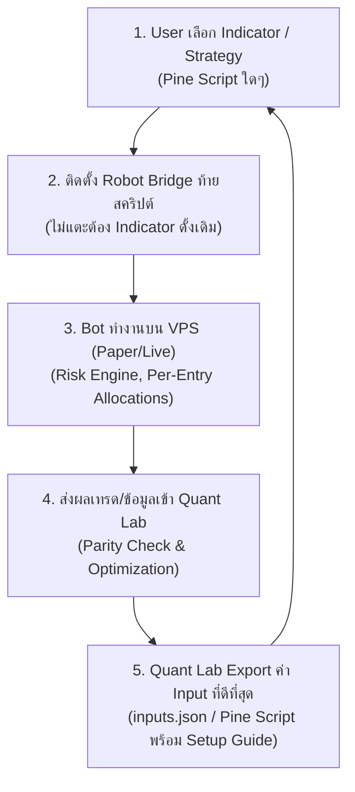

# Handoff: Quant Lab Bot Scope, Dynamic Indicators & Persistent Runs

- **Latest Commit:** `80e370b`
- **Branch:** `main`
- **Repository:** `sanchatmd-dev/trading-bot`
- **Mode:** `PAPER_ONLY` — Live Trading remains locked
- **PostgreSQL Schema:** `14` (with `quant_research_runs` table via idempotent migration)
- **Quant Bridge:** Loopback `127.0.0.1:7654` (`OFFLINE_RESEARCH_ONLY`)
- **Services:** `astra-trade-phase2`, `astra-trade-worker`, `astra-trade-quant` active

---

## 1. Executive Summary & Objective

In release `ff5a9d1`, Quant Lab operated with static defaults and did not react to Bot Manager selection or persist optimization results. This release resolves the bot scope gap, delivers persistent runs stored in PostgreSQL, and introduces dynamic multi-indicator optimization under strict Case 1 and Case 2 constraints.

---

## 2. Closed-Loop Workflow 5 ขั้นตอนหลัก

กระบวนการทั้งหมดที่กำลังพัฒนา ถูกออกแบบเป็น **Closed-Loop Workflow 5 ขั้นตอนหลัก**:



1. **User เลือก Indicator / Strategy (Pine Script ใดๆ)**: ผู้ใช้นำ Indicator หรือ Strategy ใดๆ บน TradingView ที่ตนเองต้องการใช้งานมาเป็นตัวตั้งต้น โดยระบบสนับสนุนสถาปัตยกรรม "Bring Your Own Indicator"
2. **ติดตั้ง Robot Bridge ท้ายสคริปต์ (ไม่แตะต้อง Indicator ดั้งเดิม)**: ผนวก Universal Signal Bridge เข้าที่ส่วนท้ายของสคริปต์เดิม เพื่อสร้าง JSON Webhook ตามสัญญาข้อมูล โดยคงตรรกะเดิมไว้ 100%
3. **Bot ทำงานบน VPS (Paper/Live) (Risk Engine, Per-Entry Allocations)**: Bot ทำงานบน VPS จัดการคิวคำสั่ง ตรวจสอบความเสี่ยง (Universal Risk Engine) และจัดการ Position แบบ Per-Entry Allocation (โหมด Paper-only)
4. **ส่งผลเทรด/ข้อมูลเข้า Quant Lab (Parity Check & Optimization)**: นำผลเทรด ประวัติ Session และข้อมูลราคาเข้าสู่ Quant Lab Studio เพื่อทำ Parity Check และค้นหาพารามิเตอร์ที่เหมาะสมที่สุด (Constrained Optimizer พร้อม Sensitivity/Stress Gates)
5. **Quant Lab Export ค่า Input ที่ดีที่สุด (inputs.json / Pine Script พร้อม Setup Guide)**: ส่งออกชุดค่า Input ที่ดีที่สุด (`inputs.json` / Pine Script v6 preset wrapper) พร้อม Setup Guide ให้ผู้ใช้นำกลับไปอัปเดตสคริปต์ใน Step 1 ครบวงจร Closed-Loop

*การอัปเดต Bot Scope, Dynamic Indicators และ Persistent Runs ในรีลีสนี้ เป็นการส่งมอบฟังก์ชันสนับสนุนหลักใน **Step 3 (Bot Scoped Execution)**, **Step 4 (Data Ingestion & Constrained Optimization)** และ **Step 5 (Persistent Runs & History Management)***

---

## 3. UI Modifications & Components (ส่วนติดต่อผู้ใช้)

หลักๆ มีการแก้ไขและเพิ่มฟังก์ชันที่ `public/index.html` และ `public/quant-lab.js`:

### 3.1 Visual Components & Controls
1. **Bot Selector (`<select id="qlOptBotId">`)**:
   - เพิ่ม Dropdown เลือก Bot ในแถบ Search bounds ของ Quant Lab Optimizer
   - เมื่อเปิดแท็บ Quant Lab (`data-view="quant"`) ระบบจะดึงรายชื่อ Bot ของผู้ใช้จาก `/api/bots` มาใส่ใน Dropdown อัตโนมัติ เพื่อให้ผลการทดลองผูกเข้ากับ `bot_id` ของ Bot ตัวนั้นๆ
2. **Dynamic Indicator Builder (`#qlIndicatorsList` & `+ Add Indicator`)**:
   - ยกเลิกกล่องกรอกค่าตายตัวแบบเดิมที่จำกัดเฉพาะ Fast/Slow EMA
   - เพิ่มรายการ Indicator แบบไดนามิกที่ผู้ใช้สามารถกดปุ่ม **`+ Add Indicator`** เพื่อเพิ่ม Indicator ได้ไม่จำกัด
   - แต่ละ Indicator มีการ์ดและปุ่ม **`X`** (สีแดง) สำหรับลบ Indicator ออกจากชุดทดสอบได้อย่างอิสระ
3. **Risk Limits Input Group (SL & RR)**:
   - เพิ่ม Fieldset แยกเฉพาะสำหรับกำหนดช่วงของ **SL (ATR Multiplier)** และ **RR (Risk/Reward Ratio)** ได้แก่:
     - `SL ATR Min` และ `SL ATR Max` (Default: 1.5 - 3.5, step 0.1)
     - `RR Min` และ `RR Max` (Default: 1.0 - 3.0, step 0.1)
4. **ตารางประวัติผลการทดลอง (Run History Table)**:
   - เพิ่มตารางด้านล่างบล็อก Candidate review (`#qlRunHistoryRows`)
   - แสดงคอลัมน์: **Run ID**, **Indicators ที่ใช้**, **สถานะ (COMPLETED / RUNNING / FAILED)**, **Best Train Score**, **Best Test Score**
   - เมื่อผู้ใช้เปลี่ยนการเลือก Bot หรือรัน Optimize เสร็จสิ้น ตารางจะเรียก `GET /api/quant/runs?bot_id=...` มาอัปเดตให้อัตโนมัติ

### 3.2 Dynamic Logic & Constraint Enforcement บนหน้า UI
- **Mode Badge (`#qlOptModeLabel`)**:
  - แสดงป้ายกำกับด้านบนบอกสถานะโหมดแบบเรียลไทม์:
    - **`Single Indicator (Optimizable)`** เมื่อมี 1 Indicator
    - **`Multi-Indicator (Locked)`** เมื่อมีตั้งแต่ 2 Indicators ขึ้นไป
- **การล็อกค่า Input อัตโนมัติ (Case 1 vs Case 2)**:
  - **กรณีที่ 1 (1 Indicator ต่อ 1 Bot - Case 1):** ช่องกรอก Min/Max ของ Indicator จะเปิดให้แก้ไขเพื่อค้นหาค่า Optimize ได้ตามปกติ
  - **กรณีที่ 2 (Multiple Indicators ต่อ 1 Bot - Case 2):** ทันทีที่มีการเพิ่ม Indicator เป็น 2 ตัวขึ้นไป UI จะทำการ **ปิด (Disabled / ล็อก)** ช่องกรอก Min/Max ของ Indicator ทั้งหมดให้อยู่ที่ค่า Default ทันที โดยจะเปิดให้ค้นหาค่า Optimize เฉพาะช่อง **SL ATR และ RR** เท่านั้นตามเงื่อนไข

---

## 4. Backend & Database Delivery (ส่วนหลังบ้านและฐานข้อมูล)

### 4.1 Database Schema (Schema 14)
- เพิ่มตาราง `quant_research_runs` บน Schema 14 แบบ Idempotent (`CREATE TABLE IF NOT EXISTS`):
  ```sql
  CREATE TABLE IF NOT EXISTS quant_research_runs(
    run_id            TEXT PRIMARY KEY,
    user_id           TEXT NOT NULL REFERENCES users(id),
    bot_id            TEXT NOT NULL REFERENCES users(id),
    indicators_config TEXT NOT NULL,
    optimal_results   TEXT,
    metrics           TEXT,
    status            TEXT NOT NULL DEFAULT 'PENDING' CHECK(status IN ('PENDING', 'RUNNING', 'COMPLETED', 'FAILED')),
    created_at        BIGINT NOT NULL,
    updated_at        BIGINT NOT NULL
  );
  CREATE INDEX IF NOT EXISTS idx_quant_runs_bot ON quant_research_runs(user_id, bot_id, created_at DESC);
  ```
- ใน `src/postgres/db.js`: เพิ่ม DDL ในฟังก์ชัน `migrate()` สำหรับรองรับการอัปเดตฐานข้อมูลที่มีอยู่เดิม และคง `schema_version = 14` เพื่อความเข้ากันได้กับ `db.verifySchema()` และ `scripts/rotate-postgres-key.mjs`

### 4.2 API Endpoints (`src/postgres/server.js`)
- **`GET /api/quant/runs?bot_id=<id>`**:
  - ตรวจสอบสิทธิ์การเป็นเจ้าของ Bot (`store.ownsBot(actor.id, requestedBot)`) ป้องกันการเข้าถึงข้าม Tenant
  - ดึงข้อมูล 50 รายการล่าสุดเรียงตาม `created_at DESC`
- **`POST /api/quant/optimize` Interceptor**:
  - ตรวจสอบ `bot_id` และบันทึกสถานะ `RUNNING` ลงในฐานข้อมูลก่อนส่งต่อไปยัง Python Quant Bridge
  - เมื่อได้รับผลลัพธ์จาก Python หากสำเร็จจะอัปเดตสถานะเป็น `COMPLETED` พร้อมบันทึก `optimal_results` (best params) และ `metrics` (train/validation/test score, fee_bps, dataset_split) หากผิดพลาดจะบันทึกเป็น `FAILED`

---

## 5. Python Quant Bridge & Core Contracts

### 5.1 Constraint Validation (`src/quant_bridge.py`)
- ปรับปรุงฟังก์ชัน `bounds(raw)`:
  - คำนวณจำนวน Optimizable inputs รวมทั้ง Indicator, SL (ATR Multiplier) และ RR
  - **Case 1 Enforcement**: หากมี 1 Indicator ต้องมีผลรวม Optimizable inputs **ไม่เกิน 10 Inputs** มิฉะนั้นจะ Raise `ValueError("Maximum 10 optimizable inputs exceeded")`
  - **Case 2 Enforcement**: หากมีหลาย Indicator จะล็อกพารามิเตอร์ของ Indicator ทั้งหมด (`locked=True`, `optimizable=False`, `minimum=default`, `maximum=default`) และอนุญาตให้ Optimize เฉพาะ `atr_multiplier` (SL)
  - แมปค่า `sl_atr_multiplier` เข้ากับ `atr_multiplier` สำหรับส่งต่อไปยังโมเดล `SyntheticEmaStrategy`

### 5.2 Core Contracts Preservation (`quant_lab/src/robot_quant/contracts.py`)
- คงสเปกความปลอดภัยดั้งเดิมของ `ParameterBounds`:
  - `name: Literal["ema_fast", "ema_slow", "atr_period", "atr_multiplier"]`
  - `unit: Literal["bars", "multiplier"]`
- ป้องกันไม่ให้เกิด Regression Failure ในชุดทดสอบ `quant_lab/tests/test_contracts.py`

---

## 6. Verification & Test Results (ผลการตรวจสอบความถูกต้อง)

- **Python Tests:** `71/71 passed in 2.53s` (`pytest quant_lab/tests`)
- **Node.js Tests:** `111/111 passed in 8.20s` (`node --test test/*.test.js`)
- **Python Linter:** `ruff check` (All checks passed)
- **Formatting / Whitespace:** `git diff --check` (clean)
- **CI Workflow Status:** ผ่านทั้งหมด (All Green):
  - `Quant Lab / quant (ubuntu-latest)`: Passed
  - `Quant Lab / quant (windows-latest)`: Passed
  - `Quant Lab / gate`: Passed
  - `Safety checks / postgres`: Passed (Schema 14 migration & verifySchema verified)
  - `Safety checks / container`: Passed
  - `Safety checks / scope`: Passed

---

## 7. Files Modified (รายการไฟล์ที่แก้ไข)

| File | Type | Changes |
|---|---|---|
| `public/index.html` | UI | เพิ่ม Bot selector dropdown, Dynamic indicators container, SL/RR input fields, Mode label, และ Run History table |
| `public/quant-lab.js` | Frontend JS | เพิ่มระบบ Dynamic indicators array, Visual input locking (Case 1 vs 2), History fetcher (`qLoadHistory`), และ Payload builder |
| `src/quant_bridge.py` | Python Bridge | รองรับ Dynamic JSON payload, ตรวจสอบกฎ Case 1 (<= 10 inputs) และ Case 2 (SL-only), แมป ParameterBounds อย่างปลอดภัย |
| `src/postgres/server.js` | Node.js API | เพิ่ม Route `GET /api/quant/runs` พร้อม Ownership check และดักบันทึก DB บน `POST /api/quant/optimize` |
| `src/postgres/schema.sql` | SQL | เพิ่มตาราง `quant_research_runs` และ Index ภายใต้ Schema 14 |
| `src/postgres/db.js` | Database | เพิ่ม Idempotent table migration สำหรับ `quant_research_runs` ใน `migrate()` และรักษา Schema 14 compliance |
| `quant_lab/src/robot_quant/contracts.py` | Python Core | รักษาความปลอดภัยของ `ParameterBounds` typing ดั้งเดิม |
| `.gitignore` | Config | เพิ่ม `__pycache__/` และ `*.pyc` |

---

## 8. VPS Deployment Steps (ขั้นตอนการนำขึ้น VPS)

1. ดึงโค้ดเวอร์ชันล่าสุด:
   ```bash
   cd /home/mikey/apps/astra-trade/current
   git pull origin main
   ```
2. ดำเนินการ Migrate ฐานข้อมูล PostgreSQL:
   ```bash
   npm run start:postgres
   # หรือรันผ่าน scripts/migrate-postgres.mjs
   ```
3. รีสตาร์ทเซอร์วิสทั้งหมด:
   ```bash
   sudo systemctl restart astra-trade-phase2
   sudo systemctl restart astra-trade-worker
   sudo systemctl restart astra-trade-quant
   ```
4. ตรวจสอบสถานะการทำงาน:
   ```bash
   curl -s http://127.0.0.1:7654/quant/health
   # ตอบกลับ: {"ok":true,"version":"0.4.0","mode":"OFFLINE_RESEARCH_ONLY"}
   ```
