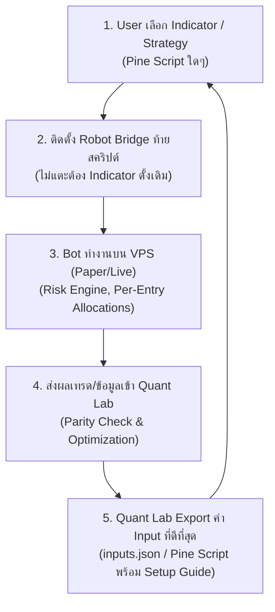

# Robot Trade — Forward Implementation Plan

Status: proposed implementation sequence after release `c573e39`. This document defines future work; it does not mark that work complete or authorize production database access, payments, or Live trading.

Planning baseline: roadmap commit `e4e473e`. This extension incorporates shared Quant Lab risk management, constrained optimization and Pine Script export into QL-1 through QL-4, preserving the existing APP roadmap and the user's choice of alert source.

Latest planning update: **QL-4 — Risk reports, Pine export and Paper validation** was implemented, audited, and hardened in repository (offline HTML tear sheets with SVG equity/drawdown curves, 6-file Pine Script v6 export bundles for `alert_calls` and `order_fills`, input preset replacement preserving indicator source logic, webhook strategy metadata pass-through, resolution of all 12 audit findings and 4 P1 review blockers, 70/70 pytest passed, direct Node-Python parity confirmed via IPC script, 111/111 Node tests passed); production Schema 12 deployment and live Paper forward acceptance on VPS remain outstanding.

Use `APP-*` for the application roadmap and `QL-*` for Quant Lab. The previously deployed application Phases 0–2 retain their names. APP-3 below is the proposed next application scope, not an assertion that an older Phase 3 specification already exists.

## Verified starting point

- Node.js 24 application, PostgreSQL 16 schema 12 in repository (schema 11 on production VPS), separate API and Paper worker, immutable releases with a current symlink.
- Multi-user authentication, MFA, bot profiles, risk controls, decimal accounting and FIFO analytics exist. Live execution remains locked.
- Release `c573e39` added owner-selected branding, mobile installation guidance and a standalone web app manifest. Local regression: 93/93 passed; production API/worker health and asset delivery verified. Physical iOS/Android installation is still an acceptance check.
- PostgreSQL integration checks previously passed for the Phase 2 implementation; rerun them for shared contracts/schema changes. The 93-test result is not a fresh PostgreSQL integration result.
- The main workflow is `.github/workflows/test.yml`, displayed as “Safety checks”.
- Scheduled off-host backup remains deferred by the owner until final project preparation. No off-host destination or schedule is claimed.
- The existing Pine v6 Universal Signal Bridge is an indicator example, not an optimizer/exporter. Its local position flag is not VPS-confirmed inventory; its bar-close TP/SL alerts are not broker-hosted protection orders. These differences must be addressed in the export/simulation contract.

## Closed-Loop Workflow Architecture

กระบวนการทั้งหมดที่กำลังพัฒนา ถูกออกแบบเป็น **Closed-Loop Workflow 5 ขั้นตอนหลัก**:

| Step | Phase Mapping | Responsibility & Description |
|---|---|---|
| **1. User เลือก Indicator / Strategy** | Bring Your Own Indicator | ผู้ใช้นำ Indicator หรือ Strategy ใดๆ บน TradingView (Pine Script) มาเป็นตัวตั้งต้นโดยไม่ต้องเขียนตรรกะใหม่ |
| **2. ติดตั้ง Robot Bridge ท้ายสคริปต์** | Signal Layer & Bridge | ผนวก Universal Signal Bridge เข้าที่ส่วนท้ายของสคริปต์เดิม เพื่อสร้าง JSON Webhook ตามสัญญาข้อมูล โดยคงตรรกะเดิมไว้ 100% |
| **3. Bot ทำงานบน VPS (Paper/Live)** | R-1, APP-3 (Schema 14) | Bot ทำงานบน VPS จัดการคิวคำสั่ง ตรวจสอบความเสี่ยง (Universal Risk Engine) และจัดการ Position แบบ Per-Entry Allocation (โหมด Paper-only) |
| **4. ส่งผลเทรด/ข้อมูลเข้า Quant Lab** | QL-1, QL-2, QL-3 | นำประวัติการเทรด ข้อมูลราคา และ Session Archive เข้า Quant Lab Studio เพื่อทำ Parity Check และค้นหาชุดค่าพารามิเตอร์ที่เหมาะสมที่สุด (Constrained Optimizer) |
| **5. Quant Lab Export ค่า Input ที่ดีที่สุด** | QL-4 (Pine Export) | ส่งออกชุดค่า Input ที่ดีที่สุด (`inputs.json` / Pine Script v6 preset wrapper) พร้อม Setup Guide ให้ผู้ใช้นำกลับไปอัปเดตสคริปต์ใน Step 1 ครบวงจร Closed-Loop |

## Sequence and dependencies

Default delivery order: **R-0 → R-1 → QL-1 → QL-2 → APP-3 → QL-3 → QL-4 → APP-4 → APP-5**.

| Phase | Main deliverable | Completion gate |
| --- | --- | --- |
| R-0 | Current release/CI/acceptance baseline | Evidence and outstanding tasks recorded accurately. |
| R-1 | Per-BUY position ownership and targeted TP/SL, end to end | Implemented and verified in repo (PostgreSQL schema 12, targeted exits in ledger/risk, Pine multi-entry tracking arrays, 108/108 Node tests passed); live Paper forward acceptance pending. |
| QL-1 | Isolated Python/CI and shared indicator/input/risk contracts | Implemented in repo (`32625fb`); hosted Linux/Windows CI and isolated DB acceptance pending. |
| QL-2 | Read-only datasets, deterministic replay and accounting/risk parity | Implemented in quant_lab/; synthetic fixtures, read-only contracts, and FIFO/risk parity pass (41/41 tests). |
| APP-3 | Universal Risk Manager runtime, multi-indicator isolation and measured Paper scaling | Bot Lifecycle & Session Management and Trading Control Panel UI implemented and verified (PostgreSQL Schema 14: bot_sessions, bot_session_archive, 4-button TCP, policy freeze, worker gating, account cards with .value-flash, 12 integration tests passed). |
| QL-3 | Backtesting and optimization of selected existing inputs | Implemented in quant_lab/ (backtest, constrained optimizer, walk-forward validation, 56/56 tests passed). |
| QL-4 | Reconciled reports, Pine export and Paper forward validation | Deployed on VPS in release 39590f7 (Quant Lab UI, Python bridge service astra-trade-quant.service on 127.0.0.1:7654 via uv 0.12.17, offline backtest, constrained optimizer, risk preview, authenticated proxy /api/quant/*, 71/71 quant tests, 111/111 Node tests; Pine Export excluded pending contract validation). |
| APP-4 | Customer onboarding, quotas, subscriptions and paid Paper readiness | Customer lifecycle, security, beta and deferred off-host recovery gates complete. |
| APP-5 | Optional broker-by-broker Live rollout | External order/reconciliation acceptance and separate approval to enable Live. |

After QL-2, isolated QL-3 research may proceed alongside APP-3. QL-4 depends on QL-3 evidence; its execution integration must also wait for the relevant APP-3 ownership/versioning capabilities. A connection being Webhook ready does not imply Optimization supported or Export validated.

The application may proceed to APP-3 while QL-2 research work continues if research is isolated and no shared contract is changing. Quant Lab reports are not a gate for delivering the core bot service. Customer-facing Quant Lab UI is a later product decision.

R-1 does not wait for Quant Lab setup or optimization. Its canonical ownership contract and acceptance fixtures become inputs to QL-1/QL-2; APP-3 extends those records rather than building a second position engine. Independent research scaffolding may proceed, but repeated independently managed entries must not be advertised as supported until the R-1 gate passes.

## First integration candidate — SPT pro V4

Use the user-supplied `SPT pro V4.txt` as the first indicator integration, subject to capability and parity acceptance. A separate transport copy now exists at `tradingview/spt_pro_v4_robot_trade.pine`; the Desktop original is preserved. User-provided screenshots confirm v1.3.0 BUY and SELL JSON webhook delivery. The subsequent user report confirms the aggregate-exit problem, not per-position acceptance. Optimization, per-entry TP/SL and full forward acceptance remain unverified.

- Preserve EMA/SuperTrend/ATR/RSI, MTF confirmation, BOS/sweep, setup expiry, cooldown and session logic. Build a verified evaluator/adapter without substituting simpler trading rules.
- Resolve effective inputs and preset overrides before search. Search only user-selected existing inputs, including an existing Custom/Long-only setting when explicitly selected; never rewrite preset branches to force optimized values.
- Map its exposed notifications into Robot Trade's versioned contract, with event identity/time, sizing/guard information and exit ownership. SETUP notices are not orders; short entries are not silently mapped to Spot exits.
- Define TP1–TP5 quantities and percentage basis, stop behavior and same-bar conflict handling separately from visual target notices. Clearly distinguish the original dashboard's R simulation from fee/cash/quantity-based execution results.
- Keep capability milestones separate: compatible webhook, baseline signal/risk parity, input optimization, source-specific export validation, and Paper forward acceptance.
- Export input presets first and optional reviewed private copies. The user chooses `alert()` or order-fill events where supported; the latter requires a separate validated strategy wrapper, not an invisible conversion of the indicator.

An indicator added later has its own connection/adapter and source/input versions. It reuses the universal risk contract; only genuinely new execution/risk capabilities require shared engine changes and regression checks.

## Shared Risk Management and strategy contract

Detailed assessment and target design: [UNIVERSAL_RISK_MANAGER.md](UNIVERSAL_RISK_MANAGER.md). The current Paper engine is retained as the foundation. Multiple independently managed indicators on one bot/symbol require strategy-owned position allocations, exit targeting, shared account reservations and versioned decisions before activation; current aggregate holdings do not provide that isolation.

### Product requirement: bring your own indicator; optimize inputs only

The primary user journey is to connect the user's existing indicator, generate a compatible webhook configuration, trade its mapped signals subject to VPS risk limits, and optionally optimize selected existing inputs. Users do not have to rewrite their trading logic or learn internal template definitions. Templates/adapters are internal integration mechanisms, not replacement strategies.

- Provide an EN/TH wizard: select bot/broker and indicator alert capabilities; map BUY/exit/TP/SL and required price/stop fields; generate the webhook URL/message or a compatible private bridge copy; validate with a Paper signal; then choose existing inputs and search bounds for optimization.
- Show separate capability states: **Webhook ready**, **Optimization supported**, and **Export validated**. Successful webhook intake never implies historical simulation or export support.
- Preserve the original source as an immutable, hashed artifact. Optimization may change only whitelisted existing input values. Preserve formulas, indicator periods not selected for search, entry/exit conditions, MTF confirmation, session rules and state-transition order. Adapter logic requires equivalence evidence on supported data; unsupported constructs produce an explicit limitation, never a silent substitute.
- Keep broker/risk policy fixed during an indicator-input optimization run. Inputs controlling sizing/exits may be searched only when they already exist, the user selects them and account limits permit them. A separate experiment is required for a different execution/risk policy.
- Identify effective inputs: preset overrides, disabled inputs and visual/notification fields must not appear as meaningful search variables. Changing an existing preset input is an explicit user selection; never alter preset branching logic to force parameters to apply.
- Source availability and a supported historical evaluator are required to optimize indicator inputs in Quant Lab. Webhook history alone cannot reconstruct signals under different inputs. Protected indicators may connect through exposed alert capabilities, but optimization remains unavailable unless an authorized, equivalent evaluator is supplied.
- Existing indicators with configurable alert messages can use generated payloads without source edits where their exposed fields suffice. Indicators with fixed messages or missing alert hooks may need a user-reviewed transport-only bridge copy. A pasted JSON message cannot create alert hooks or expose hidden values.
- Export an input preset/change list first. When source is available, optionally export a copy with only approved input-default edits and a separate, reviewed alert adapter. Show a diff proving no strategy-logic edits. Preserve source notices. Never overwrite the user's original.
- Retain user choice of `alert()` or order-fill export. Explain prerequisites: an indicator cannot emit native strategy fills without a separate validated `strategy()` wrapper; do not silently convert the original. If that wrapper cannot preserve signal semantics, mark the mode unsupported.
- Spot compatibility is a gate: short-entry signals must not be silently reinterpreted as exits. Require an existing compatible long-only input or an explicitly chosen execution mapping, shown separately from the indicator's unchanged logic.

Phase placement: QL-1 defines input/source/adapter contracts; QL-2 proves baseline signal and risk parity; QL-3 searches only effective whitelisted inputs; QL-4 exports presets/private copies, validates the selected alert source and delivers the guided workflow. Runtime/API work follows APP-3/APP-4 access gates.

Define the following in QL-1, prove data/risk parity in QL-2, consume them during QL-3 optimization and validate their export in QL-4. A shared schema does not mean Python, JavaScript and Pine can execute the same source code; each implementation needs fixtures against the same explicit semantics.

### Policy authority and scope

- Separate account/bot hard limits, the strategy's requested values, and the effective VPS decision. Existing editable defaults/maxima remain supported; optimization cannot edit account limits or disable required guards.
- Preserve the owner-configured 100% maximum risk ceiling as a ceiling, not a strategy default, recommendation or automatic search bound. Search bounds are explicitly chosen within current authorized limits.
- The VPS remains authoritative for current balance, reservations, positions, licensing and kill switches. It revalidates every signal and records rejection/capping. Exported values are a snapshot, not permission to override current policy.
- Scope risk and exposure by owner, bot, broker and quote currency. Do not pool bot balances or combine THB with USDT. Main-account aggregate exposure, if added, is a separate policy with explicit currency treatment.
- Risk-profile updates create immutable versions with author/time/change history. Changes to effective settings mark affected research validation/deployments stale. Specify how existing positions continue receiving valid reduce-only exits during transitions.

### Risk Manager usability and Quant policy alignment

The current Risk Manager remains the execution authority, but its user-entered form needs an explicit boundary between a saved Bot policy and a temporary calculator request. Implement the detailed scope in [RISK_MANAGER_NEXT.md](RISK_MANAGER_NEXT.md) before calling Quant candidates or exports policy-parity validated.

- Keep **Default** as a UI/calculator suggestion and **Max Value** as the worker-enforced ceiling. Display this distinction with the selected Bot, broker, currency, policy version and snapshot hash.
- Split Policy, Capital and Preview. Show configured funding, ledger cash, reserved cash, available cash and book equity separately. Preview inputs never create a policy draft, block RUN, or update policy persistence.
- Keep unique-symbol capacity distinct from entry-allocation capacity. Introduce a scale-in allocation limit only with a matching worker invariant, risk setting and preview result.
- Resolve the selected Bot's saved/locked policy and capital snapshot server-side for Quant and preview requests. Reject client-supplied policy overrides as authority; store policy/data/source/capital provenance with each run and mark evidence stale when any of those change.
- Add preview fixtures for all supported sizing modes and targeted reduce-only exits. Label external guard data as verified, signal-supplied or unavailable.
- Provide an audited per-Bot entry pause usable during RUNNING/PAUSED; it stops new entries while preserving valid reduce-only exits. It is separate from policy edits and from the administrator global kill switch.
- Keep Optimization Bounds separate from Risk Policy. Multi-indicator behavior must be identical in UI and bridge: either explicitly allow a compatible SL/RR parameter or keep it locked and record that state.

### Required data and feature additions

| Area | Contract and feature requirements |
| --- | --- |
| Risk identity | `risk_profile_id`, `risk_profile_version`, owner/bot scope, broker/currency, schema version, effective time and snapshot hash; separate requested and effective settings. |
| Parameter definitions | Name, type, unit, default, minimum, maximum, step or allowed choices, `locked`/`optimizable`, and cross-field constraints. Validate values server-side; preserve decimal strings for monetary fields. |
| Capital basis | Initial capital, funding flows, free cash, reserved cash, equity method and sizing method. Declare book versus mark-to-market equity; research cannot silently change production sizing semantics. |
| Exposure and open risk | Symbol/total notional, risk to defined stops across open entries, pending entry reservations and maximum scale-in entries. Distinguish unique-symbol position limits from entry count. Missing stop coverage must be explicit; stop-based risk is a model, not a guaranteed loss bound. |
| Trading costs and market rules | Entry/exit fees, fee currency/conversion policy, slippage/spread model, fee reserve, tick/lot sizes, minimum quantity/notional and source/version of market rules. Distinguish simulated costs from recorded Paper cash. |
| Exit policy | Initial supported baseline: fixed-distance/ATR SL and TP plus inventory-limited full/partial exits. Track initial stop/risk for realized R. Specify stop updates after scale-in. Trailing and break-even require separate fixtures before export support. |
| Daily and cooldown rules | Day-boundary timezone, definition of 1R, daily-loss basis, which entry/fill/exit events count toward daily trade/notional totals, loss-streak counting, pause duration and resume conditions. Preserve the current behavior until an explicit versioned change. |
| External guards | Volatility formula/lookback/source and news source/event window, update time and expiry policy. Existing signal-supplied flags are not a verified news service. Mark unavailable historical inputs as unsupported, not as passed checks. |
| Execution assumptions | Standard candle source, timeframe, indicator warm-up, bar-close/intrabar policy, signal/fill times, latency model, gap handling, incomplete bars and same-bar TP/SL precedence. |

### Optimization and deployment records

- A supported strategy definition includes `strategy_id`, `strategy_version`, template/indicator semantics, parameters and its compatible symbol/timeframe universe. General Python code or an arbitrary trained model is not automatically Pine-exportable.
- Each immutable optimization run stores `run_id`, dataset hash/coverage, strategy/risk versions, parameters, locked values, objective, constraints, search method/budget/seed, dependency/engine versions and all train/validation/test boundaries.
- Objectives may rank return/risk metrics, but hard constraints and data validity determine eligibility first. Store minimum sample/trade criteria, drawdown/exposure limits and cost assumptions. Do not rank undefined metrics as successful runs.
- Keep baseline, candidate and out-of-sample results; parameter sensitivity, increased-cost scenarios, rejected/capped orders and reasons; and walk-forward evidence. Separate model selection from the final untouched test period and disclose repeated selection attempts.
- Deployment records bind an approved strategy/risk snapshot, selected alert source and target bot. They link exports, validation evidence and observed signals/orders without embedding credentials. Export alone does not activate a bot or update a risk policy.

### Planned UI and delivery boundary

Add four EN/TH views: **Risk Policy**, **Optimization Bounds**, **Validation Results**, and **Export & Deployment**. Show account limits, proposed values and effective capped sizing separately. Support version comparison, simulation preview, and history. Optimized parameters are applied only through an explicit user action and server-side validation.

Use explicit states such as Draft, Validated, Paper Testing and Archived, with stale validation shown separately. Claim Validated only for the tested strategy/data/execution/source combination. Start with operator/private tooling; customer-facing access follows scoped API permissions, quota and tenant-isolation acceptance in APP-3/APP-4.

### Bot Lifecycle & Session Management (Run, Pause, Stop, Reset)

To ensure strict risk adherence and provide deterministic datasets for Quant Lab, bot instances must enforce a locked lifecycle:

1. **Setup & Parameter Locking:**
   - User explicitly defines `initial_capital` and configures the Risk Manager parameters before activation.
   - Upon transition to **Run**, the risk profile and capital baseline are frozen (immutable). No parameters can be altered while the bot is active.

2. **Operational States:**
   - **Run:** Accepts execution signals; maintains immutable parameters; provides real-time balance and equity updates.
   - **Pause:** Halts new position entries while permitting existing open positions to exit (reduce-only TP/SL active).
   - **Stop:** Immediately ceases bot operation and incoming signal processing.
   - **Reset:** Permitted only from a non-active state. Re-opens parameter editing for a new run cycle.

3. **Session Archival for Quant Lab:**
   - Triggering **Reset** automatically compiles an immutable session archive (`run_id`, locked parameters, initial capital, fills, ledger entries, and final balance).
   - This dataset is persisted and indexed as a read-only historical fixture ready for ingestion by QL-1/QL-2 research pipelines.

## R-0 — Baseline and acceptance record

Deliverables:
- Reconcile release, service, schema and test records in Context.md.
- Verify the main CI result for the actual release SHA through GitHub; an empty connector response does not prove that no workflow ran.
- Record desktop/mobile login, password editing, MFA and installation acceptance. Use physical iOS/Android for installation acceptance; emulator/unit results are not substitutes.
- Carry forward deferred backups and remaining load/security work explicitly.

Done when: each baseline item has a result, evidence or a named outstanding acceptance task. Do not hold research setup for unrelated device availability.

## R-1 — Per-entry positions and targeted TP/SL

Priority: correctness of the current Spot Paper workflow, before Quant Lab integration. Status: **implemented in repo (`b2cb863`, PostgreSQL schema 12)** via `ledger_position_allocations`; full end-to-end Pine validation and production migration rehearsal pending. Successful BUY/SELL webhook delivery is separate from correct position execution.

### Incident and required behavior

The current ledger has one position per bot/account/mode/symbol. Filled BUY rows are not independently owned positions. The SPT bridge keeps one emitted stop/target pair, and exits without quantity close all symbol holdings. Enabling repeated BUY therefore does not provide separate P1/P2 protection.

| Event | Required result |
| --- | --- |
| BUY1 fills | Open P1 with its actual filled quantity, SL1 and TP1. |
| BUY2 fills on the same symbol | Open P2 with its actual filled quantity, SL2 and TP2; preserve P1. |
| P1 reaches its TP or SL | Close only P1's unreserved remaining quantity; keep P2 quantity, cost, SL and TP unchanged. |
| P2 later reaches its TP or SL | Close only P2; net inventory becomes flat only when all allocations are closed. |

Here TP1/SL1 means the target/stop belonging to P1, not the indicator's partial-profit stage named TP1. Partial-profit stage identity and position identity must remain separate.

### R-1A — Contract and database ownership

- Define one stable `position_id` per independent BUY, linked to its entry `trade_id`, authenticated bot, broker account, mode, symbol and deployment. Keep event `trade_id` separate: each entry/exit/partial stage has its own idempotent event identity. `position_id` is the per-entry lot/allocation identifier within the Universal Risk Manager's optional `position_group_id`, not a replacement for group ownership.
- Map an entry reference supplied by Pine to the server-owned position within that authenticated scope. Never authorize using a payload user/bot ID. Same identifier in another tenant, bot, account, deployment or symbol must not select that holding.
- Persist actual filled and remaining quantity, reserved exit quantity, entry price/cost/fees, initial risk, SL/TP, state, originating entry and exit/fill allocations. Create inventory from fills, not from an emitted or merely queued BUY. Support partial/rejected/canceled entry outcomes without inventing holdings.
- Keep net symbol holdings and separate entry allocations, with exact-decimal invariants: managed net quantity/cost reconcile to allocations plus an explicit legacy/unallocated bucket. A later BUY must not overwrite an earlier position's stop/target. Choose the next schema version against the repository at implementation time.
- Design the upgrade from current schema 11 with an explicit legacy mapping. Do not infer independent SL/TP ownership for mixed old fills. Preserve IDs, cash, secrets and history; unresolved legacy holdings remain identified for reconciliation.

### R-1B — Receiver, risk, position manager and accounting

- Require `position_id` for TP/SL in the new scoped contract. Resolve close-remaining or a declared partial quantity/percentage only against that position's actual unreserved filled quantity. Risk sizing/capping on entry remains authoritative on the VPS; Pine must not guess the accepted quantity from its equity settings.
- Missing, unknown, wrong-scope, rejected-entry or already-closed targets produce explicit outcomes; **never fall back to symbol-wide close-all**. The server enforces these rules again at execution time, not only on webhook receipt.
- Reserve and consume target inventory atomically with order intent, fills, cash and position updates. Duplicate events, distinct TP/SL events racing for the same position, partial fills and worker crash/retry must not oversell or consume P2's inventory. Record stable rejection/reconciliation reasons.
- Keep `reduce_only` mandatory for Spot exits. Define ordinary SELL mapping explicitly: targeted position or an explicitly selected owned-group exit. Symbol-wide/account-wide close-all remains a separately authorized action, never an implicit TP/SL fallback. Default new position-scoped connections to explicit targets.
- Apply bot/account cash and exposure limits across all entries while enforcing owned inventory on exits. Distinguish unique-symbol limits from open-entry/lot limits in settings and previews; do not silently redefine existing limits.
- Attribute costs, fees, realized PnL/R and completed-entry outcomes to the allocations actually closed. Update reports/analytics to honor explicit targets rather than assigning P2's exit to P1 through global FIFO. Retain FIFO only within the declared untargeted/legacy policy; version trade-count, daily-loss and streak semantics, and reconcile totals with the cash journal.

### R-1C — Pine bridge and export compatibility

- Replace the single `rtLong`/SL/TP tracker with bounded per-entry records containing stable entry/position reference, frozen SL/TP, bar time and exit-stage state. Preserve the original indicator's BUY/SELL logic. Each eligible BUY receives its own reference; its TP/SL carries that same target reference.
- Support multiple independently targeted exits on one confirmed realtime bar. The existing once-per-bar-close alert frequency must not silently discard P2's event after P1's. Choose and test a supported batching or confirmed-bar multi-alert mechanism with TradingView rate limits, deterministic event IDs and per-position same-bar SL/TP precedence.
- Separate locally emitted state from server-confirmed inventory. Handle rejected/capped/partial BUYs and delayed exits on the server; restarting/replacing a TradingView alert must have a documented existing-position continuation/reconciliation procedure. Never replay historical BUYs to rebuild real holdings.
- Add a version/capability gate for position-aware payloads. Merely attaching an extra field is insufficient because an older receiver can ignore it and still close the entire symbol. Prove an incompatible receiver rejects the new exit contract before enabling the new Pine bridge.
- Keep TP/SL bar-close execution and selected chart/broker price provenance explicit. Per-position metadata is not broker-hosted protection. QL-4 must reuse and validate the same targeting semantics for both `alert()` and strategy order-fill exports.

### R-1D — UI, logs and reconciliation

- Show P1/P2 as separate entry allocations with position ID, entry trade ID, actual filled/remaining quantity, entry cost, SL/TP, realized PnL and status. Retain an explicitly labeled net-symbol summary.
- Trade Log links each exit to its position, entry and applied quantity; show actionable missing/closed/wrong-scope reasons. A filled entry row must not be labeled as an independent protected position until the allocation exists.
- Display exit scope in setup/preview, including the effect of SELL and any explicit close-group/close-all action. Support EN/TH and mobile/desktop layouts.

### Interactive Dashboard Charting (`lightweight-charts` v4+)

To deliver actionable visual execution monitoring for Paper/Live operations, integrate an interactive TradingView `lightweight-charts` component into the web frontend:

1. **UI & State Management:**
   - Implement a responsive Symbol Selector (Dropdown/Tabs) supporting active pairs (e.g., BTCUSDT, ETHUSDT, BNBUSDT).
   - Maintain client state for `currentSymbol` and synchronized `activePositions` retrieved from the backend API.

2. **Chart Initialization & Dynamic Symbol Switching:**
   - Expose a modular `renderChart(symbol)` lifecycle handler.
   - On symbol transition, safely clear existing series (`series.setData([])`) or re-instantiate chart instances to prevent DOM/memory leaks.
   - Stream/fetch OHLCV candle datasets for `currentSymbol` via exchange/market data endpoint into `candlestickSeries`.

3. **Indicator Calculation & Overlay:**
   - Compute and render multi-timeframe overlays per active symbol: Fast/Slow EMAs, Custom ATR, and Volume Profile.
   - Plot indicators via `addLineSeries()` or the v4+ Custom Series API.

4. **Active Position & Target Visualization (R-1 Alignment):**
   - Filter `activePositions` by `currentSymbol`.
   - **Entry Execution:** Render timestamped markers via `candlestickSeries.setMarkers()` for each distinct `position_id`.
   - **Protection & Targets (SL/TP):** Render persistent, color-coded price levels via `candlestickSeries.createPriceLine({ price, color, title })` tied to specific allocations.
   - Ensure target price lines and markers reliably re-render whenever switching between symbols with active positions.

### R-1E — Acceptance and rollout

Required tests and evidence:

1. Two same-symbol BUYs with different quantities and stops: TP(P1) closes exactly P1; P2 quantity, cost, SL/TP and state are unchanged. Repeat with SL(P1), and with P2 closing first.
2. Partial exit of P1 consumes only its declared quantity; subsequent SL consumes only P1's remainder. Risk-capped/partially filled entries use actual VPS quantities, not Pine-requested sizes.
3. Duplicate TP, different TP/SL events in either order, simultaneous exits, and restart/retry create no duplicate cash debit/credit or negative inventory. Two distinct positions exiting on one candle both receive their own valid outcome.
4. Wrong owner/bot/account/symbol/deployment, missing/unknown/closed position, rejected BUY and exit-before-entry cannot close another allocation. Unknown schema/version cannot silently execute as a legacy close-all.
5. Sum of allocation quantities/costs, net inventory, fills, cash, realized PnL and versioned analytics reconcile after every event. Combined entry limits remain enforced across P1/P2.
6. Migration/restore rehearsal preserves existing data and explicitly handles open legacy holdings. Preview and UI/log scope match worker decisions. Existing-position continuity is tested when replacing alerts or deployments.
7. Node and isolated PostgreSQL tests pass; Pine compiles in TradingView and a controlled Paper sequence demonstrates BUY1 → P1, BUY2 → P2, TP/SL(P1) → only P1 closed, then P2's independent exit. Preserve the corresponding event IDs and reconciled outcomes as evidence.

Before migration use `scripts/backup-postgres.mjs` with protected configuration and verify restore on an isolated database. `scripts/backup.mjs` backs up legacy SQLite and is not the current production backup path. Deploy backend capability before enabling the matching Pine alerts, using an immutable release and symlink swap after migration rehearsal. After allocation writes, rollback must preserve the new ownership data; an old aggregate-only binary is not a safe rollback by itself.

Until acceptance: use one independent open entry per bot/symbol, disable repeated BUY where appropriate, and reconcile already-open aggregate holdings explicitly. Disabling repeated BUY does not split existing P1/P2 or undo past exits. This planning update does not change bot settings, migrate data or deploy code.

Done when: per-position end-to-end acceptance passes and no targeted exit can close unrelated inventory. Hand the validated contract, migration record and fixtures to QL-1/QL-2 and APP-3.

## QL-1 — Isolated setup and reproducible CI

Implementation update (2026-09-22, commit `32625fb`): local scaffold, Python 3.12
uv lock, frozen contracts, offline tests, package import smoke and CI routing are
implemented in `quant_lab/`. Local evidence: Node 104/104, Quant 27/27, Ruff,
lock verification, workflow YAML parsing and every locked package import pass.
See its README for compatibility boundaries. Full completion remains conditional on
hosted Linux/Windows CI and isolated PostgreSQL checks. QL-2 may begin as isolated
research work; do not represent QL-1 as fully accepted before its remaining gate.

Deliverables:
- Create `quant_lab/{data,notebooks,src/robot_quant,tests,reports}` and `quant_lab/pyproject.toml`.
- Use Python 3.12 as the initial tested interpreter. Lock a compatible dependency set; do not claim support for untested later Python versions.
- Core: DuckDB, Polars, pandas, PyArrow and psycopg. Market-data extra: ccxt and yfinance. Research extra: vectorbt, a verified compatible pandas-ta version, QuantStats and Jupyter. Development extra: Ruff and Pytest.
- Keep Python dependencies out of Node deployment. Exclude Quant Lab from the application Docker context/release payload; maintain its own environment and execution location.
- Ignore virtual environments, caches, checkpoints, local databases, exports, generated reports and secrets. Preserve small synthetic test fixtures. Strip notebook outputs before committing.
- Add `.github/workflows/quant-lab.yml` with Ruff, offline Pytest, package import checks and locked installation. Test Linux and Windows for supported developer workflows.
- Make main heavy CI skip Quant-only changes while shared Node/schema/risk/workflow changes still trigger relevant checks. Quant CI must also react to shared schema/analytics contract changes.
- Inspect branch protection before applying workflow-level path filters. If required checks would remain pending, retain a lightweight dispatcher/required gate and skip only unrelated heavy jobs.
- Define machine-readable schemas for risk profiles, parameter/search bounds, strategy definitions, optimization runs and export metadata. Include `alert_source` values `alert_calls` and `order_fills`; user choice is required when exporting.
- Define import/export compatibility rules and the supported indicator/strategy template registry. Design persistence/migrations for immutable versions and audit history; QL-1 does not migrate the production database.
- Define Universal Risk Manager ownership, canonical intent, capability and decision contracts from [UNIVERSAL_RISK_MANAGER.md](UNIVERSAL_RISK_MANAGER.md), including how existing bot-level v1 clients coexist with future deployment-scoped connections.

Done when: a clean environment installs from the lock, meaningful configuration/package tests pass, and a CI change matrix demonstrates correct behavior for Quant-only, docs-only, application-only and shared-contract changes. Contract tests reject invalid units, unknown versions, contradictory bounds and attempts to optimize locked hard limits. Baseline Node and isolated PostgreSQL checks pass for the CI configuration change. CI never requires production secrets or live market downloads.

## QL-2 — Read-only data, market data and accounting parity

Implementation update (2026-09-22): read-only contracts, synthetic fixtures, DuckDB storage manifest verification, and FIFO/risk parity evaluators implemented in `quant_lab/`. Local tests pass: Quant 41/41, Node regression 104/104.

Deliverables:
- Start with synthetic fixtures and a restored snapshot. Use a separate research directory/process; do not run notebook workloads inside the API or execution worker.
- Define an explicitly configured Unix-socket or TCP connection. Production currently has no TCP listener; do not enable one as an automatic fallback. Remote access uses an authorized tunnel or certificate-verified private connection.
- Define a dedicated research reader role with CONNECT/USAGE and SELECT only on reviewed columns/views, no write/DDL role membership, bounded pool size, statement/lock timeouts and read-only transactions. Exclude credentials, session data, secrets and unrestricted signal payloads.
- Reader contract: `signals` (including current order intent/status fields), `fills`, `paper_cash_journal`, `paper_funding` and selected `analytics_settings` fields. Schema 11 has no separate `orders` table; any future order table requires an explicit migration/reader version. Validate actual schema/version and fail on unknown contracts.
- Join fills to signals for bot ownership. Keep main owner, bot profile (`user_id` in the existing schema), broker, execution mode and currency explicit. Do not infer isolation from a caller-supplied user ID.
- Use a consistent, bounded snapshot/export with provenance and cutoff. Avoid long analytics transactions on production. Operator research credentials must never be exposed to customer notebooks; customer access later needs server-enforced scope.
- Preserve `NUMERIC(38,18)` as Decimal through exports and storage. Prevent silent pandas float coercion. Declare float conversions only at statistical/simulation boundaries.
- Market data records provider/exchange, raw and canonical symbol, base/quote, UTC interval, candle completion, source timestamps and adjustment policy. Reject duplicate, missing or incomplete bars according to explicit policy.
- Apply existing broker-scoped USD aliases only to signal identity. Yahoo BTC-USD is not Binance BTC/USDT market data. Keep USDT and THB separate.
- Store Parquet datasets with hashes/manifests; use DuckDB for querying. Retrieve crypto history from an exchange-appropriate source and paginate/rate-limit it. Measure available history per symbol/timeframe before promising 1–3 years.
- Establish golden fixtures comparing Python accounting to `src/postgres/analytics.js`: partial exits, scale-in, flat-to-flat cycles, funding, custom fees, breakeven, open positions and legacy precision adjustments. Custom analytics fees must not be silently charged twice.
- Export selected risk settings through reviewed read-only columns/views and attach an immutable snapshot/hash to each research dataset. Identify the table/field mappings from schema 11 during implementation; do not infer that proposed versioned records already exist.
- Add shared fixtures against `src/postgres/risk.js`: sizing modes, equity/cash/reservations, stops, order/daily caps, position limits, scale-in, daily-loss/loss-streak boundaries, stale/duplicate signals and reduce-only exits. Record expected accept/reject/cap decisions, quantities and reason codes. Duplicate handling is verified at the receiver boundary as well as risk-engine decisions.
- Define separate current-Paper parity and proposed cost-aware research modes. Fee-inclusive cash debit, market-rule rounding, open-risk limits or new exit behavior require shared implementation and acceptance before claiming execution parity.
- Build deterministic evaluator/replay fixtures for strategy-owned lots, full/partial exit targeting and combined-budget contention. Prefer a batched local bridge to the shared pure risk evaluator; an independent Python implementation needs parity evidence.

Done when: fills/cash/funding and reviewed risk snapshots export correctly; read-only privileges reject writes in an isolated test DB; no cross-bot/currency leakage; Decimal round trips preserve values; golden FIFO/PnL and risk decisions match the Node contract with documented tolerances only where intended. Proposed behaviors are labeled rather than reported as production parity. Production reads remain optional until the isolated path passes.

## APP-3 — Operational readiness and measured Paper scaling

Deliverables:
- Define a target workload before scaling: concurrent owners, bots, webhook rate, burst size, history size and acceptable queue delay. Record measured results instead of choosing arbitrary replica counts.
- Measure API latency, queue age, worker heartbeat, error/rejection rates, DB connections, query times and disk growth. Redact sensitive data from logs and alerts.
- Load-test admission limits, per-owner fairness, concurrent risk reservations and recovery under worker restarts. Prevent noisy users from starving others.
- Add log/history pagination and measured indexes. Design incremental analytics only after profiling; verify that caching preserves tenant boundaries and accounting results.
- Document operational recovery, deploy rollback boundaries and alert response. Perform isolated restart/failure rehearsals.
- Close remaining risk UI, admin access, login/MFA and physical mobile acceptance gaps.
- Deliver shared runtime risk/versioning changes only after QL-2 fixtures and migration rehearsal, with appropriate Node/PostgreSQL tests. Quant-only experiments stay separate; add scoped risk-profile/deployment APIs when the operator export workflow needs them, without enabling customer access implicitly.
- Extend the R-1 position/exit foundation into the Universal Risk Manager multi-indicator runtime: authenticated mapping wizard, versioned policy/decisions, position groups/allocations, atomic cash/inventory reservations and scoped exit management. Rehearse remaining legacy single-group migration, shadow decisions and Paper canary acceptance before shared-symbol deployment. R-1 is the earlier correctness gate and does not wait for QL-2; these broader runtime changes do.

Done when: the agreed workload meets recorded thresholds, restart tests preserve order/accounting invariants, critical UI flows pass, and operators can detect and diagnose failures. This remains a Paper release; it is not a throughput claim beyond the tested workload or a Live approval.

## QL-3 — Backtesting and constrained optimization

Deliverables:
- Implement one simple reference strategy before parameter sweeps. Keep strategy and indicators in importable source, with notebooks as thin experiment interfaces.
- Use the user's indicator as the reference when integrating it. Require source-hash/input-only change checks and baseline signal equivalence before optimizing; do not replace its logic with a simpler reference strategy.
- Use vectorbt for research acceleration, with an explicit simulation layer for rules that do not map directly to its defaults. Preserve an auditable transaction ledger.
- Specify bar-close signal timing, next execution opportunity, warm-up, missing data, gap handling, tick/lot/minimum-notional constraints and same-bar SL/TP ambiguity. Do not assume favorable intrabar ordering from OHLC alone.
- Enforce long-only Spot, inventory-limited SELL, cash/fee-inclusive sizing, per-order and daily notional limits, position/risk limits, fees and slippage. State which production guards need external data and cannot be reproduced.
- Match the current cost-based book-equity risk policy where parity is intended; report mark-to-market equity separately. Export risk/strategy configuration versions without changing bot settings.
- Split training/validation/out-of-sample chronologically; add walk-forward validation before accepting optimized strategies. Prevent future-data leakage.
- Record dataset hash, strategy commit, dependency lock, parameters, seed if applicable and execution assumptions for every run.
- Establish export-compatible strategy/risk contracts and separate timing/parity fixtures for the two user-selectable Pine alert sources. See [PINE_EXPORT.md](PINE_EXPORT.md).
- Implement bounded parameter search over explicitly optimizable fields. Validate cross-field constraints, stay within approved risk limits and reject unsupported Pine template/indicator combinations before presenting them as exportable.
- Compare a fixed baseline with candidates using out-of-sample/walk-forward results, sensitivity checks and fee/slippage stress. Preserve run provenance and candidate rejection/capping statistics; do not select solely by maximum in-sample profit.
- Provide a risk simulation preview for the selected candidate showing requested risk/quantity, effective size, consumed/free capital, expected position capacity and all limiting rules. It is an estimate based on the recorded snapshot, not a guarantee that a later order is accepted.

Done when: supported data covers the requested 1–3 years at the chosen interval, repeated runs reproduce results, trades and cash stay nonnegative within the declared precision policy, transactions reconcile to realized PnL, and shared risk fixtures explain any difference from Paper execution. Locked limits cannot be relaxed by optimization, invalid/undefined results cannot win selection, and export candidates retain baseline/out-of-sample/stress evidence. No generated strategy automatically activates a bot or submits an order.

## QL-4 — Risk reports, Pine export and Paper validation

Deliver in order: QL-4A reports, QL-4B export package and versioned webhook integration, QL-4C TradingView/Paper acceptance. These are sub-milestones of the existing QL-4, not replacements for APP-3 or later application phases.

Deliverables:
- Generate private HTML tear sheets under `quant_lab/reports/` for backtests and Paper fills.
- QuantStats handles appropriately sampled returns, Sharpe/Sortino and return charts. Calculate flat-to-flat trade counts, Win Rate and Profit Factor from the reconciled FIFO ledger.
- Distinguish realized/book and mark-to-market equity. Adjust return calculations for external deposits/withdrawals. Specify annualization, timezone, risk-free assumption, benchmark and fee model.
- Handle no trades, only wins, zero variance, zero capital, missing prices, open inventory and sparse samples explicitly; show unavailable metrics instead of fabricated zeros/infinities.
- Provide Drawdown, Monthly Returns, risk metrics, data coverage, cost assumptions and a reconciliation section. Do not imply theoretical fee adjustments changed recorded cash.
- Document setup, read-only export, market-data retrieval, experiments, reporting and known limitations in `quant_lab/README.md`.
- After strategy/risk parity, add the Pine export package defined in [PINE_EXPORT.md](PINE_EXPORT.md). Require the user to select either `alert()` signals or strategy order-fill events; generate matching code, metadata, validation results and setup instructions. Validate each mode in TradingView and Paper before marking it ready.
- Produce `strategy.pine`, `strategy.json`, `risk-profile.json`, `validation.html` and `setup.md` from a selected supported candidate. Keep secrets and raw customer records outside the package. Record export checksums and source/strategy/risk versions.
- For the existing-indicator journey, always include `inputs.json` and a human-readable before/after input list. Include an optional `indicator.pine` private copy for supported source with approved defaults; `strategy.pine` is a separate validated wrapper for strategy simulation/order-fill mode. Export never silently converts or overwrites the original indicator.
- Extend the webhook validator, storage/logging and deployment UI with versioned strategy/deployment/risk/alert-source metadata. Define backward compatibility for existing webhook clients; do not silently activate or break existing alerts.
- Use stable event identities that distinguish legitimate scale-ins/partial exits and deduplicate retries. Store bar time, signal-generation/send time, receipt time and simulated fill context separately; apply stale checks to the defined signal time rather than disguising delayed events with a fresh timestamp.
- Bind deployments to the authenticated bot server-side. Handle unknown or stale versions explicitly, retain existing-position exit ownership during transitions and show rejection/capping outcomes in reconciliation. Pine state and emulator fills never establish actual VPS inventory.
- Compare signal timing, entries/exits, indicator values, quantity, rounding, costs and PnL across Python, generated Pine and the relevant VPS Paper mode on matched data. Document source/feed or emulator differences; do not claim automatic exact equality.
- Verify Pine compilation in TradingView, source-specific alert creation instructions and separate Paper forward runs for both export modes. Changing parameters, source or effective risk invalidates affected evidence and requires a clear alert-replacement process.

Done when: identical fixtures reproduce Node FIFO Win Rate/Profit Factor definitions, reports reconcile capital and PnL, return metrics use the declared equity basis, and reports contain provenance and no credentials or cross-user data. Both user-selectable export modes compile and pass their own recorded Paper forward checks: an eligible event executes at most once, duplicate retries do not create another order, exits cannot oversell, rejected entries are visible, and stale/unknown deployment handling does not orphan existing-position exits. Unsupported or unverified combinations are not marked Validated. Reports remain private operator artifacts until authenticated report delivery is designed.

## APP-4 — Customer lifecycle and paid Paper readiness

Implementation update (2026-09-22): Core plan quota and lifecycle enforcement delivered in repository:
- Defined central plan quotas (`src/postgres/quotas.js`):
  - **FREE**: 1 Bot, 30 days analytics history
  - **PERSONAL**: 3 Bots, 90 days analytics history
  - **PRO**: 10 Bots, 180 days analytics history
  - **ENTERPRISE**: 50 Bots, Unlimited analytics history
- Backend enforcement in `src/postgres/server.js`:
  - `POST /api/bots` enforces `maxBots` per plan (returns 403 when exceeded).
  - `GET /api/analytics/*` enforces `historyDays` limit per plan.
  - `/api/me` and `/api/auth/session` expose active `plan` and `quota`.
- Frontend dynamic adaptations:
  - `public/bots.js` dynamically renders up to `maxBots` with responsive `.enterprise-grid` layout for large bot counts.
  - `public/analytics.js` enforces `min` date selection according to quota history limit.

Deliverables:
- Define plans and enforce bot/history/research quotas on the server. Extend existing license/subscription controls instead of duplicating them. *(Delivered)*
- Add onboarding, lifecycle operations, support permissions, data export/retention and auditable administrative changes.
- After choosing a billing provider and plan rules, implement subscription events idempotently, including duplicate/out-of-order delivery, failed payment, expiry and reconciliation. Entry restrictions must preserve explicitly allowed risk-reducing exits.
- Complete independent security review and acceptance of the supported device/browser matrix.
- At final launch preparation, resume the owner-deferred off-host backup decision, configure encrypted automatic backups/retention and rehearse restore outside the VPS. Define and verify RPO/RTO for the offered service.
- Establish rollback, support ownership, incident response and a bounded private Paper beta before paid rollout.

Done when: customer lifecycle/entitlement tests pass, recovery is demonstrated, capacity/support claims match evidence and the owner approves the launch scope. Paid Paper service does not require all research features or authorize Live trading.

## APP-5 — Optional Live execution, one broker at a time

Deliverables:
- Choose the initial broker and confirm supported API access/capabilities before scheduling integration.
- Implement an external-order state machine, durable intent, client-order idempotency, partial-fill/cancel handling, uncertain-order reconciliation, balance/rule synchronization and documented protection-order behavior.
- Do not reuse instantaneous Paper transactions as an exactly-once guarantee for remote broker requests.
- Test sandbox/failure scenarios and credential isolation before separately authorized limited Live validation. Keep Paper and Live accounting/permissions explicit.
- Apply the same acceptance process to each subsequent broker; an adapter registry entry is not a working broker integration.

Done when: broker-specific acceptance and recovery evidence exist and the owner explicitly enables the approved scope. No live orders, broker connections or funding are authorized by this roadmap.

## Release discipline

- Each implementation phase ends with a scoped diff, appropriate tests, evidence and documented limitations.
- Node/schema/risk changes run both relevant Node and isolated PostgreSQL tests. Quant-only work runs its own CI and shared-contract checks when needed.
- New migrations require a backup and isolated rehearsal. Research snapshots/reports remain outside Git and public web assets.
- Deploy application changes through immutable releases and atomic symlink swaps. Quant Lab has a separate environment and is not deployed merely because it shares the repository.
- Commit/push/deploy follow the implementation request for that phase. This planning task changes documentation only.

Current milestone: **SMTP Notification Diagnosis & PostgreSQL Password Rotation** — Schemas 12-14, R-1 Targeted Exits, APP-3 Lifecycle, Interactive Charts, and APP-4 Quotas are deployed to production VPS (release c2921f3) and verified via automated TradingView Paper forward acceptance test suite (`scripts/test-paper-acceptance.mjs`). Next steps: diagnose worker SMTP 550 notification issue and perform scheduled PostgreSQL password rotation.
