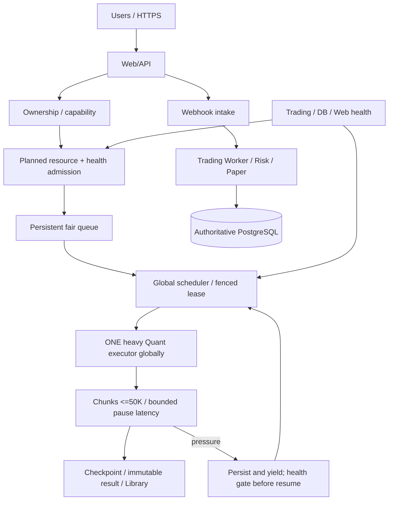
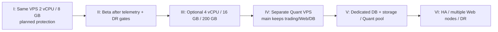
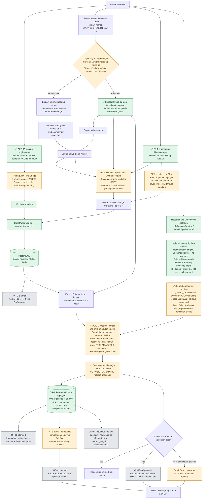
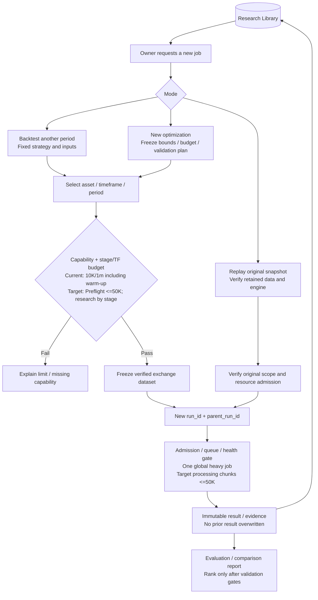

# Robot Trade — Pine → Bot → Quant → Owner Workflow

## Staging prototype priority — 2026-10-01

The owner requests a visible staging preview first, then a functional six-step
journey: AI Bridge, ten numeric inputs, Preflight recommendations, real signals
with Paper execution, bounded optimization and Quant Library selection. The
[prototype delivery plan](STAGING_PROTOTYPE_PLAN_2026-10-01.md) defines P0 preview
and P1 functional acceptance without changing phase gates. P0 may use a reviewed
compatible UI release while foundation remains off; changes requiring migration
or foundation startup still wait for B2. PF-3/PF-4 and library/comparison work
remain unfinished. The plan was handed to Claude through the
[Claude handoff](CODEX_TO_CLAUDE_PROTOTYPE_HANDOFF_2026-10-01.md).

**P0 status, 2026-10-01 16:16 UTC: visible preview deployed on staging.** Release
`533755b` adds a Prototype journey page and two read-only status endpoints. The
staging API and trading worker run it; research worker, market stream, fallback
timer, database and production are unchanged, and research admission stays
closed. The owner's signed-in walkthrough is pending. This is not six-step
acceptance. See the [P0 preview record](STAGING_PREVIEW_P0_2026-10-01.md).

**P1 progress, 2026-10-01 19:50 UTC.** Step 1 has real-provider evidence on
release `533755b`: one AI analysis failed visibly with `INVALID_AI_OUTPUT`, the
retry succeeded in 4.2 s, and two Generate jobs produced complete Bridge drafts,
for about USD 0.03 in total. The owner's TradingView compile of the draft is
pending. PF-3 readiness reporting passed local engineering acceptance in commit
`0aabe14` (hosted CI 9/9) and is not deployed yet; it will ship together with the
guided Bridge wizard (UX round 1, in progress) in one staging release switch.
PF-3 found that the default Risk policy rejects every Bridge BUY, because news
blocking is enabled and Bridge alerts carry no news flag; the owner must turn
news blocking off before the real-signal Paper demonstration. For B2, the
staging database still runs from a temporary directory that a reboot would
erase. A protected backup was taken and restored in isolation with all 49 tables
matching, and the Window-1 relocation tools were rehearsed end to end on a
separate test unit and port. The rehearsal showed that stopping any of the five
transient staging writers unloads it, so the tools now reload the persistent
copies before restarting. One live side effect occurred: the fallback collector
timer was down for 45 seconds during an optional test and recovered without a
missed run. An independent tool audit is running. The live relocation (about
10–15 minutes of API downtime) will be announced to the owner first and is
planned before 2026-10-10. Migration, grants and foundation startup (Window 2)
remain gated.

**P1 staging release, 2026-10-01 22:35 UTC.** The staging API and trading worker
now run release `3309d07`, which adds the PF-3 readiness report (Risk manager
panel) and the guided Bridge wizard (UX round 1) to the P0 preview. The switch
used new reviewed drop-ins with per-unit rollback, a gated manager reload and
read-only database gates; all five steps passed, and the served page and script
bytes match the commit. The research worker, market stream, fallback timer,
database and production are unchanged. On staging, PF-3 reports PF-2 evidence as
unavailable because PF-2 stays off, so Step 3 is visible but not accepted. The
PostgreSQL relocation tools were revised twice after an independent audit and two
tester passes and are now in a host proof on throwaway units.

**B2 Window 1 done, 2026-10-01 23:04 UTC.** The staging PostgreSQL cluster now
runs from a persistent data directory under its own enabled user service instead
of a temporary directory that a reboot would erase. The database was down for
about 9 seconds and the staging API for at most 3 minutes 29 seconds. System
identity, the checkpoint position and the row counts of all 49 tables matched
the pre-stop record; the socket directory and socket are now owner-only. A
protected backup and a cold archive were taken inside the window, and the old
directory is kept. All five writers restarted from their persistent unit copies.
Checks ten minutes later found no restarts or error lines, a successful fallback
run and flowing bars. Three tool defects were waived with recorded evidence and
are queued for the next tool version. After a reboot only the database starts
automatically; the five writers still need a manual start. Window 2 (migration,
grants and foundation start) remains gated on its own rehearsal and owner notice.

**B2 Window 2 done, 2026-10-02 03:47 UTC.** The staging database now runs in FOUNDATION mode (66 tables, schema 14). Bootstrap grants v4 are applied: v3 plus a revoke that keeps `quant_job_steps` append-only. Legacy table privileges are unchanged. The research worker runs release `3309d07` in foundation idle mode; research admission stays closed and its I/O limit is kept. The API was down for at most 1 minute 36 seconds and the database for about 4 seconds, while a cold archive was taken. Staging Analytics and legacy backtest/optimize now answer 409, as accepted. PF-4 deterministic Risk proposals are committed (`68a6268`, CI 9/9) and accepted after an independent audit, but are not yet deployed. Next in P1-A: B3 (one bounded backfill), W7 C1/C2 diagnostics and D6 Linux p99, then R7 PF-2 staging activation.

**PF-4 staging release, 2026-10-02 05:02 UTC.** The staging API and trading worker now run release `b2f0bae`, which adds the PF-4 Risk proposals panel (read-only preview and confirmed save) to release `3309d07`. The two releases differ only in PF-4 code and documentation (18 paths); the 78 engine files are byte-identical and the trading worker's import closure is unchanged. The switch wrote new drop-ins over the `3309d07` drop-ins, with per-unit rollback to `3309d07`, one gated manager reload and read-only database gates. All eight steps passed in about two minutes, and the served page and script bytes match the commit. Since Window 2 the reload gate has a narrow adapter: it accepts the research worker's pinned FOUNDATION drop-in and nothing else. The research worker stays on release `3309d07`; it, the database, market stream, fallback timer and production are unchanged. A check ten minutes later held only on its post-switch AI job counters; a read-only query showed the owner's own sign-in, one analysis and one draft generation (both succeeded), so the hold was accepted as expected use. Owner acceptance of the panel on staging waits for P1-F.

**QR-1 staging release, 2026-10-02 07:34 UTC.** The staging API and trading worker now run release `f36181c`, which adds the read-only Research Library (Step 6) on the Quant page. It lists every run of the owner, grouped as active, completed, insufficient, failed or cancelled. One run opens with its provenance and read-time integrity checks, and two to four runs can be compared; metrics appear only when their research context matches. No run can be labelled qualified yet, so the panel states that there is no qualified winner. The release differs from `b2f0bae` only in QR-1 code and documentation (19 paths); the engine files and the trading worker's code are unchanged. All ten switch steps passed, including the Window-2 health check and a check ten minutes later, and the served bytes match the commit. The research worker stays on `3309d07`. Owner acceptance waits for P1-F.

## Document authority and update rules

This is the canonical index of all current plans, their sequence, acceptance
gates, progress and change history. [README](../README.md) is the project entry
point; [Context](../Context.md) explains architecture, boundaries and operational
context. Topic documents provide specifications and evidence linked here; they
must not define a competing task order or silently supersede this status.

[Time Management](TIME_MANAGEMENT.md) is the primary companion for effort,
machine/data waits, execution overlap and remaining-time records. This roadmap
continues to own task order and gates. Update both at each scope/status/run or
handoff checkpoint, and review README/Context in the same change set; record
reviewed-unchanged when their explanations remain accurate. Revised remaining
Paper budget is 410–720 hours including rework and a runtime allowance before
subtracting overlapping waits; profitable-candidate collection has no guaranteed
deadline. Historical Preflight precedes a new live collection campaign, with
eligible downstream engineering performed during data waits.

For each completed change, update the current-status table and append a dated
change entry with evidence, scope (planned/local/staging/production), blockers
and next action. A Git checkpoint is not deployment or acceptance. Older notes
below are dated evidence; the current status and plan in this section take
precedence. Preserve production structure and private operational information.

## Project team execution

The owner requested a single-command project team. [AGENT_TEAM.md](AGENT_TEAM.md)
and root AGENTS.md define explicit model roles, exclusive file/Git ownership,
usage-aware task admission and local/VPS execution boundaries. Project TOML defaults
request Astra High for root; the active task's actual setting must be verified.
Current Codex specialists use GPT-6.1 Sol except the Astra Medium auditor:
debugger/operations use high effort, coder/tester/routine worker use medium,
and documentation/release clerk use low. This is a local configuration update;
historical model assignments below remain evidence of earlier work.
A Claude root follows the AGENTS.md Claude column (Opus 5.5 and Sonnet 5.5). The
owner removed the three Claude-only Fable 5.1 roles on 2026-10-01; earlier Fable
work stays recorded below as history.
Three bounded setup agents performed team audit, PF-1 mapping and a dispatch template.
Team setup is followed by the local PF-1A backend checkpoint below. Production
resource enforcement remains planned; QD-1/QS-1 and existing gates still apply.

All roles now require the project Caveman skill for conversation, task packets
and agent-authored compact/handoff/internal memory. Shared instructions preserve
resume facts, evidence and gates; public/product docs retain normal prose.
This communication policy does not change phase order or runtime compaction.

## Current status — 2026-09-29

Local UI checkpoint, 2026-10-03 07:43 UTC: Bot Manager now has a visible Create Bot control in the local build. Authenticated quota determines availability; pending requests block duplicate creation, and server errors remain visible. Eight focused tests and twelve independent cases passed, with desktop and 390×844 mobile layout checks. The staging UI remains on `f2bd332`; release preparation and deployment are separate next steps. Research worker alignment has a frozen local tool skeleton under independent audit. No collector, host switch or research submission is authorized by that skeleton. The owner webhook correction remains the Step 4 gate; eligible local and read-only preparation continues while the owner is away.

READY checkpoint, 2026-10-03 07:16 UTC: normal UI activation completed for new deployment `b45d9f9d`. One read-only check at 07:10:54 UTC confirmed its exact current binding, snapshot, evidence count one, 58-input review hash and healthy unchanged runtime pins. No new event, signal or allocation exists. The prepared TradingView alert is unsent because its owner-entered URL contains a nested internal URL; private correction is pending. The next Step 4 action remains creating that exact new alert and observing a natural BUY/targeted EXIT. Partial P1-F desktop/mobile checks verified truthful PF-2 unavailability, locked Risk proposal save, old-run provenance, no qualified winner and no metrics across incompatible research contexts. Full P1-F and six-step acceptance remain open. Local source/input checks and worker alignment preparation are separate bounded packets; neither opens research admission.

Owner continuation, 2026-10-03: the owner selected Step 4 path B and release-first ordering. Staging API/trading run `f2bd332`, including `34e8652` and `f21deff`; immediate and delayed checks passed at 05:14:39 and 05:28:06 UTC. The normal application created the third SPT Paper bot with news blocking enabled and generated DRAFT deployment `b45d9f9d`. The separate TradingView script compiled and was added to the chart at 05:51:08 UTC; all 58 source inputs plus ATR60/RR1.5 were saved and reopened for review. Independent exact-artifact/input and final evidence reviews passed. One immutable evidence record was inserted through the unchanged maintenance-gated operator script at 06:44 UTC. Three required services restarted and immediate postchecks passed; the conservative API downtime bound is 3.792 seconds. Current-release generic Bridge/news fixtures passed 74/74 in isolation; they do not establish exact SPT/model parity. Next: activate separately, finish the owner-entered webhook alert, then prove a natural Paper BUY/targeted EXIT. Existing policies and the old OPEN allocation remain unchanged; the old ATR60 alert must stay stopped. See the [P2 checkpoint](STAGING_P2_CHECKPOINT_2026-10-03.md).

Codex takeover verification, 2026-10-03: Codex resumed as sole root from `95a9d63` on `codex/app3a-market-wait-checkpoint`, with HEAD matching the remote branch and no tracked changes at intake. A fresh read-only staging check passed: API/trading remain on `c3fa9e5`, research on `3309d07` with the W98 cache, admission closed, no active research jobs, and FOUNDATION schema 14 with 66 tables and unchanged privileges. The SPT allocation remains OPEN at 0.01181 BTC. Do not restart the named ATR60 execution alert. Step 4 path A/B and release timing remain owner decisions; existing bots retain their news settings by default. No implementation, deployment or new research run was started during intake. README and Context were reviewed and remain consistent with the handoff.

Handoff checkpoint, 2026-10-03 04:15 UTC (Claude root): at the owner's request Claude handed the project to Codex; see the [Claude to Codex handoff](CLAUDE_TO_CODEX_HANDOFF_2026-10-03.md). The owner said Codex will use computer use for TradingView work.
- **24-hour Window-2 check:** passed at 04:03 UTC. The database kept its Window-2 start with no restart, FOUNDATION mode, schema 14 and 66 tables. Privileges equal the Window-2 post record. The three PostgreSQL ERROR lines since Window 2 came from Claude's own read-only diagnostic queries.
- **Cleanup batch 2:** two old B2 backups and the inactive pre-relocation database copy (408.7 MB) moved into the holding folder after per-item reference checks. Nothing was deleted; the folder now holds 65 items.
- **Step 4 blocker:** the READY SPT deployment's Paper bot still holds an OPEN long from 2026-09-27. Only an EXIT for that exact entry can close it, and its TradingView alert stopped on 2026-09-27. Restarting the alert now would only produce rejections. The owner must choose a manual close action (code change) or a new SPT Paper bot with fresh evidence.
- **Unchanged:** `34e8652` and `f21deff` are still not deployed. The switch tool revision and the three owner decisions remain open.

Owner-request checkpoint, 2026-10-02 20:55 UTC (Claude root): commits `34e8652` (AI quota and wording, news-window block) and `f21deff` (Activate-for-Paper UI, read-only deployment list) passed CI 9/9. They are not deployed.
- **Independent test:** an independent tester found one HIGH defect, fixed before commit: a malformed request target could crash the API while the news port was enabled. A raw-socket regression test now covers it.
- **Staging release:** needs a revised switch tool. The previous tool assumes no engine change, but `risk_evaluator.py` changed. After deployment, PF-2 needs re-enrollment and a new run, and the research worker needs a matching release and bytecode cache before any further research job. For new profiles, staging sets `BLOCK_DURING_NEWS=false` today; set it to true at the switch.
- **Step 4:** the owner's new ETRP bridge has captured 21 events, but activation requires recorded execution evidence that it does not have yet. The READY SPT deployment already has evidence, a webhook secret and a RUNNING Paper session. It needs only a current TradingView execution alert for a natural BUY/EXIT demonstration.
- **Cleanup:** 62 verified-unused items (about 1 GB) moved into a labelled holding folder, and 7 still-referenced items were held.
- **New risk:** the market stream and fallback runtime directory lives under `/tmp`, so a reboot would remove it.
- **Pending:** the 24-hour B2 Window-2 check is due 2026-10-03 03:47 UTC.

Step 5 run checkpoint, 2026-10-02 17:46 UTC (Claude root): the declared bounded run completed with `NO_VALID_CANDIDATE`: 21 evaluations, holdout unopened, no recommendation. The first submission failed at the research child's 3-second readiness gate because the interpreter compiled its imports on every launch. A read-only bytecode cache for the research worker fixed this, bringing import time under the child's limits to about 1 second. With the owner's approval, the same declared request ran once more and completed in about 3.4 minutes. API admission is closed and cleanup is proven. The owner's floor for this continuation is 2% weekly usage remaining. Open follow-ups: cache coverage for symbolic-link modules, cold page-cache timing, and a post-run adapter for the earlier worker checks. The owner's queued requests come next.

Resumed continuation, 2026-10-02 13:45 UTC: the owner now reserves 4% usage remaining. The research worker selects the verified isolated Python wrapper. Immediate checks and the delayed check at 13:44:56 UTC passed with the same worker process, one startup and no recorded errors since activation. API admission is still closed, other services retain their releases and processes, and no optimizer job was submitted. Next is reviewed API admission preparation plus a concrete authenticated submission route; this does not activate PF-2.

Latest continuation, 2026-10-02 12:02 UTC: the research-job UI is deployed on staging release `c3fa9e5` for API and trading. Both CI workflows and deployment checks passed. The isolated Python copy now passes module/native origin, source/target integrity and bytecode checks; final health passed at 12:01 UTC. Next is a separately reviewed worker interpreter configuration change, then admission and one bounded 21-candidate run on the verified 6,600-bar dataset. Research worker `3309d07`, production and database processes remain preserved; admission is closed and no optimizer job has run. Usage is 3% remaining with a 2% reserve for this Codex continuation, so the remaining margin is retained for checkpoint and handoff. B3 and W7 are not prerequisites for this research path; D6/R7 still gate PF-2 acceptance. See the [Step 5 checkpoint](STAGING_STEP5_CHECKPOINT_2026-10-02.md) and [Claude handoff](CODEX_TO_CLAUDE_HANDOFF_2026-10-02.md).

Latest handoff, 2026-10-02 08:30 UTC: at the owner's request, Claude root stopped all work at a checkpoint and handed off to Codex. Staging runs release `f36181c` (API and trading) and `3309d07` (research worker, FOUNDATION idle, admission closed). Step 5 has a design but no code; four owner requests from 2026-10-02 (timeframe select, generate cost wording, news-window port, a timeframe question) are recorded but not implemented. See the [Claude to Codex handoff](CLAUDE_TO_CODEX_HANDOFF_2026-10-02.md).

Latest staging release, 2026-10-02 07:34 UTC: release `f36181c` (QR-1 Research Library) runs on the staging API and trading worker; the research worker stays on `3309d07`. See the staging prototype priority section above.

Latest staging release, 2026-10-02 05:02 UTC: release `b2f0bae` (PF-4 Risk proposals) runs on the staging API and trading worker; the research worker stays on `3309d07`. See the staging prototype priority section above.

Latest B2 progress, 2026-10-02 03:47 UTC: Window 2 is complete (FOUNDATION mode, grants v4, research worker on release `3309d07` in idle mode with admission closed). PF-4 is committed in `68a6268` and not deployed. See the staging prototype priority section above.

Latest B2 progress, 2026-10-01 23:04 UTC: Window 1 is complete; the staging
database now runs from a persistent directory under its own service. See the
staging prototype priority section above.

Latest staging release, 2026-10-01 22:35 UTC: release `3309d07` (PF-3 readiness
panel and guided Bridge wizard) runs on the staging API and trading worker. See
the staging prototype priority section above.

Latest P1 progress, 2026-10-01 19:50 UTC: Step 1 real-provider evidence is
recorded; PF-3 is committed and locally accepted (`0aabe14`, not deployed); the
B2 Window-1 database relocation tools are rehearsed and under independent audit,
with the live window planned before 2026-10-10 after owner notice. See the
staging prototype priority section above.

Latest P0 staging preview, 2026-10-01 16:16 UTC: Claude, as sole root, deployed
release `533755b` to the staging API and trading worker through reviewed unit
drop-ins with per-unit rollback. Verified: 722-file extraction, served page and
script bytes, 401 without a session, Paper-only health, unchanged research
admission flag and unchanged identities of the other staging and production
processes. A read-only inventory confirmed that the fallback collector timer is
a fifth staging writer and that legacy synthetic Quant Lab routes call the
production Quant bridge. Next: the owner's signed-in walkthrough, then P1 in plan
order, starting with B2 recovery for all five writers and a re-decided single
release pin for API and research worker. See the
[P0 preview record](STAGING_PREVIEW_P0_2026-10-01.md).

Latest B2 recovery discovery, 2026-10-01: a five-minute fallback timer references
the market collector in addition to the four known long-running services.
Its host source identity and effective database target remain unverified.
Next action: resolve that timer/service's source, target and recovery coverage,
then complete the backup/restore and PostgreSQL lifecycle contract before the
offline packet. The dormant Linux release acceptance remains valid. PostgreSQL
durability settings were on in the sampled admin session and version-matched
tools are present, but no backup, restore, automatic restart, dataset creation,
migration or foundation startup is accepted. See the
[recovery discovery record](PF2_W7_PREREQUISITE_CHECKPOINT_2026-10-01.md#b2-recovery-and-activation-discovery).

Latest B2 Linux artifact checkpoint, 2026-10-01 13:58 UTC: root accepted the
new dormant pinned release after exclusive upload, native process-group timeout
proof and one extraction/import run. Its 714 files, 71 directories, 17 package
versions and four CJS/ESM dependency entrypoints passed. Actual supervisor exit,
finish marker, both completion journals and pre/post runtime/health proofs
passed; the existing runtime references and B1 controls remain unchanged.
Next: read-only activation/database recovery inventory and exact policy bindings,
then prepare and independently review B2 offline migration and foundation startup.
No dataset, migration, foundation startup, B3, W7 or later gate is accepted by
this artifact proof. See the [Linux acceptance record](PF2_W7_PREREQUISITE_CHECKPOINT_2026-10-01.md#b2-dormant-release-linux-acceptance).

Latest B2 release preparation checkpoint, 2026-10-01 13:31 UTC: read-only host
observations passed the existing runtime, health and device ancestry checks.
The isolated 714-file extraction package passed 18 local parser tests and seven
local control tests; independent review closed the user-session environment
correction. No upload, extraction, runtime switch, migration or job occurred.
Next: prepare and review exclusive upload, then run a bounded native timeout
proof and exact-environment read-only preflight. Extraction requires a separate
root dispatch after those results; B2 offline/startup and later gates remain open.
See the [release preparation record](PF2_W7_PREREQUISITE_CHECKPOINT_2026-10-01.md#b2-release-preparation-and-host-observations).

Latest B2 dependency checkpoint, 2026-10-01 12:36 UTC: root accepted the local
17-package bundle for the pinned W7 release. Selected application import
closure, independent source/parser checks, CJS/ESM functional imports and an
independent archive check passed. The first verifier's test-fixture closure
failure remains recorded; no install was repeated. The archive contains 182
shipped files and is not deployed. Next: bounded read-only host preflight for
release/storage bindings and current runtime facts, then separately reviewed
extraction and Linux import proof. B2 offline migration/startup remain gated.
See the [dependency record](PF2_W7_PREREQUISITE_CHECKPOINT_2026-10-01.md#b2-local-dependency-bundle).

Latest B2-R checkpoint, 2026-10-01: root accepted recovery-file publication
through independently reviewed read-only reconciliation. Four complete fallback
definitions were published and the manager reloaded once; no process stopped
or restarted. The original runner remains recorded as exit 2 at its post check:
eight unordered dependency lists changed display order, without member changes.
The corrected offline comparison passed 21 independent tests. B1 runtime
controls and all six observed process identities were unchanged at 11:59 UTC.
Fallback loading and stop/start recovery remain unproved. Next: prepare the
isolated pinned dependency bundle locally, then review release and policy
bindings before a separate B2 offline packet. No migration or research job ran.
See the [recovery acceptance record](PF2_W7_PREREQUISITE_CHECKPOINT_2026-10-01.md#b2-r-recovery-publication-and-read-only-reconciliation).

Latest B2 preparation, 2026-10-01: read-only mapping identified four staging
writers, including a market-stream service that does not hold the maintenance
lock. The next bounded action prepares recoverable definitions for all four
before any deliberate stop. A full-schema local fixture rejected grant v2;
the reviewed private v3 protects five additional version markers and adds
effective privilege refusals. Its focused real-schema acceptance passed 10 tests
with no failures, and root accepted the local artifact contract. B1 remains
the accepted runtime state; no B2 migration or job has run. See the
[prerequisite checkpoint](PF2_W7_PREREQUISITE_CHECKPOINT_2026-10-01.md).

Latest execution checkpoint, 2026-10-01 11:08 UTC: B1 is accepted on staging.
The API closes research admission and the legacy research worker remains
active and idle with verified physical read/write limits of 512 KiB/s.
Foundation/V2/enrollment/preflight remain off. One supervised forward run
completed successfully; production and trading identities and research-job
fingerprints are unchanged. The seven earlier B1 audit findings are closed
for this bounded path. The next implementation action is B2 preparation:
review recoverable service definitions before deliberate stops, inventory
staging database consumers/locks, and prepare the independently reviewed
foundation bootstrap without jobs. B3 and W7 remain later gates. The following
discovery and initial-review paragraphs retain earlier preparation evidence.

Latest checkpoint, 2026-10-01: the owner accepts staging downtime and the
mode/database/privilege/admission effects, and authorizes Codex continuation
with commit/push at significant checkpoints. The technical questions are no
longer waiting for the owner to guess configuration values. Read-only staging
discovery found a legacy schema with no foundation BACKFILL, missing resource
policies and physical I/O limits, and different previous code roots across the
three services. The [W7 prerequisite checkpoint](PF2_W7_PREREQUISITE_CHECKPOINT_2026-10-01.md)
records the immediate Roadmap action: review a separate prerequisite packet,
establish rollback/configuration evidence and prepare foundation data before
W7. The local 532-file blob export is verified; G1 is still open. No host
mutation, W7 case, migration or deployment occurred in this discovery slice.
This update supersedes earlier statements that only owner answers remain.

The subsequent B0 follow-up resolves the sampled API/research source mismatch
as CRLF differences, preserves raw per-service source evidence and records
twelve pinned deployment checks. The private staging-role grant derivative
passes independent static review and ten local PostgreSQL fixture scenarios.
These close preparation subchecks, not the foundation or W7 runtime gates.
The next bounded packet is B1 physical I/O controls and API admission pause,
after its remaining isolation/backup checks and independent review; B2 installs
foundation without jobs, B3 supplies one prerequisite BACKFILL, then W7 is
re-admitted. Per-service rollback must restore LEGACY before the old research
worker starts and retain the new executor/I/O privileges it needs.

B1 remains unadmitted after independent packet review. Seven findings cover
effective unit settings, the effective database target, complete process-stop
proof, canonical paths, bounded sanitized diagnostics, job-state fingerprints
and partial-phase rollback. Local corrections and five helper assertions are
preliminary, not closure of those findings. A read-only observation at
10:30:50–10:30:52 UTC records all five baseline units and confirms that the API
and research worker use the same staging database, distinct from production.
The next implementation action is the B1 phase/unit/cgroup checker and rollback
procedure, followed by independent verification. No B1 runtime change occurred.

The owner approved parallel local PF-2 engineering while QD-1/QS-1 runtime and
I/O acceptance remain the primary work. The [PF-2 contract checkpoint](PF_2_CONTRACT_CHECKPOINT_2026-09-29.md)
adds a hashed, development-only replay plan with frozen input/state references,
one evaluation and the existing 10K/V1 limits. Five focused checks pass; trusted
resolution, cost-model V2 parity and runtime admission remain pending. A later
development-only Python replay core (S1, described below) now exists locally but
is not wired to any runtime.
Library/Export work stays limited to contracts and fixtures until dependencies
pass; no Library/Export implementation was started in this wave.

The earlier in-memory I/O ledger now reserves before launch, binds cgroup-lifetime
counters and quarantines further compute after unknown-final accounting. Its 15
focused tests and independent recheck pass. A [new local PostgreSQL adapter](QD_QS_DURABLE_IO_PF2_CHECKPOINT_2026-09-29.md)
persists the V2 ledger with CAS transitions. Ten isolated PostgreSQL checks pass,
including settlement across scheduler pause/claim; independent source review found
no blocker within local persistence scope. The subsequent
[runtime checkpoint](QD_QS_RUNTIME_CANCEL_CHECKPOINT_2026-09-29.md) adds durable
launch intent, fenced start and cancellation guards for a held diagnostic child;
four PostgreSQL runtime checks pass. One isolated staging case reached
`CANCELLED`/`STOP_PROVEN`, charged the unknown-final allowance and passed delayed
cleanup/health checks without changing the prior services or evidence.
The subsequent [local initial-binding checkpoint](QD_QS_INITIAL_IO_BINDING_CHECKPOINT_2026-09-29.md)
adds trusted unit/process/cgroup/device sampling, persisted ACTIVE accounting and
one-shot payload release for a single diagnostic child. PostgreSQL passed 14/14;
launcher helpers and existing I/O controls passed 11/11. Independent source
review found no blocker within local scope. The subsequent [Linux binding checkpoint](QD_QS_LINUX_BINDING_CHECKPOINT_2026-09-29.md)
passed one real diagnostic case: kernel read 0/write 4,096 bytes, persisted ACTIVE
before release, exact payload receipt, trusted stop and scratch cleanup. Final
counters remain unknown; cancellation charged the reserved 2 MiB per direction.
The internal [PROFILE runtime](QD_QS_PROFILE_BINDING_CHECKPOINT_2026-09-29.md)
is implemented and independently reviewed. One Linux staging case passed: 600
raw bars, 100 derived bars, committed ACTIVE before release, real write counters
and trusted cleanup. Its result remains provisional with null SQL result and
conservative unknown-final charging. Public integration, bounded cumulative
I/O budgets and overshoot calibration, all-device coverage, worker/public V2
admission and physical enforcement remain open. PF-2 finalizer
passed Python 12/12, focused cross-language parity 1/1 over 17 vectors and Ruff
within reviewed scope; this is not full risk/position/replay parity. Hosted CI for
`421ca07` passed Linux, PostgreSQL, container and Quant Lab checks; Windows exposed
a stale test fixture, tracked in the CI repair entry below. The [terminal handshake staging checkpoint](QD_QS_TERMINAL_HANDSHAKE_2026-09-29.md)
passed one actual-worker fixture to cursor 3,876, with confirmed cleanup and
unchanged old services and jobs. Setup first encountered read-only copied files;
a reviewed continuation corrected only the new copy. The research outcome is
`NO_VALID_CANDIDATE`, not a recommendation. Other fault and capacity gates remain.

Two further local slices are accepted, recorded in the
[FTR-1 and PF-2 S1 checkpoint](QD_QS_FTR1_PF2_S1_CHECKPOINT_2026-09-29.md).
FTR-1 (`292a4b3`) freezes an owned diagnostic unit before stop, requires a
quiescence window with zero dirty and writeback memory, re-checks bound identity
and commits the frozen `io.stat` sample so the ledger can settle measured final
I/O; any failed gate keeps the unknown-final charge. The full Node suite passed
466 with one pre-existing skip and isolated PostgreSQL runtime checks passed
37/37. A separate Linux mechanism proof on staging (two transient units) showed
stable frozen counters; a later integration case, described below, ran
`terminate()` on real Linux but took the safe fallback. PROFILE remains
provisional with `evaluator_admission=false` and null SQL result.
The commit also rotates the ingestion and research engine source hashes, so
hash-bound evidence must be re-checked before any deploy. PF-2 S1 (`cda2857`) adds
a development-only Python stateful replay core for V1 `paper-close-v1` with fresh
initial state and at most 10,000 bars; 51 new tests, the full `quant_lab` suite
(182 pass) and Node oracle parity on 12 cases pass, with an independent audit
accepting after fixes. It is not full Risk Manager or position parity, V2 is
refused, and the trusted resolver, Node driver and runtime admission remain
pending. Neither slice is deployed; scope stays Spot/Paper, 10K bars including
warm-up, with holdout gates unchanged.

One supervised Linux staging case (suffix `dda8f44a`, code at `3f191ef`) then ran
the real FTR-1 `terminate()` path on the actual PROFILE child; see the
[integration record](QD_QS_FTR1_LINUX_INTEGRATION_2026-09-29.md). The outcome was
FALLBACK-SAFE. The unit froze, but the first frozen read failed the writeback
gate (`WRITEBACK_PENDING`), so no frozen sample was committed and the runtime kept
the unknown-final charge (2 MiB read and 2 MiB write). The launch was
`STOP_PROVEN` and the job `CANCELLED` with null SQL result and
`evaluator_admission=false`. Measured settlement on Linux is not proven and the
integration goal is not met; the source of the dirty pages is unproven. Prior
services, evidence and the retention pair were unchanged. Next: design and
implement pending-writeback handling before the frozen read, record the dirty and
writeback values on fallback, then run a new owner-approved case with new names.
Nothing is deployed; scope is unchanged.

A local follow-up, FTR-1b (`54a9fde`, pushed; [record](QD_QS_FTR1B_WRITEBACK_DRAIN_2026-09-29.md)), adds an
opt-in writeback drain: with `terminalDrainMs` set, the launcher keeps the unit
frozen and polls `memory.stat` every 500 ms until dirty and writeback are both
zero and at least 7.5 s have passed since the freeze, bounded by the overall
deadline (maximum 45 s), and fallback results carry an integer-only diagnostic
outside the digest, ledger and SQL. The drain is off by default and no product
code enables it; behavior at the current rate matches the previous commit. The
design review ranked child-owned dirty ext4 metadata as the likely source, which is
kernel knowledge and not proven on the host. An independent tester ran real
isolated PostgreSQL suites (37/37, 13/13, 10/10), focused tests 73/73 and the full
Node suite (491 pass, 1 pre-existing skip, 0 fail); an independent xhigh audit
found one blocking-medium defect (stop during quiescence could wait up to 35 s),
which was fixed and re-checked. All tests use a fake host and clock, so Linux
behavior of the drain is not proven and nothing is deployed.

PF-2 S3 (`5006feb`, pushed; [record](PF2_S3_RESOLVER_CHECKPOINT_2026-09-30.md)) adds a
development-only trusted resolver (`src/quant-research/preflight-resolver.js`). It
is not wired to any runtime or engine-hash list, and its test source is synthetic,
so the Python evaluator is not exercised end to end. 47 resolver tests pass and the
full Node run by the root showed 539 tests, 538 pass, 1 pre-existing skip, 0 fail;
an independent tester accepted every round, and an independent auditor's four
blocking-medium defects were fixed and re-checked. All nine CI checks passed for
the commit. PF-2 S4 (`9a340af`, pushed; [record](PF2_S4_REPLAY_DRIVER_CHECKPOINT_2026-09-30.md)) then adds a
development-only Node replay driver: it runs a resolved preflight through the S1
core in chunks with resume tokens, deadlines, byte limits and child kill on cancel,
and returns a validated result envelope with evaluator admission off. Its 34 tests
include an end-to-end run from the resolver through the S1 core, with a test-only
shim for the private signal source; the full Node suite passed 572 with 1
pre-existing skip. It is not wired to a scheduler, database or route. FTR-1c, a
journal-commit-barrier drain design for the blocked FTR-1b-INT case, was approved by
the owner; its local part is done (see below) and its Linux proof FTR-1c-INT
passed as one measured case (see below).

QS-1 B1 (`e8e1920`, with the `bce4015` follow-up; [record](QD_QS_B1_RECOVERY_PF2_R1_CHECKPOINT_2026-09-30.md)) closes a
pre-existing recovery gap: offline recovery now handles a parent crash mid-terminal
by retiring the launch unit and, per row, recording the unknown-final charge and
cancelling the job, instead of wedging the whole foundation queue. A read-only
scheduler review found three more gates before the writeback drain can be wired
into product code: an abort path for worker and owner stop (B2), a tail margin
against the systemd runtime limit (B3, now part of the FTR-1c proposal with a 70 s
cap) and terminal parameters from the hashed capacity policy (B4). PF-2 R1
(`516b624`) adds a pure plan builder and result-envelope validator. The PF-2 runtime
contract found that no durable PROFILE v2 enrollment exists yet, so PF-2 staging
waits for trusted enrollment; owner decisions OD-1 to OD-5 were approved as
recommended on 2026-09-30 (see below). The Quant Lab CI job now runs the
real-Python PF-2 tests (`4b7d174`). Nothing is deployed.

FTR-1c-C (`f5616f2`; [record](QS_FTR1C_C_HEAVY_PATH_S1S2_CHECKPOINT_2026-09-30.md)) implements the owner-approved commit
barrier locally: while a drained unit is frozen, the launcher fsyncs the
StorageBudget root directory (bounded at 2,000 ms), a host-derived drain plan sizes
the required drain from the writeback sysctls and fails closed when it does not fit,
the runtime cap rises to 70 s with a 5 s tail margin, the frozen commit transaction
is bounded and drained units use SIGKILL. Three independent reviews accepted; the
follow-ups form the FTR-1c-D hardening packet. The default barrier has not run on a
real ext4 Linux host: that is the FTR-1c-INT proof, owner-run, one attempt, no
retry. Heavy-path S1/S2 (`ff1805d`, same record) is containment only:
`POST /api/quant/research/jobs` now checks the legacy and foundation queue limits
(429) and a count/min/max bar-range precheck before any bar row load or dataset
publish, and legacy HTTP denial tests cover a stale API flag (409) and a missing
executor-mode row (503). The heavy-path gate stays open until prepare-under-lease
(S3), S3c and staging evidence. Deploying FTR-1c rotates `engine_hash`. Nothing is
deployed.

FTR-1c-INT ([record](QS_FTR1C_INT_LINUX_PROOF_2026-09-30.md)) is done: one owner-run Linux case on 2026-09-30,
no retry, on the FTR-1c-C code `f5616f2`, returned PASS-MEASURED. The ledger
settled with the frozen deltas (0 bytes read, 36,864 bytes written), the commit
barrier took 3 ms, the drain 2,580 ms against a host-required 45,000 ms plan, the
stop was proven, every recorded gate was true and postflight plus a 10-minute
recheck found services, queues and prior evidence unchanged. This is the first
Linux PROFILE case with measured settlement. It does not prove the host-dependent
parts of FTR-1c-D, product wiring W2 to W7, other hosts or statistical behavior;
the W7 wiring proof is still required before any staging drain. The 24-hour
readiness retention check passed on the aged pair with nothing deleted; the
deletion is a separate owner-run step. Four local slices are pushed (CI 9/9, full
suite 641 with 0 fail, nine PostgreSQL files 143/143): FTR-1c-D hardening
(`30620ec`: writeback-plan and ext4 gates before spawn, a filesystem re-check
before the freeze, a server-side commit age check, `MemorySwapMax=0`), wiring
step W1 (`dedf834`: an optional terminal block in the capacity policy, which
rotates the foundation, ingestion and PF-2 engine hashes, unreleased), RC-1
(`f00053b`: backtest and optimize return the `QUANT_EXECUTOR_MODE_UNAVAILABLE`
code) and PF-2 R2 (`07728ad`: the preflight schema and migration hook; the
staging migrate run is a separate owner-authorized operations packet). Owner
decisions OD-1 to OD-5 are approved as recommended; PF-2 R3 and R4, wiring step
W2, PF-2 R3b and heavy-path S3b-1 followed as local slices (see the change log).
Nothing is deployed.

The owner has requested continuation through full QD-1/QS-1 engineering closure.
The [phase checklist](QD_QS_PHASE_CLOSURE.md) now records all mandatory gates.
The [current implementation wave](QD_QS_CLOSURE_PROGRESS_2026-09-29.md) adds local
opt-in health recovery, managed-mode denial of unscheduled legacy calculations
and historical analytics, bounded V2 ATR artifacts, and a pure V2 capacity contract.
The V2 PROFILE pipeline and optional scheduler policy passed local integration;
actual worker/public-service enrollment remains unavailable. Combined checks passed
105 with one Windows symlink-privilege skip; isolated PostgreSQL has 25 passes with
one separate Python parity skip. Focused bounded-probe checks also pass; caller
timeouts do not certify termination of external database work.
An isolated direct-evaluator I/O diagnostic passed 1,000 bars in 2.526 seconds,
with verified cleanup and unchanged original services. It did not reproduce or
explain the failed actual-main context. A subsequent actual-main diagnostic reached
checkpoint 3,000 then failed on monitor limits-file `ENOENT`; cleanup and delayed
readback passed. The subsequent terminal handshake passed the isolated actual
worker fixture; cgroup teardown remains an unproven cause of the earlier error.
A genuine typed readiness pair now ages
after physical SIGKILL; pre-expiry cleanup correctly rejected it. Earliest guarded
cleanup is 2026-09-30 13:53:52 Asia/Bangkok. Next runtime work is a separately
reviewed current-control fault case; direct storage-pair creation is not supervisor recovery.
Streaming artifact integration, trusted PROFILE enrollment, cumulative I/O accounting
and expanded stateful execution remain open. Existing research enqueue preparation
still needs managed resource admission. No expanded or production admission.

The next closure wave identified a readiness-storage cleanup defect: maintenance
could remove an aged reservation while leaving its regular pending readiness
file. The typed-reservation correction passed independent source audit and 18/18
focused local checks; staging acceptance and deployment remain pending.
The existing 24-hour retention and offline ownership guards remain required;
see [readiness retention evidence](QD_QS_READINESS_RETENTION_2026-09-29.md).
The first pressure launch failed at proxy startup. Bounded probes subsequently
proved task-cap exhaustion for wrapped Node at eight tasks; the actual proxy
passed a separate smoke at sixteen tasks. A separately named pressure rerun then
started the real worker but failed its first evaluator with `QUANT_IO_GATE_FAILED`
at cursor zero, before health-fault injection. Automatic cleanup and delayed
readback passed; the original services and failed evidence remain unchanged.
The inner I/O assertion was not logged. Diagnose that startup gate before another
pressure attempt, preserving the three-second gate and resource limits. Full
QD-1/QS-1 remains open; no pressure-stop acceptance is credited.
A local diagnostic-only patch now preserves sanitized I/O failure phase, cause,
timing and accepted observations on the private error object. Combined focused
checks passed 24/24 at that checkpoint. The isolated Linux direct-evaluator
diagnostic now passes, but actual-main failure reproduction and pressure
acceptance remain pending. Production and public responses are unchanged.

Latest [worker-managed lifecycle staging](QD_QS_LIFECYCLE_STAGING_2026-09-28.md)
passed one actual database/scheduler/main/evaluator baseline under the new I/O
controls. One evaluation reached index 3,876 and returned the expected
`NO_VALID_CANDIDATE`; foundation completed successfully, checkpoint hashes matched,
the slot was released and no holdout was evaluated. Automatic completion and
cleanup took 11.4 seconds after ready; original services remained healthy with
unchanged PIDs. This is a directly seeded engineering fixture, not HTTP enqueue
acceptance. The original active-cancel attempt failed automatic cleanup with
`STOP_UNCONFIRMED`; that evidence is retained. A corrected staging harness now
verifies an already-removed transient unit before accepting its stop exit code 5.
The new cancellation passed with a 1.474-second physical stop, slot retention,
unchanged delayed checkpoint/result and automatic confirmed cleanup.
Two timeout setup attempts stopped before injection and remain recorded failures.
A later after-readiness attempt passed: exact child SIGSTOP was confirmed,
research returned `FAILED` / `EVALUATION_TIMED_OUT`, foundation reached `CANCELLED`,
the slot cleared and automatic cleanup succeeded. The original deadline and
pre-signal cursor/hash/result remained unchanged. This proves the scoped child
timeout path, not interruption during payload computation or scheduler deadline
expiry. Next work is bounded health-pressure acceptance, with the other recovery
cases still open and fresh usage/health admission required.
Health-pressure preparation now includes a private bounded proxy that forwards
genuine Paper health and can return a controlled failure. Five local fixtures
passed. The isolated environment/policy/unit copies and supervised harness
now exist in isolated staging. Proxy startup is verified at the new test cap;
the subsequent evaluator failure still prevented fault injection. Pressure-stop
acceptance remains pending.
Remaining stop/recovery cases are tracked in the evidence matrix. QD-1/QS-1 remain
open; capacity stays 10K/1m.

The earlier [actual-worker/completion follow-up](QD_QS_RUNTIME_IO_COMPLETION_2026-09-28.md)
passed bounded staging verification after correcting missing startup telemetry.
Main/evaluator use owned 4 KiB reservations, device/limit checks, genuine counters
and deadline checks before admission. Focused I/O checks passed 8/8; completion
checks passed 15/15. Actual main startup and a sequential 1,000-row evaluator
through the production supervisor passed strict Linux readback and checkpoint
verification. Automatic completion was accepted after cleanup, with 30 baseline
and 36 impact samples healthy. Two earlier helper failures remain failed evidence.
That earlier run did not exercise a new main-managed database research job or
establish sustained-load acceptance. The new baseline above adds the database path.

Steps 2 (resource controls) and 4 (data/profile contracts) started in parallel
after pushed checkpoint `9d06ba0`. The [local work record](QD_QS_RESOURCE_PROFILE_CHECKPOINT_2026-09-28.md)
now covers opt-in I/O readback, a shared calibration deadline, UTC period UI/API
and scheduled PROFILE conversion. Follow-up Node 332/332 passed; PROFILE lifecycle,
membership revocation during conversion and actual application HTTP checks passed.
Rendered desktop/mobile Data verification passed after fixing stale period replies.
PROFILE audit corrections were reviewed. The subsequent physical recovery result
passed in isolated staging and administrator-run I/O delegation was verified.
Owner-approved manager re-execution and a bounded scratch unit now demonstrate
kernel bandwidth enforcement. Actual main startup, sequential evaluator readback
and supervised completion now pass the bounded follow-up above. Review the
remaining acceptance matrix before closing either step or the full phases.

The owner authorized the [physical PROFILE and host I/O follow-up](QD_QS_PROFILE_STAGING_IO_2026-09-28.md).
A manifest-verified release completed physical PROFILE crash/restart with matching
results and original deadlines. The old lease was rejected after terminal completion.
The monitor completion gate failed because the driver's done marker arrived 11
seconds late, despite healthy impact observations; do not mark the entire supervised
run passed. After one owner-approved user-manager re-execution, an active scratch
unit verified exact read/write limits of 524,288 bytes/second. Its direct 4 MiB
write/read took 7.970/8.007 seconds; all eight existing service PIDs and health
remained unchanged. Earlier failed probes are retained. This is scratch kernel
evidence; application readback and supervised completion were separate open gates,
subsequently verified by the bounded follow-up above.
The runtime delegation is not reboot-persistent. The owner has stopped all Bots
until a future deployment; do not resume them as part of these operations.

Owner-confirmed primary collection/research market: **BINANCE:BTCUSDT Spot 1m**.
Continue with the existing market; evidence reuse remains source/settings scoped.
Time Management uses this market without a pending BTCUSD/venue clarification.

| Work | Current evidence and scope | Remaining gate / next action |
| --- | --- | --- |
| PF-2 staging continuation | [Local holdout and W3 checkpoint](PF2_W3_LOCAL_CHECKPOINT_2026-09-30.md): owner approved staging-only activation after gates and strictest shared sibling holdout. Holdout service suite passes 47/47; W3 runtime passes 43/43, W5 authority passes 4/4, and full Node passed 728 with three skipped at that checkpoint. Independent source audits found no remaining blocker. The [enrollment checkpoint](PF2_ENROLLMENT_LOCAL_CHECKPOINT_2026-10-01.md) then wired API, worker and measured PROFILE enrollment locally, and the PROFILE authority and stale-engine queue checks pass five in the [S3/W6 checkpoint](PF2_S3_W6_LOCAL_CHECKPOINT_2026-10-01.md). The WIP commit `f52d4be` failed CI; `258e865` repairs it, `3742961` fixes the E2 measured settlement race and `338d91b` shares one V2 PROFILE stop acknowledgement authority (CI 9/9 at `3ce7e32`, `3742961` and `338d91b`). Wave 2 on 2026-10-01 pushed `5b1641f` (proof tests for the remaining carry notes), `06a0f0f` (E2 follow-up: IO_BUDGET veto, terminal runtime charged in the unknown-final fallback, unsafe clock totals), `4eb041a` (test residue tidy), `e6f0dff` (owner-only W7 diagnostic PROFILE enqueue helper), `2b7915f` (CI PostgreSQL race fix) and `28d6f7e` (portable uid test); CI is 9/9 at `06a0f0f` and `28d6f7e`, the planned W7 release commit. Final local regression at `7b8a08d`: Node 783 tests, 780 pass, 0 fail, 3 skipped; PostgreSQL 450 tests, 448 pass, 0 fail, 2 skipped. The private W7 owner packet and its tracked companion, the [staging acceptance packet](PF2_STAGING_ACCEPTANCE_PACKET_2026-10-01.md), are ready after two independent audits, a re-audit and root revision 3 (gate G2 closed); see the wave 2 section at the end of this file. No deploy, migration, staging activation or VPS action; the PF-2 staging API stays off. | The owner answers the ten open questions and the G1 release record is completed (previous staging release commit, reviewed configuration digests); then owner GO for each mutating effect (G3), usage (G4) and window (G5); then the owner runs W7 cases C1 and C2, one attempt each and no automatic retry. Then measure the D6 prepare+BEGIN p99 under contention on Linux. Only a job marked `completion_mode: 'pf2-enrollment-v1'` runs the enrollment prepare and BEGIN, so D6 blocks the durable enrollment proof (R7) and staging activation, not the W7 diagnostic. The packet's offline prerequisites record the runtime role's table UPDATE privilege for `LOCK TABLE` and the DELETE revoke before W7. Backlog: a test-only seam for R5-21; the optional E2 review items G1 (charge the runtime after a terminal throw with a completion) and G5/G6 (comment and test tidying); the grant script should carry the DELETE revoke; SQL receipt defense-in-depth stays deferred. Done: the final pre-staging code audit found no code defect (packet checks added in revision 4); on HEAD after `7453d52` the design deviations are fixed (scheduler default `profileV2Enabled` false; one reason source) and every health-recovery worker needs `PG_POOL_SIZE` of at least 4 (`89d8e8c`, CI 9/9); the optional E2 accounting items F1, F3 and F4 are also done on HEAD after an Opus review. Durable trusted PROFILE V2 enrollment has local measured-settlement code and still needs Linux proof before R7; provisional CANCELLED output cannot satisfy enrollment. |
| Project agent team | Local role setup, bounded QD/QS coder assignments and independent audit; one commander, at most three children, usage checkpoints. | Continue bounded QD/QS gates; team setup does not grant production authority. |
| Time Management | Primary execution-time document includes the worker integration checkpoint; baseline estimates retained because complete active-work timing is unavailable. | Record measured verification durations separately from engineering hours; no new collection campaign. |
| R-0 | Baseline inventory and observed schema 14 recorded. | SMTP 550 remediation and confirmed delivery remain operational follow-ups; old observations are not current health checks. |
| APP-3A | Bridge engineering accepted in isolated staging; [acceptance](APP_3A_ACCEPTANCE_2026-09-26.md). | Broader source/customer support is not implied. |
| QL-2A / Custom extension | Fixed SPT baseline accepted; Custom baseline plus 16 axis settings matched; 100-observation Custom repaint passed. [Custom evidence](QL_3A_VARIED_INPUT_PARITY.md). | Evidence is source/settings scoped; positive EXIT was absent from the Custom repaint sample. Mixed candidates and new revisions need their own evidence. |
| QL-3A research | Durable 100-candidate job completed; all candidates have zero validation closed trades. [Result](QL_3A_HISTORY_RESEARCH_2026-09-27.md). | `NO_VALID_CANDIDATE`; original holdout unopened. Engineering acceptance and recommendation acceptance are tracked separately; neither is automatically granted by this update. |
| SPT Spot EXIT v1 | Separate offline draft and four predeclared development comparisons. Net loss improved to -5.1852783497 USDT but three losing episodes still stop entries; validation remains zero. [Review](QL_3A_SPOT_EXIT_V1_2026-09-27.md). | Failed development preflight. Not activated; no new TradingView collection requested for this draft. |
| Risk Manager readiness / Historical Preflight | [PF-1C engineering checkpoint](PF_1C_CHECKPOINT_2026-09-28.md): full public venue filters, shared V2 costs/reservations, saved/draft and Bridge UI; 319 local checks, 30 repeated staging checks, browser verification and 121.7-second metadata producer proof passed. [PF-2 contract](PF_2_CONTRACT_CHECKPOINT_2026-09-29.md) and [local finalizer checkpoint](QD_QS_DURABLE_IO_PF2_CHECKPOINT_2026-09-29.md) record development-only work; reported Python/Node checks pass in stated scope, but finalizer does not prove full replay parity. The [S1 stateful replay core](QD_QS_FTR1_PF2_S1_CHECKPOINT_2026-09-29.md) (`cda2857`) adds a development-only Python replay for V1 with 51 new tests, 182 `quant_lab` passes and Node oracle parity on 12 cases; it is not full Risk Manager or position parity. | The trusted resolver (S3, `5006feb`; [record](PF2_S3_RESOLVER_CHECKPOINT_2026-09-30.md)) and the Node driver/result envelope (S4, `9a340af`; [record](PF2_S4_REPLAY_DRIVER_CHECKPOINT_2026-09-30.md)) are done as pushed, development-only slices; R1, the plan builder and envelope validator, is done (`516b624`; [record](QD_QS_B1_RECOVERY_PF2_R1_CHECKPOINT_2026-09-30.md)); R2, the preflight schema and migration hook, is done (`07728ad`; [record](QS_FTR1C_INT_LINUX_PROOF_2026-09-30.md)); owner decisions OD-1 to OD-5 are approved (owner-registered write-once holdout boundary, deployment freshness at enqueue and authorize, one owner-authorized migrate/deploy/first-run packet, API only until PF-3); R3, the preflight service, holdout registry and trusted-source adapters, is done (`25f2ff0`) and R4, the supervised runner protocol and runtime glue, is done (`872a36a`), both local library code with no route, worker or process wiring; R3b (`ad93d7e`) implements the two owner-approved holdout rules (an owner-wide legacy-holdout conflict check and refusal of a boundary later than the current minute with `HOLDOUT_BOUNDARY_INVALID`); next wiring slice W3, then R6 (routes, after W3 because the API needs the capacity-policy loader; one new owner question on sibling-bot PF-2 boundaries is open) and R5 (worker, scheduler and recovery wiring, after W3), and staging waits for trusted PROFILE v2 enrollment; order-finalizer source review passed within its stated scope. Hosted Quant Lab checks passed for `421ca07`; Windows fixture repair is tracked below. V2 historical replay/admission remains denied until full evaluator parity. Then PF-3/PF-4. |
| Historical data capacity (QD-1) | [Data capability and ingestion](QD_QS_INGESTION_CALIBRATION_2026-09-28.md) passed isolated staging with 2,100 Spot bars. The [PROFILE checkpoint](QD_QS_RESOURCE_PROFILE_CHECKPOINT_2026-09-28.md) now passes local lifecycle, revocation, real application HTTP, simulated recovery and rendered period UI on desktop/mobile. Admission remains 10K/1m including warm-up. | Physical PROFILE recovery results match; repeat supervised completion with the done marker before its deadline. Raw ingestion alone is not enrollment; PROFILE results still deny evaluator admission. Expanded capacity remains gated. |
| Quant scheduling (QS-1) | [Isolated staging recovery](QD_QS_RECOVERY_STAGING_2026-09-28.md) passed: actual main worker, SIGKILL after 1,000 bars with an in-flight unit, verified offline recovery, new lease and exact resumed result at 3,876 bars. One evaluation charged; old token fenced; original deadline and checkpoint preserved. | Connect other heavy paths to the scheduler and validate larger workloads before expanded admission. Manual cold recovery is not automatic restart or full-host disaster recovery. |
| Quant resource protection (QS-1) | Prior bounded calibration and readiness checks passed their measured scopes. [Lifecycle staging](QD_QS_LIFECYCLE_STAGING_2026-09-28.md) passes its recorded database/scheduler/main/evaluator baseline. A [local PostgreSQL I/O ledger](QD_QS_DURABLE_IO_PF2_CHECKPOINT_2026-09-29.md) now persists accounting/restart/quarantine using CAS, with ten isolated PostgreSQL checks. The [runtime checkpoint](QD_QS_RUNTIME_CANCEL_CHECKPOINT_2026-09-29.md) adds held diagnostic launch/cancel guards with four PostgreSQL runtime checks and scoped independent source audit. One isolated held-child staging cancellation passed with conservative full-allowance charging, stale-start denial and delayed health/cleanup proof. Local initial binding now passes 14 PostgreSQL and 11 launcher/I/O checks with independent source review; the [Linux diagnostic](QD_QS_LINUX_BINDING_CHECKPOINT_2026-09-29.md) now proves positive write counters, binding/release and cleanup. The [internal PROFILE case](QD_QS_PROFILE_BINDING_CHECKPOINT_2026-09-29.md) now passes one Linux run with a provisional result and trusted cleanup. [FTR-1](QD_QS_FTR1_PF2_S1_CHECKPOINT_2026-09-29.md) (`292a4b3`) adds local frozen terminal readback: 466 Node passes with one pre-existing skip, PostgreSQL runtime 37/37, independent tester review, and a Linux mechanism proof on two transient units (a mechanism proof, not a proof of the code). One supervised Linux [integration case](QD_QS_FTR1_LINUX_INTEGRATION_2026-09-29.md) (`dda8f44a`, code at `3f191ef`) then ran the real `terminate()` on the PROFILE child and fell back safely: the first frozen read failed the writeback gate (`WRITEBACK_PENDING`), no frozen sample was committed, and the unknown-final charge was kept (`STOP_PROVEN`, `CANCELLED`, null SQL result); prior services and evidence were unchanged. General worker/public V2 admission remains open. | FTR-1b ([writeback drain](QD_QS_FTR1B_WRITEBACK_DRAIN_2026-09-29.md), `54a9fde`, pushed) adds an opt-in drain and a fallback diagnostic, off by default and enabled by no product code; local fake-host evidence only (PostgreSQL 37/37, 13/13, 10/10; Node 491 pass, 1 pre-existing skip, 0 fail; independent audit fixes accepted), Linux behavior unproven. Primary next gate: FTR-1c (a journal commit barrier plus a host-derived drain bound; owner-approved, design in the [S3 record](PF2_S3_RESOLVER_CHECKPOINT_2026-09-30.md)); its local part FTR-1c-C is done (`f5616f2`; [record](QS_FTR1C_C_HEAVY_PATH_S1S2_CHECKPOINT_2026-09-30.md); three independent acceptances, focused 72 tests with 1 Linux-only skip, PostgreSQL 94/94, full suite 623 with 0 fail, CI 9/9), and its Linux proof FTR-1c-INT passed ([record](QS_FTR1C_INT_LINUX_PROOF_2026-09-30.md); one owner-run case on 2026-09-30, no retry, code `f5616f2`, PASS-MEASURED: ledger SETTLED with the frozen deltas 0 bytes read and 36,864 bytes written, commit barrier 3 ms, drain 2,580 ms against a host-required 45,000 ms plan, stop proven, postflight and recheck unchanged), which retired the prepared FTR-1b-INT case unrun; FTR-1c-D hardening (`30620ec`) and wiring step W1 (`dedf834`) are local, and the host-dependent parts of FTR-1c-D wait for the W7 Linux proof. A read-only host check found an ext4 journal commit interval of 30 s, above the case's 5 s design gate, so FTR-1b-INT is blocked; the scheduler review of a STOPPING slot held about 50 s is done ([record](QD_QS_B1_RECOVERY_PF2_R1_CHECKPOINT_2026-09-30.md)): recovery after a crash mid-terminal is fixed (B1, `e8e1920`), and FTR-1c-C implements its tail-margin change (B3, 70 s cap); heavy-path S1/S2 containment (`ff1805d`) checks queue limits and bar coverage before any bar load or dataset publish; the S3a prepare-under-lease design is complete and its four owner decisions are approved (2026-09-30); heavy-path S3b-1 (`7a488d4`, with the test-only `a40aa51`) adds the pure V2 research contract module (30 tests, full suite 714 with 0 fail, independent audit accepted; not wired, in no engine-hash list until S3b-2), next S3b-2/S3b-3 and S3c after W3, and the heavy-path gate stays open until S3c and staging evidence; wiring step W2 (`a8dcf6e`, CI 9/9) binds the PROFILE V2 launcher and runtime to the policy terminal block with the abort path and the FTR-1c-D follow-ups (focused 109 tests with 1 Linux-only skip, six isolated PostgreSQL files 161/161, full suite 684 with 0 fail, independent audit and tester accepted), so the abort path (B2) and policy-pinned terminal parameters (B4) are implemented locally, but no product code constructs the launcher or the V2 runtime until W3 and the drain stays off by default; the owner ran the audited apply step for the aged readiness pair once on 2026-09-30 and it passed (exactly the typed pair deleted after about 30.3 hours of real age; postflight unchanged apart from the predicted retention state hash), so the storage retention gate is closed for that pair ([record](QD_QS_READINESS_RETENTION_2026-09-29.md)); a PostgreSQL regression for the fallback diagnostic is still needed. Measured settlement on Linux is proven for that one FTR-1c-INT case only; the earlier Linux PROFILE evidence, including the FTR-1 integration case, still shows unknown-final charging, no product code enables the drain until W3 to W7, and the W7 Linux proof needs an explicit swap host fact. Then complete the remaining fault matrix and trusted PROFILE enrollment, verify stop/recovery coverage under controls and review remaining phase gates. Runtime delegation is not reboot-persistent. Physical enforcement, cumulative byte caps and overshoot calibration, all-device coverage, a positive physical read and the post-exit writeback tail are not proved. FTR-1 rotates the ingestion and research engine source hashes; re-check hash-bound evidence before any deploy. No expanded capacity or production rollout. |
| Research Library / Best Performance (QR-1 through QR-4) | Staging 2026-10-02 (`f36181c`): read-only owner-scoped Research Library view (QR-1) with read-time integrity checks and a minimum context-matched comparison (part of QR-3); no qualified label can be shown yet. No immutable freeze (QR-1b), Best Performance report, ranking or portfolio mark-to-market yet. | Reuse durable run evidence; add immutable artifacts, portfolio reporting, fair comparison and explicit owner-started follow-up runs. Real recommendations remain validation-gated. |
| QL-4B / QL-4C | Best Inputs delivery remains gated because no eligible candidate exists. | Fixture-based package/report engineering can proceed after its engineering dependencies pass; real recommendations/apply/email require a qualified run and export validation. |
| APP-3B / APP-4 / APP-5 | Multi-Pine rollout, paid Paper readiness and optional Live remain later phases. | Preserve their isolation, security and broker-specific acceptance gates. Live stays locked. |

Latest pushed implementation/evidence checkpoint: `ceda8da` (Linux binding and
provisional PROFILE runtime) on `codex/app3a-market-wait-checkpoint`;
`ce27166` corrected checkpoint text encoding. Commits `292a4b3` (FTR-1) and
`cda2857` (PF-2 S1) follow `8ce2c67` on the same branch and are pushed with this
checkpoint entry. Earlier ingestion, PF-1B/PF-1C and PF-1A checkpoints
are `9d06ba0`, `cf8913d` and `9c5f8f3`. The owner authorized the Data capability/ingestion Git
checkpoint after local and isolated-staging verification; its scope is recorded
in the [evidence document](QD_QS_INGESTION_CALIBRATION_2026-09-28.md).
PF-1C used isolated
staging verification; the foundation/worker used local disposable PostgreSQL
and a bounded Linux supervisor smoke. Subsequent isolated main-worker rollout
and physical cold recovery passed the mechanical scope recorded below.
No existing production or staging release was switched. The unrelated diagnostic builder
is not part of this plan's implementation.

The worker integration checkpoint preceding recovery is `2f6b1be`. Use the
recovery, storage and isolated staging evidence record for current
rollout status; implementation alone does not close QD-1/QS-1.
The resumed local checkpoint passed Node 312/312 and the scoped PostgreSQL
checks, including a simulated-manager cold restart. After continuation, physical
Linux crash/restart and a bounded production-impact window passed. Recovery/storage
follow-up tests passed 14/14 and the revised PostgreSQL recovery/retention checks
passed 1/1 and 3/3. Larger-capacity and broader workload gates remain open.
All newly created test processes were stopped after acceptance; private staging
evidence remains preserved. All eight existing services were active at cleanup.
The current slice implements capability/range agreement and scheduler-backed
ingestion at the existing 10K limit. Node 318/318, focused PostgreSQL and real
local browser checks passed. Isolated staging fetched 2,100 real bars and bounded
calibration met its observed-window criterion; all new services stopped after
cleanup verification. Next engineering gates are expanded admission, absolute I/O
measurement and the remaining heavy paths. See the [current evidence record](QD_QS_INGESTION_CALIBRATION_2026-09-28.md).
Do not reopen a data-collection campaign or expand admission from these short runs.

## Approved extension — readiness before Run Bot

Purpose: detect inconsistent Risk Manager settings, explain rejection causes,
and assess research activity before the owner commits to Paper collection.
This cannot guarantee zero rejections, enough future trades or a profitable
candidate. Do not weaken guards to obtain samples. It is a readiness step
inside workflow step 3, not an additional automatic optimization cycle.

### Delivery order within QL-3A

| ID | Deliverable | Completion evidence | Current status |
| --- | --- | --- | --- |
| PF-1 | Static Risk Manager consistency check and point-in-time sizing preview. Resolve owner/Bot policy and capital on the server; distinguish hypothetical drafts from saved settings. | Accepted/capped/rejected fixtures agree with worker rules; verified venue filters, fees, reservations and reduce-only targets are represented. Unknown data cannot become a pass. Preview causes no policy mutation. | Paper/public-filter engineering passed in [PF-1C](PF_1C_CHECKPOINT_2026-09-28.md); active Bot rollout acceptance remains gated. V1 is unchanged and V2 requires explicit evidence/producer rollout. No Run approval follows from a hypothetical preview. |
| PF-2 | Bounded Historical Preflight for a supported evaluator or bound signal CSV. Replay Bridge, policy, costs and capital over development data. | Reproducible immutable inputs, causal closed-bar replay, account/guard continuity, cancellation/resource limits and auditable results; no holdout access or order execution. | [Local plan contract](PF_2_CONTRACT_CHECKPOINT_2026-09-29.md) and five focused checks completed; current plan uses 10K/V1 scope. The [isolated cost-v2 order finalizer](QD_QS_DURABLE_IO_PF2_CHECKPOINT_2026-09-29.md) passed 12 Python checks and 17 Node/Python vectors. The [S1 Python stateful replay core](QD_QS_FTR1_PF2_S1_CHECKPOINT_2026-09-29.md) (`cda2857`, development-only, V1 `paper-close-v1`, fresh state, 10K bars including warm-up) passed 51 new tests, the full `quant_lab` suite (182) and Node oracle parity on 9 scripted, 1 daily-loss lift and 2 real-SPT cases, with an independent audit accepting after fixes; it is not full Risk Manager or position parity and V2 is refused. Trusted resolver (S3) done at `5006feb` and Node driver/result envelope (S4) done at `9a340af` (both pushed, development-only, not wired to any runtime; [S3 record](PF2_S3_RESOLVER_CHECKPOINT_2026-09-30.md), [S4 record](PF2_S4_REPLAY_DRIVER_CHECKPOINT_2026-09-30.md)); the R1 plan builder and envelope validator is done at `516b624` and CI runs the real-Python tests (`4b7d174`); the R2 preflight schema and migration hook is done at `07728ad` ([record](QS_FTR1C_INT_LINUX_PROOF_2026-09-30.md)) and owner decisions OD-1 to OD-5 are approved; R3 (`25f2ff0`: the preflight service, the owner-registered write-once holdout boundary registry, job-scoped read-only trusted-source adapters and the scheduler authorize callback) and R4 (`872a36a`: the `pf2_replay` protocol mode, the widened supervisor I/O allowlist and the supervised runner glue) are done as pushed, development-only library code with no route, worker or process wiring; the PF-2 and foundation engine hashes rotate at the next deploy. R3b (`ad93d7e`, pushed) implements the two owner-approved holdout rules: the legacy-holdout conflict check covers every legacy research job of the owner across all bots (equal allowed; a malformed split of any sibling bot fails closed; other owners never read; registration stays per bot) and a boundary later than the current minute is refused with `HOLDOUT_BOUNDARY_INVALID` before any read or write (isolated PostgreSQL 45/45, 16/16, 1/1; independent audit accepted; CI 9/9 green at `a40aa51`). Remaining: wiring slice W3 first; R6 (routes) after W3 because the API needs the capacity-policy loader, with the owner-approved strictest shared sibling boundary implemented locally; R5 (worker, scheduler and recovery wiring) after W3, with S3b-2/S3b-3 and S3c before it; R7 (staging) waits for a durable trusted PROFILE v2 enrollment and the owner-authorized operations packet; the Linux I/O-controls terminal path for `pf2_replay` is not proved; optional CSV (S2), research engine-hash list integration and the 50K maximum remain pending. Implement and prove cost-model V2 historical evaluator parity before admitting V2 research; do not reuse V1 parity as V2 evidence. As of 2026-10-01 the entries at the end of this document record local W3, W4, W5, W6, R5, R6 and E1 to E4 evidence, the CI failure of the WIP commit `f52d4be` and its repair (`258e865`, `3742961`, `338d91b`; CI 9/9 at `3ce7e32`, `3742961` and `338d91b`); the remaining gates are listed in the 2026-10-01 CI repair entry. |
| PF-3 | Readiness report with signal/intent/fill/episode counts, rejection reasons, cash/exposure, pause periods and collection estimate. | Distinguishes configuration failure, insufficient activity, unavailable capability and readiness to start Paper. Estimates use a declared development window and assumptions; persistent pause gives no finite collection ETA. | Planned; after PF-2. |
| PF-4 | Explainable setting proposals inside the owner's declared risk/exposure limits, with before/after preview and explicit save. | Deterministic calculations, effective-value provenance, stale-state detection and saved-policy confirmation. AI may explain calculations but is not the authoritative calculator. | Planned; after PF-1 through PF-3. |

Before replaying the existing Spot EXIT diagnostic, resolve its recorded
post-run import/EOF formatting provenance: frozen plan hashes refer to executed
bytes, while current files have formatting-only changes. Preserve the original
plan/result and verify the saved executed copies; do not rewrite frozen history
or bypass hash checks. This is a reproducibility prerequisite, not a new search.

### Historical data and capability contract — no TradingView MCP required

1. Fetch/cache verified Spot OHLCV from the matching venue API, initially
   Binance Spot. Freeze symbol, timeframe, bar timestamps, warm-up, data hash,
   cutoff and venue metadata. TradingView price data is not required for every
   preview, but independent alignment with the accepted source evidence is.
2. For an evaluator-supported source, bind source hash, effective inputs,
   implementation/profile version and supported dependencies. Generate native
   signals locally, then replay the actual Bridge and Risk Manager semantics.
   SPT Custom has scoped existing evidence; the new EXIT v1 does not inherit it.
3. For a source without an evaluator, allow a reviewed TradingView CSV containing
   explicit native BUY/EXIT plots and bar times. Bind it to source/effective
   inputs, market and export metadata; check continuity, timing and overlapping
   OHLCV. It supports Risk Manager replay for that fixed signal snapshot only.
   It does not certify source-input optimization or live non-repainting behavior.
4. If neither trusted evaluator nor validated signal history exists, offer only
   PF-1 and report historical capability unavailable. Do not substitute synthetic
   EMA, infer signals from price alone or claim arbitrary Pine support.
5. MCP is not a prerequisite. Backend calls exchange APIs and its own engines;
   CSV is an optional owner input. Chatbot still uses direct AI API/template/guide
   without MCP into Backend. MCP alone would not supply a Pine execution engine.

Historical simulation is distinct from naturally observed webhook-to-Paper
execution. A CSV export or backfill never increases the natural fill count.
Changing source inputs requires a supported evaluator or newly bound signal
history. Changing only Risk Manager settings can reuse the same native signal
history, while each preview records its policy/capital snapshot.

### Risk calculation and rejection reporting

The owner defines allocated funds, loss tolerance, exposure ceiling and whether
repeated entries are allowed. Proposed sizing respects the lowest applicable
limit from risk including estimated costs, available cash after reserves, order
notional and aggregate exposure, then applies verified venue rounding/minima.
Risk percent is a ceiling, not a requirement to consume all cash. Expected stop
loss is an estimate; gaps and execution costs are not bounded by a nominal SL.

PF-1 must also read current session/ledger guards, cash and reservations. A
successful independent historical simulation cannot mark the actual Bot runnable
when its persistent loss streak or other current guard still blocks entries.
Show current Run readiness separately from historical research feasibility.

Use applicable quantity/minimum-notional/price filters for the selected symbol
and order type; quantity-step rounding alone is not sufficient. Define each
counter's actual semantics: current daily trade counts include accepted BUY and
EXIT executions, while entry guards must not block otherwise valid reduce-only
exits. Unique-symbol capacity is different from entry-allocation capacity.

Bridge ATR/RR remain independent from source inputs and hard policy. Show
cost-to-stop and cost-to-target effects without silently changing Bridge values.
Keep hard loss/streak limits locked during research; no cash top-up, automated
re-arm or guard reset to manufacture coverage. Multiple Pine previews require
combined signals against shared cash/reservations and APP-3B capability gating.

Report the funnel from native signals to Bridge intents, accepted/capped entries,
closed allocations and flat-to-flat position episodes. Separate configuration
rejects, expected policy skips, loss-protection pauses and genuine execution
faults. Missing-target EXIT can be an expected consequence of a rejected BUY;
retain the audit and verify the target relationship before classifying it.
An unknown target or failed exit of actual inventory must never be hidden.

### Data readiness and candidate outcomes

| Check | Current implementation | Approved planning target / limitation |
| --- | --- | --- |
| Closed allocations | Minimum 5 in train, 5 validation, 5 test in current research rules. | Preserve these engineering minimums. Do not treat allocations as independent position episodes. |
| Position episodes | Additional episode gate not implemented. | Minimum 5 completed flat-to-flat episodes per partition for engineering coverage; implement as a versioned gate. |
| Research activity target | Not enforced by current API. | Initial planning targets: 30 train / 20 validation / 20 holdout completed episodes. Not a statistical guarantee or a promise all sources can supply them. Final study criteria must be frozen before searching. |
| Parity / repaint | Existing source-specific evidence and numerical criteria remain applicable. | Bar counts and repaint observations establish different properties from closed-trade coverage. Additional bars alone do not imply readiness. |
| Recommendation | Requires eligible results, sensitivity, costs, holdout and export gates. | More trades do not guarantee a valid candidate. Repeated or highly correlated episodes reduce effective evidence. |

Assess collection feasibility on development data. Never inspect holdout to
choose policy, bounds, source revision or collection duration. Evaluate its
trade count only at the declared final step and retain an insufficient-data
outcome if necessary. Fix dataset selection/extension rules before performance
review; no repeated extension or resetting until results pass. The current
10,000-bar engine limit must be reported while it remains implemented. QD-1
below approves mode/timeframe-specific capacity with 50K Preflight/chunks; the planning value must
not be advertised as available before the implementation and capability gates pass.

Preflight is a recorded diagnostic, not the one Quant optimization run. Record
all policy previews/settings tried; choosing among many trials still risks
selection bias. Keep development, validation and final holdout roles explicit.
Freeze owner-reviewed settings before the bounded Quant job. Its terminal
result should distinguish insufficient activity, configuration constraints,
unsupported/data/parity failures and no candidate passing performance gates.
These are planned reason categories, not claims of new API states already shipped.

Engineering acceptance can include correctly rejecting an unsuitable strategy.
Do not require SPT profitability to prove job persistence, risk parity or guarded
export code. Fixture-based QL-4B work must be labelled and cannot create customer
Best Inputs. Real recommendation/apply/mail gates remain unchanged.

## Approved extension — Quant Research Library and Best Performance

This extension stores reusable Quant data and reports portfolio performance and
asset-specific strategy comparisons. [The data/report specification](QUANT_RESEARCH_LIBRARY.md)
defines records, artifacts and report semantics. This Roadmap owns sequencing,
acceptance, progress and changes. QD-1/QS-1 foundation implementation has started;
expanded capacity and customer reporting remain gated by the completion evidence below.

### Work packages and phase placement

| ID | Work and dependency | Completion gate | Status |
| --- | --- | --- | --- |
| QD-1 | QL-3A data foundation: paged exchange history/cache, immutable datasets outside job JSON, timeframe capability registry, stage-specific dataset budgets and <=50K stateful chunks. Supports expanded PF-2 and all historical reports. | Server/UI agree on limits; warm-up and calendar boundaries correct; gaps/duplicates/incomplete bars rejected; chunked execution preserves indicator/account state; progress/cancel/recovery/resource ceilings verified. | Storage, research state, disk/temp reservations, exact UTC range UI/API and scheduler-backed raw BACKFILL implemented. Local PostgreSQL recovery/cancellation passed; isolated staging fetched 2,100 actual Spot 1m bars across three pages. Expanded admission, <=50K stateful execution and profile enrollment remain open. Current 10,000/1m limit includes warm-up. |
| QS-1 | QL-3A scheduling/protection foundation: global heavy concurrency 1, durable fair queue, server admission, health gates, CPU/memory/I/O isolation and disk/retention budgets. Uses QD-1 contracts; APP-3B/APP-4 verify concurrent tenant load and quotas. | Atomic global leases/fencing, cancellation/restart, bounded pause latency, fair admission and benchmarked production headroom; unsafe requests reject/queue/pause. | Isolated main worker and physical cold recovery passed. Bounded sustained calibration met its observed-window criterion: 173.210 seconds of nonidle evaluator intervals within 300 seconds; API p95 7.20 ms, DB p95 1.53 ms, all eight existing services healthy after cleanup. Other heavy paths, larger workloads, absolute I/O budgets and broader restore remain open. No production rollout or capacity increase. |
| QR-1 | QL-3A/QL-4B: versioned Research Library and Quant Data artifacts for every terminal run, including failed/insufficient/cancelled outcomes labelled incomplete where needed. | Owner-scoped immutable identity, checksums, provenance, input/data/engine references and permission checks; no secrets in downloads; unsuccessful runs cannot become actionable Best Inputs. | Planned. |
| QR-2 | QL-4B reporting: actual Paper Portfolio Performance with market valuation, funding-aware returns and account/capital allocation reconciliation. | Stale/missing prices explicit; no double counting shared capital; ledger and valuation reconcile; historical simulation is never labelled actual Paper execution. | Planned; current equity is book equity. |
| QR-3 | QL-4B comparison: strategies for the same asset under a declared common evaluation context, alongside a separate actual-Bot comparison. Depends on QR-1 and QD-1 for expanded ranges. | Compatible market/period/capital/cost/valuation/risk assumptions; independent evaluation provenance, sample adequacy and ranking rules fixed before comparison; no qualified winner is a valid result. | Planned. |
| QR-4 | QL-4B/QL-4C: Best Performance Report and owner-requested replay, new-period backtest or new optimization with lineage. | New run/parent identity, capability/data/privacy/resource checks; no original result overwritten or automatic rerun/apply. Qualified ranking/export is validation-gated. | Planned. |

PF-1 Paper/public-filter engineering is complete at `cf8913d`; active Bot V2
rollout remains separate. QD-1 storage and QS-1 scheduling foundations proceed
in parallel after locking their shared contract. PF-2 follows with historical
V2 evaluator parity; PF-3/PF-4 retain their order. QD-1 and QS-1
admission/isolation are required before expanded heavy PF-2/research/report requests are enabled;
it can reuse the data contracts designed for PF-2. QR-1 contracts can be prepared
alongside those foundations; then QR-2/QR-3 precede QR-4 customer reporting.
These are work packages within the existing R-0 through APP-5 order, not new
top-level phases or a reason to bypass APP-3B multi-Pine gates.

### Report range and research capacity contract

This supersedes the earlier universal 50K cap. **50,000 total primary bars is the
Historical Preflight maximum and processing-chunk ceiling, not the global research
ceiling.** All dataset budgets below include warm-up; show evaluation + warm-up =
total. Candidates share data but multiply compute. Bound CPU, RAM, I/O, secondary
MTF series, result/temp bytes and aggregate work. Missing limits block admission.
Current runtime remains 10,000 bars/its narrow profile.

| Timeframe | Planned standard dataset budget, including warm-up |
| --- | --- |
| 1m | Search 100K–250K; shortlisted validation 500K; final 750K–1M |
| 3m | 200K–400K |
| 5m | 100K–250K |
| 10m | 75K–150K |
| 15m | 50K–100K |
| 30m / 1h / 2h / 4h / 6h / 8h / 12h / 1D | 50K each |
| Seconds / 3D / 1W / calendar month / other intervals | No new budget/support granted; require explicit capability and budget design. |

Ranges are operating targets, not minimum sample requirements, deployed capabilities
or guaranteed available history. Enable only after market support, verified aggregation
where required, evaluator support, accepted parity and resource admission.

| Stage for BTCUSDT Spot 1m | Dataset target | Purpose and gate |
| --- | --- | --- |
| A: Parity/debug | 5K–20K | Signal/Bridge/risk/accounting evidence; no performance claim. Existing numeric gates apply. |
| B: Historical Preflight | <=50K | PF-2 bounded development diagnosis/activity/guard feasibility. |
| C: Broad search | 100K–250K | Freeze bounded candidate budget before run. |
| D: Extended validation | 500K | Qualified shortlist only, typically 5–20; predeclared selection rule. |
| E: Final validation | 750K–1M | Final candidate or small set, typically 1–5; untouched evaluation and declared selection rules. |
| F: Deep Research | >1M or beyond its standard class | Explicit owner action, study plan, capability/data quality and storage/resource admission. |

Do not default to 1M × 100 candidates. Freeze all conditional stage datasets,
partitions, shortlist rules, cutoff, warm-up, bounds, objective, costs and risk before
execution. These stages form one bounded owner-started workflow, not repeated search.
Expanded history may overlap exposed data; only untouched disjoint periods support
independent evaluation. Ranking finalists on holdout makes it selection data, not
independent proof of the selected winner. See [contracts](QUANT_CAPACITY_AND_INFRASTRUCTURE.md).

Period-first UI: **1 Week / 1 Month / 3 Months / 6 Months / 1 Year / 2 Years /
3 Years / YTD / All Available / Custom** for simulated research; retain **All Time
Registered** for actual Bot reports. Week is seven days; months/years use calendar
boundaries and month-end clamping in the report timezone; YTD starts January 1.
Freeze UTC half-open intervals with completed bars and venue session conventions.
Show requested period, evaluation/warm-up/total bars, available history, stage limit,
capability and admission result. Never silently change timeframe or downsample.

All Available is bounded by venue history, evaluator, mode, storage and admission;
show and confirm its resolved interval. Explicit over-limit ranges require the owner
to shorten them or request admitted Deep Research. No silent truncation. For example,
1m one year is about 525,600 evaluation bars before warm-up, beyond broad search but
potentially within an admitted final stage; two/three years exceed the 1M final limit.
Exact calendar counts remain authoritative.

Actual Bot All Registered begins at registration with actual coverage; older exchange
history is simulation, never actual fills. Ledger history has separate paging/retention
limits. Persisted result reads do not rerun jobs; new price-based calculations use a
declared admitted job class. Multi-Bot rankings use compatible covered windows without
zero-filling missing history. Replaying latest inputs on old dates is a new simulation.

## Quant resource protection and infrastructure scaling

Owner decision: keep **2 vCPU / 8 GB RAM / 100 GB NVMe / 8 TB bandwidth / one provider
snapshot** for now. This owner-provided envelope is not a fresh server inventory.
No immediate upgrade required. [Capacity specification](QUANT_CAPACITY_AND_INFRASTRUCTURE.md)
defines QD-1/QS-1 contracts. Target controlled multi-user Paper/Quant, not a claim of
institutional/high-concurrency capacity.

Trading/reduce-only execution, intake, PostgreSQL and Web/API health take priority
over Quant; database headroom is necessary for trading. Quant may queue/slow/pause.
Initial heavy concurrency is **1 globally across users, Bots and subscriptions**.
Bot count is not compute entitlement. Tier quotas for queued jobs, candidates, storage,
retention and Deep access remain inside the physical limit.

Admission and a durable fair scheduler precede expanded heavy work. Use fenced leases,
health gates before start/resume and bounded pause latency; chunks may be smaller than
50K. Unknown critical health blocks admission. CPU around one vCPU, preferred memory
2–2.5 GB/about 3 GB candidate hard ceiling and disk 65/75/85% watermarks are benchmark
candidates only. Absolute DB/WAL/backup/temp headroom and hard process limits also apply.

| Infrastructure stage | Design and review gate | Status |
| --- | --- | --- |
| I: Private use | Current VPS with queue, admission, isolation, monitoring and recovery before broader heavy usage. | Hardware decision retained; protections planned. |
| II: Public/paid Paper beta | APP-3B/APP-4 tenant fairness/quotas, concurrent service-impact tests, off-host backups/alerts and full restore drill. Keep current VPS when measured objectives hold. | Planned release gate. |
| III: Vertical option | Consider 4 vCPU / 16 GB / 200 GB only after measured pressure/headroom review. | Optional; upgrade not approved. |
| IV: Separate Quant | Main host retains Web/API, trading, DB; move Quant using portable authenticated job/dataset/result contracts. | Optional when Quant dominates pressure; preferred over contention on trading host. |
| V: Separate data layer | Dedicated PostgreSQL, shared/object research storage and bounded worker pool. | Future usage-driven option. |
| VI: Higher availability | Multiple Web nodes, isolated trading, DB HA/DR and external monitoring/storage. | Future business-driven option. |

Stages are review options, not mandatory purchases. Track CPU/load, memory/swap/OOM,
DB latency, API p95/p99, webhook-to-queue latency, trading queue depth/age, Quant wait/run
time, disk/cache growth and I/O pressure. Calibrate objectives before upgrade triggers.
One snapshot does not replace scheduled off-host backups, failure alerts and verified
full recovery. Benchmark representative 10K/50K/100K/250K/500K/1M datasets and bounded
1/5/10/25/50/100 candidate cases; not the full matrix on production by default.

```mermaid
flowchart TD
    U["Users / HTTPS"] --> API["Web/API"]
    API --> AUTH["Ownership / capability"]
    AUTH --> ADM["Planned resource + health admission"]
    ADM --> Q["Persistent fair queue"]
    Q --> S["Global scheduler / fenced lease"]
    S --> W["ONE heavy Quant executor globally"]
    W --> CH["Chunks <=50K / bounded pause latency"]
    CH --> R["Checkpoint / immutable result / Library"]
    CH -->|pressure| PAUSE["Persist and yield; health gate before resume"]
    PAUSE --> S
    API --> IN["Webhook intake"]
    IN --> TW["Trading Worker / Risk / Paper"]
    TW --> DB[("Authoritative PostgreSQL")]
    HEALTH["Trading / DB / Web health"] --> ADM
    HEALTH --> S
```

```mermaid
flowchart LR
    I["I: Same VPS 2 vCPU / 8 GB<br/>planned protection"] --> II["II: Beta after telemetry + DR gates"]
    II --> III["III: Optional 4 vCPU / 16 GB / 200 GB"]
    III --> IV["IV: Separate Quant VPS<br/>main keeps trading/Web/DB"]
    IV --> V["V: Dedicated DB + storage / Quant pool"]
    V --> VI["VI: HA / multiple Web nodes / DR"]
```

### Report and research behavior

Quant Library stores source/effective-input/Bridge/policy/capital/model versions,
dataset references/hashes, candidate/trial history and summary metrics/gates for
all candidates. Shortlist/final artifacts retain required trades, decisions, equity
and validation detail; declare retention tier/completeness explicitly. Large price/signal
datasets stay in protected immutable artifacts rather than oversized job JSON.
Incomplete runs retain available evidence without inventing missing metrics.

Best Inputs remains one package with `inputs.json`, Pine, Guide and a
`quant-data/` folder; Email Report remains the second Step 5 deliverable. Library
and Best Performance views are additional research screens. A failed run can
be inspected/downloaded as diagnostic data but has no actionable Best Inputs.

Separate actual Paper Portfolio Performance from simulated Strategy Comparison.
Portfolio market value requires point-in-time prices, explicit quote/FX basis,
funding-aware returns and no shared-capital double counting; this is a reporting
valuation, not a silent change to the risk engine's book-equity basis.

Provide actual-Bot comparison with differences disclosed and standardized
strategy comparison with common asset/venue, evaluation period, capital, costs,
risk policy, price/execution conventions and supported timeframes. Rank only
qualified results on a predeclared objective within owner risk limits, with
Buy & Hold benchmark, drawdown, episode counts, costs/exposure and uncertainty.
Label the winner as best **within the selected scope**, never universally best.
No qualified winner is a valid outcome. Previously exposed holdout becomes
development evidence for later selection; new claims require independent data.

Owner follow-ups are separate actions: exact replay, fixed-input new-period
backtest, or new bounded optimization. Each receives a new `run_id`, mode and
`parent_run_id`; comparisons have their own `comparison_id` referencing all
participating versions/runs. Preserve the old record. Freeze a new data/validation
plan before research. There is no automatic optimization, Bot apply, new session
or email enqueue from a report view. Owner-started follow-ups are new workflows.

### Target system diagram

Green nodes have passed only the scope named in the box; amber nodes have partial
evidence or an open gate; grey nodes are planned. The deployed research admission
remains 10K bars including warm-up for the supported Spot 1m profile. The planned
50K limit applies to Historical Preflight and processing chunks, while planned
research datasets use timeframe/stage budgets. Historical Preflight precedes owner
Run; a saved-setting proposal never applies itself. Signal history comes from a
supported evaluator **or** validated fixed-input CSV. Price data is still required
for Bridge protection and execution. Status below reflects the 2026-10-02 17:46 UTC
checkpoint: API/trading run `c3fa9e5`, the research worker runs `3309d07` with a
read-only bytecode cache, and
research admission is closed. One Paper session is RUNNING; this does not prove a
new natural TradingView BUY/EXIT pair. PF-3/PF-4 and the research UI are deployed;
PF-2 staging activation remains pending. The declared bounded optimizer run
completed with `NO_VALID_CANDIDATE`; its holdout stayed unopened.

```mermaid
flowchart TD
    U["Owner / Web UI"] --> AI["✅ APP-3A staging engineering<br/>Indicator + direct AI API; Template / Guide; no MCP"]
    AI --> TV["TradingView Pine Bridge<br/>8 source inputs + ATR/RR<br/>Owner compile / alert walkthrough pending"]
    TV --> RX["Webhook receiver"]

    U --> RANGE["Choose asset / timeframe / period<br/>Primary market: BINANCE:BTCUSDT Spot 1m"]
    RANGE --> CAP{"Capability + stage budget<br/>Current: 10K/1m including warm-up<br/>Target: Preflight <=50K; research by TF/stage"}
    CAP -->|Unavailable| BLOCK["Explain limit / supported range<br/>No automatic truncation or timeframe change"]
    CAP -->|Admitted| DATA["✅ Scheduler-backed Spot ingestion in staging<br/>Verified raw prices; profile enrollment gated"]
    DATA --> EVAL["Supported evaluator"]
    CSV["Validated TradingView signal CSV<br/>Fixed source/input snapshot"] --> SIGNALS["Bound native signal history"]
    EVAL --> SIGNALS

    U --> PF1["✅ PF-1 engineering<br/>Risk Manager venue/cost/consistency and UI"]
    PF1 --> PF["PF-2 historical replay: local wiring accepted<br/>Staging activation waits for D6/R7<br/>PROFILE v2 enrollment / parity gates remain"]
    PF1 --> READY["PF-3 readiness + PF-4 Risk proposals deployed<br/>Preview and confirmed save; owner walkthrough pending"]
    DATA --> PF
    SIGNALS --> PF
    PF --> OWNER["Owner reviews settings and starts Paper Bot"]
    READY --> OWNER
    OWNER --> WORKER["Spot Paper worker + current risk checks"]
    RX --> WORKER
    WORKER --> DB[("PostgreSQL<br/>Cash / Positions / Fills / Audit")]

    DB --> SNAP["Freeze Bot / strategy / inputs<br/>Policy / capital / dataset / costs"]
    DATA --> SNAP
    SIGNALS --> SNAP
    SNAP --> QS["✅ QD/QS baseline, cancel and child timeout in staging<br/>One global heavy slot; current 10K/1m<br/>Local: mid-terminal crash recovery; FTR-1c Linux proof PASS-MEASURED (one case)<br/>Remaining fault gates open"]
    U --> JOBUI["Research-job UI deployed c3fa9e5<br/>10 domains / review / submit / poll / cancel"]
    JOBUI --> PYENV["Isolated staging Python verified<br/>Module/native origins, unchanged source, no bytecode<br/>Selected by research worker + read-only bytecode cache<br/>Child import about 1 s; +10 min checks passed"]
    PYENV --> ADMIT["✅ Step 5 bounded run complete: NO_VALID_CANDIDATE<br/>6600 bars / 21 evaluations / seed 20261002; holdout unopened<br/>Run 1 failed readiness; fixed, repeated once; admission closed"]
    ADMIT --> QS
    QS --> OPT["✅ One 100-candidate QL-3A run completed<br/>NO_VALID_CANDIDATE; holdout unopened"]
    OPT --> LIB[("QR-1 Research Library deployed<br/>Owner-scoped read-only view + compatible comparison<br/>No qualified winner")]
    LIB --> FREEZE["QR-1b planned<br/>Immutable artifact freeze and restart/readback proof"]
    OPT --> VALID{"Candidate + export validation pass?"}
    VALID -->|No| REASON["Reason report; no Best Inputs"]
    VALID -->|Yes| PACKAGE["QL-4B/4C planned<br/>Best Inputs + inputs.json + Pine + Guide + Quant Data"]
    VALID -->|Yes, SMTP gate passes| MAIL["Email Report to owner<br/>SMTP 550 remediation pending"]
    PACKAGE --> REVIEW["Owner reviews; may start a new Bot"]
    MAIL --> REVIEW
    DB --> PORT["QR-2 planned<br/>Actual Paper Portfolio Performance"]
    LIB --> COMP["QR-3 partial: compatible comparison deployed<br/>Full fair comparison/reporting remains"]
    COMP --> BEST["QR-4 planned<br/>Best Performance or no qualified winner"]
    BEST --> REVIEW
    LIB --> FOLLOW["Owner-requested replay / backtest / new optimize<br/>Separate run; parent_run_id; no automatic loop"]
    classDef scoped fill:#e1f5e8,stroke:#23844b,color:#143d28;
    classDef partial fill:#fff1d5,stroke:#b77900,color:#573a00;
    classDef planned fill:#e5e7eb,stroke:#6b7280,color:#243348;
    class AI,PF1,DATA,RX,WORKER,DB,JOBUI,PYENV,LIB scoped;
    class TV,CAP,QS,OPT,MAIL,PF,READY,ADMIT,COMP partial;
    class FREEZE,PACKAGE,PORT,BEST,FOLLOW planned;
```

### Owner-requested follow-up diagram

```mermaid
flowchart TD
    LIB[("Research Library")] --> OWNER["Owner requests a new job"]
    OWNER --> MODE{"Mode"}
    MODE --> REPLAY["Replay original snapshot<br/>Verify retained data and engine"]
    MODE --> BACK["Backtest another period<br/>Fixed strategy and inputs"]
    MODE --> NEW["New optimization<br/>Freeze bounds / budget / validation plan"]
    BACK --> SELECT["Select asset / timeframe / period"]
    NEW --> SELECT
    SELECT --> GATE{"Capability + stage/TF budget<br/>Current: 10K/1m including warm-up<br/>Target: Preflight <=50K; research by stage"}
    GATE -->|Fail| WHY["Explain limit / missing capability"]
    GATE -->|Pass| DATA["Freeze verified exchange dataset"]
    DATA --> RUN["New run_id + parent_run_id"]
    REPLAY --> CHECK["Verify original scope and resource admission"]
    CHECK --> RUN
    RUN --> QUEUE["Admission / queue / health gate<br/>One global heavy job<br/>Target processing chunks <=50K"]
    QUEUE --> RESULT["Immutable result / evidence<br/>No prior result overwritten"]
    RESULT --> LIB
    RESULT --> REPORT["Evaluation / comparison report<br/>Rank only after validation gates"]
```

## Change log

### 2026-09-30 — Wiring step W2, PF-2 R3b, heavy-path S3b-1 and the retention apply step (local slices and one owner-run cleanup)

Commits `a8dcf6e` (wiring step W2), `ad93d7e` (PF-2 R3b), `7a488d4` (heavy-path
S3b-1) and `a40aa51` (a test-only line-ending fix for S3b-1), pushed. W2 binds the
PROFILE V2 launcher and runtime to the policy terminal block: the launcher derives
the runtime limit, drain and tail margin from the validated block and refuses raw
timing options beside it; stop-before-freeze applies to every policy-bound
launcher, including drain 0; `QuantIoRuntime.emergencyStop` joins a running
terminate; a host check runs before any ledger reservation when a drain is
configured (prepare keeps it as a backstop, and refusals carry a cause code); the
frozen commit counts pool checkout time against its age limits; the drained ready
gate requires a zero swap limit or no swap on the host; and
`QuantProfileRuntimeV2.run` takes graceful and emergency signals and a
`beforeTerminal` hook, checks the policy hash and terminal block, ends at a compute
deadline with a drained terminal and records a no-start proof. Evidence: focused
unit 109 tests (108 pass, 1 Linux-only skip); isolated PostgreSQL quant-io-runtime
55/55, quant-profile-runtime-v2 33/33, quant-io-ledger 10/10,
quant-foundation-recovery 45/45, quant-profile 3/3 and quant-foundation 15/15; full
unit suite 684 tests, 681 pass, 0 fail, 3 skipped; an independent audit accepted
after a fix round for its low findings and an independent tester accepted (every
contract item mapped to a failing test; the timing-based files were stable over
three reruns); CI 9/9 green. No product code constructs the launcher or the V2
runtime yet (that is W3), the drain stays off by default, none of the edited files
is in an engine-hash list and nothing is proven on Linux. R3b implements the two
owner-approved holdout rules: the legacy-holdout conflict check now covers every
legacy research job of the owner across all bots (an equal boundary is allowed, a
malformed split of any sibling bot fails closed, other owners are never read and
registration stays per bot), and a boundary later than the current minute is
refused with `HOLDOUT_BOUNDARY_INVALID` before any read or write. Evidence:
isolated PostgreSQL service 45/45, schema 16/16 and migration 1/1 (root rerun); an
independent audit accepted, and its one surviving mutant is now killed by a
check-order test. CI for `ad93d7e` was 8/9 only because of the S3b-1 Windows line-ending failure described below; `a40aa51`, which contains R3b, is 9/9 green. S3b-1 adds the pure V2 research contract
module (no database, file system, clock or randomness): the additive V2 research
contract that freezes the range, bar count and an ordered content digest; the V2
foundation request with a pending dataset; the dataset binding for the future
PREPARE stage; the V1-shaped execution contract; and the SQL text for the
database-side digest. Evidence: 30 tests, including live parity with the managed
V1 contract that today's enqueue builds plus a golden hash, a digest vector, exact
validators and an import-boundary/purity check; full unit suite 714 tests, 711
pass, 0 fail, 3 skipped; an independent audit accepted after one fix (capital,
price tick and quantity step must be positive plain decimals); digest parity with
local PostgreSQL 16 was shown in a scratch probe, and the committed parity test
lands in S3b-2. CI for `7a488d4` was 8/9 because the Windows unit job failed: the
import-boundary test matched LF text while a Windows checkout uses CRLF; `a40aa51`
normalizes line endings in that test and is CI 9/9 green. The module is not wired
and is in no engine-hash list yet (S3b-2 adds it).

The storage retention gate is closed for the aged readiness pair. On 2026-09-30 at
13:14:05 UTC (20:14 Asia/Bangkok) the owner ran the audited apply step once and it
passed: exactly the aged typed readiness pair (one 4,096-byte pending file and its
reservation record) was deleted through StorageBudget maintenance after about 30.3
hours of real age, with the writer stopped and three exclusive proofs before and
between the deletes. Root's read-only postflight at about 13:15 UTC found storage
accounting back to zero, only the retention state hash changed and to the
predicted value, and the original services, restart counts, Paper health, queues,
failed units, protected evidence hashes and the writer unit unchanged. This does
not prove actual supervisor crash recovery, a database-side maintenance lock,
dataset or ATR artifact retention, behavior under concurrent writers or full
QD-1/QS-1 acceptance; see the
[readiness retention record](QD_QS_READINESS_RETENTION_2026-09-29.md).

Owner approvals on 2026-09-30 (about 12:45 UTC): the two PF-2 holdout rules
(implemented in R3b) and the four S3 prepare-under-lease decisions (per-bar
verification moves to PREPARE; a cancelled or failed PREPARE may leave one unbound
dataset until offline maintenance; S3b ships with the W-series deploy; managed V1
enqueue retires at that deploy). Order from here: W3 (worker, scheduler, main and
the capacity-policy loader) is next; PF-2 R6 (routes) moves after W3 because the
API needs that loader; PF-2 R5 after W3; heavy-path S3b-2 and S3b-3 (one commit)
and S3c after W3 and before R5; W4 after S3b-2; W6 after W3; the W7 Linux proof
then needs an explicit swap host fact. One new owner question before R6/R7:
whether a bot's PF-2 holdout boundary must also not be later than the earliest
registered PF-2 boundary of any sibling bot of the same owner (root recommends
yes, for the same shared-bars reason). Work stopped on owner instruction at about
15:00 UTC after these slices passed; no agent is running, the local test
PostgreSQL is stopped and the next action on resume is W3. Nothing is deployed, no
migration ran and no staging action was taken beyond the one cleanup above;
scope, phase order, gates and estimates are unchanged.

### 2026-09-30 — PF-2 R3 and R4, S3a design and wave M (local slices, nothing deployed)

Commits `25f2ff0` (PF-2 R3) and `872a36a` (PF-2 R4), pushed. R3 adds
`QuantPreflightService` (enqueue, get, cancel and list; owner and bot scoped;
idempotent; one active job per bot; queue caps; live deployment freshness checked
at enqueue), the owner-registered holdout boundary registry (write-once, minute
aligned, idempotent for the same value; refused when later than an existing legacy
research holdout of the same bot, with the legacy start taken on the open-time
axis), job-scoped read-only trusted-source adapters for the S3 resolver and the
scheduler authorize callback (a full plan rebuild and byte equality for fenced
actions). It is a local library only: no route, worker or process wiring. Evidence:
isolated local PostgreSQL service tests 42/42, schema tests 16/16 and the migration
test 1/1 (root rerun); full unit suite 684 tests, 681 pass, 0 fail, 3 skipped; an
independent audit and an independent tester both accepted with fixes, and every fix
was test-only and applied; every non-equivalent surviving mutant from the audit and
tester is now killed. CI for `25f2ff0` is 9/9 green. R4 adds the
`pf2_replay` protocol mode `quant-io-terminal-v1` (behavior unchanged without the
variable), widens the supervisor I/O allowlist to `research_chunk` and `pf2_replay`
only and adds the supervised runner glue for the future worker; the PF-2 engine list
gains `io-controls.js`, `preflight-runtime.js` and `process-supervisor.js`, so the
PF-2 and foundation engine hashes rotate at the next deploy while the evaluator and
ingestion hashes do not. Evidence: pytest 104 pass; focused Node 141 tests (140 pass,
1 Linux-only skip); full unit suite 684 tests, 681 pass, 0 fail, 3 skipped; an
independent audit accepted (456-case old/new main differential, 41 mutants killed)
and an independent tester accepted (41 adversarial protocol cases); CI 9/9 green.
Not proved: the Linux I/O-controls terminal path for `pf2_replay` (R7). PF-2 next:
R5 waits for wiring slice W3; R6 waits for two owner decisions on the holdout
registry (all-bots conflict check and refusal of a future boundary, both
recommended); R7 waits for a durable trusted PROFILE v2 enrollment and the
owner-authorized operations packet. The QS heavy-path S3a prepare-under-lease
design is complete (a two-designer panel judged by an independent auditor; design
only, no code): an additive V2 research contract that freezes the range, bar count
and an ordered content digest at enqueue with no file writes in the API, a PREPARE
stage in the worker after claim under the lease in the main worker unit, the
dataset binding stored as one write-once PREPARE row in the existing research chunk
table with a new retention invariant, no migration and Python unchanged through a
V1-shaped execution contract; four owner decisions are pending (per-bar verification
moves to PREPARE so defects fail the job after queueing instead of a 4xx; a
cancelled or failed PREPARE may leave one unbound dataset until offline maintenance;
ship S3b with the W-series deploy; retire managed V1 enqueue at that deploy). Next:
S3b-1, then S3b-2 and S3b-3 in one commit, then S3c; the heavy-path gate stays open
until S3c and staging evidence. Wiring step W2 is in progress locally, not
committed. The owner-run apply step for the aged readiness pair is prepared, audited
twice (accept-with-fixes; every fix was to the operator packet, the script is
unchanged) and its read-only host checks passed, but the owner has not run it, so the
storage retention gate stays open. Nothing is deployed, no migration ran and no
staging action was taken; scope, phase order, gates and estimates are unchanged.

### 2026-09-30 — FTR-1c-INT Linux proof, FTR-1c-D, W1, RC-1 and PF-2 R2 (local slices and one isolated Linux case)

[Scoped record](QS_FTR1C_INT_LINUX_PROOF_2026-09-30.md) for the FTR-1c-INT Linux proof and commits `30620ec`,
`dedf834`, `f00053b` and `07728ad`, pushed. FTR-1c-INT ran once, owner-run, no
retry, on the FTR-1c-C code `f5616f2` and returned PASS-MEASURED: the ledger
settled with the frozen deltas (0 bytes read, 36,864 bytes written), the commit
barrier took 3 ms, the freeze 11 ms and the drain 2,580 ms over 6 polls against a
host-required 45,000 ms plan; the stop was proven, the unit was removed after
exit, every recorded gate was true, no file was written in the quiet terminal
window and swap samples stayed zero; postflight and a 10-minute recheck found
services, queues, prior evidence and the retention state unchanged. It is the
first Linux PROFILE case with measured settlement; it does not prove the
host-dependent parts of FTR-1c-D, product wiring W2 to W7, other hosts or
statistical behavior. The 24-hour readiness retention check passed on the aged
pair with nothing deleted; the deletion is a separate owner-run step. FTR-1c-D
(`30620ec`) gates drained launches on the writeback plan and an ext4 root before
spawn, re-checks the filesystem before the freeze, checks the commit age on the
server and sets `MemorySwapMax=0`. W1 (`dedf834`) adds an optional terminal
block to the capacity policy and rotates the foundation, ingestion and PF-2 engine
hashes (unreleased). RC-1 (`f00053b`) returns the `QUANT_EXECUTOR_MODE_UNAVAILABLE`
code on backtest and optimize. PF-2 R2 (`07728ad`) adds the holdout boundary
registry and the preflight job table with a migration hook; the staging migrate
run is a separate owner-authorized operations packet. Owner decisions OD-1 to
OD-5 are approved as recommended; PF-2 R3 is in progress. Root checks: full suite
641 (0 fail), nine PostgreSQL files 143/143, CI 9/9. Nothing is deployed; scope,
phase order, gates and estimates are unchanged.

### 2026-09-30 — FTR-1c-C commit barrier and heavy-path S1/S2 containment (local)

[Scoped record](QS_FTR1C_C_HEAVY_PATH_S1S2_CHECKPOINT_2026-09-30.md) for commits `f5616f2` and
`ff1805d`, pushed. FTR-1c-C implements the owner-approved commit barrier and
writeback drain plan locally: a bounded fsync of the StorageBudget root while the
drained unit is frozen, a drain plan derived from the host writeback sysctls that
fails closed, a 70 s runtime cap with a 5 s tail margin, a stop check before the
freeze, a bounded frozen commit transaction that ends the job `COMMIT_FAILED` on
timeout and SIGKILL for drained units; the terminal diagnostic moves to v2. An
architecture audit, an independent tester and an independent second audit by a
different model accepted; the follow-ups form the FTR-1c-D hardening packet. Root
checks: focused 72 tests (1 Linux-only skip), PostgreSQL 94/94, full suite 623 (0
fail), CI 9/9. Heavy-path S1/S2 is containment only: the research enqueue route
checks the legacy and foundation queue limits (both 429; foundation was 400) and a
count/min/max bar-range precheck before any bar load or dataset publish, and legacy
HTTP denial tests cover a stale API flag and a missing executor-mode row; one known
`server.js` defect stays a todo test with a fix packet planned. The default
barrier has not run on a real ext4 Linux host (FTR-1c-INT, owner-run, one attempt,
no retry). The heavy-path gate stays open until S3, S3c and staging evidence.
Deploying FTR-1c rotates `engine_hash`. Nothing is deployed; scope, phase order,
gates and estimates are unchanged.

### 2026-09-30 — Target system diagram status refresh

Documentation only. In the target system diagram, the PF-2 node is now amber
because development-only local slices exist (S1 `cda2857`, S3 `5006feb`, S4
`9a340af`, R1 `516b624`); they are not wired to any runtime, and PF-2 staging waits
for trusted PROFILE v2 enrollment. The QD/QS node now names the local recovery
after a crash mid-terminal (`e8e1920`) and the owner-approved FTR-1c work in
progress; remaining fault gates stay open. No structure, gate or estimate changed;
nothing is deployed.

### 2026-09-30 — QS-1 B1 recovery, scheduler review and PF-2 R1 (local)

[Scoped record](QD_QS_B1_RECOVERY_PF2_R1_CHECKPOINT_2026-09-30.md) for commits `4b7d174`, `e8e1920`,
`bce4015` and `516b624`, pushed. Offline recovery now handles a parent crash
mid-terminal instead of wedging the foundation queue: it retires the launch unit
and, per row, records the unknown-final charge, marks the launch STOP_PROVEN and
cancels the job; settled rows stay settled, rows fail independently and re-runs
never charge twice (45 recovery tests on isolated PostgreSQL). The recovery command
prints a JSON report and exits with status 2 when rows stay blocked. A read-only
scheduler review lists the remaining gates before the drain can be wired into
product code (B2 abort path, B3 tail margin now in the FTR-1c proposal, B4 hashed
terminal policy). PF-2 R1 adds a pure plan builder and result-envelope validator;
the PF-2 runtime contract found no durable PROFILE v2 enrollment yet, so PF-2
staging waits, and owner decisions OD-1 to OD-5 are pending. The Quant Lab CI job
runs the real-Python PF-2 tests. Real systemd behavior is not proved. Nothing is
deployed; scope, phase order, gates and estimates are unchanged.

### 2026-09-30 — PF-2 S4 replay driver (local)

[Scoped record](PF2_S4_REPLAY_DRIVER_CHECKPOINT_2026-09-30.md) for commit `9a340af`,
pushed. It adds a development-only Node driver that runs a resolved preflight
through the S1 Python core in chunks and returns a validated, deep-frozen result
envelope with evaluator admission off, holdout unread and no orders executed. It
reads only enrolled development bars, binds resume tokens to the plan, resolved
input and executable hashes, and enforces a run-level deadline, per-chunk timeouts,
byte limits and child kill on cancel. 34 driver tests pass, including an end-to-end
run from the resolver through the S1 core with a test-only shim for the private
signal source; the full Node suite passed 572 with 1 pre-existing skip, and all
nine CI checks passed. The driver joins the PF-2 engine file list, so the PF-2 engine hash changes. Not wired to a
scheduler, database, route or UI; the Python runtime is not hashed and tokens are
not authenticated. During verification a bare `python` run installed a Python
runtime into the working directory on the Windows development machine; the runner
and tests now accept only absolute interpreter paths, and removing that local
install is an owner decision. Nothing is deployed; scope, phase order, gates and
estimates are unchanged.

### 2026-09-30 — PF-2 S3 trusted resolver (local) and FTR-1c proposal

[Scoped record](PF2_S3_RESOLVER_CHECKPOINT_2026-09-30.md) for commit `5006feb`,
pushed. It adds a development-only trusted resolver with 47 tests; the full Node
run by the root showed 539 tests, 538 pass, 1 pre-existing skip, 0 fail. An
independent auditor found four blocking-medium defects, all fixed and re-checked.
Not wired to any runtime or engine-hash list; production adapters are not written;
the test source is synthetic; integrity hashes are not authentication. All nine CI
checks passed. S4 followed as `9a340af`. FTR-1c is proposed and awaiting owner approval; Linux behavior is
unproven. Nothing is deployed; scope, phase order, gates and estimates are
unchanged.

### 2026-09-29 — FTR-1b writeback drain (local)

[Scoped record](QD_QS_FTR1B_WRITEBACK_DRAIN_2026-09-29.md) for commit `54a9fde`, pushed. It answers the FTR-1 Linux
case (`dda8f44a`), which fell back with `WRITEBACK_PENDING` at the first frozen
read. The design review ranked child-owned dirty ext4 metadata, from directories
the PROFILE child creates, as the most likely source; this is kernel knowledge and
is not proven on the host.

With `terminalDrainMs` set, the launcher keeps the unit frozen and polls
`memory.stat` every 500 ms until `file_dirty` and `file_writeback` are both zero
and at least 7.5 s have passed since the freeze was confirmed, bounded by the
overall deadline (maximum drain 45 s). The final stable read must be at least 2.5 s
after the freeze. `stop()` aborts the drain and quiescence promptly. Fallback
results carry an integer-only diagnostic (stage, dirty and writeback values, read
counts, at most 32 points) that stays out of the digest, the ledger and SQL. The
launcher rejects configurations whose timeout cannot hold the drain; the
`timeoutMs` cap is 60 s. The drain is off by default and no product code enables
it; only a staging driver will. With it off, behavior at the current rate (window
2,500 ms) matches the previous commit and the readback digest is unchanged; at fast
rates (window 250 ms) the new freshness floor is intentionally stricter.

Evidence: an independent tester ran real isolated PostgreSQL suites (quant-io-runtime
37/37, quant-profile-runtime-v2 13/13, quant-io-ledger 10/10), focused tests 73/73,
the full Node suite (491 pass, 1 pre-existing skip, 0 fail) and the launcher and
terminal tests of the previous commit, unchanged, against the new code (31/31). An
independent xhigh audit found one blocking-medium defect (stop during quiescence
could wait up to 35 s with the drain on), confirmed by a separate verifier; after
the fix the probe stopped in about 2 s and the re-check accepted all fixes.
Remaining audit notes are informational, for example the pre-existing systemd thaw
on stop and memory-stat flush timing.

Not proved: Linux behavior of the drain; all tests use a fake host and clock.
Next: an owner-approved Linux case with new names (FTR-1b-INT), in which the owner
runs setup and launch because the agent permission classifier blocks those steps;
then product wiring through a hashed policy, a scheduler review of a STOPPING slot
held about 50 s and a PostgreSQL regression for the fallback diagnostic; then the
remaining fault matrix and trusted PROFILE enrollment. The owner approved a
temporary elevated agent tier from 2026-09-29 17:40 UTC to 2026-09-30 03:40 UTC
(coder Sonnet 5.5 xhigh, tester Sonnet 5.5 high, auditor Opus 5.5 xhigh, verifier
Opus 5.5 high). Coder 17:34-17:50 UTC, first verification 17:54-18:06 UTC and fix
round 18:08-18:22 UTC; the 5-hour usage window went from 48% to 59% used. No hours
booked and no speedup claimed. Scope unchanged: Spot/Paper only, 10K bars including
warm-up, independent holdout, no production rollout, no Live. Readiness retention
cleanup still waits for real age expiry at 2026-09-30 13:53:52 Asia/Bangkok.

### 2026-09-29 — FTR-1 Linux integration case: fallback-safe

[Scoped evidence](QD_QS_FTR1_LINUX_INTEGRATION_2026-09-29.md) for one supervised
Linux staging case (suffix `dda8f44a`) that ran the real FTR-1 `terminate()` path
on the actual PROFILE child. Code was at `3f191ef`; the packet manifest SHA-256
was `0a413178a644c237a98476addf7e3d43164a51c8b5a797f3b2e6c9e9f6c4d8b8` (37
files, of which 29 sources were identical to `3f191ef` blobs and 7 were scripts;
only the five FTR-1 files differed from the prior PROFILE packet). An independent
pre-run audit returned GO-WITH-FIXES with no blocking defect, and its three fixes
were applied locally without changing the manifest. The case used 600 synthetic
Spot 1m bars (500 warm-up, 100 derived), an isolated new database and staging
directory, one launch and no retry.

Launch was 16:51:00 UTC; the terminal path ran 16:51:09.985 to 16:51:10.203
(218 ms), the driver finished at 16:51:10.291 and the monitor at 16:51:12.875. The
outcome was FALLBACK-SAFE with no flagged anomaly: the unit froze, but the first
frozen read failed the writeback gate (`WRITEBACK_PENDING`, memory `file_dirty` or
`file_writeback` nonzero) and no frozen sample was committed. The runtime kept the
existing unknown-final path (`UNKNOWN_FINAL_CHARGED`, ledger `CRASHED`, charge 2
MiB read and 2 MiB write). The last observed counters, read 0 and write 36,864
bytes, are not measured final counters. The launch was `STOP_PROVEN` and the job
`CANCELLED` with null SQL result and checkpoint and `evaluator_admission=false`;
the `authorizeTerminal` sequence was `crash`, `acknowledgeCrashStop`. The PROFILE
result hash equals the prior case. No thaw was issued and the stop used SIGKILL.

Measured settle on Linux is not proven. The source of the dirty pages, metadata or
file data, is unproven because the gate throws before recording the value. The
integration goal is not met.

Safety: the prior PROFILE database and artifact hashes, earlier diagnostic
evidence, and the retention file and reservation were unchanged before, after and
at the 10-minute recheck (17:01:34 UTC). The original eight service processes were
unchanged with no restarts, Paper health was ok, and production and staging
trading queues were 0/0. The 23 old failed transient units were unchanged, no
emergency stop was needed and no job or unit remains. Database p95 was 1.34 ms at
baseline and 1.02 ms during the case; this is not a capacity benchmark. The Claude
Code permission classifier blocked the agent from creating the database, so the
owner ran setup and launch personally; all other steps were agent-run and
read-only apart from the packet upload. The new database, case directory and
artifacts are retained by owner decision.

Next: design and implement handling of pending writeback before the frozen read,
and record `memory.stat` dirty and writeback values on fallback (an auditor design
is in progress); then run a new owner-approved case with new names. All-device
coverage, a positive physical read, cumulative caps, public V2 admission and
production rollout remain open. Scope is unchanged: Spot/Paper only, 10K bars
including warm-up, independent holdout, no Live. Readiness retention cleanup still
waits for real age expiry at 2026-09-30 13:53:52 Asia/Bangkok. Nothing is
deployed.

### 2026-09-29 — FTR-1 frozen terminal readback and PF-2 S1 replay core

[Scoped evidence](QD_QS_FTR1_PF2_S1_CHECKPOINT_2026-09-29.md) for two accepted
local slices. FTR-1 (`292a4b3`): before stopping an owned diagnostic child the
launcher freezes its unit, requires a quiescence window with zero dirty and
writeback memory, re-checks bound identity, commits the frozen `io.stat` sample
before the kill and accepts only a removed or retained-equal cgroup afterwards.
The runtime settles the ledger and marks `STOP_PROVEN` in one transaction, still
gated by `authorizeTerminal`; any failed gate keeps the unknown-final charge.
PROFILE stays provisional with `evaluator_admission=false` and a `CANCELLED` job
with null SQL result. Each PROFILE run gains at least about 2.5 seconds, and the
path is skipped when the unit has 5 seconds or less of runtime left. Local checks:
I/O 48/48, full Node 466 pass with one pre-existing skip, isolated PostgreSQL
runtime 37/37, PROFILE runtime 13/13, ledger 10/10. A Linux mechanism proof on
staging (kernel 6.8, systemd 255, two transient units, one run per case at
64 KiB) showed a freeze of about 10 ms, stable counters and identity across 2.5
seconds, exactly 65,536 write bytes for the fsync unit and a correctly rejected
buffered unit. It is not a proof of the code: `terminate()` has not run on real
Linux, and that integration case is the next owner-approved operations step.
Cleanup and delayed health were unchanged; the 23 old failed transient units were
left untouched by owner decision. All-device coverage, positive physical read,
cumulative caps and overshoot calibration, public V2 admission and the writeback
tail after exit remain open. The commit rotates the ingestion and research
engine source hashes; re-check hash-bound evidence before any deploy.

PF-2 S1 (`cda2857`): `evaluate_pf2_chunk` in `pf2_replay.py` is a
development-only Python stateful replay core for V1 `paper-close-v1`, with fresh
initial state, at most 10,000 bars including warm-up, causal closed bars and a
canonical checkpoint with tested restart equality. The 51 new tests, the full
`quant_lab` suite (182) and Ruff pass, with Node oracle parity on 9 scripted, 1
daily-loss lift and 2 real-SPT cases. An independent audit accepted after fixes.
It is not full Risk Manager or position parity, V2 is refused, and the checkpoint
integrity hash is not authentication, so the future driver must use trusted
storage. Remaining: S3 trusted resolver, S4 Node driver/result envelope, optional
S2 CSV, engine-hash list integration, runtime admission, V2 parity and 50K.

Both commits are pushed with this checkpoint and remain undeployed. Scope stays Spot/Paper,
BINANCE:BTCUSDT Spot 1m, 10K bars including warm-up and independent holdout
gates; no production rollout, no Live. Readiness retention cleanup still waits
for real age expiry at 2026-09-30 13:53:52 Asia/Bangkok.

### 2026-09-29: internal PROFILE binding and release on Linux

[Scoped evidence](QD_QS_PROFILE_BINDING_CHECKPOINT_2026-09-29.md): the fixed Node
worker processed 600 synthetic raw bars into 100 derived bars after 500 warm-up.
Committed ACTIVE accounting preceded release; real write observations grew from
4,096 to 36,864 bytes. The parent validated the provisional result, stopped the
child and cancelled the job with unknown-final allowance charging. SQL result
and checkpoint remain null; evaluator admission remains false. Delayed cleanup,
old services and retained evidence checks passed. Local child/launcher checks
passed 8/8, PostgreSQL PROFILE 7/7 and the subsequent overshoot regression 1/1.
Independent source and packet review passed after corrections. No production
rollout or public V2 admission is included.

Next implementation gate: establish and audit terminal I/O accounting, then
complete the remaining fault matrix and trusted PROFILE enrollment. Positive
physical reads, cumulative/all-device enforcement and public V2 remain open.
Full QD-1/QS-1 acceptance and the genuine 24-hour retention gate remain open.

### 2026-09-29 — Positive Linux counter binding and payload receipt

One [isolated Linux diagnostic case](QD_QS_LINUX_BINDING_CHECKPOINT_2026-09-29.md)
passed with real counters, committed binding before release, child receipt and
conservative cancellation. Local checks passed PostgreSQL 16/16, launcher 5/5
and Python 6/6; independent source and staging-packet review found no remaining
blocker within this case. Prior services, jobs and retention evidence remained
unchanged. The subsequent internal PROFILE case is recorded above. This
diagnostic result alone claims no PROFILE execution, public V2 admission, final
measured accounting or phase closure.

### 2026-09-29 — Windows CI risk fixture clock repair

[Safety checks for `421ca07`](https://github.com/sanchatmd-dev/trading-bot/actions/runs/36563022690)
reported 426 passes and 13 failures on Windows. All failures came from
`test/risk.test.js`: its module-load timestamp aged beyond the 60-second limit
before execution in the shared test process. Linux, PostgreSQL, container and
[Quant Lab](https://github.com/sanchatmd-dev/trading-bot/actions/runs/36563022585)
passed. A virtual 61-second delay reproduced all 13 failures.

The fixture now supplies a fixed timestamp and the existing `context.now` clock.
Focused checks pass 14/14, including acceptance at 60,000 ms and rejection at
60,001 ms; the virtual delay also passes 14/14. Production risk code and signal
age policy are unchanged. Full local Windows `npm test` completed in 122.11 seconds:
439 passed, zero failed and one symlink-privilege test skipped. Hosted repair
`372d8a3` passed [Safety checks](https://github.com/sanchatmd-dev/trading-bot/actions/runs/36564109560)
and [Quant Lab](https://github.com/sanchatmd-dev/trading-bot/actions/runs/36564109602).
README and Context were reviewed unchanged for that repair: it changes test
timing only. Positive Linux binding and PROFILE integration were next gates at
that checkpoint; their subsequent staging evidence is recorded above.

### 2026-09-29 — Initial I/O binding after the pushed runtime checkpoint

Reviewed and pushed the preceding 20-file checkpoint as `d31b42a` on
`codex/app3a-market-wait-checkpoint`; the remote revision matched. Subsequent
[initial-binding work](QD_QS_INITIAL_IO_BINDING_CHECKPOINT_2026-09-29.md) was
developed locally and remains separate from that commit. It persists trusted counters before
release, fences identity/lease changes and retains bound cancellation accounting.
Audit corrected three issues: a discarded final observation, a synthetic
invocation identifier and an unsupported disjoint-domain claim. The final
source review found no blocker for one diagnostic child per job, with 14/14
PostgreSQL and 11/11 launcher/I/O checks. Linux binding, actual PROFILE and full
accounting were open at that checkpoint; subsequent staging evidence is above.
No staging or production rollout occurred within that local slice. Main documents and the phase checklist were synchronized.

### 2026-09-29 — Runtime launch intent and held-child cancellation

The [runtime checkpoint](QD_QS_RUNTIME_CANCEL_CHECKPOINT_2026-09-29.md)
connects the durable ledger to a diagnostic launcher through immutable start
intent and scheduler/SQL guards. Four isolated PostgreSQL runtime checks and
one focused V1 scheduler check passed; independent source audit found no blocker
within held-bootstrap/cancel scope. Payload release remains denied until trusted
initial counter binding is implemented. A retained-cgroup probe failed to prove
post-exit counters; its failure and cleanup remain evidence. This does not close
QD-1/QS-1 or enable actual PROFILE execution, V2 public admission or larger jobs.
The one subsequent isolated staging case passed cancellation, full unknown-final
charging, stale-start denial and delayed cleanup/health checks. The original
eight service PIDs, nine historical job pairs and retention evidence were unchanged.
Roadmap, Time Management, README, Context and the phase checklist were updated.

### 2026-09-29 — Local durable I/O and isolated PF-2 order finalizer

The [combined checkpoint](QD_QS_DURABLE_IO_PF2_CHECKPOINT_2026-09-29.md)
adds a PostgreSQL ledger bound to the existing immutable V2 scheduler contract
and an isolated Python cost-v2 order finalizer. Isolated PostgreSQL passed 10/10;
Python passed 12/12; one cross-language test matched 17 fixed vectors. Independent
source review found no blocker within these local scopes. Runtime launch/cancel
serialization, physical enforcement, full historical replay and trusted enrollment
remain open. Production admission stays at 10K; no staging rollout, production
migration or new collection campaign occurred. Roadmap, Time Management,
README and Context were synchronized. Hosted CI has not run.

### 2026-09-29 — Full-phase checklist and local recovery/capacity contracts

Added the [phase checklist](QD_QS_PHASE_CLOSURE.md), preserving separate evidence
for local implementation, isolated staging and production. The [closure wave](QD_QS_CLOSURE_PROGRESS_2026-09-29.md)
records a scoped diagnostic pass, opt-in temporal health recovery, strict capacity
contracts and the 54 local / 23 PostgreSQL passing checks, with one parity skip.
Normal reserve remains 20 points. Real retention aging, current-control faults,
enrollment, expanded execution and resource accounting still gate phase closure.

### 2026-09-29 — Proxy diagnosis and pressure rerun checkpoint

Wrapped Node hit `TasksMax=8`; the same probe passed at sixteen tasks. The actual
proxy also passed startup, genuine health forwarding and physical cleanup at
sixteen tasks. One separately named pressure rerun preserved the frozen release,
all main/evaluator limits and prior operation files. Its first evaluator failed
with `QUANT_IO_GATE_FAILED` before fault injection. Research ended `FAILED`,
foundation `CANCELLED`, with cursor zero, no result and no active execution slot.
Automatic cleanup succeeded and original service health remained unchanged.
Inner failure detail is missing; startup diagnosis is the next action, not another
blind retry. No capacity, production or full-phase acceptance follows. Luna Low
updated the diagnostic record; root corrected one failed-versus-inactive state
description. Runtime operations remained with Sol High.
The subsequent local diagnostic patch preserves public error codes, stop/cleanup
precedence and existing limits. Root's combined checks passed 24/24 after correcting
first-failure capture for output overflow and nonzero process exit. This is local
evidence only; a separate immutable diagnostic staging package is the next step.

### 2026-09-29 — Scoped timeout acceptance and pressure preparation

After two preserved setup failures, one after-readiness attempt passed the actual
worker/evaluator timeout path with confirmed SIGSTOP, `EVALUATION_TIMED_OUT`,
unchanged deadline/checkpoint, released execution occupancy and automatic cleanup.
Natural STOPPING was not sampled; no in-payload interruption claim is made.
Pressure has only a reviewed private design and locally checked health proxy.
Its harness and supervised run remain pending. The owner allowed a three-point
reserve for this continuation only; the checkpoint retained 7% weekly allowance,
with short-window usage unknown. No production rollout or capacity increase.

### 2026-09-29 — Evaluator-timeout attempt and Luna documentation pilot

One isolated engineering attempt found the live child at cursor 2,000 but could
not observe completed readiness within the probe window. No SIGSTOP was sent;
automatic cleanup confirmed all test processes stopped and the slot released.
Original services remained healthy. Timeout, pressure, crash/recovery and
readiness cleanup acceptance remain open; preserve the failed attempt and
diagnose the probe before another run. A Luna Low worker completed one bounded
local documentation review, reviewed by root; runtime operations remained with
Sol High. No production rollout, capacity increase or new market collection.

### 2026-09-29 — Sequential fault-case preparation checkpoint

The owner requested timeout, pressure, crash/recovery and readiness crash cleanup
in sequence. Local timeout review identified separate evaluator and scheduler
timers with possible competing terminal diagnostics. No staging job or VPS action
ran; preparation stopped at the usage reserve. All four cases remain pending.
Next action is to refresh usage/health and define the timeout path and expected
result before injection; do not count a child timeout as scheduler-deadline proof.

### 2026-09-29 — Supervised cancellation acceptance

Reproduced the staging cleanup exit code 5 for an already-removed transient unit.
The private harness now verifies ownership, manager state, zero PID, cgroup and
pending jobs before accepting that specific outcome. One new supervised cancel
passed in 1.474 seconds with automatic confirmed cleanup, unchanged delayed
checkpoint/results and healthy original services. The original failed attempt
remains evidence. No production source, capacity, Bot or holdout changed; timeout,
pressure and crash/recovery checks remain open. See the [lifecycle evidence](QD_QS_LIFECYCLE_STAGING_2026-09-28.md).

### 2026-09-29 — Bounded Luna worker policy

Added a Luna Medium routine-worker role for small local code, UI and fixture
slices with exact ownership and observable acceptance. Root remains the sole
commander; Sol independently verifies behavior-changing Luna work, while complex
and high-risk paths retain their existing roles. All roles keep Caveman compact
and handoff rules. Start with one Luna worker, pilot three to five comparable
slices, and evaluate observed usage, elapsed time, rework and defects before
considering more parallel work. This policy change does not dispatch an agent,
change production, or close a phase gate.

### 2026-09-29 — Target system diagrams aligned with current capability

Updated the target and owner-follow-up diagrams to distinguish the current
10K/Spot 1m admission from planned 50K Historical Preflight/chunks and staged
research budgets. Marked scoped staging evidence, the open QD/QS cancellation
cleanup and fault gates, `NO_VALID_CANDIDATE`, SMTP 550 and planned report/export
components. This changes documentation only, with no capacity or phase acceptance.

### 2026-09-28 — Worker-managed lifecycle baseline

The isolated database/scheduler/main/evaluator baseline passed with one charged
evaluation, an expected diagnostic result, verified Python checkpoint and released
slot. Setup backup and seed-helper failures were retained and recovered through
guarded resumes. No product runtime changes or new market collection were required.
The active-cancel case passed its database transition and 1.429-second stop bound,
but failed automatic cleanup completion; no retry ran. Stop/recovery cases remain
separately gated in the [evidence matrix](QD_QS_LIFECYCLE_STAGING_2026-09-28.md).
The owner extended the 10-percentage-point reserve to this staging set only;
the standing project reserve remains 20 points. No production deployment or phase
closure follows from this checkpoint.

### 2026-09-28 — Bounded telemetry readiness and successful staging completion

Added reserved 4 KiB telemetry preparation in the actual main/evaluator cgroups,
preserving strict counters, device/limit checks and physical-stop cleanup.
Audit corrected acceptance of late reads; focused I/O checks passed 8/8.
The final staging sequence verified actual main startup and a 1,000-row evaluator
through the production supervisor, with matching Python checkpoint hashes.
Automatic completion succeeded in 35.250 seconds with healthy baseline/impact
samples; test units stopped and the override was removed. Two earlier private
helper failures remain recorded. Full worker-managed research, expanded capacity
and phase closure are separate gates. No production deployment or Bot resume.
See the [evidence and limitations](QD_QS_RUNTIME_IO_COMPLETION_2026-09-28.md).

### 2026-09-28 — Actual main startup gate and completion protocol

An isolated actual-main attempt failed the strict I/O telemetry gate and was
cleaned up without job claims or changes to the original services. The completion
correction passed 15 focused local checks, including duplicate invocation and
real CLI publication paths. Main/evaluator positive acceptance and a fresh staging
monitor run remain open. See the [follow-up record](QD_QS_RUNTIME_IO_COMPLETION_2026-09-28.md).

### 2026-09-28 — Owner-approved manager refresh and bounded I/O proof

One user-manager re-execution completed with the original service PIDs preserved.
An active scratch unit read its own exact I/O limits before load, then measured
4 MiB direct writes and reads at approximately 0.5 MiB/second. The invalid `dd`
option attempt wrote zero bytes and remains recorded as rework. Scratch cleanup
and original service health passed. Actual main/evaluator I/O gates and the earlier
PROFILE monitor completion failure remain open; no phase closure or Bot resume.
See the [operational record](QD_QS_PROFILE_STAGING_IO_2026-09-28.md).

### 2026-09-28 — Physical PROFILE and I/O staging preparation

Prepared an isolated immutable release for the owner-authorized crash/restart
drill and a reviewed runtime I/O delegation script. The script preserves existing
controllers, checks PID continuity and owns its rollback file. Kernel differences
after restoration are reported explicitly. SSH cannot execute sudo unattended;
the owner ran the command and controller readback passed. Physical PROFILE results
match across attempts, but the monitor completion gate failed on a late done marker.
These outcomes do not close the full resource/profile acceptance.
See the [operational record](QD_QS_PROFILE_STAGING_IO_2026-09-28.md).

### 2026-09-28 — Browser and PROFILE acceptance follow-up

Rendered Data checks passed in isolated Chrome with the real local application
and PostgreSQL. A stale period-preview race was reproduced and fixed, with a
regression for both stale success and error responses. Actual application HTTP
PROFILE lifecycle and membership revocation during conversion passed; final Node
regression is 332/332. Existing global chart/inline-style CSP warnings are recorded
separately in the [evidence](QD_QS_RESOURCE_PROFILE_CHECKPOINT_2026-09-28.md).
No staging/production rollout occurred. Physical PROFILE recovery and host I/O
acceptance remain open; no new collection or capacity increase was authorized.

### 2026-09-28 — Resource controls and data/profile integration

Local steps 2 and 4 add opt-in I/O readback to the main worker and supervisor,
one monitor/driver deadline, period previews and a scheduled PROFILE conversion
path. The [work record](QD_QS_RESOURCE_PROFILE_CHECKPOINT_2026-09-28.md) separates
local test evidence from remaining PostgreSQL/browser and host acceptance.
PROFILE preserves source/provenance binding and explicitly denies evaluator
admission. A raw ingestion result alone remains insufficient for Quant research.
Read-only host inspection found missing I/O controller delegation; no host
configuration, release, campaign or 10K admission limit changed. README and
Context now describe the local scope. Git publication is still pending.

### 2026-09-28 — Data capability and scheduler-backed ingestion

Added authenticated raw-history preview/queue/status/cancel, exact UTC range
agreement and a Data panel. BACKFILL shares the existing managed worker/global
slot and persists immutable page references for resume and retention. Local Node
318/318 passed, along with PostgreSQL HTTP, page recovery/cancellation and research
adapter regressions. Real Chrome checks found and verified the Bot query-scope
fix; an independent audit also led to a polling-race regression. Isolated staging
fetched 2,100 actual bars. Calibration recorded 173.210 seconds of nonidle evaluator
intervals within 300 seconds, with healthy existing services and verified cleanup.
Thirty-two mechanical jobs completed; the watchdog stopped the final job after
monitor completion. I/O counters remain unavailable. No capacity expansion,
production switch, original holdout access or new research campaign is implied.
README and Context were updated; Time Management retains measured verification
durations separately from unmeasured active engineering hours.

| Date | Change / evidence | Scope and current consequence |
| --- | --- | --- |
| 2026-09-28 | [Recovery, storage and staging](QD_QS_RECOVERY_STAGING_2026-09-28.md): offline cold recovery, disk/temp/retention and ingestion/range contracts; actual isolated main worker and physical crash/restart passed. | Audit corrections cover lost-lock checks and repeated crashes. SIGKILL at 1,000 bars resumed exactly to the baseline result at 3,876; one evaluation charged. Initial monitor breach and watcher failure retained, final impact window passed. Production and original holdout unchanged; capacity stays 10K/1m. |
| 2026-09-28 | [QD-1/QS-1 worker integration](QD_QS_WORKER_CHECKPOINT_2026-09-28.md): actual research adapter, complete SPT/Paper continuation, offline migration, Linux supervisor and health admission. | Existing data reused for mechanical parity; bounded Linux resource smoke completed. No new campaign or production rollout. Cold-crash recovery and calibrated staging headroom remain gates; 10K/1m and V1 admission unchanged. |
| 2026-09-28 | [QD-1/QS-1 foundation](QD_QS_FOUNDATION_CHECKPOINT_2026-09-28.md): shared contract, immutable Spot storage and isolated PostgreSQL scheduler implemented in parallel. | Node 291/291 and PostgreSQL 14/14 passed; two audit findings fixed and rechecked. PF-1 engineering is complete at `cf8913d`. Full QD-1/QS-1 and current-worker integration remain open at this earlier checkpoint; 10K/1m ceiling preserved. Local checkpoint only, no VPS rollout or new research run. |
| 2026-09-28 | [PF-1C](PF_1C_CHECKPOINT_2026-09-28.md): public venue filters, versioned shared costs, draft/Bridge UI, browser and isolated staging checks completed. | 319 local automated checks passed; 30 staging repeats passed; seven metadata refreshes over 121.7 seconds. Existing services/evidence preserved. Active Bot rollout and V2 Quant parity remain separate gates; no commit/push in this checkpoint. |
| 2026-09-28 | [PF-1B](PF_1B_CHECKPOINT_2026-09-28.md): parallel local PostgreSQL, Bridge and UI work; 107 focused checks plus 22 real PostgreSQL checks passed. | Read-only server-resolved Bridge costs, consistency/provenance/capacity and saved-policy UI. Local cluster stopped. Complete venue enforcement/draft/Bridge UI and browser/staging gates remain; no new collection or deployment. |
| 2026-09-28 | Owner requested Caveman for every agent, including compact/handoff. | Updated root instructions, all seven role profiles, packet template and primary docs. Internal memory compression is explicitly allowed; resume facts stay mandatory. Configuration/docs only; savings unmeasured, PF-1 remains in progress. |
| 2026-09-28 | [PF-1A backend checkpoint](PF_1A_CHECKPOINT_2026-09-28.md), Sol implementation/tests and Astra audit; 53/53 focused tests passed. Owner authorized commit/push. | Local readiness API only; real PostgreSQL/HTTP tests added but not run. Continue PF-1 integration, venue/Bridge costs, consistency and UI; no deployment, policy change or new collection. Weekly usage remaining 84% at final checkpoint; short window unknown. |
| 2026-09-27 | Owner requested project-wide specialist agents with model routing, quota reserve and local/VPS division. | Local team config/instructions and three bounded setup assignments; PF-1 mapped but not implemented. No autonomous campaign, deployment or permanent agents started. |
| 2026-09-27 | Reviewed capacity handoff: keep current VPS; 50K Preflight/chunks, staged research, QS-1 and infrastructure I–VI. | Documentation only; current 10K/profile and prior outcomes unchanged. QD-1/QS-1 and benchmarks gate capacity. Paper budget revised to 410–720 hours. |
| 2026-09-27 | Owner confirmed BINANCE:BTCUSDT Spot 1m as the primary market. | Roadmap and Time Management synchronized; no market migration, runtime change or new collection started. |
| 2026-09-27 | Owner requested [Time Management](TIME_MANAGEMENT.md) as another primary document, synchronized with Roadmap/README/Context. | Documentation-only effort and wait budgets, dependency-based overlap, collection stop/replan rules and an execution ledger. PF-1 remains next; no runtime action. |
| 2026-09-24 | [R-0 baseline](R0_BASELINE_2026-09-24.md). | Observed infrastructure/schema facts; SMTP follow-up remains. |
| 2026-09-26 | [APP-3A](APP_3A_ACCEPTANCE_2026-09-26.md) and [QL-2A](QL_2A_IMPLEMENTATION.md) acceptance. | Scoped staging/engineering evidence, not general Pine or Live support. |
| 2026-09-27 | [Custom parity/repaint](QL_3A_VARIED_INPUT_PARITY.md) and [historical job](QL_3A_HISTORY_RESEARCH_2026-09-27.md). | 100-candidate job completed with no valid candidate; holdout unopened. |
| 2026-09-27 | [SPT review](QL_3A_SPT_SIGNAL_REVIEW_2026-09-27.md), [EXIT v1 draft](QL_3A_SPOT_EXIT_V1_2026-09-27.md), checkpoint `a4e524f`. | Pushed code/evidence; failed development preflight, no runtime activation. |
| 2026-09-27 | Owner approved static checks, Historical Preflight without MCP, readiness reporting and calculated proposals. | Documentation-only plan PF-1 through PF-4; no feature implementation or new research run. README/Context are primary project explanations; this file owns sequencing and progress. |
| 2026-09-27 | Owner approved Quant Research Library, Best Performance Report, explicit owner-started research lineage and the earlier universal 50K limit (superseded by the staged-capacity decision). | Documentation-only QD-1 / QR-1 through QR-4 with target diagrams and period limits. Runtime remains at 10,000 bars/its supported profile; no data fetch, migration, replay, optimization or activation performed by this update. |

## Historical checkpoint narrative

The following checkpoint notes preserve earlier scope and unresolved work at
their recorded dates. Use the current-status table and approved extension above
for today's next action and capability claims.

Latest development decision (2026-09-27): a separate
[Spot EXIT v1 draft](QL_3A_SPOT_EXIT_V1_2026-09-27.md) and evaluator were prepared
under a frozen diagnostic plan. Historical loss decreased, but three losing
position episodes still trigger the unchanged guard and validation stays empty.
Do not begin another live collection or optimization for this failed preflight.
Next design review concerns entry frequency, repeated entries and transaction
costs. No new source is activated; QL-3A recommendations and QL-4B remain gated.

Status: proposed implementation plan, revised 2026-09-24. This document is the canonical plan for the new Pine Bridge → Bot → Quant → Export workflow. Earlier planning and phase history are preserved in [the archived roadmap](ROADMAP_ARCHIVE_2026-09-24.md). Nothing in this plan enables Live trading or changes production.

Latest QL-3A checkpoint (2026-09-27): Custom baseline plus sixteen input-axis
settings passed parity, and the Custom baseline passed the separate
100-observation repaint check. A fixed historical 10,000-bar Spot dataset then
supported one durable 100-candidate job with 100% dimension coverage, completed
in 102.787 seconds. All candidates had zero validation closed trades, so the
result is `NO_VALID_CANDIDATE` and holdout remains unevaluated. Baseline
validation BUYs were blocked by the unchanged loss-streak guard. Additional
live-bar waiting is not required for this completed research run. Review source
behavior and any explicitly proposed operating revision before a new declared
experiment; no automatic repeated optimization or guard reset is authorized by
this result. **QL-3A recommendation acceptance and QL-4B remain gated.** See
[the continuation record](QL_3A_HISTORY_RESEARCH_2026-09-27.md).
The [SPT signal/loss review](QL_3A_SPT_SIGNAL_REVIEW_2026-09-27.md) is now
complete: nine allocations represent three losing position episodes, and native
EXIT retains bearish entry-style setup dependencies. Next is an owner-reviewed
Spot exit specification and declared validation plan. No revised source or new
research run was applied by this review.

Implementation update (2026-09-24): **APP-3A is in progress**. Draft APIs/UI, durable direct-AI jobs, source revisions, evidence-controlled activation, trusted market ingestion and the scoped Paper receiver/worker are implemented locally. Gemini analyze/generate succeeded on the owner SPT source in isolated staging; the unchanged-source draft compiled and displayed on TradingView with native notifications off. Separate SPT capture alerts run on registered BTCUSDT 1D and 1-minute deployments. A capture-only endpoint, restricted public HTTPS proxy route and closed Binance bars for both intervals are staged. The actual 1-minute SPT alert delivered a BUY and a targeted TP EXIT: 2 unique events, 2 duplicate deliveries, 0 rejected and 0 Paper execution events. BUY close/ATR and the next bar's TP/SL ordering matched frozen Binance bars for this pair. The owner approved using SPT's short-entry `sellSignal` only to close Bridge longs, without opening shorts. The owner also specified Spot-only Bot/Quant operation and AI-assisted adaptation of Futures indicators; prompt/guide v3 diagnose Futures dependencies, while separate Spot source adaptation remains to be built. A separate 1-minute TradingView fixture also verified the transport path. Quantitative multi-bar parity, remaining source review and owner activation evidence remain open. Feature defaults off in production; APP-3A is not complete and QL-2A is not unlocked. See [APP-3A implementation record](APP_3A_IMPLEMENTATION.md).

Market timing update (2026-09-25): the owner approved a v2 bounded wait before Paper queue admission, leaving v1 fail-fast. The isolated staging API/worker now include the v2 wait state and a dedicated Binance Spot closed-kline stream with five-minute REST reconciliation. Initial stream bars preceded three capture-only webhooks; no v2 Paper intent has yet been exercised by a real alert. Production remains unchanged, and APP-3A still needs live continuity, v2 Paper evidence and the separate source/parity gates.

Current acceptance (2026-09-26): **APP-3A Bridge engineering acceptance passed in staging; next is QL-2A**. Approved Spot v4 compiled and its capture-only v2 alert delivered 11 BUY and 11 protection EXIT events, with no first-touch/market mismatches. The isolated PostgreSQL suite passed 24 checks and focused Node checks passed 22. A separate hosted test Bot then filled controlled v2 BUY/targeted NATIVE EXIT against independently collected real Spot bars, with 474/450 ms receipt-to-queue observations, no duplicate fills and a 5,000 ms expiry creating no signals. Its deployment-specific manifest and restricted-role recording/activation exercise are complete. This is combined real capture and controlled Paper evidence, not natural TradingView-to-Paper execution or Quant certification. See [the acceptance record](APP_3A_ACCEPTANCE_2026-09-26.md) for exact models, timing and scope. The original SPT deployment remains inactive DRAFT, production is unchanged, and SPT Quant capability remains UNSUPPORTED pending QL-2A.

QL-2A acceptance (2026-09-26): **engineering baseline accepted for the reviewed fixed SPT Spot v4 profile; next is QL-3A**. The source-bound trace compiled with reviewed inputs. Captured-checkpoint replay has 4,179 measured bars, 47 BUY/65 EXIT and zero state/flag changes; all 5,185 closed bars agree with independent Spot OHLCV. Python/Node serial Paper comparison matches all 92 decisions including caps and costs. All 130 snapshot-bound native observations match later history with zero changes, exceeding the minimum 100. QL-3A may define research bounds/validation and search the independent Bridge ATR/RR pair; selected dynamic source slots require additional evaluator/domain evidence. Runtime Quant stays UNSUPPORTED pending later integration. See [QL-2A implementation](QL_2A_IMPLEMENTATION.md). No production deployment or customer optimization occurred.

QL-3A progress (2026-09-26): **started, not accepted**. One offline, exhaustive 25-pair Bridge ATR/RR research run used the frozen QL-2A SPT profile and chronological train/validation/untouched-test partitions. All 25 pairs had three closed train trades and zero validation trades under the unchanged Bot policy, so the run returned `NO_VALID_CANDIDATE`; test performance was not opened, and QL-4B remains gated. No automatic optimization loop, owner recommendation or production change occurred. See [QL-3A implementation](QL_3A_IMPLEMENTATION.md). Durable job controls, adequate execution samples and selected-pair parity remain open.

QL-3A local checkpoint: a source-specific `Custom` evaluator can vary only owner-selected numeric SPT slots (maximum eight) and keeps Bridge ATR(14) independent of the source ATR setting. The matching Custom TradingView input snapshot and parity evidence are still required; this is not accepted runtime Quant support. Separately, an audited owner-reviewed Paper loss-streak re-arm path is prepared so a stopped, flat Bot may begin a new session without weakening its locked policy. No new validation trades have been collected, and the original `NO_VALID_CANDIDATE` result stands.

APP-3A/QL-3A input-review local checkpoint: Chatbot now inspects inputs locally before an AI call, captures a complete typed effective-input map with explicit owner confirmation, and binds its source/effective-input hashes to the source revision. The selected SPT `Custom` reference values are offered only for the exact approved source hash. This closes the missing UI-to-API snapshot path; owner rollout and new TradingView Custom parity remain open.

QL-3A collection/engineering update (2026-09-26): the Custom baseline matched 4,409 checkpoint-restored TradingView bars with zero state/flag mismatches; varied-input and fresh Custom repaint evidence remain separate gates. One natural staging Long closed by SL exposed transaction costs exceeding the narrow ATR2 stop risk and triggered the unchanged daily-loss guard. The owner-authorized ATR60/RR1.5 cost baseline now has a compiled, reviewed artifact and Active alert on the same Bot/account/session, with a separate dataset segment and no guard reset. Offline replay of 3,527 pre-holdout Custom bars matched Node/Python execution for both predetermined baselines; ATR60 closed five NATIVE exits but still had zero validation trades under the loss-streak guard. Waiting until daily rollover does not guarantee acceptance. Durable job controls, owner-selected source slots/domains and varied-input parity can proceed immediately; QL-4B remains gated. See [QL-3A implementation](QL_3A_IMPLEMENTATION.md) for timestamps and evidence.

## Baseline and scope

Staging rollout update (2026-09-27): checkpoint `6320169` is pushed and Quant extension 1, the staging API and dedicated research worker are enabled. Base schema 14, locked policy, capital, session/run ID and risk counters were preserved. Owner-scoped API/auth/CSRF checks and an intentionally rolled-back 100-candidate submission passed; no owner optimization job was committed. Market stream continued while receiver maintenance was recorded for dataset-quality review. Production is unchanged. The remaining QL-3A gates are reviewed dataset cutoff/trade coverage, varied-input parity and fresh Custom repaint evidence; QL-4B remains blocked. See [rollout evidence](evidence/QL_3A_DURABLE_JOBS_STAGING_ROLLOUT_2026-09-27.json).

QL-3A durable job checkpoint (2026-09-27): PostgreSQL job/checkpoint persistence, owner-scoped progress/cancel, lease-fenced restart recovery and immutable source/input/dataset/policy contracts are implemented locally. The owner-approved eight source grids and two Bridge grids are frozen in an [input-lock record](evidence/QL_3A_APPROVED_INPUT_LOCK_2026-09-27.json). Ten Node checks against a separate PostgreSQL cluster and three Python boundary checks passed; a real-source baseline IPC check retained zero validation trades and did not evaluate holdout. Deployment of this optional staging extension, dataset cutoff/trade coverage, varied-input parity and fresh Custom repaint evidence remain open. QL-4B is still gated; no Best Inputs, automatic repeat optimization or Bot change was introduced. See [durable job API and rollout](QL_3A_DURABLE_JOBS.md).

The local checkout at the start of this review included documentation changes already in progress. Repository code has PostgreSQL schema 14, Paper API/worker, per-entry allocations, Bot lifecycle controls, Quant Lab UI and a local Python bridge. During R-0, the owner verified release `ff5a9d1` and all four production components active; Codex subsequently confirmed these through SSH. Public health remained v2.2.0/PAPER_ONLY, with the observed queue draining from one to zero. After an initial authentication failure, an authorized read-only database transaction on 2026-09-24 directly confirmed schema 14 and outbox counts SENT 2,946, FAILED 1,151 and DISABLED 513. These are observations at that check, not current live counters. SMTP 550 remediation and an owner receipt check remain open before Email Report delivery. Local test results do not certify the deployed release.

The repository contains offline Quant reports and Pine export utilities, but the customer workflow specified here remains incomplete. The current optimize endpoint runs synthetic EMA on generated candles; its parameter contract does not optimize RR or arbitrary imported Pine logic. Bot ownership is checked for runs, but the server does not yet supply an immutable Bot policy/capital/source snapshot to the evaluator. There is no Pine import registry, authenticated export/import review flow or Quant Email Report. Treat historical phase test counts as historical evidence, not current acceptance.

The [R-0 evidence record](R0_BASELINE_2026-09-24.md) identifies the owner's untouched SPT Pro V4 source and a first isolated Pine/Bot fixture. It also records two pre-append changes in the older transport copy, current local test results and the remaining VPS follow-ups.

Production execution stays Paper-only. The worker remains authoritative for cash, reservations, limits, duplicate events and actual fills. Broker adapters and a Pine alert cannot claim VPS inventory.

## Five-step user workflow

| Step | User outcome | Gate |
| --- | --- | --- |
| 1. Connect Pine | Register authorized Pine v5/v6 indicator source, hash, effective inputs and Bot membership. Reject strategies before AI use; the user converts externally before resubmission. For Futures-oriented indicators, AI proposes a separate Spot-adapted indicator for owner review; register its approved hash before building the Bridge. | Trading Bot and Quant Lab are Spot-only. Futures dependencies block Spot execution/optimization until the reviewed adaptation capability is implemented and the approved revision passes its gates. |
| 2. Build Bridge | Use a direct AI API with a versioned Bridge template and AI guide. User maps 0–8 numeric source inputs alongside 2 mandatory Bridge slots. Receive the complete draft and guide without waiting for Quant evidence. | At most 10 slots; structural/compile/binding, Bridge reference and isolated webhook checks before Webhook ready. Quant sample/repaint gates are separate. |
| 3. Check readiness and run Paper | Run static Risk Manager checks and capability-scoped Historical Preflight before owner start; then record sessions, decisions, fills and market data. | PF-1/PF-2 report limitations and configuration issues. Preview does not activate a Bot. Actual accepted/capped/rejected outcomes and targeted exits reconcile. |
| 4. Quant Lab optimization | Run one bounded Quant optimization job against the frozen Bot/capital/source/data snapshot, after baseline parity. Optimize according to the Pine count. | Produce one completed run with data, out-of-sample, sensitivity and cost-stress evidence, or report no eligible candidate. |
| 5. Export, owner review and optional new run | Deliver validated Best Inputs including Quant Data and Email Report; retain research records and optional scoped performance views. Owner reviews best Pine inputs and Bridge settings in Bot Risk Manager, then may apply reviewed values and start the Bot again. | Owner action is required. This workflow ends at the owner's decision/new Bot start; it does not return to Quant for another optimization or require a post-export Paper validation cycle. |

Workflow order describes the user journey. Paper activity before Quant supplies the research record. Quant optimization is one run for this workflow. Export and email do not change saved Bot settings or start a Bot; after reviewing both Pine inputs and Bot Risk Manager settings, the owner may explicitly apply eligible values and start the Bot again. That action ends this workflow.

## Binding and optimization contract

Bridge ATR Multiplier for SL defaults to 2.0 and Bridge RR defaults to 1.5. Each generated Bridge has its own namespaced variables. Similar variables in user Pine remain part of user logic and are never overwritten or rebound to the Bridge pair. The Bridge pair must affect the declared stop/target behavior and the Quant evaluator; a UI field with no effect is not an optimization dimension.

A selectable parameter is an effective numeric indicator input that influences the selected signals or exits. Provide dropdowns for the user to map 0–8 distinct numeric inputs, alongside 2 mandatory Bridge slots (total 2–10). Fixed slot identities do not freeze the Bridge values during optimization. List all eligible candidates; never silently choose the first 8. Boolean/string/color/source/timeframe inputs, visual controls, credentials, transport, funding and hard Bot limits are excluded. Unselected and excluded inputs retain their effective values in the snapshot. Unsupported evaluation of a selected slot or effective signal dependency blocks optimization. This revision replaces the earlier all-source-parameters requirement.

| Bot membership at the run snapshot | Search | Actionable Best Inputs export |
| --- | --- | --- |
| One connected Pine | Only the 0–8 user-selected numeric source inputs plus the independent Bridge ATR/RR pair; at most 10 dimensions. | Complete reproducible input snapshot: optimized selected values and Bridge pair, with every other source input labelled fixed and unchanged. |
| Two or more connected Pine scripts | All source inputs fixed at their recorded values; optimize one shared Bridge ATR/RR pair against combined signals and shared Bot limits. | Only the best shared Bridge ATR/RR pair. Preserve fixed source snapshots privately as provenance. |

Pine count is the number of registered script identities connected to the Bot, resolved on the server. It is not the number of indicators inside a script or a client-selected mode. Adding, removing or changing a connected script invalidates run/export evidence. A single Bot-level Bridge pair must be applied consistently to every member deployment in the multiple-Pine mode. Until APP-3B isolation/canary passes, multiple-Pine evaluation and package checks run only in an isolated fixture; owner-facing multi-Pine apply and new Bot start remain disabled.

Every user-selected numeric parameter and the Bridge pair participate in bounded search for one Pine; multiple Pine scripts search only the shared pair. This does not promise a global optimum or require every value to change. Record domains, algorithm, budget, seed, candidate counts and completion reason. Report inadequate coverage explicitly. Changes to selected slots, domains or fixed values invalidate dependent evidence.

## Source, exit and validation rules

An indicator copy retains its original program body and appends a collision-safe Bridge block. The chatbot accepts only inspectable indicator source; strategies are rejected before AI invocation and must be converted by the user externally. User-converted indicators are their own baseline, without a claim of equivalence to the former strategy. This workflow uses alert() events only. Generate a draft first and award readiness only from independent evidence. Protected-source alert integrations and historical order-fill utilities are outside this chatbot scope.

The [stage-specific numerical gates](PINE_BRIDGE_ADAPTER_API.md#quantitative-parity-and-readiness-gates) separate Bridge generation from Quant support. Bridge binds 1 execution symbol/timeframe per deployment while preserving internal MTF/pivot/reference calculations; missing evaluator support alone does not reject it. Drafts need structural checks; Webhook ready additionally needs 0 compilation errors, 100% correct mappings, 0 changed source bytes, reference exit fixtures and isolated webhook evidence. Quant requires 100% effective dependency coverage, at least 2,000 matched bars after warm-up and 100 native events (30 BUY/30 exit minimum), 100% signal agreement and 0-bar shift. Repaint evidence uses 100 recorded or properly reconstructed point-in-time observations; it never requires 100 new daily closes before Bridge delivery. Insufficient evidence blocks only the relevant capability.

Use [bridge-exit-v1](PINE_BRIDGE_ADAPTER_API.md#exit-semantics-bridge-exit-v1): freeze SL/TP from confirmed entry-bar close and ATR(14), inspect protective exits from the next closed bar, and prioritize SL then TP then native exit. Both-touched bars choose SL. The planned Paper/Quant model fills at the verified execution-bar close with identical adverse slippage/rounding/fees, never automatically at the trigger level. Suppress that deployment's new BUY on an exit-intent bar. Resolve each target within its authenticated deployment/allocation and actual remaining quantity; rejected entries create no allocation and capped entries retain only accepted quantity. This new model requires versioned implementation, with no implicit change to existing sessions. Keep valid old deployment exits during alert replacement.

APP-3A fixes the [Bridge webhook/receiver contract](PINE_BRIDGE_ADAPTER_API.md#versioned-webhook-contract--app-3a): versioned route/payload, server-resolved owner/Bot, deployment and logical entry identity, accepted-entry-to-allocation mapping, idempotent scoped exits and rejection of unknown versions/targets. Build the minimal owner/tenant isolation and Paper allocation controls with this receiver in M1–M2; APP-3B later proves broader multi-Pine/shared-symbol operation. QL-2A consumes this contract rather than defining the first receiver version.

The evaluator must replay the actual connected source semantics or a proven equivalent. Synthetic EMA runs remain demos. Baseline comparison precedes any optimization; compare signal time, entry/exit identity, input values, stop/target and costs on matched market data. Record unsupported Pine constructs as blockers. Separate Webhook ready, Optimization supported, Export candidate and Export validated states.

## Identity and provenance

| Identity | Created | Purpose |
| --- | --- | --- |
| pine_import_id | Step 1/2 source registration | Stable private identity of one imported Pine source under its owner and Bot scope. |
| source_version and source_hash | Every source or binding change | Identify exact original logic, effective inputs and Bridge mapping. |
| run_id | Every Quant research run | Immutable membership, policy/capital/data snapshot, parameter domains and results. |
| export_id | Every Best Inputs package | Identify the selected candidate, alert source, files, checksums and email report. |
| deployment_id | Each TradingView alert replacement | Identify the specific script/settings/alert-source version emitting webhook events. |
| job_id | Each accepted AI analysis/generation job | Persist idempotency, source/instruction versions, attempts, deadline, token/cost accounting and draft outcome independently of Quant run identity. |

A multiple-Pine run stores all participating pine_import_id/source_version pairs. Server-side Bot ownership is checked for every read, run, export and import. A content hash is never authorization. Store immutable policy version/hash, capital basis, funding cutoff, dataset hash/cutoff, broker/currency, cost model, dependency version and validation status. Changes to material inputs mark evidence stale.

The Bot Risk Manager page displays Bridge Settings separately from hard Policy limits and Capital. Importing a candidate requires authenticated review, current Bot/policy/source checks and an audit record. A RUNNING or PAUSED Bot's locked settings cannot be silently rewritten. Email delivery and package creation never mutate Bot policy or activate a Bot.

## Governing phase sequence

The governing delivery order for this revision is **R-0 → APP-3A → QL-2A → QL-3A → QL-4B → QL-4C → APP-3B → APP-4 → APP-5**. This is the phase sequence supplied for the revised plan. M0–M7 below are work packages within these phases, not replacement phase names. The [archived roadmap](ROADMAP_ARCHIVE_2026-09-24.md) retains the earlier, broader R-1/QL-1/QL-2/APP-3/QL-3/QL-4 naming and evidence; its older default delivery order does not override this sequence. R-1, QL-1 and QL-4A are historical foundations to verify or reuse, not new gates inserted into this revised order.

| Governing phase | Revised scope and work packages | Exit gate before the next phase |
| --- | --- | --- |
| **R-0** | M0: reconcile release/schema, Paper allocation, SMTP and candidate Pine source facts. | Scoped baseline/fixture and direct schema/outbox verification recorded. SMTP 550 remains an operational follow-up before Email Report delivery; deploy readiness still needs its own checks. |
| **APP-3A** | M1–M2: owner-scoped identities/snapshots; durable direct-AI jobs with versioned template/guide, 2 Bridge numeric slots plus 0–8 selected source slots, and a versioned isolated Paper receiver using bridge-exit-v2 for new artifacts, with legacy v1 fail-fast behavior, scoped IDs and strict payload validation. No MCP connection. | Staging engineering accepted 2026-09-26: minimal webhook/receiver contract and owner/allocation isolation, bounded job recovery/cancellation, strategy rejection, hosted Paper timing and readiness manifest. Owner/production rollout stays separate; Quant evaluator/sample/repaint readiness belongs to QL-2A. |
| **QL-2A** | M3: actual source/data replay, signal and Node/Paper risk parity, Bridge exit semantics and cost accounting. | Accepted 2026-09-26 for the reviewed fixed SPT Spot v4 profile: 4,179 measured bars, 92 matching decisions and 130/130 unchanged repaint observations. QL-3A engineering may start within this scope; runtime capability remains gated and synthetic EMA remains demo-only. |
| **QL-3A** | M4: bounded research job. One Pine searches selected numeric inputs (up to 8) and Bridge ATR/RR; multiple Pine scripts freeze source inputs and search the shared Bridge pair. | Engineering: bounded reproducible jobs, full dimension coverage, parity and correct failure outcomes; add PF-1 through PF-4. Recommendation: sufficient activity plus out-of-sample, sensitivity and cost-stress evidence. Record both statuses separately. |
| **QL-4B** | M5–M6 plus QR-1/QR-2/QR-3: build Best Inputs with Quant Data, Research Library/reporting and review/import interface with matching Email Report draft. | Candidate files/report and guarded apply contract exist; no owner-facing recommendation, outbox enqueue, policy change or Bot activation before QL-4C validation. |
| **QL-4C** | M7 validate package, indicator compilation, source/Quant evidence and review/import flow. No post-export Paper trading cycle. | For one Pine, only validated fresh exports become owner-visible/applyable; enqueue Email Report only when validation and SMTP delivery gate pass. Multi-Pine results remain isolated until APP-3B. |
| **APP-3B** | Operational hardening after the one-Pine proof: multi-Pine isolation, scoped allocations and exits, reservations, measured scaling, recovery and shared-symbol Paper canary. | Multi-Pine owner review/apply/new Bot start unlock only after canary, workload and failure-recovery thresholds pass with no cross-Bot or oversold exits. |
| **APP-4** | Customer lifecycle, quotas, security and paid Paper readiness. | Bounded customer Paper beta and operational acceptance. |
| **APP-5** | Optional broker-by-broker Live capability. | Separate broker reconciliation and explicit Live authorization. |

The APP-3A/APP-3B and QL-2A/QL-3A subdivisions above define their **revised scope** for this plan; they are not claims that those exact subphase definitions were previously implemented. The first complete owner workflow is one Pine/one Bot. Before APP-3B, multiple-Pine Quant/export paths may generate internal, isolated evidence but cannot be released for owner apply/new Bot start. APP-3B extends the validated workflow to multiple scripts. Existing Paper service work can continue under its own acceptance and does not add a post-export feedback loop or claim that these new gates have passed.

APP-3A market timing uses a bounded v2 intake state: webhook receipt may precede independent market-bar storage, but no Paper order may be queued until the matching closed bar and all current readiness checks pass. The wait is at most 5 seconds and never extends the Bot's signal-age limit. Expiry or invalid market facts reject the intent; v1 remains fail-fast. Measure live receipt-to-freeze and freeze-to-queue latency, missing-bar rejection and collector continuity before closing the Bridge market-data gate. Repaint parity remains a separate Quant gate.

## Work packages within the governing phases

| Milestone | Build work | Required completion evidence |
| --- | --- | --- |
| M0 — Baseline | Reconcile local release/schema facts, existing Paper allocation contract, SMTP status and source capability. Keep historical phase evidence in the archive. | Current scoped inventory and a concrete supported first Pine/Bot fixture. |
| M1 — Identity and risk | Create owner-scoped Pine registry, source versions, Bot membership snapshots, immutable policy/capital resolution, stale evidence and deployment/entry-to-allocation identity rules. Separate Bridge Settings from hard Risk Policy. | Tenant isolation and authenticated Bot scope cover source/job/webhook/allocations; frozen policy and source-change behavior reject client overrides. |
| M2 — Bridge adapter | Build indicator-only dropdown mapping and durable analyze/generate/status/cancel jobs with owner-scoped idempotency and bounded resources. Assemble block with original bytes; no MCP. Return draft/guide before Quant checks. Implement versioned payload validation and isolated Paper bridge-exit-v1 receiver in APP-3A. | Strict schema/version rejection, scoped identity and retry behavior, Bridge-stage compile/transport/exit evidence, and bounded AI job recovery. Quant unsupported does not imply Bridge unsupported. |
| M3 — Quant evaluator | Replace demo-only execution path for a supported source with actual market data and a parity-proven evaluator. Implement both Bridge ATR and RR, scoped exits, costs and account constraints. | Matched baseline signals and Node/Paper risk decisions; reproducible source/data hashes. |
| M4 — Research jobs | Run one-Pine/selected-numeric-inputs-plus-Bridge or multiple-Pine/shared-pair search as a bounded job. Add progress, cancel, restart recovery, chronological validation and candidate gates. QD-1 adds stage/timeframe budgets and <=50K chunks; QS-1 adds global admission/isolation; PF and QR contracts reuse this foundation. | 100% of selected dimensions participate within recorded bounds/budget; fixed inputs unchanged and silently dropped dimensions 0. |
| M5 — Best Inputs and owner review | Generate mode-specific candidate inputs.json, Pine, Setup Guide, Quant Data, manifest and validation evidence. QR-1/QR-3 preserve library/comparison provenance. Build authenticated review/apply interface with explicit owner action, initially disabled until M7 passes. | Candidate values, ownership, freshness and policy lock are checkable; no draft can change settings/start a Bot. |
| M6 — Email Report | Generate the owner-scoped draft from export_id with bot_id, pine_import_id list, UTC timestamp, recommended values and key Quant metrics. Prepare idempotent outbox/delivery tracking, with enqueue gated on M7 validation and SMTP remediation/receipt. | Draft report matches run/package and contains no credentials. SMTP failure leaves a validated package available with separate mail status. |
| M7 — Export readiness and owner handoff | Verify package/Pine compilation and source-specific evidence, then enable authenticated one-Pine review/apply, outbox enqueue when mail gate passes and optional owner Bot start. Preserve old allocation exits during alert replacement. | One-Pine export status is VALIDATED/READY before any owner recommendation, apply or email enqueue; multi-Pine remains isolated until APP-3B. No mandatory post-export Paper run or return to Quant. |

M0–M2 may use private fixtures. M3 requires the APP-3A receiver contract and supported source/data semantics; M4 depends on M1 and M3. PF-1 through PF-4 extend M1/M3/M4 within QL-3A in their declared order. M5–M7 may be engineered with labelled isolated fixtures after engineering dependencies pass; real owner recommendations, apply and delivery require one eligible M4 result and M7 validation. The initial owner apply/start gate covers only one Pine. APP-3B gates multi-Pine owner-facing rollout. Basic tenant/entry isolation is required in APP-3A; APP-4 adds customer security/quotas. Schema changes require a protected backup and isolated migration/restore rehearsal. Node/risk/schema changes use relevant Node and isolated PostgreSQL checks; Quant changes use contract/parity checks. Production releases use immutable directories and atomic symlink switching.

## Step 5 deliverables

Step 5 delivers exactly two user-facing items:

1. **Best Inputs package:** inputs.json, supported indicator Pine Script, Setup Guide and Quant Data (manifest, metrics, equity/trades/decisions, validation and dataset references). For one Pine it contains up to 8 optimized numeric source inputs, the Bridge pair and all other source inputs explicitly labelled fixed. For multiple Pine scripts, actionable settings contain only the shared Bridge pair; unchanged source snapshots stay in private provenance. Include before/after values, slot mappings, scope, run/export/deployment IDs, checksums and quantitative validation evidence.
2. **Email Report:** summarize Best Inputs, bot_id, pine_import_id or the member list, export_id, UTC timestamp, train/validation/test results, trade/sample counts, drawdown, Win Rate, Profit Factor, costs and stale/validation status. Separate Pine-only source inputs from the Bridge pair displayed in Bot Risk Manager. Send only to the verified owner, with an authenticated review link and no webhook secret.

Report drafting in QL-4B creates no outbox row. QL-4C first checks compilation, parity, ownership and freshness; only a validated one-Pine export is shown as a recommendation or made applyable. Enqueue one matching Email Report by export_id only after this validation and SMTP 550 remediation with confirmed owner receipt. SMTP delivery remains at least once; duplicate deliveries carry the same report ID. Track NO_VALID_CANDIDATE, EXPORT_CANDIDATE, EXPORT_VALIDATED/EXPORT_READY, EMAIL_BLOCKED_SMTP, EMAIL_PENDING, EMAIL_SENT and EMAIL_FAILED separately. Email failure does not invalidate an otherwise validated package. Multiple-Pine results stay internal until APP-3B acceptance.

A TradingView running alert snapshots its script and inputs at creation. If the owner chooses to use the exported Pine inputs, they must create a new deployment version and deliberately replace the alert before starting the Bot again. The guide must describe retiring the old entry route while maintaining permitted exits for existing allocations. This is an owner handoff at the end of the workflow, not a required Paper acceptance loop back to Quant.

## Parallel application roadmap

The existing Paper service, paid Paper readiness and optional Live execution remain separate streams. APP-4 customer lifecycle needs entitlement, independent security review, off-host recovery decision and bounded Paper beta. APP-5 Live needs broker-specific order state, uncertain-order reconciliation, sandbox acceptance and separate owner authorization. Neither stream changes this roadmap's PAPER_ONLY execution gate.

## Historical R-1 — Per-entry positions and targeted TP/SL

Per-entry allocation and targeted exit work is recorded in the [archived roadmap](ROADMAP_ARCHIVE_2026-09-24.md#r-1--per-entry-positions-and-targeted-tpsl). New Bridge and Quant work must reuse its server-owned allocation contract. The current release claim in Context.md is historical documentation; verify live service/schema state before a production change.

## 2026-09-30 — Codex specialist model refresh

Owner requested GPT-6.1 Sol for every Codex role previously assigned Sol or Luna.
AGENTS.md, project defaults and all seven affected role profiles now select
`gpt-6.1-sol`: high for debugger/operations, medium for coder/tester/routine
worker, and low for documentation/release clerk. Root remains Astra high and
architecture auditor remains Astra medium; Claude mappings are unchanged.
README, Context and Agent Team describe the current assignments; historical
model-use evidence is retained. Loaded role selectors must match the current
policy, otherwise dispatch uses explicit model/effort and role instructions.

Scope is local configuration/documentation only. The owner authorized a usage
threshold exception for this bounded update only; the standing 15-point reserve
is unchanged. No child dispatch, product code change, runtime action, commit,
push or deployment occurs in this checkpoint. TOML parsing, static profile
consistency and `git diff --check` passed; no product tests are needed.
No throughput/cost claim or forecast change follows. W3 remains the next product
implementation action, subject to refreshed usage and existing gates.

### 2026-10-01 — PF-2 W3/W5 local verification and S3 continuation

The [updated checkpoint](PF2_W3_LOCAL_CHECKPOINT_2026-09-30.md) records 167 PostgreSQL passes and one skip, plus 728 Node passes and three skips. W3 diagnostic review found and corrected misleading completion reasons; new runtime fixtures were repaired without weakening immutable contracts. W5 execution authority passed independent review. Native Linux and staging activation remain gated. S3b-2 and S3b-3 now have separate file ownership; independent S3c follows before PF-2 R5. The accepted durable enrollment design still requires implementation and proof. No commit, push or deployment occurred.

### 2026-10-01 — S3 prepare-under-lease and W6 local integration

The [local checkpoint](PF2_S3_W6_LOCAL_CHECKPOINT_2026-10-01.md) records S3b-2/S3b-3 implementation, independent source review, the off-grid HTTP regression and fix, and W6 offline schema validation/idle observation. Migration and retention each pass nine PostgreSQL checks. Independent S3c and final regression runs are pending. W4, PF-2 R5/R6, durable enrollment and Linux staging proof remain gated. No deployment or activation occurred.

### 2026-10-01 — S3c local acceptance and PF-2 integration

Independent S3c passes 12 baseline checks and detects eight mutation variants across seven design categories, with unchanged original source hashes. See [S3/W6 evidence](PF2_S3_W6_LOCAL_CHECKPOINT_2026-10-01.md). R5 worker/recovery, E1 enrollment admission and R6 API wiring are in progress under separate ownership. Linux evidence, measured enrollment completion and staging activation remain gated; no commit, push or deployment occurred.

### 2026-10-01 — Enrollment admission, receipt consumers and worker verification

E1 admission and immutable receipt schema pass 3 PostgreSQL checks; migration integration passes 9. E3 receipt consumers pass 47 resolver checks, 48 preflight PostgreSQL checks and one historical exposure/retention check, with independent source review finding no remaining blocker in that scope. R5 worker/recovery passes 10 focused PostgreSQL checks after correcting its synthetic replay fixture and bounded waits. R6 actual-application HTTP passes 8 checks; positive enrollment/envelope coverage remains pending. These are local results, including synthetic evidence and simulated process supervision. E2 measured completion is now the implementation gate, followed by a real local producer-to-PF2 path and Linux/staging acceptance. PF-2 remains disabled on staging; no commit, push or deployment occurred.

The [enrollment integration checkpoint](PF2_ENROLLMENT_LOCAL_CHECKPOINT_2026-10-01.md)
adds final HTTP 9/9, E2 SQL authority 4/4, W4 closure checks and the diagnostic
regression 43/43. E2 runtime fault acceptance and E4 production of a real local
receipt remain open before the Linux/staging gate.

### 2026-10-01 — PF-2 owner-requested stop checkpoint

The owner requested no new work and a checkpoint. E2 runtime passes 10 and its
separate fault matrix passes 16; the arithmetic boundary correction passes three
pure regressions after independent review. E4 now passes a real local worker
chain from 10,000-bar BACKFILL through PROFILE receipt to the PF-2 replay envelope,
with explicit synthetic source/OS and Python enrollment-shim limitations.
Final regression is not accepted: full Node reports 760 pass, 2 fail, 3 skip;
the closure follow-up still fails. PostgreSQL I/O runtime reports 53 pass/2 fail,
and I/O ledger 9 pass/1 fail at the new V2 terminal gate. Remaining final suites
were not started. Resume with these exact failures, then the incomplete W7 owner
enqueue helper and reviewed Linux/staging packet. Local PostgreSQL is stopped.
See [checkpoint](PF2_ENROLLMENT_LOCAL_CHECKPOINT_2026-10-01.md) and
[draft packet](PF2_STAGING_ACCEPTANCE_PACKET_2026-10-01.md). Staging remains off;
no commit, push or deployment occurred. README and Context reflect local scope.

Git-only continuation: the owner authorized committing and pushing the saved
PF-2 WIP checkpoint. This does not resume implementation, accept the remaining
regression failures or enable staging. The diagnostic enqueue helper remains
incomplete and untested. Resume requirements above remain in force.

## 2026-10-01 — Claude Fable 5.1 permanent roles

The owner made Fable 5.1 a permanent part of the Claude agent team in the three
roles from the 2026-09-30 pilot. AGENTS.md maps them as Claude-only rows: a
second-opinion auditor for accounting, fencing, recovery, security and parity
slices beside the Opus auditor; an alternative designer in design panels judged
by an Opus auditor; and a checkpoint drafter for checkpoint records and Thai owner
summaries that root reviews before commit. The auditor and designer run at high
effort and the drafter at medium; the temporary xhigh tier ended on 2026-09-30.
Fable runs one child at a time and checks its separate weekly usage bucket before
dispatch. Three Claude role files in `.claude/agents/` pin model and effort.
Codex mappings are unchanged.

Scope is policy and documentation only. One documentation lookup confirmed the
role-file keys; no project worker, product code change, test, runtime action or
deployment occurred. PF-2 work stays stopped at the owner's request; the CI
repair plan and all existing gates are unchanged.

## 2026-10-01 — PF-2 CI repair, E2 settlement fix and shared stop acknowledgement

The owner resumed PF-2 work on the Claude root after the Codex handoff. The wave
ran from about 20:30Z to 22:20Z on 2026-09-30 UTC (2026-10-01 in Thailand) and
pushed `96b0e15` (Fable 5.1 permanent Claude roles, documentation), `258e865`
(CI repair), `3ce7e32` (CI annotation of failing PostgreSQL tests), `3742961`
(E2 enrollment settlement fix) and `338d91b` (shared V2 PROFILE stop
acknowledgement authority plus a deadline test). No deploy, migration, staging
activation or VPS action occurred; the PF-2 staging API stays off.

CI: the WIP checkpoint `f52d4be` failed (Quant and Safety resolver sort, 19
PostgreSQL tests). For `258e865`, Quant Windows/Ubuntu, Safety Windows/Ubuntu,
container and gate passed; the PostgreSQL job failed once for an unknown cause,
because its job logs need a signed-in viewer, and the next runs passed.
`3ce7e32` and `3742961` pass 9/9 checks, including Windows and PostgreSQL. The
result for `338d91b` is also 9/9.

Root causes fixed in `258e865`: (1) a product regression: PF-2 wiring passed
unusable dataset stores when the data capability was off, so the server did not
start (`PREFLIGHT_CONFIGURATION_INVALID`, ten HTTP suites); stores now pass only
when PF-2 is enabled, and enabled PF-2 without usable stores still fails closed.
(2) `PF2_ENGINE_FILES` is sorted, the resolver closure checks align with the
shared runtime manifest, the PF-2 21-file closure is pinned and one shared
application boundary list is used. (3) The legacy synthetic foundation test used
kind `PREFLIGHT` and now uses `BACKTEST`. (4) The Linux stop-proof failures came
from a hard-coded Windows venv path and no Python in the CI PostgreSQL job;
platform paths and `uv sync` in CI fix them. (5) The I/O guard and schema
inventory tests were updated; each guard is still covered (mutants killed).

E2 audit: an Opus auditor and a Fable second-opinion auditor independently found
the same defect. The SERIALIZABLE settle took its snapshot before waiting for the
scheduler lock, so a concurrent owner cancel discarded the measured settlement.
`3742961` takes `LOCK TABLE` first (no retry), returns `UNSETTLED` from the
durable re-read only when nothing settled, keeps clock high-water marks with a
monotonic floor, binds authority at runtime construction and checks launch
identity at finalize. The Opus re-audit accepted. Carry-note verification of
`f52d4be` closed 20 of 23 items: R6-15 (startup) is fixed; W3-4 is accepted per
contract F11 (a PAUSED V2 row cannot relaunch and is cancelled at claim) with its
proof test pending; S3b-8 is closed because the deadline is enforced at every
lease action before the runtime cap (test P13). `338d91b` removes the duplicate
acknowledgement authority.

Local evidence (CI flags, isolated local PostgreSQL): full Node 767 tests, 764
pass, 0 fail, 3 skipped in 287 s, run before the E2 fix; enrollment PostgreSQL
38/38; runtime-v2, foundation and recovery 106/106; producer and worker 11/11;
io-runtime 57/57; io-ledger 10/10; preflight-schema 16/16. These are test
durations, not engineering hours.

Open: the E2 follow-up (veto enrollment when a settled I/O operation has a stop
reason; charge terminal runtime in the unknown-final fallback; unsafe clock
totals); the D6 prepare+BEGIN p99 under contention must be measured on Linux and
blocks the durable enrollment proof (Roadmap R7) and staging activation, not the
W7 diagnostic; the staging role needs table UPDATE privilege for
`LOCK TABLE`; proof tests R6-14, R5-19, R5-21, R5-23, S3b-9 and W3-4 are missing;
the W7 diagnostic helper is still incomplete and untested; SQL receipt
defense-in-depth (a schema change) is deferred; one PostgreSQL CI failure on
`258e865` is unexplained. Claude usage: at resume 5-hour 6%, weekly all models
13%, weekly Fable 7%; at 22:16Z 5-hour 66%, weekly 21%, weekly Fable 13%. No
speedup or cost claim is made and the forecast is unchanged.

## 2026-10-01 — PF-2 wave 2: E2 follow-up, proof tests, W7 helper and owner packet

The Claude root continued PF-2 work. The wave ran from about 01:06Z to 06:40Z on
2026-10-01 UTC (08:06-13:40 in Thailand), including waits for the 5-hour usage
window, and pushed `5b1641f`, `06a0f0f`, `4eb041a`, `e6f0dff`, `2b7915f` and
`28d6f7e`. No deploy, migration, staging activation or VPS action occurred; the
PF-2 staging API stays off. Scope is unchanged: Spot/Paper only,
BINANCE:BTCUSDT 1m, 10,000 raw bars including warm-up, no Live, no optimizer
loop and no guard reset.

Code and tests: `5b1641f` proves the remaining PF-2 carry notes R6-14, R5-19
(fake systemd only), R5-21, R5-23, S3b-9 and W3-4 (a PAUSED V2 row is cancelled
at claim), each with killed mutants; R5-21 captures a private function through a
temporary prototype accessor, and a test-only seam is a follow-up. `06a0f0f` is
the E2 follow-up: enrollment is vetoed (IO_BUDGET) when a settled I/O operation
carries a stop reason, while a measured DENIED keeps its charge; the
unknown-final fallback now charges terminal runtime; unsafe wall-clock totals
count as an anomaly. Residual R3 is accepted because it is unreachable with the
current wiring. The Opus review accepted; optional backlog items are F1 (charge
before UNCONFIRMED returns), F3 (monotonic unsafe total) and F4 (loose PostgreSQL
bounds). `4eb041a` tidies test residue (unused imports, end-of-file blank lines,
skip reasons and one shared HTTP fixture stop helper).

W7 helper: `e6f0dff` adds the owner-only W7 diagnostic PROFILE enqueue helper
`scripts/enqueue-quant-profile-diagnostic.mjs`. It is a dry run by default and
runs one SERIALIZABLE transaction that takes the scheduler lock first with a
1,000 ms lock wait bound; the idle gate runs first; a write needs `--enqueue
--expect-contract-hash`; it is idempotent, refuses with codes and checks private
request files. The commit also adds a symlink-safe start guard to
`scripts/check-quant-foundation-idle.mjs`. The Opus review accepted with fixes,
applied before the commit. Local: helper unit tests 27 pass with 2 Linux-only
skips, PostgreSQL helper 14/14, migration 9/9.

CI: `06a0f0f` passes 9/9. `e6f0dff` failed on a PostgreSQL race and on the
Ubuntu helper uid test. `2b7915f` makes the HTTP test fixture wait until stopped
server sessions release the maintenance lock, which fixes the race
(`RECOVERY_RUNTIME_ACTIVE`); it probably also caused the earlier unexplained
`258e865` failure, which is not proven because job logs need a signed-in viewer.
For `2b7915f` the PostgreSQL job passed and the Ubuntu unit job failed on the uid
test, so `28d6f7e` makes the helper test simulate a missing uid portably.
`28d6f7e` passes 9/9, including PostgreSQL, Windows and Ubuntu, and is the
planned W7 release commit. The CI unit job now annotates failing tests.

W7 owner packet: a private, ignored owner packet and the tracked companion
[staging acceptance packet](PF2_STAGING_ACCEPTANCE_PACKET_2026-10-01.md) were
built without live VPS access. The owner runs every host step, with one attempt
per case and no automatic retry. The release must be exported from git blob
bytes, because `git archive` on this Windows checkout writes CRLF and
`.gitattributes` export-ignores `quant_lab/**` (63 files, 24 of them in the
engine hashes). Blob-based engine hashes at `e6f0dff` and `28d6f7e`: ingestion
`d7097b8a...` (79 files) and foundation `d865692f...` (78 files). Review:
revision 1 got "go with fixes" from two independent audits (Opus and a
second-opinion auditor); revision 2 (operations role) closed every finding or
rejected it with a reason; the Opus re-audit of revision 2 found no High item and
two Medium items (static grant-role and psql checks must run before the
irreversible schema installation; the early rollback must check the runtime
role's SELECT on the I/O tables before restarting the previous release) plus Low
items; root revision 3 fixed them and the same auditor closed gate G2. Root
decisions: C2 stops the worker 1,000 ms after the job is first seen STOPPING; a
LATE stop is inconclusive and not retried; host thresholds are at least 20 GiB
free disk, at least 4 GiB available memory, one-minute load below 1.0 and a claim
within 10 minutes.

Remaining gates: G1 release record (including the previous staging release
commit and reviewed configuration digests), G3 owner GO for each mutating effect,
G4 usage and G5 window. Ten owner questions are open: executor mode; the existing
SUCCEEDED BACKFILL of at most 10,000 bars and READY deployment; API admission off
during W7; the offline window; the runtime role and DELETE revoke; blob export
approval; configuration digests; the previous release; the end state; and
psql/tmux on the host.

D6 correction: earlier entries said the D6 prepare+BEGIN p99 under contention on
Linux blocks W-INT and staging. That was too broad. Only a job marked
`completion_mode: 'pf2-enrollment-v1'` runs the enrollment prepare and BEGIN
(`src/postgres/quant-profile-runtime-v2.js`, lines 82-84, 152 and 164-167); W7
diagnostic jobs are unmarked. D6 therefore blocks the durable enrollment proof
(Roadmap R7) and staging activation, not the W7 diagnostic. The earlier entries
and the README, Context and Time Management status text now say so.

Local evidence (CI flags, isolated local PostgreSQL): the final local regression
is recorded at `7b8a08d`, the end of the previous wave (2026-09-30 22:52Z):
PostgreSQL 450 tests, 448 pass, 0 fail, 2 skipped (724 s); Node 783 tests, 780
pass, 0 fail, 3 skipped (224 s). The wave 2 commits carry the focused local runs
above and CI 9/9 at `06a0f0f` and `28d6f7e`. These are test durations, not
engineering hours.

Next: the owner answers and the G1 release record; owner GO; owner-run W7 cases
C1 and C2; then the D6 measurement and Roadmap R7. Backlog: the E2 optional items
F1, F3 and F4; a test-only seam for R5-21; design deviations (the scheduler
constructor default `profileV2Enabled=true` versus the worker default false, and
two reason allowlists); the grant script should carry the DELETE revoke (a later
grant run re-grants DELETE); SQL receipt defense-in-depth (a schema change) stays
deferred. The final pre-staging code audit ran after this checkpoint (see below). Claude usage: at wave
start 5-hour 0%, weekly all models 23%, weekly Fable 16%; at 05:30Z 5-hour 74%,
weekly 32%, weekly Fable 19%; after the 06:00Z reset 5-hour 0%, weekly 33%.
Active engineering hours remain unknown; no speedup or cost claim is made and the
forecast is unchanged.

## 2026-10-01 — Fable 5.1 roles removed

After the W7 packet checkpoint the owner removed Fable 5.1 from the Claude agent
team. AGENTS.md no longer lists the three Claude-only Fable roles (second-opinion
auditor, alternative designer and checkpoint drafter) or the Fable usage-bucket
rule, and the three `.claude/agents/fable-*.md` role files are deleted. The Opus
architecture auditor covers reviews and design panels alone, and Sonnet
documentation covers checkpoint drafts. Fable is not dispatched again unless the
owner asks. Earlier Fable results stay in this file and in Time Management as
history. No product code, test, deploy or VPS state changed.

## 2026-10-01 — W7 pre-staging code audit

An Opus architecture audit of the code that W7 runs at the release commit `28d6f7e`
returned "go with fixes". It found no code defect, no path to a lost or double charge
or a permanent transient-unit leak in C1 or C2 (with a worker SIGTERM at every terminal
phase), and no mismatch between the packet and the log lines, keys and codes of the
code. The release commit stays `28d6f7e`. Its three Medium items became packet checks
in revision 4 of the owner packet and in the
[staging acceptance packet](PF2_STAGING_ACCEPTANCE_PACKET_2026-10-01.md): the worker
database pool must be the default 5 or at least 4, because a running PROFILE V2 job
holds the runtime lock, an observe transaction and the tick heartbeat transaction and
health recovery needs one more connection; the running worker must already carry the
reviewed I/O controls with a matching cgroup `io.max` before the offline window; and W7
uses the smallest eligible SUCCEEDED BACKFILL (at least 501 raw bars), because the
compute window after spawn is about 13 seconds and a 10,000-bar compute is not measured
on this host, with a compute-deadline outcome classed inconclusive rather than failed.
Three Low items became packet notes: the health recovery maximum sample gap must be at
least 10,000 ms, FOUNDATION mode makes five legacy staging API routes answer 409 until a
rollback restores LEGACY, and the failure hold records a leftover storage lock. A later
code follow-up may raise the startup pool check of the worker to 4 when PROFILE V2 is
on. No deploy, migration or VPS action occurred.

## 2026-10-01 — Fail-closed defaults on HEAD

A bounded coder slice, reviewed by an Opus auditor, landed on HEAD after `7453d52`; the
W7 release stays pinned at `28d6f7e`. The worker refuses to start with health recovery
on and `PG_POOL_SIZE` below 4, for every job kind: the recovery probe needs its own
connection while one scheduler transaction holds the scheduler lock and awaits it and a
second one waits for that lock, and a local PostgreSQL reproduction showed a pool of 3
starving the probe until the heartbeat quarantined the job (`HEALTH_UNAVAILABLE`). The
scheduler constructor now defaults `profileV2Enabled` to false (the worker passes its
own flag; the only production scheduler is built by the worker), and the worker builds
its PROFILE terminal-log reasons from the exported I/O reason list, so the two lists
cannot drift. Local: Node 829 tests, 824 pass, 0 fail, 5 skipped; PostgreSQL
quant-foundation 16/16, quant-foundation-recovery 48/48, quant-research-foundation 23
pass with 1 skipped, quant-preflight-worker 10/10, plus 15 other PostgreSQL and
integration files before the final rule change; every mutant of the three rules fails
the new tests. These files are engine-hashed, so the ingestion, foundation and PF-2
engine hashes change at HEAD. Existing SUCCEEDED raw datasets and enrollments stay
eligible; the first release that carries this change must recompute the engine hashes
from the commit, drain or accept cancellation of queued engine-hashed jobs, and check
that health-recovery workers run with `PG_POOL_SIZE` absent (default 5) or at least 4.

## 2026-10-01 — E2 optional accounting follow-ups and Codex handoff

On HEAD after `89d8e8c` (CI 9/9), a coder slice reviewed by an Opus auditor (accepted,
no P0-P3 defect) closes the three optional E2 items. F1: the two UNCONFIRMED exits of
the PROFILE terminal now charge the runtime since BEGIN, best effort, when a completion
is in progress. Every post-BEGIN charge writes one absolute total with `GREATEST`, keyed
by job and lease token, so charges never add up, and a failing charge keeps the
fail-closed STOPPING/UNCONFIRMED result. F3: an unsafe monotonic runtime total drops
the monotonic term and sets the sticky clock anomaly, as R2 does for the wall clock
(unreachable in production). F4: the PostgreSQL charged-once bounds now run from the
BEGIN authority call, so a doubled charge fails them; it passed the old bounds. Local:
Node 836 tests, 831 pass, 0 fail, 5 skipped; nine PostgreSQL enrollment, runtime and
ledger files pass; every mutant fails the new tests. Optional residuals: the runtime
after a terminal throw with a completion, and after a process death, stays uncharged
(process death needs a persisted BEGIN time).

The Claude root then stopped at the owner's request and prepared a handoff to Codex.
State at handoff: the W7 owner packet revision 4 is ready; gates G1 (release record)
and G3 (owner GO) are open, and the owner's answers to the W7 questions are pending.
The W7 release commit stays `28d6f7e`; HEAD carries the fail-closed defaults and the E2
follow-ups for a later release. No deploy, migration, staging activation or VPS action
occurred, and the PF-2 staging API stays off.

## 2026-10-01 — P0 staging preview deployed (Claude root)

The owner switched the sole root back to Claude through the
[Codex handoff](CODEX_TO_CLAUDE_PROTOTYPE_HANDOFF_2026-10-01.md) and asked for the
staging preview first, then the six steps. Claude usage at takeover: 5-hour window
2% used, weekly 37% used; the 15-point reserve applies.

- **Read-only inventory (P0-A/P0-B, one operations agent, two SSH sessions):** no
  deviation from the Codex baseline. The API and research worker ran release
  `6320169`; the trading worker ran a mixed tree with four modules older than that
  release, including the AI request builder without the non-numeric input filter.
  Research admission is closed by the B1 drop-in. The fallback collector timer is
  a confirmed fifth staging writer with the stream's database role. Legacy
  synthetic Quant Lab routes call the production Quant bridge on loopback.
- **Code (`533755b`):** Prototype journey page, owner-scoped read-only research
  history and Bridge overview endpoints, tests. Node suite 846 passed, 0 failed;
  independent focused reruns 44/44 UI and 13/13 PostgreSQL; hosted CI 9/9.
- **Deployment (P0-D):** exact Git-blob source plus the accepted 17-package bundle,
  722 files verified on the host. New `95-p0-release.conf` drop-ins switched the
  staging API and trading worker; daemon reload changed no process; both restarts
  passed their checks without rollback. Research worker, stream, fallback timer,
  database and production are unchanged.
- **Scope:** staging deployment of a preview. No migration, grant, foundation
  start, research job, AI job, signal, Live or production change.

Open items: the owner's signed-in walkthrough; B2 recovery coverage for all five
writers; one re-decided release pin for API and research worker before B2 offline
work (the dormant `28d6f7e` candidate no longer matches the running API); P1-A to
P1-F. See the [P0 preview record](STAGING_PREVIEW_P0_2026-10-01.md).

## 2026-10-01 — P1 wave 1: Step 1 evidence, PF-3 and B2 Window-1 preparation (Claude root)

- **Step 1 evidence (owner session, release `533755b`, real provider):** one
  analysis failed visibly with `INVALID_AI_OUTPUT` and was recovered; the retry
  succeeded in 4.2 s; two Generate jobs produced complete drafts with a setup
  guide and bindings; total cost about USD 0.03. The owner's indicator uses
  arrays, matrices and imports, so it is unsupported for Quant replay. The
  TradingView compile of the draft is pending with the owner.
- **PF-3 (`0aabe14`, local acceptance, not deployed):** read-only
  `GET /api/risk/readiness-report` for one owned Bot, with verdicts in the order
  configuration failure, execution fault review, capability unavailable,
  insufficient activity and ready to start Paper, every blocker listed, PF-2
  evidence funnel and rejection classes, pauses and an activity projection. It
  runs in a read-only transaction, re-checks ownership and saves, starts and asks
  nothing. Evidence: Node suite 901 tests, 896 passed, 0 failed, 5 skipped;
  independent PostgreSQL reruns 63/63; hosted CI 9/9. Follow-up: log unexpected
  PF-2 read errors server-side instead of only reporting them as unavailable.
- **Finding:** the default policy enables `blockDuringNews`, and Bridge intents
  carry no news flag, so the Risk Manager rejects every Bridge BUY with
  "Missing news risk data". PF-3 reports this as a configuration blocker; the
  owner must turn news blocking off (then generate again) before Step 4.
- **B2 preparation (staging):** recovery copies of the fallback collector timer
  and service were published with one manager reload; a protected backup and an
  isolated restore rehearsal matched all 49 tables; the offline and relocation
  runbook was designed with split windows (Window 1 relocation and socket
  hardening, Window 2 migration, grants and foundation start). The Window-1
  tools were rehearsed end to end on a separate unit and port: identity, row
  counts, reboot simulation, rollback and physical rollback all passed. The
  rehearsal found that stopping a transient writer unloads it, so restarts need
  one manager reload of the persistent copies first; the tools now enforce this.
  Side effect: the fallback collector timer was down for 45 seconds during an
  optional test and now runs from its persistent copy; no collection run was
  missed.
- **Scope:** no live relocation, migration, grant, foundation start, research
  job, Live or production change. Open: independent tool audit, owner notice and
  the live Window 1 (planned before 2026-10-10), PF-3 plus wizard staging
  release, PF-4, Steps 4–6 and Window 2.

## 2026-10-01 — Staging release `3309d07`: PF-3 panel and guided Bridge wizard (Claude root)

- **UX round 1 (`3309d07`):** the Build Pine Bridge panel is a six-step wizard.
  Locked steps are inert, a coach mark points at the next required control, and
  motion respects reduced-motion settings. The analysis JSON is labelled as a
  report, not Pine code. Timeframe defaults to 1 minute. The install checklist
  says to replace the whole script. Generate warns about Risk saves and news
  blocking. Node suite 927 tests, 922 passed, 0 failed, 5 skipped. A local browser
  check at 1280 px (English) and 375 px (Thai) showed no horizontal overflow.
  Hosted CI: 7 of 9 checks passed. The Ubuntu Node job failed on a pre-existing
  TOTP step-boundary flake in `test/phase1.test.js`, unrelated to the change and
  tracked as a separate fix, and fail-fast cancelled the Windows job.
- **Deployment:** release export of 554 source files plus 182 dependency files
  (736). Engine-hashed files are byte-identical to release `533755b`. The switch
  tool passed 61 mock-host assertions. The first precheck held on a false
  production-port check (that cluster listens on a Unix socket only); a
  three-line tool revision fixed it. Precheck, prepare, API switch, worker switch
  and postcheck then passed. An independent read-only check matched all five
  served files to the commit.
- **Window-1 tools:** the independent audit returned accept-with-fixes. Its two
  high findings were no restart path between stopping the old cluster and
  renaming it, and the reload ordering on restore; both are fixed. A tester then
  found four low issues, including a reload gate that passed on empty systemd
  output; all are fixed, and the tester passed both revisions. The audit also
  found that the database socket's parent directory is already owner-only, so no
  other local user can reach the database today; Window-1 hardening is defence
  in depth. A host proof on throwaway units is running.
- **Scope:** staging only. No live relocation, migration, grant, foundation
  start, research job, Live or production change.

## 2026-10-01 — B2 Window 1: staging PostgreSQL moved out of /tmp (Claude root)

- **Preparation:** an independent audit returned accept-with-fixes. Two fix
  rounds and two tester passes followed (stub hosts, more than 200 assertions
  in total). A host proof on throwaway units showed four things: stopping a
  transient unit unloads it; one gated manager reload restores it from its
  persistent copy, including after a failed stop; a dropped SSH session does not
  stop a step; and a killed database restarts by itself. A fresh read-only
  preflight then passed with no issues, and every database client mapped to a
  known writer.
- **Live window (22:48–22:54 UTC):** stage the new unit; stop the five writers
  in order; take a backup with no clients connected; stop the old cluster with
  a checkpoint; take a cold archive and a verified copy; start under the new
  unit; check identity and row counts; enable the unit; restart the writers from
  their persistent copies. The database was down about 9 seconds and the API at
  most 3 minutes 29 seconds, well under the 8–15-minute estimate.
- **Waivers, all with evidence:** the backup's configuration scan counted six
  replaced relative env paths as missing, while the effective files were hashed;
  the client check counted an empty result as one phantom client, while SQL
  showed none; restore checked API health before the trading worker was up,
  which the API needs for a healthy answer. All three are tool defects for the
  next version; none changed data.
- **After the window:** no restarts or error lines in the database, API,
  trading, research or stream journals; the fallback collector ran successfully;
  bars kept arriving; production processes were unchanged.
- **Scope:** staging only. No migration, grant, foundation start, research job,
  Live or production change. Old data directory, backup, archive and rehearsal
  directories are kept for the owner's cleanup decision.

## 2026-10-02 — B2 Window 2 and PF-4 (Claude root)

- **Window-2 tools:** migration, grants, policies, research-worker switch,
  health, cold archive and rehearsal driver, plus fixed versions of the
  Window-1 quiesce, preflight and backup tools. A tester ran the real
  migration and 46 access-control assertions on a throwaway cluster.
- **Rehearsal T10 (fresh physical restore, separate port):** it found that
  bootstrap grants v3 would widen `quant_job_steps` from SELECT+INSERT to
  SELECT+INSERT+UPDATE+DELETE. The table is append-only: a trigger rejects
  every update and delete, and the code only inserts and reads. The
  post-check refused and rolled back. Grants v4 add the revoke plus an
  in-transaction assert.
- **Rehearsal T10b:** every batch passed: migration, grants (no expected
  changes, append-only check, privilege matrix equal), idempotency and the
  physical rollback. The live system was identical before and after.
- **Live window (03:42–03:47 UTC):**
  - preflight, policies;
  - stop the five writers, take a backup and a cold archive;
  - migrate to FOUNDATION, apply grants v4 in one transaction;
  - switch the research worker, restart the writers, watch the journal,
    check health.
  The API was down for at most 1 minute 36 seconds and the database for
  about 4 seconds. One cosmetic waiver: a policies log line showed a redacted
  stage path. Checks after ten minutes showed identical processes and no
  restarts.
- **Pins:** the W7 grants pin moves from v3 to v4. v4 is shaped for staging
  and refuses to apply on a baseline whose privileges differ. The engine
  pins at release `3309d07` are legacy `053b4eaa…` and foundation
  `f9b78da9…`, verified on the host.
- **PF-4 (`68a6268`):** deterministic Risk proposals with a read-only
  preview and a confirmed save. Ceilings move to the owner-declared values,
  up or down, never past them. Loss guards and capital never change. Stale
  saves are refused with 409. When max risk per trade rises, the panel
  states the higher money value of the R-based daily loss limit. An
  independent audit included 6000 fuzz cases, races and a real browser
  check, and accepted it after one fix round. Node suite 959 tests,
  954 passed; CI 9/9.
- **Scope:** staging only. No research job, backfill, Live or production
  change. Research admission stays closed.

## 2026-10-02 — Staging release `b2f0bae`: PF-4 Risk proposals (Claude root)

- **Release `b2f0bae`:** exported from Git blobs (559 source files plus 182
  dependency rows). It differs from `3309d07` in 18 paths, all PF-4 code,
  PF-4 tests or documentation. The 78 engine files are byte-identical, so
  the engine pins stay legacy `053b4eaa…` and foundation `f9b78da9…`. The
  trading worker's import closure is unchanged (34 files); the API gains the
  three PF-4 modules.
- **Switch tool v4:** new drop-ins sort after the `3309d07` drop-ins, and
  rollback renames them aside to return a unit to `3309d07`. The verbatim
  reload gate holds whenever the FOUNDATION drop-in of the research worker
  exists, which Window 2 made permanent. A separate adapter accepts only
  that exact gate result, and only when the drop-in is the single pinned
  file; every other result still holds. The read-only database gate also
  checks FOUNDATION mode, zero foundation jobs, 66 tables and the legacy
  409 guard, computed by the product function on a read-only session. A
  mock harness ran 89 checks, all passed.
- **Live switch (05:00–05:02 UTC):** upload, extract, precheck, prepare
  (one gated reload, no restart), API switch, trading switch, postcheck.
  All eight steps passed. The API restart took about 4 seconds. Served page
  and script bytes match the commit (8 of 8), authenticated routes answer
  401 without a session, health reports `PAPER_ONLY`, and no error lines
  were logged. Research worker, database, market stream and production
  processes kept their PIDs. The check ten
  minutes later held only on its post-switch AI job counters. A read-only
  root query found the owner's sign-in, one analysis, one draft generation
  (both succeeded) and a new alert capture, so the hold was accepted as
  expected use. Root also compared the served bytes with the Git blobs of
  `b2f0bae`: 8 of 8 equal.
- **Tool follow-up:** the unit-directory manifest changed at prepare, so
  older preflight and health tools that pin the previous manifest or the
  `3309d07` drop-in map need a new version before reuse.
- **Scope:** staging only. No migration, research job, backfill, Live or
  production change. Research admission stays closed.

## 2026-10-02 — QR-1 Research Library and staging release `f36181c` (Claude root)

- **QR-1 (`f36181c`):** three owner-scoped, read-only routes (list, one
  run, comparison) and a Research Library panel on the Quant page; journey
  step 6 reads it. Reads run in a read-only transaction and return
  whitelisted fields only; another owner's run answers like an absent one.
  Runs are grouped by outcome; the historical run without a valid candidate
  stays in the completed group with its reason counts. The detail shows
  provenance, read-time integrity checks, completeness, limitations,
  candidates and the qualification gates. The last gate cannot pass yet, so
  no qualified label exists. The list does not run the integrity checks; a
  note says that they run when a run is opened. Compatible comparisons are
  proven with labelled synthetic fixtures in tests only.
- **Verification:** npm test 1001 tests, 996 passed, 5 skipped; focused
  PostgreSQL suites 72 passed; CI 9/9. An independent tester checked the
  panel in a real browser at 1280 and 375 px, ran 142 adversarial API
  checks, showed that reads leave the stored rows byte-identical and
  measured list p95 at 292 ms for heavy runs. Five UI defects (a stray
  "null" text, the view placement on mobile, keyboard focus, an integrity
  note and the count of unloaded runs) were fixed and re-checked.
- **Staging switch (07:32–07:44 UTC):** switch tool v5 adds a new drop-in
  layer with rollback to `b2f0bae`. Its after-switch activity counters now
  cover only the switch window, so owner use afterwards is reported instead
  of held. All ten steps passed, including the Window-2 health check
  (admission closed, FOUNDATION, research worker on `3309d07`) and a check
  ten minutes later. Root compared the served bytes with the Git blobs of
  `f36181c`: 9 of 9 equal.
- **Known limits:** the runtime role can still edit stored results; the
  read-time checks detect an edit but do not block it (the QR-1b freeze is
  deferred). Thai labels await owner review.
- **Scope:** staging only. No migration, research job, backfill, Live or
  production change.
