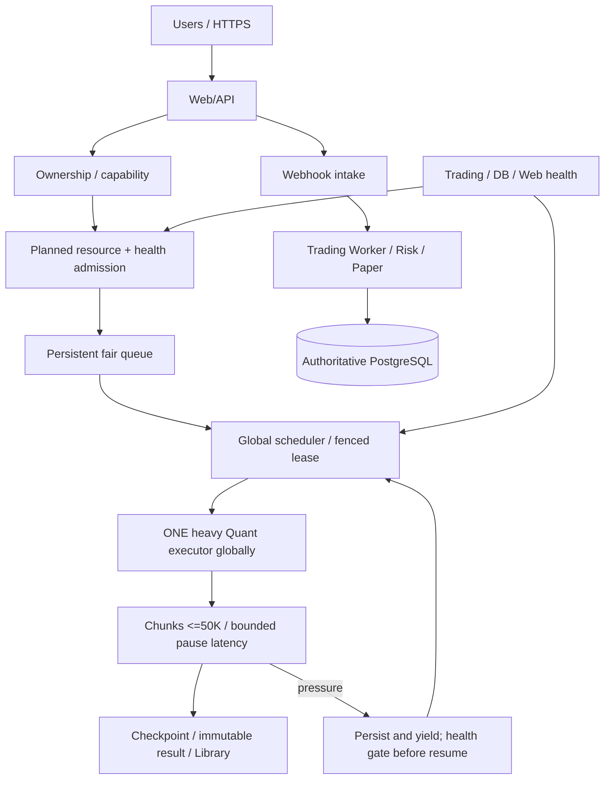
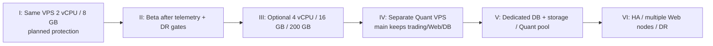
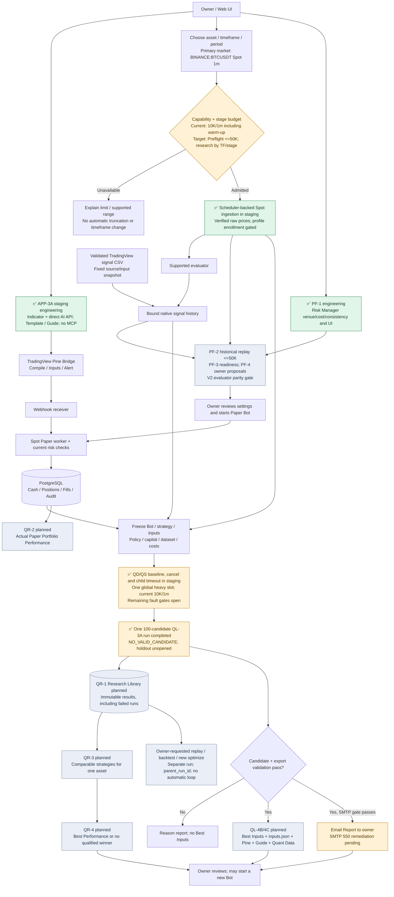
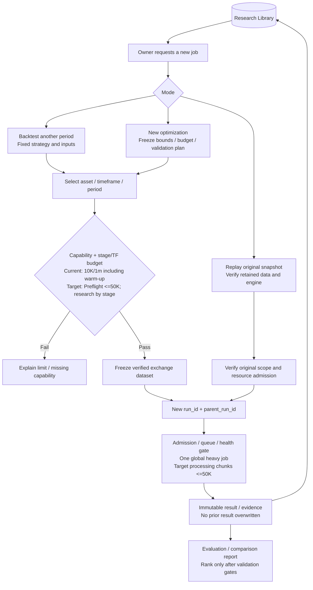

# Robot Trade — Pine → Bot → Quant → Owner Workflow

## Document authority and update rules

This is the canonical index of all current plans, their sequence, acceptance
gates, progress and change history. [README](../README.md) is the project entry
point; [Context](../Context.md) explains architecture, boundaries and operational
context. Topic documents provide specifications and evidence linked here; they
must not define a competing task order or silently supersede this status.

[Time Management](TIME_MANAGEMENT.md) is the primary companion for effort,
machine/data waits, execution overlap and remaining-time records. This roadmap
continues to own task order and gates. Update both at each scope/status/run or
handoff checkpoint, and review README/Context in the same change set; record
reviewed-unchanged when their explanations remain accurate. Revised remaining
Paper budget is 410–720 hours including rework and a runtime allowance before
subtracting overlapping waits; profitable-candidate collection has no guaranteed
deadline. Historical Preflight precedes a new live collection campaign, with
eligible downstream engineering performed during data waits.

For each completed change, update the current-status table and append a dated
change entry with evidence, scope (planned/local/staging/production), blockers
and next action. A Git checkpoint is not deployment or acceptance. Older notes
below are dated evidence; the current status and plan in this section take
precedence. Preserve production structure and private operational information.

## Project team execution

The owner requested a single-command project team. [AGENT_TEAM.md](AGENT_TEAM.md)
and root AGENTS.md define explicit model roles, exclusive file/Git ownership,
usage-aware task admission and local/VPS execution boundaries. Project TOML defaults
request Astra High for root; the active task's actual setting must be verified.
Three bounded setup agents performed team audit, PF-1 mapping and a dispatch template.
Team setup is followed by the local PF-1A backend checkpoint below. Production
resource enforcement remains planned; QD-1/QS-1 and existing gates still apply.

All roles now require the project Caveman skill for conversation, task packets
and agent-authored compact/handoff/internal memory. Shared instructions preserve
resume facts, evidence and gates; public/product docs retain normal prose.
This communication policy does not change phase order or runtime compaction.

## Current status — 2026-09-29

The owner approved parallel local PF-2 engineering while QD-1/QS-1 runtime and
I/O acceptance remain the primary work. The [PF-2 contract checkpoint](PF_2_CONTRACT_CHECKPOINT_2026-09-29.md)
adds a hashed, development-only replay plan with frozen input/state references,
one evaluation and the existing 10K/V1 limits. Five focused checks pass; trusted
resolution, cost-model V2 parity and runtime admission remain pending. A later
development-only Python replay core (S1, described below) now exists locally but
is not wired to any runtime.
Library/Export work stays limited to contracts and fixtures until dependencies
pass; no Library/Export implementation was started in this wave.

The earlier in-memory I/O ledger now reserves before launch, binds cgroup-lifetime
counters and quarantines further compute after unknown-final accounting. Its 15
focused tests and independent recheck pass. A [new local PostgreSQL adapter](QD_QS_DURABLE_IO_PF2_CHECKPOINT_2026-09-29.md)
persists the V2 ledger with CAS transitions. Ten isolated PostgreSQL checks pass,
including settlement across scheduler pause/claim; independent source review found
no blocker within local persistence scope. The subsequent
[runtime checkpoint](QD_QS_RUNTIME_CANCEL_CHECKPOINT_2026-09-29.md) adds durable
launch intent, fenced start and cancellation guards for a held diagnostic child;
four PostgreSQL runtime checks pass. One isolated staging case reached
`CANCELLED`/`STOP_PROVEN`, charged the unknown-final allowance and passed delayed
cleanup/health checks without changing the prior services or evidence.
The subsequent [local initial-binding checkpoint](QD_QS_INITIAL_IO_BINDING_CHECKPOINT_2026-09-29.md)
adds trusted unit/process/cgroup/device sampling, persisted ACTIVE accounting and
one-shot payload release for a single diagnostic child. PostgreSQL passed 14/14;
launcher helpers and existing I/O controls passed 11/11. Independent source
review found no blocker within local scope. The subsequent [Linux binding checkpoint](QD_QS_LINUX_BINDING_CHECKPOINT_2026-09-29.md)
passed one real diagnostic case: kernel read 0/write 4,096 bytes, persisted ACTIVE
before release, exact payload receipt, trusted stop and scratch cleanup. Final
counters remain unknown; cancellation charged the reserved 2 MiB per direction.
The internal [PROFILE runtime](QD_QS_PROFILE_BINDING_CHECKPOINT_2026-09-29.md)
is implemented and independently reviewed. One Linux staging case passed: 600
raw bars, 100 derived bars, committed ACTIVE before release, real write counters
and trusted cleanup. Its result remains provisional with null SQL result and
conservative unknown-final charging. Public integration, bounded cumulative
I/O budgets and overshoot calibration, all-device coverage, worker/public V2
admission and physical enforcement remain open. PF-2 finalizer
passed Python 12/12, focused cross-language parity 1/1 over 17 vectors and Ruff
within reviewed scope; this is not full risk/position/replay parity. Hosted CI for
`421ca07` passed Linux, PostgreSQL, container and Quant Lab checks; Windows exposed
a stale test fixture, tracked in the CI repair entry below. The [terminal handshake staging checkpoint](QD_QS_TERMINAL_HANDSHAKE_2026-09-29.md)
passed one actual-worker fixture to cursor 3,876, with confirmed cleanup and
unchanged old services and jobs. Setup first encountered read-only copied files;
a reviewed continuation corrected only the new copy. The research outcome is
`NO_VALID_CANDIDATE`, not a recommendation. Other fault and capacity gates remain.

Two further local slices are accepted, recorded in the
[FTR-1 and PF-2 S1 checkpoint](QD_QS_FTR1_PF2_S1_CHECKPOINT_2026-09-29.md).
FTR-1 (`292a4b3`) freezes an owned diagnostic unit before stop, requires a
quiescence window with zero dirty and writeback memory, re-checks bound identity
and commits the frozen `io.stat` sample so the ledger can settle measured final
I/O; any failed gate keeps the unknown-final charge. The full Node suite passed
466 with one pre-existing skip and isolated PostgreSQL runtime checks passed
37/37. A separate Linux mechanism proof on staging (two transient units) showed
stable frozen counters, but `terminate()` itself has not run on real Linux, and
PROFILE remains provisional with `evaluator_admission=false` and null SQL result.
The commit also rotates the ingestion and research engine source hashes, so
hash-bound evidence must be re-checked before any deploy. PF-2 S1 (`cda2857`) adds
a development-only Python stateful replay core for V1 `paper-close-v1` with fresh
initial state and at most 10,000 bars; 51 new tests, the full `quant_lab` suite
(182 pass) and Node oracle parity on 12 cases pass, with an independent audit
accepting after fixes. It is not full Risk Manager or position parity, V2 is
refused, and the trusted resolver, Node driver and runtime admission remain
pending. Neither slice is deployed; scope stays Spot/Paper, 10K bars including
warm-up, with holdout gates unchanged.

The owner has requested continuation through full QD-1/QS-1 engineering closure.
The [phase checklist](QD_QS_PHASE_CLOSURE.md) now records all mandatory gates.
The [current implementation wave](QD_QS_CLOSURE_PROGRESS_2026-09-29.md) adds local
opt-in health recovery, managed-mode denial of unscheduled legacy calculations
and historical analytics, bounded V2 ATR artifacts, and a pure V2 capacity contract.
The V2 PROFILE pipeline and optional scheduler policy passed local integration;
actual worker/public-service enrollment remains unavailable. Combined checks passed
105 with one Windows symlink-privilege skip; isolated PostgreSQL has 25 passes with
one separate Python parity skip. Focused bounded-probe checks also pass; caller
timeouts do not certify termination of external database work.
An isolated direct-evaluator I/O diagnostic passed 1,000 bars in 2.526 seconds,
with verified cleanup and unchanged original services. It did not reproduce or
explain the failed actual-main context. A subsequent actual-main diagnostic reached
checkpoint 3,000 then failed on monitor limits-file `ENOENT`; cleanup and delayed
readback passed. The subsequent terminal handshake passed the isolated actual
worker fixture; cgroup teardown remains an unproven cause of the earlier error.
A genuine typed readiness pair now ages
after physical SIGKILL; pre-expiry cleanup correctly rejected it. Earliest guarded
cleanup is 2026-09-30 13:53:52 Asia/Bangkok. Next runtime work is a separately
reviewed current-control fault case; direct storage-pair creation is not supervisor recovery.
Streaming artifact integration, trusted PROFILE enrollment, cumulative I/O accounting
and expanded stateful execution remain open. Existing research enqueue preparation
still needs managed resource admission. No expanded or production admission.

The next closure wave identified a readiness-storage cleanup defect: maintenance
could remove an aged reservation while leaving its regular pending readiness
file. The typed-reservation correction passed independent source audit and 18/18
focused local checks; staging acceptance and deployment remain pending.
The existing 24-hour retention and offline ownership guards remain required;
see [readiness retention evidence](QD_QS_READINESS_RETENTION_2026-09-29.md).
The first pressure launch failed at proxy startup. Bounded probes subsequently
proved task-cap exhaustion for wrapped Node at eight tasks; the actual proxy
passed a separate smoke at sixteen tasks. A separately named pressure rerun then
started the real worker but failed its first evaluator with `QUANT_IO_GATE_FAILED`
at cursor zero, before health-fault injection. Automatic cleanup and delayed
readback passed; the original services and failed evidence remain unchanged.
The inner I/O assertion was not logged. Diagnose that startup gate before another
pressure attempt, preserving the three-second gate and resource limits. Full
QD-1/QS-1 remains open; no pressure-stop acceptance is credited.
A local diagnostic-only patch now preserves sanitized I/O failure phase, cause,
timing and accepted observations on the private error object. Combined focused
checks passed 24/24 at that checkpoint. The isolated Linux direct-evaluator
diagnostic now passes, but actual-main failure reproduction and pressure
acceptance remain pending. Production and public responses are unchanged.

Latest [worker-managed lifecycle staging](QD_QS_LIFECYCLE_STAGING_2026-09-28.md)
passed one actual database/scheduler/main/evaluator baseline under the new I/O
controls. One evaluation reached index 3,876 and returned the expected
`NO_VALID_CANDIDATE`; foundation completed successfully, checkpoint hashes matched,
the slot was released and no holdout was evaluated. Automatic completion and
cleanup took 11.4 seconds after ready; original services remained healthy with
unchanged PIDs. This is a directly seeded engineering fixture, not HTTP enqueue
acceptance. The original active-cancel attempt failed automatic cleanup with
`STOP_UNCONFIRMED`; that evidence is retained. A corrected staging harness now
verifies an already-removed transient unit before accepting its stop exit code 5.
The new cancellation passed with a 1.474-second physical stop, slot retention,
unchanged delayed checkpoint/result and automatic confirmed cleanup.
Two timeout setup attempts stopped before injection and remain recorded failures.
A later after-readiness attempt passed: exact child SIGSTOP was confirmed,
research returned `FAILED` / `EVALUATION_TIMED_OUT`, foundation reached `CANCELLED`,
the slot cleared and automatic cleanup succeeded. The original deadline and
pre-signal cursor/hash/result remained unchanged. This proves the scoped child
timeout path, not interruption during payload computation or scheduler deadline
expiry. Next work is bounded health-pressure acceptance, with the other recovery
cases still open and fresh usage/health admission required.
Health-pressure preparation now includes a private bounded proxy that forwards
genuine Paper health and can return a controlled failure. Five local fixtures
passed. The isolated environment/policy/unit copies and supervised harness
now exist in isolated staging. Proxy startup is verified at the new test cap;
the subsequent evaluator failure still prevented fault injection. Pressure-stop
acceptance remains pending.
Remaining stop/recovery cases are tracked in the evidence matrix. QD-1/QS-1 remain
open; capacity stays 10K/1m.

The earlier [actual-worker/completion follow-up](QD_QS_RUNTIME_IO_COMPLETION_2026-09-28.md)
passed bounded staging verification after correcting missing startup telemetry.
Main/evaluator use owned 4 KiB reservations, device/limit checks, genuine counters
and deadline checks before admission. Focused I/O checks passed 8/8; completion
checks passed 15/15. Actual main startup and a sequential 1,000-row evaluator
through the production supervisor passed strict Linux readback and checkpoint
verification. Automatic completion was accepted after cleanup, with 30 baseline
and 36 impact samples healthy. Two earlier helper failures remain failed evidence.
That earlier run did not exercise a new main-managed database research job or
establish sustained-load acceptance. The new baseline above adds the database path.

Steps 2 (resource controls) and 4 (data/profile contracts) started in parallel
after pushed checkpoint `9d06ba0`. The [local work record](QD_QS_RESOURCE_PROFILE_CHECKPOINT_2026-09-28.md)
now covers opt-in I/O readback, a shared calibration deadline, UTC period UI/API
and scheduled PROFILE conversion. Follow-up Node 332/332 passed; PROFILE lifecycle,
membership revocation during conversion and actual application HTTP checks passed.
Rendered desktop/mobile Data verification passed after fixing stale period replies.
PROFILE audit corrections were reviewed. The subsequent physical recovery result
passed in isolated staging and administrator-run I/O delegation was verified.
Owner-approved manager re-execution and a bounded scratch unit now demonstrate
kernel bandwidth enforcement. Actual main startup, sequential evaluator readback
and supervised completion now pass the bounded follow-up above. Review the
remaining acceptance matrix before closing either step or the full phases.

The owner authorized the [physical PROFILE and host I/O follow-up](QD_QS_PROFILE_STAGING_IO_2026-09-28.md).
A manifest-verified release completed physical PROFILE crash/restart with matching
results and original deadlines. The old lease was rejected after terminal completion.
The monitor completion gate failed because the driver's done marker arrived 11
seconds late, despite healthy impact observations; do not mark the entire supervised
run passed. After one owner-approved user-manager re-execution, an active scratch
unit verified exact read/write limits of 524,288 bytes/second. Its direct 4 MiB
write/read took 7.970/8.007 seconds; all eight existing service PIDs and health
remained unchanged. Earlier failed probes are retained. This is scratch kernel
evidence; application readback and supervised completion were separate open gates,
subsequently verified by the bounded follow-up above.
The runtime delegation is not reboot-persistent. The owner has stopped all Bots
until a future deployment; do not resume them as part of these operations.

Owner-confirmed primary collection/research market: **BINANCE:BTCUSDT Spot 1m**.
Continue with the existing market; evidence reuse remains source/settings scoped.
Time Management uses this market without a pending BTCUSD/venue clarification.

| Work | Current evidence and scope | Remaining gate / next action |
| --- | --- | --- |
| Project agent team | Local role setup, bounded QD/QS coder assignments and independent audit; one commander, at most three children, usage checkpoints. | Continue bounded QD/QS gates; team setup does not grant production authority. |
| Time Management | Primary execution-time document includes the worker integration checkpoint; baseline estimates retained because complete active-work timing is unavailable. | Record measured verification durations separately from engineering hours; no new collection campaign. |
| R-0 | Baseline inventory and observed schema 14 recorded. | SMTP 550 remediation and confirmed delivery remain operational follow-ups; old observations are not current health checks. |
| APP-3A | Bridge engineering accepted in isolated staging; [acceptance](APP_3A_ACCEPTANCE_2026-09-26.md). | Broader source/customer support is not implied. |
| QL-2A / Custom extension | Fixed SPT baseline accepted; Custom baseline plus 16 axis settings matched; 100-observation Custom repaint passed. [Custom evidence](QL_3A_VARIED_INPUT_PARITY.md). | Evidence is source/settings scoped; positive EXIT was absent from the Custom repaint sample. Mixed candidates and new revisions need their own evidence. |
| QL-3A research | Durable 100-candidate job completed; all candidates have zero validation closed trades. [Result](QL_3A_HISTORY_RESEARCH_2026-09-27.md). | `NO_VALID_CANDIDATE`; original holdout unopened. Engineering acceptance and recommendation acceptance are tracked separately; neither is automatically granted by this update. |
| SPT Spot EXIT v1 | Separate offline draft and four predeclared development comparisons. Net loss improved to -5.1852783497 USDT but three losing episodes still stop entries; validation remains zero. [Review](QL_3A_SPOT_EXIT_V1_2026-09-27.md). | Failed development preflight. Not activated; no new TradingView collection requested for this draft. |
| Risk Manager readiness / Historical Preflight | [PF-1C engineering checkpoint](PF_1C_CHECKPOINT_2026-09-28.md): full public venue filters, shared V2 costs/reservations, saved/draft and Bridge UI; 319 local checks, 30 repeated staging checks, browser verification and 121.7-second metadata producer proof passed. [PF-2 contract](PF_2_CONTRACT_CHECKPOINT_2026-09-29.md) and [local finalizer checkpoint](QD_QS_DURABLE_IO_PF2_CHECKPOINT_2026-09-29.md) record development-only work; reported Python/Node checks pass in stated scope, but finalizer does not prove full replay parity. The [S1 stateful replay core](QD_QS_FTR1_PF2_S1_CHECKPOINT_2026-09-29.md) (`cda2857`) adds a development-only Python replay for V1 with 51 new tests, 182 `quant_lab` passes and Node oracle parity on 12 cases; it is not full Risk Manager or position parity. | Complete the trusted resolver (S3), Node driver/result envelope (S4) and runtime admission around the S1 core; order-finalizer source review passed within its stated scope. Hosted Quant Lab checks passed for `421ca07`; Windows fixture repair is tracked below. V2 historical replay/admission remains denied until full evaluator parity. Then PF-3/PF-4. |
| Historical data capacity (QD-1) | [Data capability and ingestion](QD_QS_INGESTION_CALIBRATION_2026-09-28.md) passed isolated staging with 2,100 Spot bars. The [PROFILE checkpoint](QD_QS_RESOURCE_PROFILE_CHECKPOINT_2026-09-28.md) now passes local lifecycle, revocation, real application HTTP, simulated recovery and rendered period UI on desktop/mobile. Admission remains 10K/1m including warm-up. | Physical PROFILE recovery results match; repeat supervised completion with the done marker before its deadline. Raw ingestion alone is not enrollment; PROFILE results still deny evaluator admission. Expanded capacity remains gated. |
| Quant scheduling (QS-1) | [Isolated staging recovery](QD_QS_RECOVERY_STAGING_2026-09-28.md) passed: actual main worker, SIGKILL after 1,000 bars with an in-flight unit, verified offline recovery, new lease and exact resumed result at 3,876 bars. One evaluation charged; old token fenced; original deadline and checkpoint preserved. | Connect other heavy paths to the scheduler and validate larger workloads before expanded admission. Manual cold recovery is not automatic restart or full-host disaster recovery. |
| Quant resource protection (QS-1) | Prior bounded calibration and readiness checks passed their measured scopes. [Lifecycle staging](QD_QS_LIFECYCLE_STAGING_2026-09-28.md) passes its recorded database/scheduler/main/evaluator baseline. A [local PostgreSQL I/O ledger](QD_QS_DURABLE_IO_PF2_CHECKPOINT_2026-09-29.md) now persists accounting/restart/quarantine using CAS, with ten isolated PostgreSQL checks. The [runtime checkpoint](QD_QS_RUNTIME_CANCEL_CHECKPOINT_2026-09-29.md) adds held diagnostic launch/cancel guards with four PostgreSQL runtime checks and scoped independent source audit. One isolated held-child staging cancellation passed with conservative full-allowance charging, stale-start denial and delayed health/cleanup proof. Local initial binding now passes 14 PostgreSQL and 11 launcher/I/O checks with independent source review; the [Linux diagnostic](QD_QS_LINUX_BINDING_CHECKPOINT_2026-09-29.md) now proves positive write counters, binding/release and cleanup. The [internal PROFILE case](QD_QS_PROFILE_BINDING_CHECKPOINT_2026-09-29.md) now passes one Linux run with a provisional result and trusted cleanup. [FTR-1](QD_QS_FTR1_PF2_S1_CHECKPOINT_2026-09-29.md) (`292a4b3`) adds local frozen terminal readback: 466 Node passes with one pre-existing skip, PostgreSQL runtime 37/37, independent tester review, and a Linux mechanism proof on two transient units (a mechanism proof, not a proof of the code). General worker/public V2 admission remains open. | Primary next gate: run the FTR-1 `terminate()` integration case on real Linux (next owner-approved operations step); the only Linux PROFILE evidence so far still shows unknown-final charging. Then complete the remaining fault matrix and trusted PROFILE enrollment, verify stop/recovery coverage under controls and review remaining phase gates. Runtime delegation is not reboot-persistent. Physical enforcement, cumulative byte caps and overshoot calibration, all-device coverage, a positive physical read and the post-exit writeback tail are not proved. FTR-1 rotates the ingestion and research engine source hashes; re-check hash-bound evidence before any deploy. No expanded capacity or production rollout. |
| Research Library / Best Performance (QR-1 through QR-4) | Owner-approved plan and target diagrams below; no customer library, comparison ranking or portfolio mark-to-market shipped by this update. | Reuse durable run evidence; add immutable artifacts, portfolio reporting, fair comparison and explicit owner-started follow-up runs. Real recommendations remain validation-gated. |
| QL-4B / QL-4C | Best Inputs delivery remains gated because no eligible candidate exists. | Fixture-based package/report engineering can proceed after its engineering dependencies pass; real recommendations/apply/email require a qualified run and export validation. |
| APP-3B / APP-4 / APP-5 | Multi-Pine rollout, paid Paper readiness and optional Live remain later phases. | Preserve their isolation, security and broker-specific acceptance gates. Live stays locked. |

Latest pushed implementation/evidence checkpoint: `ceda8da` (Linux binding and
provisional PROFILE runtime) on `codex/app3a-market-wait-checkpoint`;
`ce27166` corrected checkpoint text encoding. Commits `292a4b3` (FTR-1) and
`cda2857` (PF-2 S1) follow `8ce2c67` on the same branch and are pushed with this
checkpoint entry. Earlier ingestion, PF-1B/PF-1C and PF-1A checkpoints
are `9d06ba0`, `cf8913d` and `9c5f8f3`. The owner authorized the Data capability/ingestion Git
checkpoint after local and isolated-staging verification; its scope is recorded
in the [evidence document](QD_QS_INGESTION_CALIBRATION_2026-09-28.md).
PF-1C used isolated
staging verification; the foundation/worker used local disposable PostgreSQL
and a bounded Linux supervisor smoke. Subsequent isolated main-worker rollout
and physical cold recovery passed the mechanical scope recorded below.
No existing production or staging release was switched. The unrelated diagnostic builder
is not part of this plan's implementation.

The worker integration checkpoint preceding recovery is `2f6b1be`. Use the
recovery, storage and isolated staging evidence record for current
rollout status; implementation alone does not close QD-1/QS-1.
The resumed local checkpoint passed Node 312/312 and the scoped PostgreSQL
checks, including a simulated-manager cold restart. After continuation, physical
Linux crash/restart and a bounded production-impact window passed. Recovery/storage
follow-up tests passed 14/14 and the revised PostgreSQL recovery/retention checks
passed 1/1 and 3/3. Larger-capacity and broader workload gates remain open.
All newly created test processes were stopped after acceptance; private staging
evidence remains preserved. All eight existing services were active at cleanup.
The current slice implements capability/range agreement and scheduler-backed
ingestion at the existing 10K limit. Node 318/318, focused PostgreSQL and real
local browser checks passed. Isolated staging fetched 2,100 real bars and bounded
calibration met its observed-window criterion; all new services stopped after
cleanup verification. Next engineering gates are expanded admission, absolute I/O
measurement and the remaining heavy paths. See the [current evidence record](QD_QS_INGESTION_CALIBRATION_2026-09-28.md).
Do not reopen a data-collection campaign or expand admission from these short runs.

## Approved extension — readiness before Run Bot

Purpose: detect inconsistent Risk Manager settings, explain rejection causes,
and assess research activity before the owner commits to Paper collection.
This cannot guarantee zero rejections, enough future trades or a profitable
candidate. Do not weaken guards to obtain samples. It is a readiness step
inside workflow step 3, not an additional automatic optimization cycle.

### Delivery order within QL-3A

| ID | Deliverable | Completion evidence | Current status |
| --- | --- | --- | --- |
| PF-1 | Static Risk Manager consistency check and point-in-time sizing preview. Resolve owner/Bot policy and capital on the server; distinguish hypothetical drafts from saved settings. | Accepted/capped/rejected fixtures agree with worker rules; verified venue filters, fees, reservations and reduce-only targets are represented. Unknown data cannot become a pass. Preview causes no policy mutation. | Paper/public-filter engineering passed in [PF-1C](PF_1C_CHECKPOINT_2026-09-28.md); active Bot rollout acceptance remains gated. V1 is unchanged and V2 requires explicit evidence/producer rollout. No Run approval follows from a hypothetical preview. |
| PF-2 | Bounded Historical Preflight for a supported evaluator or bound signal CSV. Replay Bridge, policy, costs and capital over development data. | Reproducible immutable inputs, causal closed-bar replay, account/guard continuity, cancellation/resource limits and auditable results; no holdout access or order execution. | [Local plan contract](PF_2_CONTRACT_CHECKPOINT_2026-09-29.md) and five focused checks completed; current plan uses 10K/V1 scope. The [isolated cost-v2 order finalizer](QD_QS_DURABLE_IO_PF2_CHECKPOINT_2026-09-29.md) passed 12 Python checks and 17 Node/Python vectors. The [S1 Python stateful replay core](QD_QS_FTR1_PF2_S1_CHECKPOINT_2026-09-29.md) (`cda2857`, development-only, V1 `paper-close-v1`, fresh state, 10K bars including warm-up) passed 51 new tests, the full `quant_lab` suite (182) and Node oracle parity on 9 scripted, 1 daily-loss lift and 2 real-SPT cases, with an independent audit accepting after fixes; it is not full Risk Manager or position parity and V2 is refused. Trusted resolver (S3, needs hash preimage schemas decided), Node driver/result envelope (S4), optional CSV (S2), engine-hash list integration, runtime admission and the 50K maximum remain pending. Implement and prove cost-model V2 historical evaluator parity before admitting V2 research; do not reuse V1 parity as V2 evidence. |
| PF-3 | Readiness report with signal/intent/fill/episode counts, rejection reasons, cash/exposure, pause periods and collection estimate. | Distinguishes configuration failure, insufficient activity, unavailable capability and readiness to start Paper. Estimates use a declared development window and assumptions; persistent pause gives no finite collection ETA. | Planned; after PF-2. |
| PF-4 | Explainable setting proposals inside the owner's declared risk/exposure limits, with before/after preview and explicit save. | Deterministic calculations, effective-value provenance, stale-state detection and saved-policy confirmation. AI may explain calculations but is not the authoritative calculator. | Planned; after PF-1 through PF-3. |

Before replaying the existing Spot EXIT diagnostic, resolve its recorded
post-run import/EOF formatting provenance: frozen plan hashes refer to executed
bytes, while current files have formatting-only changes. Preserve the original
plan/result and verify the saved executed copies; do not rewrite frozen history
or bypass hash checks. This is a reproducibility prerequisite, not a new search.

### Historical data and capability contract — no TradingView MCP required

1. Fetch/cache verified Spot OHLCV from the matching venue API, initially
   Binance Spot. Freeze symbol, timeframe, bar timestamps, warm-up, data hash,
   cutoff and venue metadata. TradingView price data is not required for every
   preview, but independent alignment with the accepted source evidence is.
2. For an evaluator-supported source, bind source hash, effective inputs,
   implementation/profile version and supported dependencies. Generate native
   signals locally, then replay the actual Bridge and Risk Manager semantics.
   SPT Custom has scoped existing evidence; the new EXIT v1 does not inherit it.
3. For a source without an evaluator, allow a reviewed TradingView CSV containing
   explicit native BUY/EXIT plots and bar times. Bind it to source/effective
   inputs, market and export metadata; check continuity, timing and overlapping
   OHLCV. It supports Risk Manager replay for that fixed signal snapshot only.
   It does not certify source-input optimization or live non-repainting behavior.
4. If neither trusted evaluator nor validated signal history exists, offer only
   PF-1 and report historical capability unavailable. Do not substitute synthetic
   EMA, infer signals from price alone or claim arbitrary Pine support.
5. MCP is not a prerequisite. Backend calls exchange APIs and its own engines;
   CSV is an optional owner input. Chatbot still uses direct AI API/template/guide
   without MCP into Backend. MCP alone would not supply a Pine execution engine.

Historical simulation is distinct from naturally observed webhook-to-Paper
execution. A CSV export or backfill never increases the natural fill count.
Changing source inputs requires a supported evaluator or newly bound signal
history. Changing only Risk Manager settings can reuse the same native signal
history, while each preview records its policy/capital snapshot.

### Risk calculation and rejection reporting

The owner defines allocated funds, loss tolerance, exposure ceiling and whether
repeated entries are allowed. Proposed sizing respects the lowest applicable
limit from risk including estimated costs, available cash after reserves, order
notional and aggregate exposure, then applies verified venue rounding/minima.
Risk percent is a ceiling, not a requirement to consume all cash. Expected stop
loss is an estimate; gaps and execution costs are not bounded by a nominal SL.

PF-1 must also read current session/ledger guards, cash and reservations. A
successful independent historical simulation cannot mark the actual Bot runnable
when its persistent loss streak or other current guard still blocks entries.
Show current Run readiness separately from historical research feasibility.

Use applicable quantity/minimum-notional/price filters for the selected symbol
and order type; quantity-step rounding alone is not sufficient. Define each
counter's actual semantics: current daily trade counts include accepted BUY and
EXIT executions, while entry guards must not block otherwise valid reduce-only
exits. Unique-symbol capacity is different from entry-allocation capacity.

Bridge ATR/RR remain independent from source inputs and hard policy. Show
cost-to-stop and cost-to-target effects without silently changing Bridge values.
Keep hard loss/streak limits locked during research; no cash top-up, automated
re-arm or guard reset to manufacture coverage. Multiple Pine previews require
combined signals against shared cash/reservations and APP-3B capability gating.

Report the funnel from native signals to Bridge intents, accepted/capped entries,
closed allocations and flat-to-flat position episodes. Separate configuration
rejects, expected policy skips, loss-protection pauses and genuine execution
faults. Missing-target EXIT can be an expected consequence of a rejected BUY;
retain the audit and verify the target relationship before classifying it.
An unknown target or failed exit of actual inventory must never be hidden.

### Data readiness and candidate outcomes

| Check | Current implementation | Approved planning target / limitation |
| --- | --- | --- |
| Closed allocations | Minimum 5 in train, 5 validation, 5 test in current research rules. | Preserve these engineering minimums. Do not treat allocations as independent position episodes. |
| Position episodes | Additional episode gate not implemented. | Minimum 5 completed flat-to-flat episodes per partition for engineering coverage; implement as a versioned gate. |
| Research activity target | Not enforced by current API. | Initial planning targets: 30 train / 20 validation / 20 holdout completed episodes. Not a statistical guarantee or a promise all sources can supply them. Final study criteria must be frozen before searching. |
| Parity / repaint | Existing source-specific evidence and numerical criteria remain applicable. | Bar counts and repaint observations establish different properties from closed-trade coverage. Additional bars alone do not imply readiness. |
| Recommendation | Requires eligible results, sensitivity, costs, holdout and export gates. | More trades do not guarantee a valid candidate. Repeated or highly correlated episodes reduce effective evidence. |

Assess collection feasibility on development data. Never inspect holdout to
choose policy, bounds, source revision or collection duration. Evaluate its
trade count only at the declared final step and retain an insufficient-data
outcome if necessary. Fix dataset selection/extension rules before performance
review; no repeated extension or resetting until results pass. The current
10,000-bar engine limit must be reported while it remains implemented. QD-1
below approves mode/timeframe-specific capacity with 50K Preflight/chunks; the planning value must
not be advertised as available before the implementation and capability gates pass.

Preflight is a recorded diagnostic, not the one Quant optimization run. Record
all policy previews/settings tried; choosing among many trials still risks
selection bias. Keep development, validation and final holdout roles explicit.
Freeze owner-reviewed settings before the bounded Quant job. Its terminal
result should distinguish insufficient activity, configuration constraints,
unsupported/data/parity failures and no candidate passing performance gates.
These are planned reason categories, not claims of new API states already shipped.

Engineering acceptance can include correctly rejecting an unsuitable strategy.
Do not require SPT profitability to prove job persistence, risk parity or guarded
export code. Fixture-based QL-4B work must be labelled and cannot create customer
Best Inputs. Real recommendation/apply/mail gates remain unchanged.

## Approved extension — Quant Research Library and Best Performance

This extension stores reusable Quant data and reports portfolio performance and
asset-specific strategy comparisons. [The data/report specification](QUANT_RESEARCH_LIBRARY.md)
defines records, artifacts and report semantics. This Roadmap owns sequencing,
acceptance, progress and changes. QD-1/QS-1 foundation implementation has started;
expanded capacity and customer reporting remain gated by the completion evidence below.

### Work packages and phase placement

| ID | Work and dependency | Completion gate | Status |
| --- | --- | --- | --- |
| QD-1 | QL-3A data foundation: paged exchange history/cache, immutable datasets outside job JSON, timeframe capability registry, stage-specific dataset budgets and <=50K stateful chunks. Supports expanded PF-2 and all historical reports. | Server/UI agree on limits; warm-up and calendar boundaries correct; gaps/duplicates/incomplete bars rejected; chunked execution preserves indicator/account state; progress/cancel/recovery/resource ceilings verified. | Storage, research state, disk/temp reservations, exact UTC range UI/API and scheduler-backed raw BACKFILL implemented. Local PostgreSQL recovery/cancellation passed; isolated staging fetched 2,100 actual Spot 1m bars across three pages. Expanded admission, <=50K stateful execution and profile enrollment remain open. Current 10,000/1m limit includes warm-up. |
| QS-1 | QL-3A scheduling/protection foundation: global heavy concurrency 1, durable fair queue, server admission, health gates, CPU/memory/I/O isolation and disk/retention budgets. Uses QD-1 contracts; APP-3B/APP-4 verify concurrent tenant load and quotas. | Atomic global leases/fencing, cancellation/restart, bounded pause latency, fair admission and benchmarked production headroom; unsafe requests reject/queue/pause. | Isolated main worker and physical cold recovery passed. Bounded sustained calibration met its observed-window criterion: 173.210 seconds of nonidle evaluator intervals within 300 seconds; API p95 7.20 ms, DB p95 1.53 ms, all eight existing services healthy after cleanup. Other heavy paths, larger workloads, absolute I/O budgets and broader restore remain open. No production rollout or capacity increase. |
| QR-1 | QL-3A/QL-4B: versioned Research Library and Quant Data artifacts for every terminal run, including failed/insufficient/cancelled outcomes labelled incomplete where needed. | Owner-scoped immutable identity, checksums, provenance, input/data/engine references and permission checks; no secrets in downloads; unsuccessful runs cannot become actionable Best Inputs. | Planned. |
| QR-2 | QL-4B reporting: actual Paper Portfolio Performance with market valuation, funding-aware returns and account/capital allocation reconciliation. | Stale/missing prices explicit; no double counting shared capital; ledger and valuation reconcile; historical simulation is never labelled actual Paper execution. | Planned; current equity is book equity. |
| QR-3 | QL-4B comparison: strategies for the same asset under a declared common evaluation context, alongside a separate actual-Bot comparison. Depends on QR-1 and QD-1 for expanded ranges. | Compatible market/period/capital/cost/valuation/risk assumptions; independent evaluation provenance, sample adequacy and ranking rules fixed before comparison; no qualified winner is a valid result. | Planned. |
| QR-4 | QL-4B/QL-4C: Best Performance Report and owner-requested replay, new-period backtest or new optimization with lineage. | New run/parent identity, capability/data/privacy/resource checks; no original result overwritten or automatic rerun/apply. Qualified ranking/export is validation-gated. | Planned. |

PF-1 Paper/public-filter engineering is complete at `cf8913d`; active Bot V2
rollout remains separate. QD-1 storage and QS-1 scheduling foundations proceed
in parallel after locking their shared contract. PF-2 follows with historical
V2 evaluator parity; PF-3/PF-4 retain their order. QD-1 and QS-1
admission/isolation are required before expanded heavy PF-2/research/report requests are enabled;
it can reuse the data contracts designed for PF-2. QR-1 contracts can be prepared
alongside those foundations; then QR-2/QR-3 precede QR-4 customer reporting.
These are work packages within the existing R-0 through APP-5 order, not new
top-level phases or a reason to bypass APP-3B multi-Pine gates.

### Report range and research capacity contract

This supersedes the earlier universal 50K cap. **50,000 total primary bars is the
Historical Preflight maximum and processing-chunk ceiling, not the global research
ceiling.** All dataset budgets below include warm-up; show evaluation + warm-up =
total. Candidates share data but multiply compute. Bound CPU, RAM, I/O, secondary
MTF series, result/temp bytes and aggregate work. Missing limits block admission.
Current runtime remains 10,000 bars/its narrow profile.

| Timeframe | Planned standard dataset budget, including warm-up |
| --- | --- |
| 1m | Search 100K–250K; shortlisted validation 500K; final 750K–1M |
| 3m | 200K–400K |
| 5m | 100K–250K |
| 10m | 75K–150K |
| 15m | 50K–100K |
| 30m / 1h / 2h / 4h / 6h / 8h / 12h / 1D | 50K each |
| Seconds / 3D / 1W / calendar month / other intervals | No new budget/support granted; require explicit capability and budget design. |

Ranges are operating targets, not minimum sample requirements, deployed capabilities
or guaranteed available history. Enable only after market support, verified aggregation
where required, evaluator support, accepted parity and resource admission.

| Stage for BTCUSDT Spot 1m | Dataset target | Purpose and gate |
| --- | --- | --- |
| A: Parity/debug | 5K–20K | Signal/Bridge/risk/accounting evidence; no performance claim. Existing numeric gates apply. |
| B: Historical Preflight | <=50K | PF-2 bounded development diagnosis/activity/guard feasibility. |
| C: Broad search | 100K–250K | Freeze bounded candidate budget before run. |
| D: Extended validation | 500K | Qualified shortlist only, typically 5–20; predeclared selection rule. |
| E: Final validation | 750K–1M | Final candidate or small set, typically 1–5; untouched evaluation and declared selection rules. |
| F: Deep Research | >1M or beyond its standard class | Explicit owner action, study plan, capability/data quality and storage/resource admission. |

Do not default to 1M × 100 candidates. Freeze all conditional stage datasets,
partitions, shortlist rules, cutoff, warm-up, bounds, objective, costs and risk before
execution. These stages form one bounded owner-started workflow, not repeated search.
Expanded history may overlap exposed data; only untouched disjoint periods support
independent evaluation. Ranking finalists on holdout makes it selection data, not
independent proof of the selected winner. See [contracts](QUANT_CAPACITY_AND_INFRASTRUCTURE.md).

Period-first UI: **1 Week / 1 Month / 3 Months / 6 Months / 1 Year / 2 Years /
3 Years / YTD / All Available / Custom** for simulated research; retain **All Time
Registered** for actual Bot reports. Week is seven days; months/years use calendar
boundaries and month-end clamping in the report timezone; YTD starts January 1.
Freeze UTC half-open intervals with completed bars and venue session conventions.
Show requested period, evaluation/warm-up/total bars, available history, stage limit,
capability and admission result. Never silently change timeframe or downsample.

All Available is bounded by venue history, evaluator, mode, storage and admission;
show and confirm its resolved interval. Explicit over-limit ranges require the owner
to shorten them or request admitted Deep Research. No silent truncation. For example,
1m one year is about 525,600 evaluation bars before warm-up, beyond broad search but
potentially within an admitted final stage; two/three years exceed the 1M final limit.
Exact calendar counts remain authoritative.

Actual Bot All Registered begins at registration with actual coverage; older exchange
history is simulation, never actual fills. Ledger history has separate paging/retention
limits. Persisted result reads do not rerun jobs; new price-based calculations use a
declared admitted job class. Multi-Bot rankings use compatible covered windows without
zero-filling missing history. Replaying latest inputs on old dates is a new simulation.

## Quant resource protection and infrastructure scaling

Owner decision: keep **2 vCPU / 8 GB RAM / 100 GB NVMe / 8 TB bandwidth / one provider
snapshot** for now. This owner-provided envelope is not a fresh server inventory.
No immediate upgrade required. [Capacity specification](QUANT_CAPACITY_AND_INFRASTRUCTURE.md)
defines QD-1/QS-1 contracts. Target controlled multi-user Paper/Quant, not a claim of
institutional/high-concurrency capacity.

Trading/reduce-only execution, intake, PostgreSQL and Web/API health take priority
over Quant; database headroom is necessary for trading. Quant may queue/slow/pause.
Initial heavy concurrency is **1 globally across users, Bots and subscriptions**.
Bot count is not compute entitlement. Tier quotas for queued jobs, candidates, storage,
retention and Deep access remain inside the physical limit.

Admission and a durable fair scheduler precede expanded heavy work. Use fenced leases,
health gates before start/resume and bounded pause latency; chunks may be smaller than
50K. Unknown critical health blocks admission. CPU around one vCPU, preferred memory
2–2.5 GB/about 3 GB candidate hard ceiling and disk 65/75/85% watermarks are benchmark
candidates only. Absolute DB/WAL/backup/temp headroom and hard process limits also apply.

| Infrastructure stage | Design and review gate | Status |
| --- | --- | --- |
| I: Private use | Current VPS with queue, admission, isolation, monitoring and recovery before broader heavy usage. | Hardware decision retained; protections planned. |
| II: Public/paid Paper beta | APP-3B/APP-4 tenant fairness/quotas, concurrent service-impact tests, off-host backups/alerts and full restore drill. Keep current VPS when measured objectives hold. | Planned release gate. |
| III: Vertical option | Consider 4 vCPU / 16 GB / 200 GB only after measured pressure/headroom review. | Optional; upgrade not approved. |
| IV: Separate Quant | Main host retains Web/API, trading, DB; move Quant using portable authenticated job/dataset/result contracts. | Optional when Quant dominates pressure; preferred over contention on trading host. |
| V: Separate data layer | Dedicated PostgreSQL, shared/object research storage and bounded worker pool. | Future usage-driven option. |
| VI: Higher availability | Multiple Web nodes, isolated trading, DB HA/DR and external monitoring/storage. | Future business-driven option. |

Stages are review options, not mandatory purchases. Track CPU/load, memory/swap/OOM,
DB latency, API p95/p99, webhook-to-queue latency, trading queue depth/age, Quant wait/run
time, disk/cache growth and I/O pressure. Calibrate objectives before upgrade triggers.
One snapshot does not replace scheduled off-host backups, failure alerts and verified
full recovery. Benchmark representative 10K/50K/100K/250K/500K/1M datasets and bounded
1/5/10/25/50/100 candidate cases; not the full matrix on production by default.

```mermaid
flowchart TD
    U["Users / HTTPS"] --> API["Web/API"]
    API --> AUTH["Ownership / capability"]
    AUTH --> ADM["Planned resource + health admission"]
    ADM --> Q["Persistent fair queue"]
    Q --> S["Global scheduler / fenced lease"]
    S --> W["ONE heavy Quant executor globally"]
    W --> CH["Chunks <=50K / bounded pause latency"]
    CH --> R["Checkpoint / immutable result / Library"]
    CH -->|pressure| PAUSE["Persist and yield; health gate before resume"]
    PAUSE --> S
    API --> IN["Webhook intake"]
    IN --> TW["Trading Worker / Risk / Paper"]
    TW --> DB[("Authoritative PostgreSQL")]
    HEALTH["Trading / DB / Web health"] --> ADM
    HEALTH --> S
```

```mermaid
flowchart LR
    I["I: Same VPS 2 vCPU / 8 GB<br/>planned protection"] --> II["II: Beta after telemetry + DR gates"]
    II --> III["III: Optional 4 vCPU / 16 GB / 200 GB"]
    III --> IV["IV: Separate Quant VPS<br/>main keeps trading/Web/DB"]
    IV --> V["V: Dedicated DB + storage / Quant pool"]
    V --> VI["VI: HA / multiple Web nodes / DR"]
```

### Report and research behavior

Quant Library stores source/effective-input/Bridge/policy/capital/model versions,
dataset references/hashes, candidate/trial history and summary metrics/gates for
all candidates. Shortlist/final artifacts retain required trades, decisions, equity
and validation detail; declare retention tier/completeness explicitly. Large price/signal
datasets stay in protected immutable artifacts rather than oversized job JSON.
Incomplete runs retain available evidence without inventing missing metrics.

Best Inputs remains one package with `inputs.json`, Pine, Guide and a
`quant-data/` folder; Email Report remains the second Step 5 deliverable. Library
and Best Performance views are additional research screens. A failed run can
be inspected/downloaded as diagnostic data but has no actionable Best Inputs.

Separate actual Paper Portfolio Performance from simulated Strategy Comparison.
Portfolio market value requires point-in-time prices, explicit quote/FX basis,
funding-aware returns and no shared-capital double counting; this is a reporting
valuation, not a silent change to the risk engine's book-equity basis.

Provide actual-Bot comparison with differences disclosed and standardized
strategy comparison with common asset/venue, evaluation period, capital, costs,
risk policy, price/execution conventions and supported timeframes. Rank only
qualified results on a predeclared objective within owner risk limits, with
Buy & Hold benchmark, drawdown, episode counts, costs/exposure and uncertainty.
Label the winner as best **within the selected scope**, never universally best.
No qualified winner is a valid outcome. Previously exposed holdout becomes
development evidence for later selection; new claims require independent data.

Owner follow-ups are separate actions: exact replay, fixed-input new-period
backtest, or new bounded optimization. Each receives a new `run_id`, mode and
`parent_run_id`; comparisons have their own `comparison_id` referencing all
participating versions/runs. Preserve the old record. Freeze a new data/validation
plan before research. There is no automatic optimization, Bot apply, new session
or email enqueue from a report view. Owner-started follow-ups are new workflows.

### Target system diagram

Green nodes have passed only the scope named in the box; amber nodes have partial
evidence or an open gate; grey nodes are planned. The deployed research admission
remains 10K bars including warm-up for the supported Spot 1m profile. The planned
50K limit applies to Historical Preflight and processing chunks, while planned
research datasets use timeframe/stage budgets. Historical Preflight precedes owner
Run; a saved-setting proposal never applies itself. Signal history comes from a
supported evaluator **or** validated fixed-input CSV. Price data is still required
for Bridge protection and execution. All Bots are currently stopped by the owner.

```mermaid
flowchart TD
    U["Owner / Web UI"] --> AI["✅ APP-3A staging engineering<br/>Indicator + direct AI API; Template / Guide; no MCP"]
    AI --> TV["TradingView Pine Bridge<br/>Compile / Inputs / Alert"]
    TV --> RX["Webhook receiver"]

    U --> RANGE["Choose asset / timeframe / period<br/>Primary market: BINANCE:BTCUSDT Spot 1m"]
    RANGE --> CAP{"Capability + stage budget<br/>Current: 10K/1m including warm-up<br/>Target: Preflight <=50K; research by TF/stage"}
    CAP -->|Unavailable| BLOCK["Explain limit / supported range<br/>No automatic truncation or timeframe change"]
    CAP -->|Admitted| DATA["✅ Scheduler-backed Spot ingestion in staging<br/>Verified raw prices; profile enrollment gated"]
    DATA --> EVAL["Supported evaluator"]
    CSV["Validated TradingView signal CSV<br/>Fixed source/input snapshot"] --> SIGNALS["Bound native signal history"]
    EVAL --> SIGNALS

    U --> PF1["✅ PF-1 engineering<br/>Risk Manager venue/cost/consistency and UI"]
    PF1 --> PF["PF-2 historical replay <=50K<br/>PF-3 readiness; PF-4 owner proposals<br/>V2 evaluator parity gate"]
    DATA --> PF
    SIGNALS --> PF
    PF --> OWNER["Owner reviews settings and starts Paper Bot"]
    OWNER --> WORKER["Spot Paper worker + current risk checks"]
    RX --> WORKER
    WORKER --> DB[("PostgreSQL<br/>Cash / Positions / Fills / Audit")]

    DB --> SNAP["Freeze Bot / strategy / inputs<br/>Policy / capital / dataset / costs"]
    DATA --> SNAP
    SIGNALS --> SNAP
    SNAP --> QS["✅ QD/QS baseline, cancel and child timeout in staging<br/>One global heavy slot; current 10K/1m<br/>Remaining fault gates open"]
    QS --> OPT["✅ One 100-candidate QL-3A run completed<br/>NO_VALID_CANDIDATE; holdout unopened"]
    OPT --> LIB[("QR-1 Research Library planned<br/>Immutable results, including failed runs")]
    OPT --> VALID{"Candidate + export validation pass?"}
    VALID -->|No| REASON["Reason report; no Best Inputs"]
    VALID -->|Yes| PACKAGE["QL-4B/4C planned<br/>Best Inputs + inputs.json + Pine + Guide + Quant Data"]
    VALID -->|Yes, SMTP gate passes| MAIL["Email Report to owner<br/>SMTP 550 remediation pending"]
    PACKAGE --> REVIEW["Owner reviews; may start a new Bot"]
    MAIL --> REVIEW
    DB --> PORT["QR-2 planned<br/>Actual Paper Portfolio Performance"]
    LIB --> COMP["QR-3 planned<br/>Comparable strategies for one asset"]
    COMP --> BEST["QR-4 planned<br/>Best Performance or no qualified winner"]
    BEST --> REVIEW
    LIB --> FOLLOW["Owner-requested replay / backtest / new optimize<br/>Separate run; parent_run_id; no automatic loop"]
    classDef scoped fill:#e1f5e8,stroke:#23844b,color:#143d28;
    classDef partial fill:#fff1d5,stroke:#b77900,color:#573a00;
    classDef planned fill:#e9eef7,stroke:#71829d,color:#243348;
    class AI,PF1,DATA scoped;
    class CAP,QS,OPT,MAIL partial;
    class PF,LIB,PACKAGE,PORT,COMP,BEST,FOLLOW planned;
```

### Owner-requested follow-up diagram

```mermaid
flowchart TD
    LIB[("Research Library")] --> OWNER["Owner requests a new job"]
    OWNER --> MODE{"Mode"}
    MODE --> REPLAY["Replay original snapshot<br/>Verify retained data and engine"]
    MODE --> BACK["Backtest another period<br/>Fixed strategy and inputs"]
    MODE --> NEW["New optimization<br/>Freeze bounds / budget / validation plan"]
    BACK --> SELECT["Select asset / timeframe / period"]
    NEW --> SELECT
    SELECT --> GATE{"Capability + stage/TF budget<br/>Current: 10K/1m including warm-up<br/>Target: Preflight <=50K; research by stage"}
    GATE -->|Fail| WHY["Explain limit / missing capability"]
    GATE -->|Pass| DATA["Freeze verified exchange dataset"]
    DATA --> RUN["New run_id + parent_run_id"]
    REPLAY --> CHECK["Verify original scope and resource admission"]
    CHECK --> RUN
    RUN --> QUEUE["Admission / queue / health gate<br/>One global heavy job<br/>Target processing chunks <=50K"]
    QUEUE --> RESULT["Immutable result / evidence<br/>No prior result overwritten"]
    RESULT --> LIB
    RESULT --> REPORT["Evaluation / comparison report<br/>Rank only after validation gates"]
```

## Change log

### 2026-09-29 — FTR-1 frozen terminal readback and PF-2 S1 replay core

[Scoped evidence](QD_QS_FTR1_PF2_S1_CHECKPOINT_2026-09-29.md) for two accepted
local slices. FTR-1 (`292a4b3`): before stopping an owned diagnostic child the
launcher freezes its unit, requires a quiescence window with zero dirty and
writeback memory, re-checks bound identity, commits the frozen `io.stat` sample
before the kill and accepts only a removed or retained-equal cgroup afterwards.
The runtime settles the ledger and marks `STOP_PROVEN` in one transaction, still
gated by `authorizeTerminal`; any failed gate keeps the unknown-final charge.
PROFILE stays provisional with `evaluator_admission=false` and a `CANCELLED` job
with null SQL result. Each PROFILE run gains at least about 2.5 seconds, and the
path is skipped when the unit has 5 seconds or less of runtime left. Local checks:
I/O 48/48, full Node 466 pass with one pre-existing skip, isolated PostgreSQL
runtime 37/37, PROFILE runtime 13/13, ledger 10/10. A Linux mechanism proof on
staging (kernel 6.8, systemd 255, two transient units, one run per case at
64 KiB) showed a freeze of about 10 ms, stable counters and identity across 2.5
seconds, exactly 65,536 write bytes for the fsync unit and a correctly rejected
buffered unit. It is not a proof of the code: `terminate()` has not run on real
Linux, and that integration case is the next owner-approved operations step.
Cleanup and delayed health were unchanged; the 23 old failed transient units were
left untouched by owner decision. All-device coverage, positive physical read,
cumulative caps and overshoot calibration, public V2 admission and the writeback
tail after exit remain open. The commit rotates the ingestion and research
engine source hashes; re-check hash-bound evidence before any deploy.

PF-2 S1 (`cda2857`): `evaluate_pf2_chunk` in `pf2_replay.py` is a
development-only Python stateful replay core for V1 `paper-close-v1`, with fresh
initial state, at most 10,000 bars including warm-up, causal closed bars and a
canonical checkpoint with tested restart equality. The 51 new tests, the full
`quant_lab` suite (182) and Ruff pass, with Node oracle parity on 9 scripted, 1
daily-loss lift and 2 real-SPT cases. An independent audit accepted after fixes.
It is not full Risk Manager or position parity, V2 is refused, and the checkpoint
integrity hash is not authentication, so the future driver must use trusted
storage. Remaining: S3 trusted resolver, S4 Node driver/result envelope, optional
S2 CSV, engine-hash list integration, runtime admission, V2 parity and 50K.

Both commits are pushed with this checkpoint and remain undeployed. Scope stays Spot/Paper,
BINANCE:BTCUSDT Spot 1m, 10K bars including warm-up and independent holdout
gates; no production rollout, no Live. Readiness retention cleanup still waits
for real age expiry at 2026-09-30 13:53:52 Asia/Bangkok.

### 2026-09-29: internal PROFILE binding and release on Linux

[Scoped evidence](QD_QS_PROFILE_BINDING_CHECKPOINT_2026-09-29.md): the fixed Node
worker processed 600 synthetic raw bars into 100 derived bars after 500 warm-up.
Committed ACTIVE accounting preceded release; real write observations grew from
4,096 to 36,864 bytes. The parent validated the provisional result, stopped the
child and cancelled the job with unknown-final allowance charging. SQL result
and checkpoint remain null; evaluator admission remains false. Delayed cleanup,
old services and retained evidence checks passed. Local child/launcher checks
passed 8/8, PostgreSQL PROFILE 7/7 and the subsequent overshoot regression 1/1.
Independent source and packet review passed after corrections. No production
rollout or public V2 admission is included.

Next implementation gate: establish and audit terminal I/O accounting, then
complete the remaining fault matrix and trusted PROFILE enrollment. Positive
physical reads, cumulative/all-device enforcement and public V2 remain open.
Full QD-1/QS-1 acceptance and the genuine 24-hour retention gate remain open.

### 2026-09-29 — Positive Linux counter binding and payload receipt

One [isolated Linux diagnostic case](QD_QS_LINUX_BINDING_CHECKPOINT_2026-09-29.md)
passed with real counters, committed binding before release, child receipt and
conservative cancellation. Local checks passed PostgreSQL 16/16, launcher 5/5
and Python 6/6; independent source and staging-packet review found no remaining
blocker within this case. Prior services, jobs and retention evidence remained
unchanged. The subsequent internal PROFILE case is recorded above. This
diagnostic result alone claims no PROFILE execution, public V2 admission, final
measured accounting or phase closure.

### 2026-09-29 — Windows CI risk fixture clock repair

[Safety checks for `421ca07`](https://github.com/sanchatmd-dev/trading-bot/actions/runs/36563022690)
reported 426 passes and 13 failures on Windows. All failures came from
`test/risk.test.js`: its module-load timestamp aged beyond the 60-second limit
before execution in the shared test process. Linux, PostgreSQL, container and
[Quant Lab](https://github.com/sanchatmd-dev/trading-bot/actions/runs/36563022585)
passed. A virtual 61-second delay reproduced all 13 failures.

The fixture now supplies a fixed timestamp and the existing `context.now` clock.
Focused checks pass 14/14, including acceptance at 60,000 ms and rejection at
60,001 ms; the virtual delay also passes 14/14. Production risk code and signal
age policy are unchanged. Full local Windows `npm test` completed in 122.11 seconds:
439 passed, zero failed and one symlink-privilege test skipped. Hosted repair
`372d8a3` passed [Safety checks](https://github.com/sanchatmd-dev/trading-bot/actions/runs/36564109560)
and [Quant Lab](https://github.com/sanchatmd-dev/trading-bot/actions/runs/36564109602).
README and Context were reviewed unchanged for that repair: it changes test
timing only. Positive Linux binding and PROFILE integration were next gates at
that checkpoint; their subsequent staging evidence is recorded above.

### 2026-09-29 — Initial I/O binding after the pushed runtime checkpoint

Reviewed and pushed the preceding 20-file checkpoint as `d31b42a` on
`codex/app3a-market-wait-checkpoint`; the remote revision matched. Subsequent
[initial-binding work](QD_QS_INITIAL_IO_BINDING_CHECKPOINT_2026-09-29.md) was
developed locally and remains separate from that commit. It persists trusted counters before
release, fences identity/lease changes and retains bound cancellation accounting.
Audit corrected three issues: a discarded final observation, a synthetic
invocation identifier and an unsupported disjoint-domain claim. The final
source review found no blocker for one diagnostic child per job, with 14/14
PostgreSQL and 11/11 launcher/I/O checks. Linux binding, actual PROFILE and full
accounting were open at that checkpoint; subsequent staging evidence is above.
No staging or production rollout occurred within that local slice. Main documents and the phase checklist were synchronized.

### 2026-09-29 — Runtime launch intent and held-child cancellation

The [runtime checkpoint](QD_QS_RUNTIME_CANCEL_CHECKPOINT_2026-09-29.md)
connects the durable ledger to a diagnostic launcher through immutable start
intent and scheduler/SQL guards. Four isolated PostgreSQL runtime checks and
one focused V1 scheduler check passed; independent source audit found no blocker
within held-bootstrap/cancel scope. Payload release remains denied until trusted
initial counter binding is implemented. A retained-cgroup probe failed to prove
post-exit counters; its failure and cleanup remain evidence. This does not close
QD-1/QS-1 or enable actual PROFILE execution, V2 public admission or larger jobs.
The one subsequent isolated staging case passed cancellation, full unknown-final
charging, stale-start denial and delayed cleanup/health checks. The original
eight service PIDs, nine historical job pairs and retention evidence were unchanged.
Roadmap, Time Management, README, Context and the phase checklist were updated.

### 2026-09-29 — Local durable I/O and isolated PF-2 order finalizer

The [combined checkpoint](QD_QS_DURABLE_IO_PF2_CHECKPOINT_2026-09-29.md)
adds a PostgreSQL ledger bound to the existing immutable V2 scheduler contract
and an isolated Python cost-v2 order finalizer. Isolated PostgreSQL passed 10/10;
Python passed 12/12; one cross-language test matched 17 fixed vectors. Independent
source review found no blocker within these local scopes. Runtime launch/cancel
serialization, physical enforcement, full historical replay and trusted enrollment
remain open. Production admission stays at 10K; no staging rollout, production
migration or new collection campaign occurred. Roadmap, Time Management,
README and Context were synchronized. Hosted CI has not run.

### 2026-09-29 — Full-phase checklist and local recovery/capacity contracts

Added the [phase checklist](QD_QS_PHASE_CLOSURE.md), preserving separate evidence
for local implementation, isolated staging and production. The [closure wave](QD_QS_CLOSURE_PROGRESS_2026-09-29.md)
records a scoped diagnostic pass, opt-in temporal health recovery, strict capacity
contracts and the 54 local / 23 PostgreSQL passing checks, with one parity skip.
Normal reserve remains 20 points. Real retention aging, current-control faults,
enrollment, expanded execution and resource accounting still gate phase closure.

### 2026-09-29 — Proxy diagnosis and pressure rerun checkpoint

Wrapped Node hit `TasksMax=8`; the same probe passed at sixteen tasks. The actual
proxy also passed startup, genuine health forwarding and physical cleanup at
sixteen tasks. One separately named pressure rerun preserved the frozen release,
all main/evaluator limits and prior operation files. Its first evaluator failed
with `QUANT_IO_GATE_FAILED` before fault injection. Research ended `FAILED`,
foundation `CANCELLED`, with cursor zero, no result and no active execution slot.
Automatic cleanup succeeded and original service health remained unchanged.
Inner failure detail is missing; startup diagnosis is the next action, not another
blind retry. No capacity, production or full-phase acceptance follows. Luna Low
updated the diagnostic record; root corrected one failed-versus-inactive state
description. Runtime operations remained with Sol High.
The subsequent local diagnostic patch preserves public error codes, stop/cleanup
precedence and existing limits. Root's combined checks passed 24/24 after correcting
first-failure capture for output overflow and nonzero process exit. This is local
evidence only; a separate immutable diagnostic staging package is the next step.

### 2026-09-29 — Scoped timeout acceptance and pressure preparation

After two preserved setup failures, one after-readiness attempt passed the actual
worker/evaluator timeout path with confirmed SIGSTOP, `EVALUATION_TIMED_OUT`,
unchanged deadline/checkpoint, released execution occupancy and automatic cleanup.
Natural STOPPING was not sampled; no in-payload interruption claim is made.
Pressure has only a reviewed private design and locally checked health proxy.
Its harness and supervised run remain pending. The owner allowed a three-point
reserve for this continuation only; the checkpoint retained 7% weekly allowance,
with short-window usage unknown. No production rollout or capacity increase.

### 2026-09-29 — Evaluator-timeout attempt and Luna documentation pilot

One isolated engineering attempt found the live child at cursor 2,000 but could
not observe completed readiness within the probe window. No SIGSTOP was sent;
automatic cleanup confirmed all test processes stopped and the slot released.
Original services remained healthy. Timeout, pressure, crash/recovery and
readiness cleanup acceptance remain open; preserve the failed attempt and
diagnose the probe before another run. A Luna Low worker completed one bounded
local documentation review, reviewed by root; runtime operations remained with
Sol High. No production rollout, capacity increase or new market collection.

### 2026-09-29 — Sequential fault-case preparation checkpoint

The owner requested timeout, pressure, crash/recovery and readiness crash cleanup
in sequence. Local timeout review identified separate evaluator and scheduler
timers with possible competing terminal diagnostics. No staging job or VPS action
ran; preparation stopped at the usage reserve. All four cases remain pending.
Next action is to refresh usage/health and define the timeout path and expected
result before injection; do not count a child timeout as scheduler-deadline proof.

### 2026-09-29 — Supervised cancellation acceptance

Reproduced the staging cleanup exit code 5 for an already-removed transient unit.
The private harness now verifies ownership, manager state, zero PID, cgroup and
pending jobs before accepting that specific outcome. One new supervised cancel
passed in 1.474 seconds with automatic confirmed cleanup, unchanged delayed
checkpoint/results and healthy original services. The original failed attempt
remains evidence. No production source, capacity, Bot or holdout changed; timeout,
pressure and crash/recovery checks remain open. See the [lifecycle evidence](QD_QS_LIFECYCLE_STAGING_2026-09-28.md).

### 2026-09-29 — Bounded Luna worker policy

Added a Luna Medium routine-worker role for small local code, UI and fixture
slices with exact ownership and observable acceptance. Root remains the sole
commander; Sol independently verifies behavior-changing Luna work, while complex
and high-risk paths retain their existing roles. All roles keep Caveman compact
and handoff rules. Start with one Luna worker, pilot three to five comparable
slices, and evaluate observed usage, elapsed time, rework and defects before
considering more parallel work. This policy change does not dispatch an agent,
change production, or close a phase gate.

### 2026-09-29 — Target system diagrams aligned with current capability

Updated the target and owner-follow-up diagrams to distinguish the current
10K/Spot 1m admission from planned 50K Historical Preflight/chunks and staged
research budgets. Marked scoped staging evidence, the open QD/QS cancellation
cleanup and fault gates, `NO_VALID_CANDIDATE`, SMTP 550 and planned report/export
components. This changes documentation only, with no capacity or phase acceptance.

### 2026-09-28 — Worker-managed lifecycle baseline

The isolated database/scheduler/main/evaluator baseline passed with one charged
evaluation, an expected diagnostic result, verified Python checkpoint and released
slot. Setup backup and seed-helper failures were retained and recovered through
guarded resumes. No product runtime changes or new market collection were required.
The active-cancel case passed its database transition and 1.429-second stop bound,
but failed automatic cleanup completion; no retry ran. Stop/recovery cases remain
separately gated in the [evidence matrix](QD_QS_LIFECYCLE_STAGING_2026-09-28.md).
The owner extended the 10-percentage-point reserve to this staging set only;
the standing project reserve remains 20 points. No production deployment or phase
closure follows from this checkpoint.

### 2026-09-28 — Bounded telemetry readiness and successful staging completion

Added reserved 4 KiB telemetry preparation in the actual main/evaluator cgroups,
preserving strict counters, device/limit checks and physical-stop cleanup.
Audit corrected acceptance of late reads; focused I/O checks passed 8/8.
The final staging sequence verified actual main startup and a 1,000-row evaluator
through the production supervisor, with matching Python checkpoint hashes.
Automatic completion succeeded in 35.250 seconds with healthy baseline/impact
samples; test units stopped and the override was removed. Two earlier private
helper failures remain recorded. Full worker-managed research, expanded capacity
and phase closure are separate gates. No production deployment or Bot resume.
See the [evidence and limitations](QD_QS_RUNTIME_IO_COMPLETION_2026-09-28.md).

### 2026-09-28 — Actual main startup gate and completion protocol

An isolated actual-main attempt failed the strict I/O telemetry gate and was
cleaned up without job claims or changes to the original services. The completion
correction passed 15 focused local checks, including duplicate invocation and
real CLI publication paths. Main/evaluator positive acceptance and a fresh staging
monitor run remain open. See the [follow-up record](QD_QS_RUNTIME_IO_COMPLETION_2026-09-28.md).

### 2026-09-28 — Owner-approved manager refresh and bounded I/O proof

One user-manager re-execution completed with the original service PIDs preserved.
An active scratch unit read its own exact I/O limits before load, then measured
4 MiB direct writes and reads at approximately 0.5 MiB/second. The invalid `dd`
option attempt wrote zero bytes and remains recorded as rework. Scratch cleanup
and original service health passed. Actual main/evaluator I/O gates and the earlier
PROFILE monitor completion failure remain open; no phase closure or Bot resume.
See the [operational record](QD_QS_PROFILE_STAGING_IO_2026-09-28.md).

### 2026-09-28 — Physical PROFILE and I/O staging preparation

Prepared an isolated immutable release for the owner-authorized crash/restart
drill and a reviewed runtime I/O delegation script. The script preserves existing
controllers, checks PID continuity and owns its rollback file. Kernel differences
after restoration are reported explicitly. SSH cannot execute sudo unattended;
the owner ran the command and controller readback passed. Physical PROFILE results
match across attempts, but the monitor completion gate failed on a late done marker.
These outcomes do not close the full resource/profile acceptance.
See the [operational record](QD_QS_PROFILE_STAGING_IO_2026-09-28.md).

### 2026-09-28 — Browser and PROFILE acceptance follow-up

Rendered Data checks passed in isolated Chrome with the real local application
and PostgreSQL. A stale period-preview race was reproduced and fixed, with a
regression for both stale success and error responses. Actual application HTTP
PROFILE lifecycle and membership revocation during conversion passed; final Node
regression is 332/332. Existing global chart/inline-style CSP warnings are recorded
separately in the [evidence](QD_QS_RESOURCE_PROFILE_CHECKPOINT_2026-09-28.md).
No staging/production rollout occurred. Physical PROFILE recovery and host I/O
acceptance remain open; no new collection or capacity increase was authorized.

### 2026-09-28 — Resource controls and data/profile integration

Local steps 2 and 4 add opt-in I/O readback to the main worker and supervisor,
one monitor/driver deadline, period previews and a scheduled PROFILE conversion
path. The [work record](QD_QS_RESOURCE_PROFILE_CHECKPOINT_2026-09-28.md) separates
local test evidence from remaining PostgreSQL/browser and host acceptance.
PROFILE preserves source/provenance binding and explicitly denies evaluator
admission. A raw ingestion result alone remains insufficient for Quant research.
Read-only host inspection found missing I/O controller delegation; no host
configuration, release, campaign or 10K admission limit changed. README and
Context now describe the local scope. Git publication is still pending.

### 2026-09-28 — Data capability and scheduler-backed ingestion

Added authenticated raw-history preview/queue/status/cancel, exact UTC range
agreement and a Data panel. BACKFILL shares the existing managed worker/global
slot and persists immutable page references for resume and retention. Local Node
318/318 passed, along with PostgreSQL HTTP, page recovery/cancellation and research
adapter regressions. Real Chrome checks found and verified the Bot query-scope
fix; an independent audit also led to a polling-race regression. Isolated staging
fetched 2,100 actual bars. Calibration recorded 173.210 seconds of nonidle evaluator
intervals within 300 seconds, with healthy existing services and verified cleanup.
Thirty-two mechanical jobs completed; the watchdog stopped the final job after
monitor completion. I/O counters remain unavailable. No capacity expansion,
production switch, original holdout access or new research campaign is implied.
README and Context were updated; Time Management retains measured verification
durations separately from unmeasured active engineering hours.

| Date | Change / evidence | Scope and current consequence |
| --- | --- | --- |
| 2026-09-28 | [Recovery, storage and staging](QD_QS_RECOVERY_STAGING_2026-09-28.md): offline cold recovery, disk/temp/retention and ingestion/range contracts; actual isolated main worker and physical crash/restart passed. | Audit corrections cover lost-lock checks and repeated crashes. SIGKILL at 1,000 bars resumed exactly to the baseline result at 3,876; one evaluation charged. Initial monitor breach and watcher failure retained, final impact window passed. Production and original holdout unchanged; capacity stays 10K/1m. |
| 2026-09-28 | [QD-1/QS-1 worker integration](QD_QS_WORKER_CHECKPOINT_2026-09-28.md): actual research adapter, complete SPT/Paper continuation, offline migration, Linux supervisor and health admission. | Existing data reused for mechanical parity; bounded Linux resource smoke completed. No new campaign or production rollout. Cold-crash recovery and calibrated staging headroom remain gates; 10K/1m and V1 admission unchanged. |
| 2026-09-28 | [QD-1/QS-1 foundation](QD_QS_FOUNDATION_CHECKPOINT_2026-09-28.md): shared contract, immutable Spot storage and isolated PostgreSQL scheduler implemented in parallel. | Node 291/291 and PostgreSQL 14/14 passed; two audit findings fixed and rechecked. PF-1 engineering is complete at `cf8913d`. Full QD-1/QS-1 and current-worker integration remain open at this earlier checkpoint; 10K/1m ceiling preserved. Local checkpoint only, no VPS rollout or new research run. |
| 2026-09-28 | [PF-1C](PF_1C_CHECKPOINT_2026-09-28.md): public venue filters, versioned shared costs, draft/Bridge UI, browser and isolated staging checks completed. | 319 local automated checks passed; 30 staging repeats passed; seven metadata refreshes over 121.7 seconds. Existing services/evidence preserved. Active Bot rollout and V2 Quant parity remain separate gates; no commit/push in this checkpoint. |
| 2026-09-28 | [PF-1B](PF_1B_CHECKPOINT_2026-09-28.md): parallel local PostgreSQL, Bridge and UI work; 107 focused checks plus 22 real PostgreSQL checks passed. | Read-only server-resolved Bridge costs, consistency/provenance/capacity and saved-policy UI. Local cluster stopped. Complete venue enforcement/draft/Bridge UI and browser/staging gates remain; no new collection or deployment. |
| 2026-09-28 | Owner requested Caveman for every agent, including compact/handoff. | Updated root instructions, all seven role profiles, packet template and primary docs. Internal memory compression is explicitly allowed; resume facts stay mandatory. Configuration/docs only; savings unmeasured, PF-1 remains in progress. |
| 2026-09-28 | [PF-1A backend checkpoint](PF_1A_CHECKPOINT_2026-09-28.md), Sol implementation/tests and Astra audit; 53/53 focused tests passed. Owner authorized commit/push. | Local readiness API only; real PostgreSQL/HTTP tests added but not run. Continue PF-1 integration, venue/Bridge costs, consistency and UI; no deployment, policy change or new collection. Weekly usage remaining 84% at final checkpoint; short window unknown. |
| 2026-09-27 | Owner requested project-wide specialist agents with model routing, quota reserve and local/VPS division. | Local team config/instructions and three bounded setup assignments; PF-1 mapped but not implemented. No autonomous campaign, deployment or permanent agents started. |
| 2026-09-27 | Reviewed capacity handoff: keep current VPS; 50K Preflight/chunks, staged research, QS-1 and infrastructure I–VI. | Documentation only; current 10K/profile and prior outcomes unchanged. QD-1/QS-1 and benchmarks gate capacity. Paper budget revised to 410–720 hours. |
| 2026-09-27 | Owner confirmed BINANCE:BTCUSDT Spot 1m as the primary market. | Roadmap and Time Management synchronized; no market migration, runtime change or new collection started. |
| 2026-09-27 | Owner requested [Time Management](TIME_MANAGEMENT.md) as another primary document, synchronized with Roadmap/README/Context. | Documentation-only effort and wait budgets, dependency-based overlap, collection stop/replan rules and an execution ledger. PF-1 remains next; no runtime action. |
| 2026-09-24 | [R-0 baseline](R0_BASELINE_2026-09-24.md). | Observed infrastructure/schema facts; SMTP follow-up remains. |
| 2026-09-26 | [APP-3A](APP_3A_ACCEPTANCE_2026-09-26.md) and [QL-2A](QL_2A_IMPLEMENTATION.md) acceptance. | Scoped staging/engineering evidence, not general Pine or Live support. |
| 2026-09-27 | [Custom parity/repaint](QL_3A_VARIED_INPUT_PARITY.md) and [historical job](QL_3A_HISTORY_RESEARCH_2026-09-27.md). | 100-candidate job completed with no valid candidate; holdout unopened. |
| 2026-09-27 | [SPT review](QL_3A_SPT_SIGNAL_REVIEW_2026-09-27.md), [EXIT v1 draft](QL_3A_SPOT_EXIT_V1_2026-09-27.md), checkpoint `a4e524f`. | Pushed code/evidence; failed development preflight, no runtime activation. |
| 2026-09-27 | Owner approved static checks, Historical Preflight without MCP, readiness reporting and calculated proposals. | Documentation-only plan PF-1 through PF-4; no feature implementation or new research run. README/Context are primary project explanations; this file owns sequencing and progress. |
| 2026-09-27 | Owner approved Quant Research Library, Best Performance Report, explicit owner-started research lineage and the earlier universal 50K limit (superseded by the staged-capacity decision). | Documentation-only QD-1 / QR-1 through QR-4 with target diagrams and period limits. Runtime remains at 10,000 bars/its supported profile; no data fetch, migration, replay, optimization or activation performed by this update. |

## Historical checkpoint narrative

The following checkpoint notes preserve earlier scope and unresolved work at
their recorded dates. Use the current-status table and approved extension above
for today's next action and capability claims.

Latest development decision (2026-09-27): a separate
[Spot EXIT v1 draft](QL_3A_SPOT_EXIT_V1_2026-09-27.md) and evaluator were prepared
under a frozen diagnostic plan. Historical loss decreased, but three losing
position episodes still trigger the unchanged guard and validation stays empty.
Do not begin another live collection or optimization for this failed preflight.
Next design review concerns entry frequency, repeated entries and transaction
costs. No new source is activated; QL-3A recommendations and QL-4B remain gated.

Status: proposed implementation plan, revised 2026-09-24. This document is the canonical plan for the new Pine Bridge → Bot → Quant → Export workflow. Earlier planning and phase history are preserved in [the archived roadmap](ROADMAP_ARCHIVE_2026-09-24.md). Nothing in this plan enables Live trading or changes production.

Latest QL-3A checkpoint (2026-09-27): Custom baseline plus sixteen input-axis
settings passed parity, and the Custom baseline passed the separate
100-observation repaint check. A fixed historical 10,000-bar Spot dataset then
supported one durable 100-candidate job with 100% dimension coverage, completed
in 102.787 seconds. All candidates had zero validation closed trades, so the
result is `NO_VALID_CANDIDATE` and holdout remains unevaluated. Baseline
validation BUYs were blocked by the unchanged loss-streak guard. Additional
live-bar waiting is not required for this completed research run. Review source
behavior and any explicitly proposed operating revision before a new declared
experiment; no automatic repeated optimization or guard reset is authorized by
this result. **QL-3A recommendation acceptance and QL-4B remain gated.** See
[the continuation record](QL_3A_HISTORY_RESEARCH_2026-09-27.md).
The [SPT signal/loss review](QL_3A_SPT_SIGNAL_REVIEW_2026-09-27.md) is now
complete: nine allocations represent three losing position episodes, and native
EXIT retains bearish entry-style setup dependencies. Next is an owner-reviewed
Spot exit specification and declared validation plan. No revised source or new
research run was applied by this review.

Implementation update (2026-09-24): **APP-3A is in progress**. Draft APIs/UI, durable direct-AI jobs, source revisions, evidence-controlled activation, trusted market ingestion and the scoped Paper receiver/worker are implemented locally. Gemini analyze/generate succeeded on the owner SPT source in isolated staging; the unchanged-source draft compiled and displayed on TradingView with native notifications off. Separate SPT capture alerts run on registered BTCUSDT 1D and 1-minute deployments. A capture-only endpoint, restricted public HTTPS proxy route and closed Binance bars for both intervals are staged. The actual 1-minute SPT alert delivered a BUY and a targeted TP EXIT: 2 unique events, 2 duplicate deliveries, 0 rejected and 0 Paper execution events. BUY close/ATR and the next bar's TP/SL ordering matched frozen Binance bars for this pair. The owner approved using SPT's short-entry `sellSignal` only to close Bridge longs, without opening shorts. The owner also specified Spot-only Bot/Quant operation and AI-assisted adaptation of Futures indicators; prompt/guide v3 diagnose Futures dependencies, while separate Spot source adaptation remains to be built. A separate 1-minute TradingView fixture also verified the transport path. Quantitative multi-bar parity, remaining source review and owner activation evidence remain open. Feature defaults off in production; APP-3A is not complete and QL-2A is not unlocked. See [APP-3A implementation record](APP_3A_IMPLEMENTATION.md).

Market timing update (2026-09-25): the owner approved a v2 bounded wait before Paper queue admission, leaving v1 fail-fast. The isolated staging API/worker now include the v2 wait state and a dedicated Binance Spot closed-kline stream with five-minute REST reconciliation. Initial stream bars preceded three capture-only webhooks; no v2 Paper intent has yet been exercised by a real alert. Production remains unchanged, and APP-3A still needs live continuity, v2 Paper evidence and the separate source/parity gates.

Current acceptance (2026-09-26): **APP-3A Bridge engineering acceptance passed in staging; next is QL-2A**. Approved Spot v4 compiled and its capture-only v2 alert delivered 11 BUY and 11 protection EXIT events, with no first-touch/market mismatches. The isolated PostgreSQL suite passed 24 checks and focused Node checks passed 22. A separate hosted test Bot then filled controlled v2 BUY/targeted NATIVE EXIT against independently collected real Spot bars, with 474/450 ms receipt-to-queue observations, no duplicate fills and a 5,000 ms expiry creating no signals. Its deployment-specific manifest and restricted-role recording/activation exercise are complete. This is combined real capture and controlled Paper evidence, not natural TradingView-to-Paper execution or Quant certification. See [the acceptance record](APP_3A_ACCEPTANCE_2026-09-26.md) for exact models, timing and scope. The original SPT deployment remains inactive DRAFT, production is unchanged, and SPT Quant capability remains UNSUPPORTED pending QL-2A.

QL-2A acceptance (2026-09-26): **engineering baseline accepted for the reviewed fixed SPT Spot v4 profile; next is QL-3A**. The source-bound trace compiled with reviewed inputs. Captured-checkpoint replay has 4,179 measured bars, 47 BUY/65 EXIT and zero state/flag changes; all 5,185 closed bars agree with independent Spot OHLCV. Python/Node serial Paper comparison matches all 92 decisions including caps and costs. All 130 snapshot-bound native observations match later history with zero changes, exceeding the minimum 100. QL-3A may define research bounds/validation and search the independent Bridge ATR/RR pair; selected dynamic source slots require additional evaluator/domain evidence. Runtime Quant stays UNSUPPORTED pending later integration. See [QL-2A implementation](QL_2A_IMPLEMENTATION.md). No production deployment or customer optimization occurred.

QL-3A progress (2026-09-26): **started, not accepted**. One offline, exhaustive 25-pair Bridge ATR/RR research run used the frozen QL-2A SPT profile and chronological train/validation/untouched-test partitions. All 25 pairs had three closed train trades and zero validation trades under the unchanged Bot policy, so the run returned `NO_VALID_CANDIDATE`; test performance was not opened, and QL-4B remains gated. No automatic optimization loop, owner recommendation or production change occurred. See [QL-3A implementation](QL_3A_IMPLEMENTATION.md). Durable job controls, adequate execution samples and selected-pair parity remain open.

QL-3A local checkpoint: a source-specific `Custom` evaluator can vary only owner-selected numeric SPT slots (maximum eight) and keeps Bridge ATR(14) independent of the source ATR setting. The matching Custom TradingView input snapshot and parity evidence are still required; this is not accepted runtime Quant support. Separately, an audited owner-reviewed Paper loss-streak re-arm path is prepared so a stopped, flat Bot may begin a new session without weakening its locked policy. No new validation trades have been collected, and the original `NO_VALID_CANDIDATE` result stands.

APP-3A/QL-3A input-review local checkpoint: Chatbot now inspects inputs locally before an AI call, captures a complete typed effective-input map with explicit owner confirmation, and binds its source/effective-input hashes to the source revision. The selected SPT `Custom` reference values are offered only for the exact approved source hash. This closes the missing UI-to-API snapshot path; owner rollout and new TradingView Custom parity remain open.

QL-3A collection/engineering update (2026-09-26): the Custom baseline matched 4,409 checkpoint-restored TradingView bars with zero state/flag mismatches; varied-input and fresh Custom repaint evidence remain separate gates. One natural staging Long closed by SL exposed transaction costs exceeding the narrow ATR2 stop risk and triggered the unchanged daily-loss guard. The owner-authorized ATR60/RR1.5 cost baseline now has a compiled, reviewed artifact and Active alert on the same Bot/account/session, with a separate dataset segment and no guard reset. Offline replay of 3,527 pre-holdout Custom bars matched Node/Python execution for both predetermined baselines; ATR60 closed five NATIVE exits but still had zero validation trades under the loss-streak guard. Waiting until daily rollover does not guarantee acceptance. Durable job controls, owner-selected source slots/domains and varied-input parity can proceed immediately; QL-4B remains gated. See [QL-3A implementation](QL_3A_IMPLEMENTATION.md) for timestamps and evidence.

## Baseline and scope

Staging rollout update (2026-09-27): checkpoint `6320169` is pushed and Quant extension 1, the staging API and dedicated research worker are enabled. Base schema 14, locked policy, capital, session/run ID and risk counters were preserved. Owner-scoped API/auth/CSRF checks and an intentionally rolled-back 100-candidate submission passed; no owner optimization job was committed. Market stream continued while receiver maintenance was recorded for dataset-quality review. Production is unchanged. The remaining QL-3A gates are reviewed dataset cutoff/trade coverage, varied-input parity and fresh Custom repaint evidence; QL-4B remains blocked. See [rollout evidence](evidence/QL_3A_DURABLE_JOBS_STAGING_ROLLOUT_2026-09-27.json).

QL-3A durable job checkpoint (2026-09-27): PostgreSQL job/checkpoint persistence, owner-scoped progress/cancel, lease-fenced restart recovery and immutable source/input/dataset/policy contracts are implemented locally. The owner-approved eight source grids and two Bridge grids are frozen in an [input-lock record](evidence/QL_3A_APPROVED_INPUT_LOCK_2026-09-27.json). Ten Node checks against a separate PostgreSQL cluster and three Python boundary checks passed; a real-source baseline IPC check retained zero validation trades and did not evaluate holdout. Deployment of this optional staging extension, dataset cutoff/trade coverage, varied-input parity and fresh Custom repaint evidence remain open. QL-4B is still gated; no Best Inputs, automatic repeat optimization or Bot change was introduced. See [durable job API and rollout](QL_3A_DURABLE_JOBS.md).

The local checkout at the start of this review included documentation changes already in progress. Repository code has PostgreSQL schema 14, Paper API/worker, per-entry allocations, Bot lifecycle controls, Quant Lab UI and a local Python bridge. During R-0, the owner verified release `ff5a9d1` and all four production components active; Codex subsequently confirmed these through SSH. Public health remained v2.2.0/PAPER_ONLY, with the observed queue draining from one to zero. After an initial authentication failure, an authorized read-only database transaction on 2026-09-24 directly confirmed schema 14 and outbox counts SENT 2,946, FAILED 1,151 and DISABLED 513. These are observations at that check, not current live counters. SMTP 550 remediation and an owner receipt check remain open before Email Report delivery. Local test results do not certify the deployed release.

The repository contains offline Quant reports and Pine export utilities, but the customer workflow specified here remains incomplete. The current optimize endpoint runs synthetic EMA on generated candles; its parameter contract does not optimize RR or arbitrary imported Pine logic. Bot ownership is checked for runs, but the server does not yet supply an immutable Bot policy/capital/source snapshot to the evaluator. There is no Pine import registry, authenticated export/import review flow or Quant Email Report. Treat historical phase test counts as historical evidence, not current acceptance.

The [R-0 evidence record](R0_BASELINE_2026-09-24.md) identifies the owner's untouched SPT Pro V4 source and a first isolated Pine/Bot fixture. It also records two pre-append changes in the older transport copy, current local test results and the remaining VPS follow-ups.

Production execution stays Paper-only. The worker remains authoritative for cash, reservations, limits, duplicate events and actual fills. Broker adapters and a Pine alert cannot claim VPS inventory.

## Five-step user workflow

| Step | User outcome | Gate |
| --- | --- | --- |
| 1. Connect Pine | Register authorized Pine v5/v6 indicator source, hash, effective inputs and Bot membership. Reject strategies before AI use; the user converts externally before resubmission. For Futures-oriented indicators, AI proposes a separate Spot-adapted indicator for owner review; register its approved hash before building the Bridge. | Trading Bot and Quant Lab are Spot-only. Futures dependencies block Spot execution/optimization until the reviewed adaptation capability is implemented and the approved revision passes its gates. |
| 2. Build Bridge | Use a direct AI API with a versioned Bridge template and AI guide. User maps 0–8 numeric source inputs alongside 2 mandatory Bridge slots. Receive the complete draft and guide without waiting for Quant evidence. | At most 10 slots; structural/compile/binding, Bridge reference and isolated webhook checks before Webhook ready. Quant sample/repaint gates are separate. |
| 3. Check readiness and run Paper | Run static Risk Manager checks and capability-scoped Historical Preflight before owner start; then record sessions, decisions, fills and market data. | PF-1/PF-2 report limitations and configuration issues. Preview does not activate a Bot. Actual accepted/capped/rejected outcomes and targeted exits reconcile. |
| 4. Quant Lab optimization | Run one bounded Quant optimization job against the frozen Bot/capital/source/data snapshot, after baseline parity. Optimize according to the Pine count. | Produce one completed run with data, out-of-sample, sensitivity and cost-stress evidence, or report no eligible candidate. |
| 5. Export, owner review and optional new run | Deliver validated Best Inputs including Quant Data and Email Report; retain research records and optional scoped performance views. Owner reviews best Pine inputs and Bridge settings in Bot Risk Manager, then may apply reviewed values and start the Bot again. | Owner action is required. This workflow ends at the owner's decision/new Bot start; it does not return to Quant for another optimization or require a post-export Paper validation cycle. |

Workflow order describes the user journey. Paper activity before Quant supplies the research record. Quant optimization is one run for this workflow. Export and email do not change saved Bot settings or start a Bot; after reviewing both Pine inputs and Bot Risk Manager settings, the owner may explicitly apply eligible values and start the Bot again. That action ends this workflow.

## Binding and optimization contract

Bridge ATR Multiplier for SL defaults to 2.0 and Bridge RR defaults to 1.5. Each generated Bridge has its own namespaced variables. Similar variables in user Pine remain part of user logic and are never overwritten or rebound to the Bridge pair. The Bridge pair must affect the declared stop/target behavior and the Quant evaluator; a UI field with no effect is not an optimization dimension.

A selectable parameter is an effective numeric indicator input that influences the selected signals or exits. Provide dropdowns for the user to map 0–8 distinct numeric inputs, alongside 2 mandatory Bridge slots (total 2–10). Fixed slot identities do not freeze the Bridge values during optimization. List all eligible candidates; never silently choose the first 8. Boolean/string/color/source/timeframe inputs, visual controls, credentials, transport, funding and hard Bot limits are excluded. Unselected and excluded inputs retain their effective values in the snapshot. Unsupported evaluation of a selected slot or effective signal dependency blocks optimization. This revision replaces the earlier all-source-parameters requirement.

| Bot membership at the run snapshot | Search | Actionable Best Inputs export |
| --- | --- | --- |
| One connected Pine | Only the 0–8 user-selected numeric source inputs plus the independent Bridge ATR/RR pair; at most 10 dimensions. | Complete reproducible input snapshot: optimized selected values and Bridge pair, with every other source input labelled fixed and unchanged. |
| Two or more connected Pine scripts | All source inputs fixed at their recorded values; optimize one shared Bridge ATR/RR pair against combined signals and shared Bot limits. | Only the best shared Bridge ATR/RR pair. Preserve fixed source snapshots privately as provenance. |

Pine count is the number of registered script identities connected to the Bot, resolved on the server. It is not the number of indicators inside a script or a client-selected mode. Adding, removing or changing a connected script invalidates run/export evidence. A single Bot-level Bridge pair must be applied consistently to every member deployment in the multiple-Pine mode. Until APP-3B isolation/canary passes, multiple-Pine evaluation and package checks run only in an isolated fixture; owner-facing multi-Pine apply and new Bot start remain disabled.

Every user-selected numeric parameter and the Bridge pair participate in bounded search for one Pine; multiple Pine scripts search only the shared pair. This does not promise a global optimum or require every value to change. Record domains, algorithm, budget, seed, candidate counts and completion reason. Report inadequate coverage explicitly. Changes to selected slots, domains or fixed values invalidate dependent evidence.

## Source, exit and validation rules

An indicator copy retains its original program body and appends a collision-safe Bridge block. The chatbot accepts only inspectable indicator source; strategies are rejected before AI invocation and must be converted by the user externally. User-converted indicators are their own baseline, without a claim of equivalence to the former strategy. This workflow uses alert() events only. Generate a draft first and award readiness only from independent evidence. Protected-source alert integrations and historical order-fill utilities are outside this chatbot scope.

The [stage-specific numerical gates](PINE_BRIDGE_ADAPTER_API.md#quantitative-parity-and-readiness-gates) separate Bridge generation from Quant support. Bridge binds 1 execution symbol/timeframe per deployment while preserving internal MTF/pivot/reference calculations; missing evaluator support alone does not reject it. Drafts need structural checks; Webhook ready additionally needs 0 compilation errors, 100% correct mappings, 0 changed source bytes, reference exit fixtures and isolated webhook evidence. Quant requires 100% effective dependency coverage, at least 2,000 matched bars after warm-up and 100 native events (30 BUY/30 exit minimum), 100% signal agreement and 0-bar shift. Repaint evidence uses 100 recorded or properly reconstructed point-in-time observations; it never requires 100 new daily closes before Bridge delivery. Insufficient evidence blocks only the relevant capability.

Use [bridge-exit-v1](PINE_BRIDGE_ADAPTER_API.md#exit-semantics-bridge-exit-v1): freeze SL/TP from confirmed entry-bar close and ATR(14), inspect protective exits from the next closed bar, and prioritize SL then TP then native exit. Both-touched bars choose SL. The planned Paper/Quant model fills at the verified execution-bar close with identical adverse slippage/rounding/fees, never automatically at the trigger level. Suppress that deployment's new BUY on an exit-intent bar. Resolve each target within its authenticated deployment/allocation and actual remaining quantity; rejected entries create no allocation and capped entries retain only accepted quantity. This new model requires versioned implementation, with no implicit change to existing sessions. Keep valid old deployment exits during alert replacement.

APP-3A fixes the [Bridge webhook/receiver contract](PINE_BRIDGE_ADAPTER_API.md#versioned-webhook-contract--app-3a): versioned route/payload, server-resolved owner/Bot, deployment and logical entry identity, accepted-entry-to-allocation mapping, idempotent scoped exits and rejection of unknown versions/targets. Build the minimal owner/tenant isolation and Paper allocation controls with this receiver in M1–M2; APP-3B later proves broader multi-Pine/shared-symbol operation. QL-2A consumes this contract rather than defining the first receiver version.

The evaluator must replay the actual connected source semantics or a proven equivalent. Synthetic EMA runs remain demos. Baseline comparison precedes any optimization; compare signal time, entry/exit identity, input values, stop/target and costs on matched market data. Record unsupported Pine constructs as blockers. Separate Webhook ready, Optimization supported, Export candidate and Export validated states.

## Identity and provenance

| Identity | Created | Purpose |
| --- | --- | --- |
| pine_import_id | Step 1/2 source registration | Stable private identity of one imported Pine source under its owner and Bot scope. |
| source_version and source_hash | Every source or binding change | Identify exact original logic, effective inputs and Bridge mapping. |
| run_id | Every Quant research run | Immutable membership, policy/capital/data snapshot, parameter domains and results. |
| export_id | Every Best Inputs package | Identify the selected candidate, alert source, files, checksums and email report. |
| deployment_id | Each TradingView alert replacement | Identify the specific script/settings/alert-source version emitting webhook events. |
| job_id | Each accepted AI analysis/generation job | Persist idempotency, source/instruction versions, attempts, deadline, token/cost accounting and draft outcome independently of Quant run identity. |

A multiple-Pine run stores all participating pine_import_id/source_version pairs. Server-side Bot ownership is checked for every read, run, export and import. A content hash is never authorization. Store immutable policy version/hash, capital basis, funding cutoff, dataset hash/cutoff, broker/currency, cost model, dependency version and validation status. Changes to material inputs mark evidence stale.

The Bot Risk Manager page displays Bridge Settings separately from hard Policy limits and Capital. Importing a candidate requires authenticated review, current Bot/policy/source checks and an audit record. A RUNNING or PAUSED Bot's locked settings cannot be silently rewritten. Email delivery and package creation never mutate Bot policy or activate a Bot.

## Governing phase sequence

The governing delivery order for this revision is **R-0 → APP-3A → QL-2A → QL-3A → QL-4B → QL-4C → APP-3B → APP-4 → APP-5**. This is the phase sequence supplied for the revised plan. M0–M7 below are work packages within these phases, not replacement phase names. The [archived roadmap](ROADMAP_ARCHIVE_2026-09-24.md) retains the earlier, broader R-1/QL-1/QL-2/APP-3/QL-3/QL-4 naming and evidence; its older default delivery order does not override this sequence. R-1, QL-1 and QL-4A are historical foundations to verify or reuse, not new gates inserted into this revised order.

| Governing phase | Revised scope and work packages | Exit gate before the next phase |
| --- | --- | --- |
| **R-0** | M0: reconcile release/schema, Paper allocation, SMTP and candidate Pine source facts. | Scoped baseline/fixture and direct schema/outbox verification recorded. SMTP 550 remains an operational follow-up before Email Report delivery; deploy readiness still needs its own checks. |
| **APP-3A** | M1–M2: owner-scoped identities/snapshots; durable direct-AI jobs with versioned template/guide, 2 Bridge numeric slots plus 0–8 selected source slots, and a versioned isolated Paper receiver using bridge-exit-v2 for new artifacts, with legacy v1 fail-fast behavior, scoped IDs and strict payload validation. No MCP connection. | Staging engineering accepted 2026-09-26: minimal webhook/receiver contract and owner/allocation isolation, bounded job recovery/cancellation, strategy rejection, hosted Paper timing and readiness manifest. Owner/production rollout stays separate; Quant evaluator/sample/repaint readiness belongs to QL-2A. |
| **QL-2A** | M3: actual source/data replay, signal and Node/Paper risk parity, Bridge exit semantics and cost accounting. | Accepted 2026-09-26 for the reviewed fixed SPT Spot v4 profile: 4,179 measured bars, 92 matching decisions and 130/130 unchanged repaint observations. QL-3A engineering may start within this scope; runtime capability remains gated and synthetic EMA remains demo-only. |
| **QL-3A** | M4: bounded research job. One Pine searches selected numeric inputs (up to 8) and Bridge ATR/RR; multiple Pine scripts freeze source inputs and search the shared Bridge pair. | Engineering: bounded reproducible jobs, full dimension coverage, parity and correct failure outcomes; add PF-1 through PF-4. Recommendation: sufficient activity plus out-of-sample, sensitivity and cost-stress evidence. Record both statuses separately. |
| **QL-4B** | M5–M6 plus QR-1/QR-2/QR-3: build Best Inputs with Quant Data, Research Library/reporting and review/import interface with matching Email Report draft. | Candidate files/report and guarded apply contract exist; no owner-facing recommendation, outbox enqueue, policy change or Bot activation before QL-4C validation. |
| **QL-4C** | M7 validate package, indicator compilation, source/Quant evidence and review/import flow. No post-export Paper trading cycle. | For one Pine, only validated fresh exports become owner-visible/applyable; enqueue Email Report only when validation and SMTP delivery gate pass. Multi-Pine results remain isolated until APP-3B. |
| **APP-3B** | Operational hardening after the one-Pine proof: multi-Pine isolation, scoped allocations and exits, reservations, measured scaling, recovery and shared-symbol Paper canary. | Multi-Pine owner review/apply/new Bot start unlock only after canary, workload and failure-recovery thresholds pass with no cross-Bot or oversold exits. |
| **APP-4** | Customer lifecycle, quotas, security and paid Paper readiness. | Bounded customer Paper beta and operational acceptance. |
| **APP-5** | Optional broker-by-broker Live capability. | Separate broker reconciliation and explicit Live authorization. |

The APP-3A/APP-3B and QL-2A/QL-3A subdivisions above define their **revised scope** for this plan; they are not claims that those exact subphase definitions were previously implemented. The first complete owner workflow is one Pine/one Bot. Before APP-3B, multiple-Pine Quant/export paths may generate internal, isolated evidence but cannot be released for owner apply/new Bot start. APP-3B extends the validated workflow to multiple scripts. Existing Paper service work can continue under its own acceptance and does not add a post-export feedback loop or claim that these new gates have passed.

APP-3A market timing uses a bounded v2 intake state: webhook receipt may precede independent market-bar storage, but no Paper order may be queued until the matching closed bar and all current readiness checks pass. The wait is at most 5 seconds and never extends the Bot's signal-age limit. Expiry or invalid market facts reject the intent; v1 remains fail-fast. Measure live receipt-to-freeze and freeze-to-queue latency, missing-bar rejection and collector continuity before closing the Bridge market-data gate. Repaint parity remains a separate Quant gate.

## Work packages within the governing phases

| Milestone | Build work | Required completion evidence |
| --- | --- | --- |
| M0 — Baseline | Reconcile local release/schema facts, existing Paper allocation contract, SMTP status and source capability. Keep historical phase evidence in the archive. | Current scoped inventory and a concrete supported first Pine/Bot fixture. |
| M1 — Identity and risk | Create owner-scoped Pine registry, source versions, Bot membership snapshots, immutable policy/capital resolution, stale evidence and deployment/entry-to-allocation identity rules. Separate Bridge Settings from hard Risk Policy. | Tenant isolation and authenticated Bot scope cover source/job/webhook/allocations; frozen policy and source-change behavior reject client overrides. |
| M2 — Bridge adapter | Build indicator-only dropdown mapping and durable analyze/generate/status/cancel jobs with owner-scoped idempotency and bounded resources. Assemble block with original bytes; no MCP. Return draft/guide before Quant checks. Implement versioned payload validation and isolated Paper bridge-exit-v1 receiver in APP-3A. | Strict schema/version rejection, scoped identity and retry behavior, Bridge-stage compile/transport/exit evidence, and bounded AI job recovery. Quant unsupported does not imply Bridge unsupported. |
| M3 — Quant evaluator | Replace demo-only execution path for a supported source with actual market data and a parity-proven evaluator. Implement both Bridge ATR and RR, scoped exits, costs and account constraints. | Matched baseline signals and Node/Paper risk decisions; reproducible source/data hashes. |
| M4 — Research jobs | Run one-Pine/selected-numeric-inputs-plus-Bridge or multiple-Pine/shared-pair search as a bounded job. Add progress, cancel, restart recovery, chronological validation and candidate gates. QD-1 adds stage/timeframe budgets and <=50K chunks; QS-1 adds global admission/isolation; PF and QR contracts reuse this foundation. | 100% of selected dimensions participate within recorded bounds/budget; fixed inputs unchanged and silently dropped dimensions 0. |
| M5 — Best Inputs and owner review | Generate mode-specific candidate inputs.json, Pine, Setup Guide, Quant Data, manifest and validation evidence. QR-1/QR-3 preserve library/comparison provenance. Build authenticated review/apply interface with explicit owner action, initially disabled until M7 passes. | Candidate values, ownership, freshness and policy lock are checkable; no draft can change settings/start a Bot. |
| M6 — Email Report | Generate the owner-scoped draft from export_id with bot_id, pine_import_id list, UTC timestamp, recommended values and key Quant metrics. Prepare idempotent outbox/delivery tracking, with enqueue gated on M7 validation and SMTP remediation/receipt. | Draft report matches run/package and contains no credentials. SMTP failure leaves a validated package available with separate mail status. |
| M7 — Export readiness and owner handoff | Verify package/Pine compilation and source-specific evidence, then enable authenticated one-Pine review/apply, outbox enqueue when mail gate passes and optional owner Bot start. Preserve old allocation exits during alert replacement. | One-Pine export status is VALIDATED/READY before any owner recommendation, apply or email enqueue; multi-Pine remains isolated until APP-3B. No mandatory post-export Paper run or return to Quant. |

M0–M2 may use private fixtures. M3 requires the APP-3A receiver contract and supported source/data semantics; M4 depends on M1 and M3. PF-1 through PF-4 extend M1/M3/M4 within QL-3A in their declared order. M5–M7 may be engineered with labelled isolated fixtures after engineering dependencies pass; real owner recommendations, apply and delivery require one eligible M4 result and M7 validation. The initial owner apply/start gate covers only one Pine. APP-3B gates multi-Pine owner-facing rollout. Basic tenant/entry isolation is required in APP-3A; APP-4 adds customer security/quotas. Schema changes require a protected backup and isolated migration/restore rehearsal. Node/risk/schema changes use relevant Node and isolated PostgreSQL checks; Quant changes use contract/parity checks. Production releases use immutable directories and atomic symlink switching.

## Step 5 deliverables

Step 5 delivers exactly two user-facing items:

1. **Best Inputs package:** inputs.json, supported indicator Pine Script, Setup Guide and Quant Data (manifest, metrics, equity/trades/decisions, validation and dataset references). For one Pine it contains up to 8 optimized numeric source inputs, the Bridge pair and all other source inputs explicitly labelled fixed. For multiple Pine scripts, actionable settings contain only the shared Bridge pair; unchanged source snapshots stay in private provenance. Include before/after values, slot mappings, scope, run/export/deployment IDs, checksums and quantitative validation evidence.
2. **Email Report:** summarize Best Inputs, bot_id, pine_import_id or the member list, export_id, UTC timestamp, train/validation/test results, trade/sample counts, drawdown, Win Rate, Profit Factor, costs and stale/validation status. Separate Pine-only source inputs from the Bridge pair displayed in Bot Risk Manager. Send only to the verified owner, with an authenticated review link and no webhook secret.

Report drafting in QL-4B creates no outbox row. QL-4C first checks compilation, parity, ownership and freshness; only a validated one-Pine export is shown as a recommendation or made applyable. Enqueue one matching Email Report by export_id only after this validation and SMTP 550 remediation with confirmed owner receipt. SMTP delivery remains at least once; duplicate deliveries carry the same report ID. Track NO_VALID_CANDIDATE, EXPORT_CANDIDATE, EXPORT_VALIDATED/EXPORT_READY, EMAIL_BLOCKED_SMTP, EMAIL_PENDING, EMAIL_SENT and EMAIL_FAILED separately. Email failure does not invalidate an otherwise validated package. Multiple-Pine results stay internal until APP-3B acceptance.

A TradingView running alert snapshots its script and inputs at creation. If the owner chooses to use the exported Pine inputs, they must create a new deployment version and deliberately replace the alert before starting the Bot again. The guide must describe retiring the old entry route while maintaining permitted exits for existing allocations. This is an owner handoff at the end of the workflow, not a required Paper acceptance loop back to Quant.

## Parallel application roadmap

The existing Paper service, paid Paper readiness and optional Live execution remain separate streams. APP-4 customer lifecycle needs entitlement, independent security review, off-host recovery decision and bounded Paper beta. APP-5 Live needs broker-specific order state, uncertain-order reconciliation, sandbox acceptance and separate owner authorization. Neither stream changes this roadmap's PAPER_ONLY execution gate.

## Historical R-1 — Per-entry positions and targeted TP/SL

Per-entry allocation and targeted exit work is recorded in the [archived roadmap](ROADMAP_ARCHIVE_2026-09-24.md#r-1--per-entry-positions-and-targeted-tpsl). New Bridge and Quant work must reuse its server-owned allocation contract. The current release claim in Context.md is historical documentation; verify live service/schema state before a production change.
