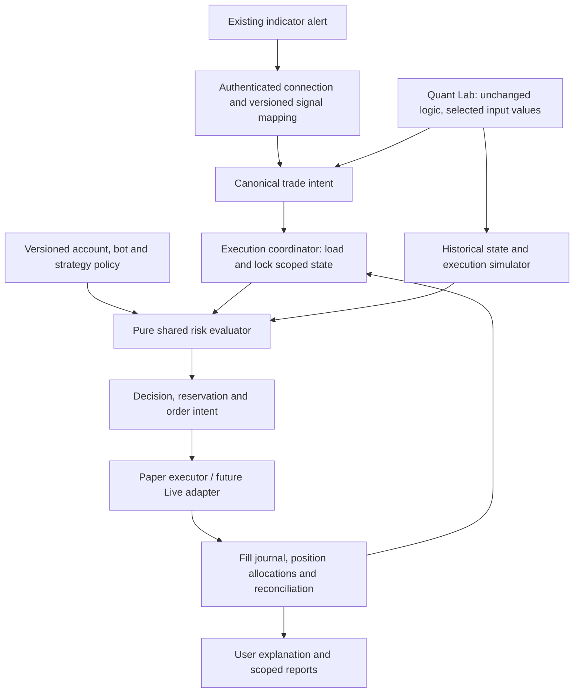

# Universal Risk Manager — assessment and design

Status: design proposal against deployed Paper code at `e4e473e` (application release `c573e39`) and the pending roadmap extensions. No production migrations, execution changes, new webhook formats or Live capability were implemented by this review.

## Verdict and evidence

Planning update (2026-09-19): [Archived Roadmap R-1](ROADMAP_ARCHIVE_2026-09-24.md#r-1--per-entry-positions-and-targeted-tpsl) brings per-entry allocation and targeted TP/SL forward before QL-1 after the reported P1/P2 aggregate-exit incident. `position_id` identifies an independent entry lot within the group model below. Isolation is needed even for repeated BUYs from ONE indicator, not only multiple indicators. R-1 delivers the initial contract/runtime/bridge gate; APP-3 extends it. The assessment below describes the existing aggregate implementation, not completed R-1 work.

The current engine is a useful foundation for scoped, multi-user Paper trading. It is not sufficient for independently managed indicators sharing a bot/symbol, arbitrary webhook semantics, or reproducible input-only optimization. Extend it rather than introduce a separate risk engine for every indicator.

Scope reviewed: PostgreSQL normalizer, risk engine, worker, ledger, schema, preview route, analytics and existing tests. A read-only in-memory diagnostic exercised the exit engine. The previous 93-test result is historical; this design review did not rerun the full suite or submit production trades.

| Finding | Evidence in current code | Consequence / priority |
| --- | --- | --- |
| Bot/user isolation and exact Paper accounting exist | `src/postgres/worker.js` locks owner and bot; `schema.sql` scopes ledger by user/account/mode; `domain.js` restores monetary fields as exact decimal strings. | Retain. These are correctness measures, not a measured commercial throughput guarantee. |
| Useful entry/exit controls exist | `src/postgres/risk.js`: risk/stop sizing, cash/equity/order/daily limits, reservations, unique-symbol limits, streak/volatility/news checks, entry kill switch and inventory-capped Spot exits. | Retain and version their semantics. Duplicate admission is handled in receiver/ledger, not the pure risk function. |
| Positions are not owned by an indicator | `ledger_positions` key is user/account/mode/symbol; no strategy, deployment or position-group key. Exits without quantity use the full aggregated quantity. | P1 before shared-symbol multi-indicator use: one indicator can exit another indicator's allocation within the same bot. This is not evidence of cross-user leakage. |
| Stops and R accounting also aggregate | `ledger.js:recordExecution` updates the aggregate stop/TP on each BUY and accumulates initial risk; streaks close at aggregate flat. | P1: independent indicator stops, cycles and attribution cannot be represented reliably. |
| Alert semantics are narrow | `src/domain.js` accepts BUY/SELL/TP/SL, one TP and explicit required metadata. It cannot infer whether an external SELL means short entry or long exit. | P1: require reviewed mappings/capability validation; no automatic intent guessing. |
| Venue/fill costs are not simulated by the worker | `worker.js` immediately fills with `deltaFeeQuote: '0'` at the evaluated price. Even accepted LIMIT requests do not enter a resting-order lifecycle. | P1 before realistic parity/export: label current assumptions; do not claim realistic LIMIT, fee or slippage behavior. Ledger fee support alone is not cost-aware sizing. |
| Configuration lacks immutable decision snapshots | `risk_profiles` stores current policy by bot; audit records changes, but signals do not bind immutable risk/mapping/strategy versions or structured decisions. | P1 for Quant reproducibility and explaining changes. |
| Hard limits have limited scope | Policies are bot-level; daily/exposure queries use account scope. Current Paper accounts are independent virtual balances. | P1 before shared actual broker accounts: identify a single backing account and aggregate reservations instead of reusing its balance per bot. |
| Guards use client-supplied data and current wall time | News/volatility fields come from webhook; `ledger.js` computes the UTC day with the wall clock. | P2: data provenance/freshness and injected clocks are required for historical replay. Missing guard data must not become zero/false by default. |
| Preview is narrower than execution use cases | `server.js:/api/risk/preview` constructs a BUY/Percent Equity signal, defaults news risk false and volatility to zero, then invokes the engine. | P2: useful shared-engine preview, but not a complete indicator/exit/dynamic-guard certification. |

Diagnostic: with one bot/symbol holding an aggregated quantity of `2`, representing indicator A = `1` and B = `1`, a TP/SELL signal from A without quantity currently yields an accepted quantity of `2`. The current engine receives no A/B ownership information. Under the proposed default, A may sell only its own unreserved allocation of `1`.

Until allocation support is deployed, use a separate existing bot profile for each independently managed indicator/account policy (within the existing five-bot quota). This is an operating recommendation, not an already-enforced product restriction. Unknown existing shared histories cannot be split by guessing.

## Architecture and responsibilities

The mapping layer translates transport and declared meaning; it does not change indicator logic. Risk evaluation admits, caps or rejects a request. Position/Exit Management owns target inventory, TP slices and stop lifecycle. Execution adapters implement order semantics. Quant Lab substitutes historical state and a declared fill model, never production balances or writes.

### Stable ownership model

- Distinguish main `owner_id`, bot profile `bot_id` (currently represented by `users.id`), `broker_account_id`, `execution_mode`, quote currency, `strategy_id`, and `deployment_id`.
- A deployment binds one indicator source/version, input snapshot, alert mapping/version, policy references and permitted symbol/timeframe scope. The server resolves the destination bot and account from authenticated connection records, never from a claimed user ID.
- Each independent trade campaign has a stable `position_group_id`; entries produce lots with their own initial risk and stop metadata. A group may have scale-in lots. Deployment replacement must retain the ability to exit the original group.
- Keep two views: physical/account net inventory and strategy-owned virtual allocations. Same symbol can be held by A and B without either selling the other's allocation. Strategy lots are attribution, not separate exchange positions.
- For managed inventory, sum of owned allocations equals the tracked managed net position; account-reconciled unallocated/manual inventory is a separate bucket. Unexplained differences pause affected entries for reconciliation. Do not invent ownership of manual or legacy holdings.
- Preserve current independent Paper bot capital. If users later explicitly connect multiple bots to the same actual broker account, all consume one shared account cash/inventory pool with bounded bot allocations; re-entering the same credentials must not create fictitious funds. Sharing a broker account across different owners is unsupported.

## Canonical signal and capability contract

Use a versioned contract rather than indicator-specific engine branches. The existing v1 webhook remains a compatibility route.

| Field group | Requirements |
| --- | --- |
| Identity | Contract/mapping version, deployment, stable event ID and position-group/entry reference where applicable; source IDs are resolved against authenticated scope. |
| Intent | Explicit ENTER_LONG, REDUCE_LONG, CLOSE_LONG, or supported management intent; reason such as entry, TP stage, SL or opposite signal. SETUP/visual notices are non-trading events. |
| Instrument | Raw symbol/exchange, canonical instrument, timeframe, broker account/mode and quote. Preserve USD alias policy without treating USD prices as USDT conversion. |
| Timing | Signal/bar time, send/receive time, sequence and source clock assumptions. A delayed original event cannot acquire a fresh identity/time to evade duplicate/stale checks. |
| Entry sizing | Exact quantity, fixed notional or percent-equity/stop risk intent with declared source and units. Account caps apply to all modes. |
| Exit targeting | Group/allocation target plus quantity, fraction of original filled allocation, fraction of remaining allocation, or close remaining. The percentage denominator is mandatory; partial TP stages identify an immutable stage. |
| Execution | Declared order type/price/stop/targets, observed price and provenance, allowed size adjustment, freshness constraints and alert source. Unsupported order or protection capabilities are rejected visibly. |
| Context | Guard observations with source/time/formula and strategy/input/risk versions. Persist only allowlisted fields; redact private payloads/secrets. |

Reject ambiguous/missing mappings with a plain-language setup explanation. A short-entry SELL is not automatically a long exit. If a Spot-compatible long-only input exists, the user may select it; that is an input choice, not a rewritten condition.

Signals missing an indicator SL cannot use stop-based percent-risk sizing. Initial rollout should offer a compatible exposed stop input or explain unsupported sizing. An optional exposure-only fixed-notional mode is a later, explicitly selected policy with its own limits; it cannot display a defined stop-loss risk or silently add a stop to the indicator.

Event idempotency: new connections deduplicate by owner/bot/deployment/event identity, with validated length and canonical payload hash. Exact retries return the recorded outcome; same identity with different intent is an explicit conflict. Preserve legacy `(user_id, trade_id)` semantics for old routes. Sequence checks distinguish legitimate partial exits from stale state; dependent exits arriving before an unresolved entry are bounded/reconciled, not allowed to close another group.

Expose capability states independently: Webhook ready, Optimization supported, Export validated. Protected indicators may connect using exposed alerts; their webhook stream alone cannot supply counterfactual signals for other inputs.

## Universal policy composition

Use platform/venue invariants, main-owner controls, broker-account controls, bot budgets and deployment requests. A template supplies requested settings, not new authority.

- For compatible numeric ceilings in the same unit/scope, apply the most restrictive applicable limit.
- Allow lists intersect; hard-deny conditions combine; exact quantities and bounded percentages cannot relax higher-level limits.
- Non-comparable settings (equity method, day boundary, R definition, fee model) require a declared inherited value/version. Never merge them with a numeric minimum.
- Retain current hard-limit values including the owner's configured 100% ceiling; do not treat those as strategy defaults or an optimization objective.
- Distinguish PAUSE_ENTRIES, explicit exit-only operation and administrative suspension. An entry kill switch blocks new risk while allowing authenticated supported risk-reducing exits; it does not automatically liquidate or bypass ownership, stale-signal or quantity checks. Preserve existing suspension behavior until a reviewed policy change.
- New entries must satisfy account free cash, bot budget, strategy budget, order/daily notional, per-symbol exposure, aggregate modeled risk, entry-count and unique-symbol limits. Display the active binding constraints.
- Daily counters specify whether accepted intents, first fills, all fills or round trips are counted and which day/zone applies. Match current all-order first-fill/notional and aggregate R behavior in the compatibility mode; do not silently relabel it as entry-only or per-strategy R.
- Fees, spread/slippage, tick/step rules and gap assumptions are versioned. Use decimal arithmetic and directional rounding; revalidate after rounding. Reserve buy cost plus applicable fees; reserve sell base quantity, including base-denominated fees where applicable.
- Stop-based risk is modeled loss under an execution assumption. ATR/trailing/partial exits belong to a supported Exit Policy; no stop metadata is represented as an exchange-hosted order unless an adapter actually confirms one.

### Decision and preview contract

Return a structured decision with `ACCEPT`, `ACCEPT_CAPPED` or `REJECT`, stable reason codes, severity, original request, effective order/quantity, monetary calculations, per-rule result, policy/mapping/engine versions and state snapshot ID/time.

Define adjustment semantics per connection: Percent Equity may retain existing automatic downward capping; explicit quantity/notional uses the existing strict behavior unless the user chooses bounded capping. Exit quantities cannot exceed owned unreserved inventory. Never claim an accepted signal must execute unchanged.

The preview uses the same evaluator and supports BUY, partial/full exit, TP/SL, duplicate/sequence scenarios and known/unknown external guard inputs. The UI says why sizing changed or why a rule cannot yet be evaluated. A preview is read-only and has no reservation; execution re-evaluates authoritative state transactionally.

## Concurrency, reservations and persistence

Preserve the current transactional instantaneous Paper path while extending scope. Admission means queued, not filled or funded. Serialize conflicting intents at the shared account/allocation boundary and reserve resources in the same transaction as the admitted execution intent.

- Proposed new records: indicator connections and mapping versions; immutable risk policy versions; strategy deployments/input snapshots; position groups/lots and fill allocations; cash/base-quantity reservations; structured risk decisions; optimization/export runs.
- Reference the existing normalized signal/order-intent/fill/cash records. In current schema 11, execution intent/status is carried by `signals`; do not assume a separate `orders` table exists. A future distinct order table is an explicit migration decision.
- Use tenant-qualified unique keys and foreign keys linking bot/account/deployment/group. Index scoped active reservations, pending intents and deployment event IDs. A foreign key to an unscoped deployment ID alone does not establish ownership.
- Reserve cash and risk for buys; reserve owned inventory for sells. Release unused portions on terminal outcomes, consume on fills and preserve uncertain reservations during reconciliation. Expiry alone cannot free resources associated with an unknown broker outcome.
- Keep fills and allocation updates idempotent. Aggregate allocation accounting must reconcile to account cash/inventory; new strategy-attributed FIFO may coexist with the existing aggregate account report, clearly labeled.
- Lock in a consistent documented order: owner, backing account IDs, bot IDs, position-group/lot IDs, then execution records, sorted inside each class. Apply it across admission, policy/funding changes, execution and reconciliation before relaxing existing coarse locks.
- Keep transactions bounded. Future remote broker calls occur outside database transactions through durable order intents and a reconciliation state machine; no retry blindly resends an unknown order.
- Query/API roles have minimum necessary privileges. Research receives read-only snapshots/views; no customer-supplied notebook executes with database, broker or webhook credentials. Tenant-qualified query checks and integration tests remain required; RLS can be added as defense in depth with tested connection context, not assumed to exist.
- Add per-owner admission/run quotas and bounded queue/resource limits. Model fair scheduling and causally valid exit handling under load; priority must not move a dependent exit ahead of its accepted entry or sell reserved inventory.

## Quant Lab and unchanged indicator logic

The indicator retains its source and behavior. Optimization changes only selected existing effective inputs; freeze risk/execution policy for that experiment. Inputs controlling stops/sizing may be searched only if they already exist, are explicitly selected and obey caps. Preset overrides and inactive/visual fields are excluded unless resolved via existing input choices.

Implement a pure risk evaluator that accepts canonical intent, versioned policy, explicit clock, balances, allocations/reservations and guard/market snapshots. It performs no I/O, reads no global live state and mutates no balances. Keep accounting/state transitions and fill models as separately versioned functions.

Preferred first implementation: extract the existing JavaScript Decimal engine behind a batched local JSON interface so Python can evaluate research intents against the same rules without calling production. Serialize money as decimal strings. Profile throughput before choosing a Python implementation; if one is needed, acceptance/rejection/capping/rounding and state-transition fixtures must match before advertising parity. vectorbt accelerates supported research but does not replace universal account/allocation constraints.

Historical runs build account/group state incrementally from observed data and simulated fills, with the supplied historical clock. They may not read future candles or today's DB balances, and they must apply account-wide competition when multiple indicators share a budget. Isolated strategy reports cannot claim a feasible combined portfolio.

Record source/input hashes, policy/engine/fill-model versions, dataset identity/coverage, calendar, objective/search budget, seed and baseline/out-of-sample/stress evidence. Run reviewed evaluators in resource-bounded isolated processes without production credentials; do not evaluate arbitrary uploaded Pine/Python as privileged server code.

Export presets plus an optional private input-default copy with no strategy-logic edits. Separate a reviewed transport adapter or strategy wrapper from the original. User selects `alert()` or simulated strategy order fills where supported; neither confirms actual VPS holdings. Validate source-specific semantics per [PINE_EXPORT.md](PINE_EXPORT.md).

## User experience

1. **Connect indicator:** select bot/broker, identify exposed alert events and paste a sample payload or supply authorized source. Show mapped action in plain language; explain unsupported short/SL/TP fields.
2. **Allocate budget:** show bot cash and how much each connected strategy may use, with shared-account totals where applicable. Default to selling only that strategy's position group. A one-indicator bot needs no advanced allocation configuration.
3. **Risk settings:** Basic view shows sizing method, budget/risk, order/daily limits and pause controls. Advanced view contains supported exit/cost/guard settings, policy inheritance and versions. Templates never silently invent missing fields or relax limits.
4. **Test signal:** show “received”, “mapped”, “risk passed/capped/rejected”, “queued”, and “filled” separately, with requested/applied quantity, exit target, current balance and an actionable reason. EN/TH uses stable server reason codes.
5. **Optimize inputs:** only show effective eligible inputs and their ranges. Compare original inputs with candidates and show signal changes, risk rejections/caps, out-of-sample results and costs. Original source remains intact.
6. **Export/apply:** choose an eligible candidate and alert source; show input/mapping/policy differences. Export does not activate deployment. Activating a new version includes handling old open groups and replacing the previous TradingView alert.

Independent connection/deployment lifecycle: Draft, Webhook Validated, Paper Active, Paused and Archived; optimization/export capability and validation freshness are separate indicators, not inferred from a connection being active.

## Delivery sequence and migration

| Milestone | Work and gate |
| --- | --- |
| R-1 / immediate position isolation | Define and implement per-entry ownership, targeted exits, atomic accounting and Pine/UI integration; prove TP(P1) preserves P2 before enabling independent repeated entries. Reuse this foundation in Quant contracts and APP-3. |
| QL-1 / URM design contract | Define canonical events, capabilities, source/input invariants, typed policy/decision schemas and decimal fixtures. No production migration. |
| QL-2 / evaluation foundation | Extract deterministic clock/state inputs; prove current-engine accounting/risk parity in an isolated DB; define new allocation/cost behaviors with separate fixtures and read-only export. |
| APP-3 / multi-indicator runtime | Migrate versioned connections/policies and allocation/reservation records; add scoped APIs/wizard/preview/reconciliation; validate concurrent multi-owner/account/group behavior before enabling shared-symbol mode. |
| QL-3 / input optimization | Use the shared evaluator and supported indicator adapters; freeze policies, search only user-selected inputs and validate combined-budget runs. |
| QL-4 / export acceptance | Generate presets/private copies and validate each supported alert source in TradingView and Paper. Retain input-only logic evidence. |
| APP-4 / customer release | Enforce tenant/run quotas, private reports, support/permissions, beta acceptance and recovery gates. |
| APP-5 / optional Live | Add actual-account reconciliation, venue constraints and protective-order capability with broker-specific acceptance. |

Migration must back up and rehearse a copy before changing schema. Assign legacy positions to a clearly named legacy ownership group; never infer indicator ownership from mixed historical fills. Keep existing cash, positions, IDs, secrets and v1 webhook behavior until scoped migration is explicitly activated. Existing customers may use the legacy single-group route; new multi-indicator connections require explicit ownership mapping.

Shadow evaluation compares old/new decisions without executing twice. Run a Paper canary with controlled fixtures and entry/exit continuity before cutover. After new allocation writes, rollback must use a compatible runtime or reconciled restore; switching to a schema-unaware release is not automatically safe.

## Required acceptance matrix

1. Two owners cannot read, configure, export or close each other's data, even with another owner's deployment/group IDs.
2. Same symbol, same bot: A owns 1 and B owns 1. A full exit sells only A's 1; B's stop/allocation remains unchanged.
3. Same real-account model across two bots: concurrent requests cannot reserve more cash/base inventory than available; independent Paper bots retain their configured isolation.
4. Distinct partial TP stages are applied once with a declared percentage basis; overlapping TP/SL, duplicates, delayed/out-of-order exits and rejected entries cannot oversell or close a different group.
5. Scale-in preserves per-lot/group stop/risk provenance. Strategy FIFO sums reconcile to account cash and managed inventory; changes in daily/streak attribution are versioned.
6. Lower-level policies cannot override hard caps, expiry or platform invariants. Entry kill permits authorized reduce-only exits; account suspension and unknown-order rules are tested separately.
7. Costs/rounding and min-notional checks cannot create negative cash/inventory; test fee assets, near-zero balances and capped quantities below venue minimums.
8. Signal mapping never converts short entry to Spot exit implicitly or treats a setup notice as an order. Missing/untrusted/stale guard observations produce explicit results.
9. Identical recorded state/clock/intent/policy yields identical preview/replay/worker decisions. A state change between preview and execution produces a new visible decision, not a promise breach.
10. Optimization modifies only whitelisted inputs; source logic remains unchanged, effective presets are honored and unsupported/protected evaluators are labeled.
11. Switching risk/input/alert-source versions does not orphan old positions, replay entries or silently accept incompatible payloads. Legacy migration/restore preserves hashes and balances.
12. Under agreed load, worker crash/retry and concurrent funding/policy changes preserve reservations, fill idempotency, tenant fairness and auditability.

## Design references

Repository evidence: [risk engine](../src/postgres/risk.js), [normalizer](../src/postgres/domain.js), [ledger](../src/postgres/ledger.js), [worker](../src/postgres/worker.js), [schema](../src/postgres/schema.sql), [HTTP/preview](../src/postgres/server.js), [PostgreSQL tests](../test/postgres/phase2.test.mjs).

The reviewed PostgreSQL skill informed scoped privileges, ownership constraints, bounded transactions and consistent lock ordering. These are design requirements, not a claim of a completed database security audit.
